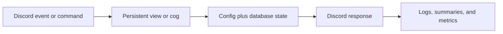
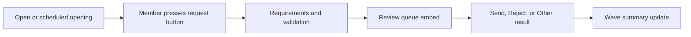
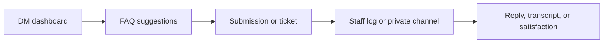
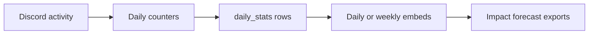
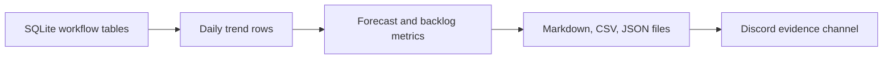
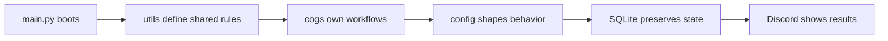
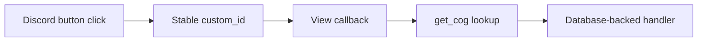
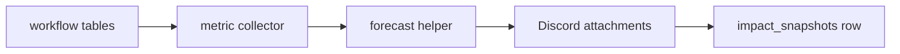

# Avenue Guard

Private Technical Manual: How The Bot Works Internally

Generated from the current Avenue Guard codebase and configuration for Rodrigo.

## Contents

1. Private Manual Notice
2. How To Read This Manual
3. Executive Overview
4. Development History
5. Runtime And Startup Architecture
6. Configuration Model
7. Database And Persistence
8. Cog Architecture
9. Permissions And Security Model
10. Moderation Guardrails
11. Live Request System
12. Request Validation And GD Metadata
13. Review Workflow
14. Weekly Activity And Rewards
15. Help, Tickets, And Staff Support
16. Background Telemetry
17. Admin Tools And Diagnostics
18. Impact Reporting
19. External Services And Dependencies
20. Failure Recovery
21. Maintenance And Testing
22. Appendix: Command Families
23. Appendix: Data And Evidence
24. Private Orientation: How To Study The Bot
25. Source Inventory
26. Command Surface Inventory
27. Database Table Inventory
28. Startup Code Walkthrough
29. Database Code Walkthrough
30. Config And Template Engine Walkthrough
31. Persistent Views Walkthrough
32. Live Request Code Walkthrough
33. Validation Code Walkthrough
34. Request Review Code Walkthrough
35. Scheduled Openings Walkthrough
36. Tracking Code Walkthrough
37. Weekly Request Workflow Walkthrough
38. Help And Ticket Code Walkthrough
39. Background Telemetry Code Walkthrough
40. Forum And Sticky Code Walkthrough
41. Impact And Backup Code Walkthrough
42. Server Icon Rotation Code Walkthrough
43. Engineering Thinking Behind The Bot
44. Debugging Notebook

## 1. Private Manual Notice

This document is now a private technical manual for Rodrigo. It explains Avenue Guard as a codebase, not as a public staff guide. It still describes staff-facing workflows because those workflows exist in the code, but the reader is assumed to be the person trying to understand, maintain, explain, and continue building the bot.

> **Reading promise:** The manual uses plain language, diagrams, tables, and real source excerpts. The aim is to make the bot understandable from top to bottom without flattening the technical details that make it work.

If you only need a quick answer, use the inventory and appendix chapters. If you want a deep read, follow the source walkthrough chapters in order. They move from startup to persistence, then into requests, tracking, help, telemetry, impact reporting, and debugging.

## 2. How To Read This Manual

Avenue Guard is the operating system for GD Avenue's Discord workflows. It is not only a moderation bot, and it is not only a level request bot. It connects request waves, weekly activity rewards, tickets, help flows, forum formatting, staff logs, analytics, and admin diagnostics into one persistent bot.

This manual is private technical documentation for Rodrigo. It is not written as a staff handbook. It explains how the bot is built, how the code thinks, which modules own which workflows, and why the implementation choices exist. Staff workflows are described only because they are part of the bot's code and state model.

> **Core idea:** The bot is built around a single configured Discord server, a JSON configuration file, persistent SQLite state, and a set of cogs that each own a clear part of the community workflow.

### Document Map

- The first chapters give the big mental model: runtime, config, persistence, cogs, permissions, and history.
- The workflow chapters explain requests, weekly tracking, help/tickets, forums, telemetry, admin tools, and impact reporting.
- The private deep-dive chapters walk through actual source code excerpts and the less obvious engineering ideas.
- The appendices give quick lookup tables for commands, database tables, files, and maintenance habits.

The bot has grown through many rounds of practical server needs. That matters because many design choices are not abstract engineering preferences. They exist because the community needed safer requesting, better review visibility, more reliable tickets, measurable activity, and staff tools that can recover from missing messages or restarts.

## 3. Executive Overview

At the highest level, Avenue Guard is a Discord operations bot. It listens to server events, direct messages, button interactions, modal submissions, slash commands, scheduled loops, and background telemetry. Each event is routed through a cog that owns the relevant workflow, and most important outcomes are stored in SQLite.

The bot's central value is continuity. A request wave should not disappear after a restart. A ticket should have an ID and a transcript. A weekly reward should know who was contacted and whether they replied. A forum post deleted for missing the required word should be logged. A reviewer should see which requests are still pending. An owner should be able to generate numbers that show the bot's impact.

#### Main Operating Loop



> Every major workflow follows this loop so visible Discord state and stored bot memory stay aligned.

| Area | What Avenue Guard Does | Why It Matters |
| --- | --- | --- |
| Request waves | Opens, limits, schedules, validates, reviews, summarizes, and repairs level request waves. | Turns a messy manual process into a controlled staff queue. |
| Weekly rewards | Tracks eligible activity, contacts winners, records claims, and routes weekly submissions into the review workflow. | Rewards activity while keeping staff review consistent. |
| Help and tickets | Runs a DM help dashboard, FAQ search, appeals, reports, bot issues, transcript requests, tickets, and satisfaction prompts. | Gives members private support without losing staff accountability. |
| Guardrails | Deletes restricted proof-channel misuse, applies restriction roles, sends role DMs, manages sticky/forum reminders, and enforces forum words. | Reduces repeated moderation work and keeps public channels organized. |
| Telemetry | Tracks daily summaries, command usage, voice time, activity, anti-farm events, and now persistent impact exports. | Makes the bot measurable and useful for operations, not just automation. |

### What Makes It Complex

Avenue Guard is complex because it combines multiple stateful systems. It has persistent Discord views, scheduled jobs, slash commands, mod-only and admin-only gates, external validation calls, modal workflows, message edits, channel creation and deletion, ticket transcripts, and configurable embed templates. Many bots do one of these things. Avenue Guard coordinates all of them in one server-specific package.

The most important invariant is that public Discord state and database state should describe the same reality. If requests are closed in SQLite, the request button should say closed. If a ticket is resolved, the opening message and transcript should reflect that. If a request is reviewed, the original buttons should be disabled. Much of the bot's repair and diagnostic design exists to preserve this agreement between what users see and what the bot remembers.

## 4. Development History

The current bot evolved from a simpler Render-ready Discord bot into a much more complete community operations platform. The early shape focused on practical automations: keeping the bot in the correct guild, deleting misplaced proof-channel messages, sending role-triggered DMs, and keeping sticky reminder messages visible.

The next major phase added weekly activity tracking. The bot began counting eligible member messages, skipping excluded roles and channels, and contacting weekly winners with request opportunities. This phase introduced the idea that activity and reward state must survive restarts, because weekly workflows can span hours or days.

The request system then became the largest feature area. Live request waves gained an open/closed state, count limits, timers, scheduled openings, request types, duplicate blocking, per-wave summaries, reviewer buttons, result channels, edit windows, request edit audits, validation cache, and repair commands. Weekly request submissions were later brought into the same review workflow so staff did not need to learn two systems.

The help system grew in parallel. Instead of only sending generic DMs, Avenue Guard now runs an in-DMs dashboard, FAQ search, pre-ticket FAQ suggestions, appeal/report/bug previews, staff reply relay, private ticket creation, ticket statuses, transcript saving, transcript search, transcript requests, and satisfaction prompts.

More recent phases focused on staff experience and measurement: cleaner log embeds, daily and weekly summaries, anti-farm detection, server icon rotation, admin dashboards, doctor/repair suggestions, and now impact reporting. The bot's direction has been consistent: when a process starts to need staff memory, the bot stores it, exposes it, and makes it reviewable.

> **History in one sentence:** Avenue Guard developed from a utility bot into a persistent community workflow engine for requests, support, moderation guardrails, analytics, and staff coordination.

## 5. Runtime And Startup Architecture

The runtime begins in main.py. The bot creates a py-cord Bot object with the intents needed for messages, members, reactions, moderation, presences, voice states, and direct messages. It loads config.json through utils.config.Config, resolves the configured database path, opens it through utils.db.Database, installs global error handlers, and loads each cog extension.

Startup is deliberately defensive. On ready, the bot connects the database, checks that it can see the allowed guild, starts the keepalive server, starts background tasks in the tracking, help, request, and background cogs, and registers persistent views. Persistent views are crucial because Discord button interactions can arrive after a restart. The custom IDs live in utils.views and route back to the correct cog.

| Startup Step | Owner | Purpose |
| --- | --- | --- |
| Load config | utils.config.Config | Reads config.json and exposes typed getters for IDs, lists, and strings. |
| Connect DB | utils.db.Database | Creates or migrates SQLite tables before workflows depend on them. |
| Load cogs | main.py | Attaches feature modules for moderation, tracking, help, responses, sticky messages, requests, commands, and background jobs. |
| Start tasks | on_ready | Starts loops for weekly handling, ticket scans, request auto-close, scheduled openings, summaries, status, and icon rotation. |
| Register views | utils.views | Keeps buttons and selects alive across restarts through stable custom IDs. |

### Hosted Environment

The bot is designed to run on a hosted service such as Render. A small keepalive HTTP server exists for hosted environments, but the important persistence requirement is the SQLite database. If the host uses ephemeral storage, the database path must live on a persistent disk or equivalent mounted storage.

The bot also assumes that startup may happen after Discord components already exist. That is why persistent views are registered every time the bot becomes ready and why request/ticket state is not reconstructed from memory. Startup should be safe whether the bot was restarted manually, redeployed by the host, or recovered after an exception.

## 6. Configuration Model

Avenue Guard uses config.json as the main control plane. The Config loader treats keys beginning with an underscore as comments by convention, but it does not need a separate schema file. IDs can be stored as strings; the getter methods convert them to integers or lists when code needs them.

This design makes server-specific changes practical. Admins can change channel IDs, role IDs, request wording, embed templates, validation settings, icon URLs, background summary settings, and help FAQ entries without editing Python code. The /resync command reloads config and response rules so many changes do not require a full restart.

| Config Section | Controls |
| --- | --- |
| guild | The allowed guild ID. The bot shuts down if it cannot operate in that server. |
| roles | Moderation, admin, tracking exclusion, reward, and watched-role IDs. |
| channels | Core log, request, transcript, command, proof, and help channels. |
| tracking | Weekly message counting, winner DMs, reminders, streaks, anti-farm checks, and logs. |
| tickets | Ticket category, staff ping role, cooldowns, inactivity, and satisfaction prompt. |
| help | FAQ entries, warnings, cooldown assumptions, duplicate windows, and submission limits. |
| level_requests | Request channels, roles, text, embeds, validation, wave summaries, colors, and opening announcements. |
| background | Daily summaries, weekly recaps, rotating status, and server icon rotation. |
| database | SQLite path and scheduled zipped database backups. |
| impact | Destination for persistent impact report attachments and snapshots. |

### Why JSON Instead Of Hardcoding

The server changes faster than code should. Roles are renamed, channels are moved, request copy is adjusted, and staff may want different embed language for review or result messages. Keeping those values in config.json lets the bot remain stable while the server's surface changes.

The most customizable parts are the embed templates. Request submissions, reviewed requests, weekly submissions, result messages, wave summaries, help logs, and announcements are built from template variables. This gives the server control over tone and layout while keeping the workflow rules in code. The config checker validates many of those templates so a typo in a variable is easier to catch before staff depend on the embed.

## 7. Database And Persistence

The SQLite layer is intentionally small and predictable. utils.db.Database owns one SQLite connection with check_same_thread disabled, serializes operations with an asyncio lock, and runs blocking database work inside threads. The migration code creates tables and adds columns for older databases so the bot can evolve without manual SQL work every time a feature is added.

The database is not only storage; it is the bot's memory. It knows the active request wave, scheduled openings, submitted users and level IDs, request edit history, validation cache, weekly claims, weekly sessions, weekly reviews, activity counts, tickets, transcript pointers, help submissions, cooldowns, daily stats, and impact snapshots.

#### Persistence Safety Model


> The primary durable copy is the mounted SQLite file; backup attachments and exports provide recovery evidence.

### Render Storage Rule

On Render, the project source and cache can be wiped by redeploys or cache clears. Avenue Guard therefore resolves its SQLite path from AVENUE_GUARD_DB_PATH first, then database.path in config.json, then an auto-detected Render Persistent Disk path at /var/data/avenue-guard/bot.db, and only then the local fallback. For production, mount a Render Persistent Disk at /var/data or point AVENUE_GUARD_DB_PATH at another durable path.

The /bot storage command checks the running path and the latest backup record. The /bot backup command creates a zipped copy immediately, and the background backup loop posts scheduled copies to the configured backup channel. If no persistent path is writable, the bot now starts with a local fallback and warns clearly, but that fallback should be treated as temporary.

| Table | Purpose |
| --- | --- |
| activity_counts | Weekly message totals per user. |
| weekly_claims / weekly_sessions / weekly_dm_log | Weekly reward workflow state and audit history. |
| weekly_request_reviews | Weekly submitted request review messages and results. |
| tickets / ticket_sequences | Ticket channels, users, status, IDs, satisfaction, and closure state. |
| ticket_transcripts / transcript_requests | Saved transcript locations and member transcript request decisions. |
| help_submissions / help_sessions / help_cooldowns | DM help flows, appeal/report/bug submissions, and rate limits. |
| level_request_state | Current live request state, wave ID, limits, timers, and request button pointer. |
| level_request_submissions | Per-wave submitted levels, requester, result, review, and embed data. |
| level_request_edit_audit | Before/after snapshots of request edits. |
| gd_level_validation_cache | Cached validation results from external GD providers. |
| daily_stats / weekly_recaps | Operational telemetry snapshots and private recap history. |
| impact_snapshots | Persistent impact report payloads produced by /bot impact. |
| database_backups | Backup timestamps, channels, message IDs, sizes, reasons, and filenames. |

> **Persistence rule:** If a workflow can span a restart or must be auditable later, it belongs in SQLite rather than only in memory.

The migration approach is intentionally additive. New columns are added if missing, older tables are normalized when their shape changes, and indexes are created for common lookups. This lets the live bot keep its history while gaining new features such as ticket opening message IDs, request edit audit entries, scheduled opening messages, weekly review data, and impact snapshots.

## 8. Cog Architecture

Each cog owns a feature family. This keeps the code understandable even though the bot is large. The cogs do interact with each other, but mostly through named methods and shared database/config utilities. CommandsCog is the command hub, while the workflow cogs handle the long-running state machines.

| Cog | Primary Responsibility |
| --- | --- |
| ModCog | Proof-channel restrictions and role-triggered DMs. |
| TrackingCog | Weekly activity tracking, weekly request reward DMs, anti-farm checks, and weekly request recording. |
| HelpCog | DM help dashboard, FAQ, appeal/report/bug submissions, tickets, transcripts, and satisfaction. |
| MessageResponsesCog | Configurable message-triggered auto-responses. |
| StickyCog | Sticky messages, forum first-message reminders, and required-word thread deletion/logging. |
| RequestLevelsCog | Live request waves, scheduled openings, validation, modals, edit windows, reviews, results, summaries, and repairs. |
| CommandsCog | Admin, tracking, ticket, forum, request, server icon, fun, diagnostics, and impact commands. |
| BackgroundCog | Daily stats, summaries, rotating status, server icon rotation, and background persistence. |

### Interaction Flow

Persistent views in utils.views act like switchboards. A button custom ID identifies the action, the view asks Discord for the relevant cog, and then the cog handles the real logic. This means the visible component can remain tiny while the business rules stay in the owning cog.

For example, the request button view only knows that a member clicked Request your level. RequestLevelsCog then checks whether requests are open, whether the member has the required role, whether they already submitted in the wave, whether the button should open an edit flow, and whether a modal should appear.

This separation is especially useful for persistent components. A button may be clicked long after the message was created, so the button itself should not carry fragile state. It carries a stable custom ID, and the owning cog retrieves current state from config and SQLite at click time.

## 9. Permissions And Security Model

The bot combines Discord permissions, configured role IDs, and command-level checks. Public commands are kept narrow, mod commands require the configured mod role or configured permission policy, and admin commands require one of the configured admin/owner roles. Sensitive interactions also check the user before editing dashboards or panels.

Avenue Guard also avoids unsafe mention behavior in staff logs and bot-generated messages where possible. The no_mentions helper prevents accidental mass pings in logs and auto-responses. Where pings are intentional, such as the default request-open announcement, the behavior is explicit and configurable.

- Guild restriction prevents the bot from operating outside the configured server.
- Admin commands are role-gated even if their command descriptions do not visually say so.
- Mod workflows check staff role or manage-guild policy before ticket/status operations.
- Request reviewer controls are limited by access to the review channel and configured reviewer roles where staff filters apply.
- Auto-response output is length-limited and mass mentions are blocked.
- External validation has per-user rate limits and provider backoff to reduce abuse and failure cascades.

> **Security posture:** The bot is not a bank-grade security system, but it uses practical Discord safety controls: role gates, guild gates, safe mentions, cooldowns, audit logs, and recovery commands.

Data safety is treated pragmatically. The bot stores IDs, message pointers, submitted text, review text, ticket metadata, and transcript pointers because those are necessary for accountability. It avoids storing secrets in the database and does not require Google credentials for impact reporting. Sensitive records should still be protected by keeping the database on trusted storage and limiting staff-log channel access.

## 10. Moderation Guardrails

The guardrail layer handles repetitive moderation actions that should not depend on a staff member being online. The proof-channel restriction watches a configured channel. If a non-whitelisted member posts there, the bot deletes the message and applies the configured restriction role. If they add a reaction there, it removes the reaction and applies the same restriction role.

Role-triggered DMs are another guardrail. When a member gains a watched role, the bot sends a configured DM that explains what changed and how to appeal or contact staff. This turns silent role changes into explainable actions.

### Forum And Sticky Reminders

Sticky messages keep important instructions visible at the bottom of busy text channels. The bot debounces sticky updates, deletes the old sticky message, and posts a fresh one after the configured delay. Forum first-message reminders post an embed in new forum threads, with tag-specific templates when configured.

Required-word enforcement is designed for forum formats that must include a specific word. The bot checks thread title/body text, supports contains, whole word, and regex modes, sends a configurable DM to the thread owner, deletes the thread after the configured delay, and logs the deletion with the author and thread context.

> **Why this exists:** Forum reminders are gentle guidance; required-word enforcement is the hard stop for posts that ignore a required format.

## 11. Live Request System

The live request system is the bot's most involved workflow. It starts with a persistent request button embed in the configured request channel. Staff can refresh or recreate that embed with /refresh-request-button. Admins can open requests immediately, close them manually, or schedule openings for later.

#### Live Request Wave



> Submission count increases only after a valid modal succeeds, not when the button is pressed.

A wave begins whenever requests open. A wave can be unlimited, limited by successful submission count, limited by time, or limited by both. If both count and time are defined, the count limit wins. A request only counts after a valid modal submission succeeds. Clicking the button or opening the form does not consume a slot.

### Per-Wave Rules

- One user can submit one live request per wave.
- One level ID can be submitted once per wave.
- Per-user and per-level duplicate tracking resets when a new wave starts.
- Requests can be edited until the wave closes plus the configured grace period.
- The wave summary is updated as reviews happen so staff can see remaining workload.

### Request Types

Request waves can optionally define a type, such as needs showcase, only demons, only platformers, only classic, classic non-demons, platformer non-demons, or long/XL levels. These types are enforced after validation when the bot has enough GD metadata to reason about difficulty, platformer status, and length.

Opening announcements are configurable. If no custom message is provided, the bot uses the default request role ping and inserts a human-readable condition summary. Scheduled openings can also store a custom opening message.

Scheduled openings are deliberately managed as records instead of timers only in memory. Admins can list, edit, delete, refresh, or open them immediately. If the bot restarts before the scheduled time, the pending opening still exists in SQLite and the scheduled-opening loop can act on it when the bot comes back.

## 12. Request Validation And GD Metadata

Validation protects the request queue from bad level IDs and gives reviewers more context. The bot checks level IDs before accepting a modal: IDs must be 7 to 9 digits, showcase links must be URLs, and missing levels can be auto-rejected when enabled providers confidently agree that the ID does not exist.

The validation layer uses two providers: GDBrowser and the direct GD/Boomlings endpoint. Results are combined into one normalized payload that can include level name, creator, difficulty, length, stars, rated status, featured/epic flags, demon status, and platformer status. The result is cached in SQLite to keep repeated checks fast and to avoid hammering external services.

| Validation Output | How It Is Used |
| --- | --- |
| exists | Blocks confidently missing IDs before they enter the review queue. |
| rated | Warns reviewers that a level may already be rated. |
| demon/platformer | Requires a showcase URL automatically. |
| difficulty/length/stars | Adds clean GD info to request embeds. |
| provider disagreement | Warns staff instead of hiding uncertainty. |
| cache expiry | Lets repair or new submissions refresh stale warnings later. |

> **Validation principle:** The bot is strict only when the evidence is strong. When providers disagree or fail, the bot surfaces a warning instead of pretending certainty.

Validation also feeds presentation. The request embed can show compact GD info without overcrowding the request: difficulty, length, stars/rated status, flags, creator, and provider warnings can be collapsed into clean fields. That means reviewers spend less time opening external pages just to understand what kind of level they are judging.

## 13. Review Workflow

After a successful request submission, the bot sends a configurable embed to the level_requested channel. The embed includes requester, level ID, level name, creators, showcase, notes, GD info, validation warning, duplicate history warning, edit trail count, and wave information. The same view provides Send, Reject, and Other buttons.

Send and Reject open a review modal with an optional review field. Once submitted, the original request embed is edited into its final state, the result color changes, the reviewer is recorded, the result embed is posted to the sent or rejected channel, the requester is pinged there, and all buttons on the original request are disabled.

The Other button offers fixed reasons: level does not exist, stolen level, and already rated. These are treated like not-sent results and notify the requester through the rejected channel. This keeps special rejection reasons structured rather than buried in arbitrary review text.

### Wave Summary

When a wave exists, the bot maintains a summary embed in level_requested. It shows total requested, reviewed count, sent count, not-sent count, percentages, remaining reviews, not-sent breakdown, and reviewer stats. This is the staff dashboard for the wave, and it updates each time a request is reviewed.

### Repair

/requests repair exists because Discord messages can be deleted, embeds can go stale, validation warnings can expire, and reviewed messages should stay locked. The repair command refreshes the request button, rebuilds summaries, recreates missing pending request messages, refreshes validation warnings, and disables buttons on reviewed messages.

Review actions are designed to be idempotent from a staff perspective. The bot checks the original request row, verifies that it is still pending, confirms the result channel, edits the original embed, writes the review fields, sends the final notification, and disables buttons. This reduces the chance that two reviewers can accidentally process the same request twice.

## 14. Weekly Activity And Rewards

TrackingCog counts eligible member messages by week. It skips excluded channels and roles, uses a cooldown to avoid overcounting rapid-fire messages, buffers writes to reduce SQLite load, and applies anti-farm checks before messages are added to the weekly leaderboard.

At reward time, the bot contacts configured winners through DM. A member can claim, decline, time out, or receive a reminder. The weekly claim tables and logs store who was contacted, what happened, and which user should be offered the next slot if someone declines or times out. Admins can disable and re-enable the automatic reward for the current week.

Weekly request submissions use the same Send, Reject, and Other review workflow as live requests, but they are not part of a live request wave. This means staff review behavior stays consistent while wave-specific limits and summaries remain clean.

### Streaks And Anti-Farm

Weekly streaks reward members who repeatedly place in the configured top rank band. Anti-farm detection watches for repeated low-effort messages and logs suspicious patterns instead of letting them inflate weekly counts. The result is a leaderboard that is harder to game and more useful for community reward decisions.

Manual force-DM exists for operational exceptions. Admins can send the weekly request DM to a member even if normal tracking would exclude them or the automatic reward is disabled for the week. The result is logged so manual overrides remain visible to future staff.

## 15. Help, Tickets, And Staff Support

The DM help system starts from a dashboard. Members can see active ticket status, weekly activity status, current request state, recent help submissions, and cooldowns. The menu hides the option the user is already viewing, cleans up previous screens when possible, and supports Back, Cancel, and Start Over controls.

#### Help And Ticket Flow



> The user experience stays private while staff still get auditable records.

FAQ search and auto-suggestions are meant to reduce unnecessary tickets. Before opening a staff ticket, the bot can show relevant FAQ entries so common questions are solved privately. If the user still needs help, they can open a routed private ticket channel by topic.

### Submission Workflows

Appeals, user reports, bot issue reports, and transcript requests use tracked submissions. The bot stores a code, keeps attachment links, shows a preview before submission, posts a structured staff log embed, and lets staff reply to a log message to relay a response back to the submitter by DM.

### Tickets

Tickets use atomic ticket IDs, private channels, status tags, inactivity scans, close prompts, transcripts, transcript search, and satisfaction prompts. The opening message is kept in sync when staff or users reply, when a staff member changes status, and when the ticket closes. Before deletion, the bot saves a transcript and records where the transcript was posted.

The help system is intentionally private-first. It gives members a place to ask for help without escalating every issue into a public channel, but it still creates staff-visible logs when something becomes an official submission. This balances member comfort with staff accountability.

## 16. Background Telemetry

BackgroundCog is the bot's measurement layer. It listens for messages, edits, deletes, reactions, joins, leaves, bans, unbans, boosts, voice state changes, command completions, and command errors. These events are accumulated into daily snapshots and persisted in daily_stats.

#### Telemetry Flow



> Operational telemetry is useful for trends, but it should be described as tracked data rather than absolute community reality.

The daily summary embed turns raw counters into something readable: message totals, day-over-day movement, active members, active channels, joins/leaves, moderation signals, voice time, command success rate, top channels, top members, and top commands. Weekly recaps summarize longer-term activity, request, review, streak, and anti-farm patterns.

### Presence And Icon Rotation

The bot can rotate its Discord status using placeholders such as members, online count, weekly messages, current top member, open tickets, and today's messages. It can also rotate the server icon through configured image URLs in disabled, linear, or random modes. The icon rotation code downloads images, checks that they look like supported image bytes, remembers failures, and stores current index/state back into config.json.

Daily stats are useful but should be read as operational telemetry, not perfect analytics. They depend on bot uptime, enabled intents, cache visibility, and events the bot can observe. That is why impact reports label large totals as tracked events rather than claiming to represent every possible interaction in the community.

## 17. Admin Tools And Diagnostics

CommandsCog exposes most operator-facing slash commands. It includes tracking commands, ticket commands, forum required-word management, request review filters, request history, request repair, server icon controls, fun commands, and bot diagnostics.

The admin dashboard is a button-driven status view. It gathers system health, request state, tracking state, icon rotation, config issues, and repair suggestions into one embed. This reduces the need for scattered health commands while still keeping older commands available for direct checks.

| Diagnostic | Purpose |
| --- | --- |
| /bot dashboard | Interactive overview of system health, config, and repair tips. |
| /bot health | Compact live health report. |
| /bot config_check | Checks configured channels, roles, templates, and response rules. |
| /bot doctor | Deeper permission and system diagnostics. |
| /requests repair | Repairs request system messages, validation warnings, summaries, and locks. |
| /bot impact | Owner-only impact and forecast exports with Markdown, CSV, trend CSV, breakdown CSV, and JSON. |
| /bot backup | Creates a zipped SQLite backup and posts it to the configured backup channel. |
| /bot storage | Shows active database path, persistence warning, backup channel, interval, and latest backup. |

> **Operator principle:** When a feature can fail because a Discord message, channel, permission, or config value changed, the bot should expose a command that explains or repairs it.

## 18. Impact Reporting

The owner-only /bot impact command turns the bot's persistent state into a quantifiable impact report. It collects current server size, unique members touched by tracked workflows, tracked interaction events, support/help volume, ticket volume, transcripts, request totals, review rates, weekly reward activity, command usage, voice minutes, anti-farm events, and summary history.

#### Impact Reporting Pipeline



> The report is both human-readable and spreadsheet-ready so it can support CV evidence and operational planning.

The command posts a Markdown report, summary CSV, daily trend CSV, breakdown CSV, and raw JSON file to the configured impact report channel, then stores the same report payload in the impact_snapshots database table. The Markdown file is human-readable and CV-friendly. The CSV files can be imported into Google Sheets for charts, portfolio evidence, forecasting, or regular impact tracking.

The report now includes a simple forecast model. It compares the last seven days with the previous seven days, projects the next seven days from that movement, labels the engagement signal, and highlights review backlog or command error risk. This should be read as an operations forecast, not a perfect prediction.

### Why This Is Defensible For A CV

The report uses numbers the bot actually tracks. Instead of claiming vague community influence, it produces concrete figures such as members reached, support items handled, level requests coordinated, tracked events, tickets resolved, and review throughput. This makes the result useful for a CV because it describes operational impact in measurable terms.

For best evidence, run /bot impact on a recurring cadence such as monthly or before major application updates. Keep the posted Discord attachments, and import the CSV files into a spreadsheet when you want trend charts. The database snapshot is useful for bot-side history, while the Discord attachment gives you a durable, shareable artifact.

> **Example CV wording:** Built and maintained Avenue Guard, a Discord operations bot supporting a multi-thousand-member community, coordinating level request workflows, staff tickets, weekly rewards, help flows, moderation guardrails, and persistent impact reporting.

## 19. External Services And Dependencies

Avenue Guard relies on Discord as its primary platform, py-cord as its Discord framework, aiohttp for asynchronous HTTP, SQLite for persistence, and optional hosted infrastructure for runtime availability. Most data remains local to the bot's database and Discord channels.

The Geometry Dash validation feature uses GDBrowser and the GD/Boomlings endpoint. These services can fail, disagree, rate limit, or return unexpected payloads. The bot handles that by normalizing provider responses, caching results, surfacing warnings, and backing off providers that fail repeatedly.

### Google Sheets Consideration

The bot now exports multiple CSV impact files. That is the safest immediate bridge to Google Sheets because it does not require storing Google credentials in the bot. If a future service account or Google Drive integration is added, the same metrics payload can be uploaded automatically. Until then, the summary, trend, and breakdown CSV files are designed to import cleanly into a spreadsheet.

## 20. Failure Recovery

Avenue Guard assumes that Discord state can drift. A message can be deleted, a channel can be moved, a role can be missing, a permission can change, a provider can fail, or a database can be older than the current code. Recovery is therefore built into migrations, diagnostics, admin logs, repair commands, and cautious external validation.

- Database migration creates missing tables and columns on startup.
- Global command and event error handlers log failures instead of silently swallowing them.
- Request repair can rebuild missing request messages and relock reviewed embeds.
- Ticket close restores status if transcript/close fails partway through.
- Weekly request recording failures are logged and do not silently mark claims as successful.
- Icon rotation remembers last errors and avoids changing too frequently.
- Impact reports persist both a DB payload and Discord attachments when the report channel is configured.
- Scheduled database backups post zipped SQLite copies to Discord when the backup channel is configured.

> **Recovery philosophy:** The bot does not need to be impossible to break. It needs to fail visibly, preserve state, and provide a clear path back to a working condition.

In practice, most failures fall into a few categories: config points at a missing channel, the bot lacks a permission, a message was deleted, an external provider failed, a user disabled DMs, or a deploy restarted the process mid-workflow. The bot's current recovery tools are aimed at exactly those categories.

## 21. Maintenance And Testing

The main test guide is TEST_CHECKLIST.md. It is intentionally server-side because many behaviors require Discord state: roles, channels, messages, DMs, buttons, modals, slash command permissions, forum threads, scheduled tasks, and external request validation.

Code-level checks still matter. The project should compile cleanly, config.json should parse, and database migrations should run against a temporary database. For risky changes, test the real Discord workflow with a staff account and a non-staff account.

### Recommended Maintenance Routine

1. Run a syntax and config check before deploying.
2. Run /bot dashboard after deploying to catch missing roles, channels, or permissions.
3. Use /requests repair after request-template, validation, or message-state changes.
4. Run /bot storage after deploying to confirm the database path is persistent.
5. Run /bot backup after first deploy and before major migrations.
6. Run /bot impact periodically and keep the CSV files for trend tracking.
7. Update this manual when new feature families are added.

## 22. Appendix: Command Families

The bot exposes commands by family so staff can discover tools without memorizing every implementation detail. Command descriptions are kept clean; role restrictions are enforced by code instead of being advertised awkwardly in every description.

| Family | Commands |
| --- | --- |
| Tracking | /tracking top, /tracking me, /tracking reset, /tracking force_dm, /tracking disable_reward, /tracking enable_reward |
| Requests | /refresh-request-button, /open-requests, /close-requests, /requests-are, /edit-request, /pending-openings, /requests pending, /requests history, /requests repair |
| Tickets | /ticket close, /ticket status, /ticket transcripts |
| Forum | /forum required_word |
| Bot/admin | /bot dashboard, /bot health, /bot config_check, /bot doctor, /bot impact, /bot backup, /bot storage, /resync, /restart |
| Server icon | /server_icon status, /server_icon mode, /server_icon add, /server_icon replace, /server_icon remove, /server_icon set, /server_icon next |
| Fun | /dance, /rock-paper-scissors, /gambling |

### Operating Rule Of Thumb

Use public commands for member self-service, mod commands for ticket and forum operations, admin commands for stateful or config-affecting actions, and repair/doctor commands whenever Discord state no longer matches the database.

## 23. Appendix: Data And Evidence

Avenue Guard's strongest evidence is the data it already generates. Tickets, transcripts, help submissions, request waves, weekly claims, daily stats, and impact reports can show how much community work the bot has handled. The important thing is to use labels that match what is measured.

| Metric Label | Source | Good Use |
| --- | --- | --- |
| Current server members | Discord guild member count | Shows the size of the community the bot supports. |
| Unique members touched | Union of tracked workflow user IDs | Shows historical reach across bot workflows. |
| Tracked interaction events | Messages, commands, requests, tickets, help, DMs, reviews, transcripts, and safety logs | Shows operational throughput, not every human action in the server. |
| Support/help items | Tickets, help submissions, transcript requests | Shows staff-support workload handled by the bot. |
| Level requests coordinated | Live requests plus weekly request reviews | Shows request-program volume. |
| Review rate | Reviewed requests divided by total requests | Shows staff queue completion. |

For a CV, the safest wording combines a clear build claim with measured impact. For example: Built Avenue Guard, a Discord operations bot for GD Avenue that automates request waves, weekly rewards, tickets, help workflows, moderation guardrails, and analytics, with persistent reports quantifying member reach, support volume, request throughput, and staff review outcomes.

## 24. Private Orientation: How To Study The Bot

This private section is written for you as the builder-owner of Avenue Guard. The goal is not only to know which commands exist. The goal is to understand how a Discord event becomes code, how code turns into stored state, how that state survives a restart, and how the bot repairs visible Discord messages when they drift.

A useful way to study the project is to read it in layers: main.py starts the system, utils provide shared rules, cogs own workflows, config.json controls server-specific behavior, and SQLite remembers anything that matters after a restart. When you get lost, ask: who owns this event, where is the state stored, and what Discord object does the user see?

#### Code Reading Map



> This is the mental route for almost every feature in the bot.

| Question | Where To Look First |
| --- | --- |
| Why did the bot start or fail? | main.py and utils/db.py |
| Why did a command answer this way? | cogs/Commands.py or cogs/RequestLevels.py command method |
| Why did a button do something after restart? | utils/views.py custom ID and the owning cog handler |
| Why did a request enter or skip the queue? | RequestLevelsCog validation, requirements, and submission lock |
| Why did a weekly winner get contacted? | TrackingCog weekly loop, weekly_claims, weekly_sessions |
| Why did a ticket status change? | HelpCog on_message and ticket status helpers |
| Why did a report number appear in impact data? | CommandsCog _collect_impact_metrics |

> **The important pattern:** Avenue Guard is event-driven, but its serious workflows are state-driven. The event starts the logic; the database decides what is true.

## 25. Source Inventory

This chapter is generated from the current source files. It gives you a quick structural map before the deeper walkthroughs. Line counts are not a quality metric by themselves, but they reveal where most of the bot's complexity lives.

| File | Lines | Shape | Discord Hooks |
| --- | --- | --- | --- |
| main.py | 204 | 0 classes / 8 functions | 0 listeners / 0 loops |
| cogs/Background.py | 1085 | 3 classes / 74 functions | 12 listeners / 5 loops |
| cogs/Commands.py | 3224 | 3 classes / 115 functions | 0 listeners / 0 loops |
| cogs/Help.py | 1957 | 5 classes / 108 functions | 1 listeners / 0 loops |
| cogs/MessageResponses.py | 166 | 1 classes / 9 functions | 1 listeners / 0 loops |
| cogs/Mod.py | 147 | 1 classes / 5 functions | 3 listeners / 0 loops |
| cogs/RequestLevels.py | 2743 | 9 classes / 143 functions | 0 listeners / 0 loops |
| cogs/Sticky.py | 478 | 1 classes / 20 functions | 2 listeners / 0 loops |
| cogs/Tracking.py | 1569 | 2 classes / 53 functions | 1 listeners / 0 loops |
| utils/config.py | 80 | 1 classes / 7 functions | 0 listeners / 0 loops |
| utils/db.py | 1003 | 1 classes / 27 functions | 0 listeners / 0 loops |
| utils/errors.py | 51 | 0 classes / 4 functions | 0 listeners / 0 loops |
| utils/gd_validation.py | 295 | 0 classes / 14 functions | 0 listeners / 0 loops |
| utils/server_icons.py | 70 | 0 classes / 5 functions | 0 listeners / 0 loops |
| utils/views.py | 206 | 8 classes / 20 functions | 0 listeners / 0 loops |

The largest files are large because they own full workflows, not because they only hold utility helpers. RequestLevels.py owns a state machine with modals, validation, buttons, scheduled openings, review actions, and repairs. Commands.py owns the command surface and cross-system diagnostics. Help.py owns the DM and ticket state machines.

### How To Use This Inventory

When debugging, avoid starting from the biggest file and scrolling randomly. Start from the user action. If it is a slash command, search the command name. If it is a button, search the custom ID in utils/views.py and follow the handler. If it is a background action, search the task loop name or the database table it changes.

## 26. Command Surface Inventory

This table is extracted from command registrations. The bot has direct commands and grouped commands. Some legacy or programmatic commands appear by short name here, while their actual Discord path may include a group such as /bot, /tracking, /ticket, /requests, /forum, or /server_icon.

| Command | Registered In | Description |
| --- | --- | --- |
| /add | cogs/Commands.py | Add a server icon URL |
| /backup | cogs/Commands.py | Create a durable database backup |
| /close | cogs/Commands.py | Close the current ticket channel |
| /config_check | cogs/Commands.py | Check configured channels and roles |
| /dance | cogs/Commands.py | Send a dance GIF |
| /dashboard | cogs/Commands.py | Open the admin system dashboard |
| /disable_reward | cogs/Commands.py | Disable this week's automatic weekly request reward |
| /doctor | cogs/Commands.py | Run deep bot permission diagnostics |
| /enable_reward | cogs/Commands.py | Re-enable this week's automatic weekly request reward |
| /force_dm | cogs/Commands.py | Force-send the weekly request DM to a user |
| /gambling | cogs/Commands.py | Try your luck in a quick slots game |
| /health | cogs/Commands.py | Show bot health and live system status |
| /history | cogs/Commands.py | Show request edit history |
| /impact | cogs/Commands.py | Generate a persistent community impact report |
| /me | cogs/Commands.py | Show your activity stats for this week |
| /mode | cogs/Commands.py | Set server icon rotation mode |
| /next | cogs/Commands.py | Change to the next configured server icon now |
| /pending | cogs/Commands.py | Show and filter pending request reviews |
| /remove | cogs/Commands.py | Remove a server icon URL by number |
| /repair | cogs/Commands.py | Repair request system messages |
| /replace | cogs/Commands.py | Replace a server icon URL by number |
| /required_word | cogs/Commands.py | View or update a forum required word |
| /reset | cogs/Commands.py | Reset current week's tracking stats |
| /restart | cogs/Commands.py | Restart the bot |
| /resync | cogs/Commands.py | Reload config, views, and responses without restart |
| /rock-paper-scissors | cogs/Commands.py | Play Rock Paper Scissors |
| /set | cogs/Commands.py | Change to a specific configured server icon now |
| /status | cogs/Commands.py | Set the current ticket status |
| /status | cogs/Commands.py | Show server icon rotation status |
| /storage | cogs/Commands.py | Show database storage and backup status |
| /top | cogs/Commands.py | Show the current week's top 20 active members |
| /transcripts | cogs/Commands.py | Search saved ticket transcripts |
| /close-requests | cogs/RequestLevels.py | Close level requests |
| /edit-request | cogs/RequestLevels.py | Edit your current pending level request |
| /open-requests | cogs/RequestLevels.py | Open level requests now or schedule them |
| /pending-openings | cogs/RequestLevels.py | List, edit, or delete scheduled request openings |
| /refresh-request-button | cogs/RequestLevels.py | Refresh or recreate the request button embed |
| /requests-are | cogs/RequestLevels.py | Check whether level requests are open |

> **Descriptions are intentionally clean:** The code enforces permissions. The command descriptions do not need to carry visual labels like admin-only or owner-only.

## 27. Database Table Inventory

This table is extracted from utils/db.py. It is one of the most useful quick-reference sections because almost every serious Avenue Guard behavior has a table behind it.

| Table | Purpose |
| --- | --- |
| activity_counts | Weekly activity totals. |
| activity_last_counted | Per-user cooldown memory for activity counting. |
| anti_farm_events | Skipped low-effort activity events. |
| daily_stats | Daily telemetry payloads. |
| database_backups | Posted backup metadata. |
| gd_level_validation_cache | Cached GD provider validation payloads. |
| help_cooldowns | Help action rate limits. |
| help_sessions | Current DM help flow stage. |
| help_submissions | Appeals, reports, and bot issue records. |
| impact_snapshots | Owner impact report payload history. |
| level_request_edit_audit | Before/after request edit snapshots. |
| level_request_scheduled_openings | Future request openings. |
| level_request_state | Current live request wave state. |
| level_request_submissions | Live request submissions and reviews. |
| level_request_wave_summaries | Live wave summary message pointers. |
| rps_streaks | Rock-paper-scissors win streaks. |
| sticky_state | Last sticky message per channel. |
| ticket_cooldowns | Ticket creation cooldowns. |
| ticket_sequences | Atomic ticket ID counters by guild. |
| ticket_transcripts | Transcript log message pointers. |
| tickets | Ticket channel, owner, status, ID, and satisfaction state. |
| transcript_requests | Member transcript approval requests. |
| weekly_claims | Weekly reward contact and claim status. |
| weekly_dm_log | Weekly workflow audit events. |
| weekly_recaps | Private weekly recap message history. |
| weekly_reminders | Reminder delivery memory. |
| weekly_request_reviews | Weekly request review queue rows. |
| weekly_reward_disabled | Per-week switch for automatic reward delivery. |
| weekly_runs | Scheduler idempotency for weekly jobs. |
| weekly_sessions | Active weekly DM claim sessions. |
| weekly_streaks | Top-member streak tracking. |

The table names are grouped by feature family. activity_* and weekly_* belong to tracking. ticket_* and help_* belong to support. level_request_* and gd_level_validation_cache belong to live requests. daily_stats, impact_snapshots, and database_backups belong to measurement and durability.

## 28. Startup Code Walkthrough

main.py is the bot's entry point. The most important design choice here is that startup resolves a usable database path before creating the Database wrapper. That protects production from accidentally using ephemeral source storage when a persistent disk exists.

#### Database path resolution (main.py:46-74)

```python
  46: def resolve_db_path(config: Config) -> tuple[str, str, str]:
  47:     warnings: list[str] = []
  48:     env_path = os.getenv("AVENUE_GUARD_DB_PATH", "").strip()
  49:     candidates: list[tuple[str, str, bool]] = []
  50:     if env_path:
  51:         candidates.append(("AVENUE_GUARD_DB_PATH", env_path, True))
  52:     config_path = str(config.get("database", "path", default="") or "").strip()
  53:     if config_path:
  54:         candidates.append(("config.json database.path", config_path, False))
  55:     candidates.append(("Render Persistent Disk auto-detect", RENDER_DISK_DB_PATH, False))
  56:     candidates.append(("local fallback", DEFAULT_DB_PATH, False))
  57: 
  58:     for source, path, explicit in candidates:
  59:         ok, error = _database_path_usable(path)
  60:         if ok:
  61:             warning = " | ".join(warnings)
  62:             if warning:
  63:                 startup_log(warning)
  64:             if source == "local fallback":
  65:                 warning = (
  66:                     f"{warning} | " if warning else ""
  67:                 ) + "Using local fallback database; data can be lost if Render clears cache and no Persistent Disk is mounted."
  68:             return path, source, warning
  69:         message = f"Database path from {source} is not writable: {path} ({error})"
  70:         if explicit:
  71:             message += "; falling back so the bot can start"
  72:         warnings.append(message)
  73: 
  74:     return DEFAULT_DB_PATH, "local fallback", "All configured database paths failed; using local fallback."
```

The path resolver checks sources in priority order: environment variable, config.json, Render persistent disk candidate, then local fallback. The key technical trick is the write probe: the bot does not assume a path works just because it looks right. It tries to create the parent directory, writes a tiny test file, deletes it, and only then accepts the path.

#### Bot creation and startup hooks (main.py:76-138)

```python
  76: def create_bot() -> discord.Bot:
  77:     intents = discord.Intents.default()
  78:     for intent_name in (
  79:         "bans",
  80:         "dm_messages",
  81:         "guild_messages",
  82:         "guild_reactions",
  83:         "members",
  84:         "message_content",
  85:         "messages",
  86:         "moderation",
  87:         "presences",
  88:         "reactions",
  89:         "voice_states",
  90:     ):
  91:         if hasattr(intents, intent_name):
  92:             setattr(intents, intent_name, True)
  93:     bot = discord.Bot(intents=intents)
  94: 
  95:     bot.config = Config("config.json")
  96:     bot.db_path, bot.db_path_source, bot.db_path_warning = resolve_db_path(bot.config)
  97:     startup_log(f"Using database path: {bot.db_path} ({bot.db_path_source})")
  98:     bot.db = Database(bot.db_path)
  99: 
 100:     setup_global_error_handlers(bot)
 101: 
 102:     async def _load_cogs():
 103:         bot.load_extension("cogs.Mod")
 104:         bot.load_extension("cogs.Tracking")
 105:         bot.load_extension("cogs.Help")
 106:         bot.load_extension("cogs.MessageResponses")
 107:         bot.load_extension("cogs.Sticky")
 108:         bot.load_extension("cogs.RequestLevels")
 109:         bot.load_extension("cogs.Commands")
 110:         bot.load_extension("cogs.Background")
 111: 
 112:     @bot.event
 113:     async def on_ready():
 114:         try:
 115:             await bot.db.connect()
 116:         except Exception as e:
 117:             await log_error(bot, f"Database setup failed on startup: {repr(e)}")
 118:             await bot.close()
 119:             return
 120: 
 121:         # Ensure only in allowed guild
 122:         allowed = bot.config.get_int("guild", "allowed_guild_id")
 123:         if allowed:
 124:             g = bot.get_guild(allowed)
 125:             if g is None:
 126:                 try:
 127:                     g = await bot.fetch_guild(allowed)
 128:                     startup_log(f"Allowed guild {allowed} was not cached, but fetch succeeded.")
 129:                 except Exception as e:
 130:                     message = f"Bot is not in allowed guild_id={allowed}, or cannot fetch it: {type(e).__name__}: {e}. Shutting down."
 131:                     startup_log(message)
 132:                     await log_error(bot, message)
 133:                     await bot.close()
 134:                     return
 135: 
 136:         # Start keepalive server
 137:         try:
 138:             # start once
```

create_bot wires the bot object, configuration, database, cogs, and on_ready behavior together. on_ready is where the runtime becomes alive: database connection, guild validation, background loops, and persistent views are all started from there.

#### Persistent view registration (main.py:167-177)

```python
 167:     async def register_persistent_views():
 168:         # It's okay to add multiple times; discord.py ignores duplicates by custom_id mapping.
 169:         bot.add_view(TrackingDeclineConfirmView())
 170:         bot.add_view(TicketClosePromptView())
 171:         bot.add_view(HelpMenuView())
 172:         bot.add_view(HelpModConfirmView())
 173:         bot.add_view(TranscriptRequestView())
 174:         bot.add_view(LevelRequestButtonView())
 175:         bot.add_view(LevelRequestReviewView())
 176: 
 177:     bot.register_persistent_views = register_persistent_views
```

Persistent view registration is easy to underestimate. Discord button messages can outlive the Python process. Without registering the views again after restart, users could click old buttons and Discord would not know which callback should run.

## 29. Database Code Walkthrough

The Database wrapper is small because it has one job: make SQLite safe enough for an async Discord bot. SQLite calls are blocking, so the wrapper serializes access with an asyncio.Lock and runs the actual SQLite work inside asyncio.to_thread.

#### Connection, WAL, migration, and backup (utils/db.py:14-66)

```python
  14:     - Executes each query fully inside one to_thread call to avoid cursor/thread mismatches
  15:     """
  16: 
  17:     def __init__(self, path: str):
  18:         self.path = Path(path)
  19:         self.path.parent.mkdir(parents=True, exist_ok=True)
  20:         self._lock = asyncio.Lock()
  21:         self._conn: Optional[sqlite3.Connection] = None
  22:         self._ready = False
  23: 
  24:     async def connect(self) -> None:
  25:         async with self._lock:
  26:             if self._conn is not None and self._ready:
  27:                 return
  28: 
  29:             def _connect_and_migrate():
  30:                 if self._conn is None:
  31:                     conn = sqlite3.connect(str(self.path), check_same_thread=False)
  32:                     conn.row_factory = sqlite3.Row
  33:                     conn.execute("PRAGMA journal_mode=WAL;")
  34:                     conn.execute("PRAGMA foreign_keys=ON;")
  35:                     conn.commit()
  36:                     self._conn = conn
  37: 
  38:                 assert self._conn is not None
  39:                 self._migrate_sync()
  40: 
  41:             await asyncio.to_thread(_connect_and_migrate)
  42:             self._ready = True
  43: 
  44:     async def close(self) -> None:
  45:         async with self._lock:
  46:             if self._conn is None:
  47:                 return
  48: 
  49:             def _close():
  50:                 assert self._conn is not None
  51:                 self._conn.close()
  52: 
  53:             await asyncio.to_thread(_close)
  54:             self._conn = None
  55:             self._ready = False
  56: 
  57:     async def backup_to(self, target_path: str | Path) -> int:
  58:         await self.connect()
  59:         target = Path(target_path)
  60:         target.parent.mkdir(parents=True, exist_ok=True)
  61:         async with self._lock:
  62:             assert self._conn is not None
  63: 
  64:             def _backup() -> int:
  65:                 assert self._conn is not None
  66:                 self._conn.execute("PRAGMA wal_checkpoint(FULL);")
```

WAL mode helps SQLite handle concurrent readers while writes are happening. The lock still serializes bot-side operations, which prevents two coroutine paths from sharing one cursor incorrectly. This is less glamorous than a bigger database, but it fits a single-server bot well and keeps deployment simple.

#### Atomic ticket sequence and query helpers (utils/db.py:935-1003)

```python
 935:     async def next_ticket_id(self, guild_id: int) -> int:
 936:         await self.connect()
 937:         async with self._lock:
 938:             assert self._conn is not None
 939: 
 940:             def _run():
 941:                 assert self._conn is not None
 942:                 cur = self._conn.execute("SELECT next_ticket_id FROM ticket_sequences WHERE guild_id=?", (guild_id,))
 943:                 row = cur.fetchone()
 944:                 if row is None:
 945:                     next_id = 1
 946:                     self._conn.execute("INSERT INTO ticket_sequences(guild_id, next_ticket_id) VALUES(?,?)", (guild_id, 2))
 947:                     self._conn.commit()
 948:                     return next_id
 949:                 next_id = int(row["next_ticket_id"])
 950:                 self._conn.execute("UPDATE ticket_sequences SET next_ticket_id=? WHERE guild_id=?", (next_id + 1, guild_id))
 951:                 self._conn.commit()
 952:                 return next_id
 953: 
 954:             return await asyncio.to_thread(_run)
 955: 
 956:     async def execute(self, sql: str, params: Sequence[Any] = ()) -> None:
 957:         await self.connect()
 958:         async with self._lock:
 959:             assert self._conn is not None
 960: 
 961:             def _run():
 962:                 assert self._conn is not None
 963:                 self._conn.execute(sql, params)
 964:                 self._conn.commit()
 965: 
 966:             await asyncio.to_thread(_run)
 967: 
 968:     async def executemany(self, sql: str, seq: Iterable[Sequence[Any]]) -> None:
 969:         await self.connect()
 970:         items = list(seq)
 971:         async with self._lock:
 972:             assert self._conn is not None
 973: 
 974:             def _run():
 975:                 assert self._conn is not None
 976:                 self._conn.executemany(sql, items)
 977:                 self._conn.commit()
 978: 
 979:             await asyncio.to_thread(_run)
 980: 
 981:     async def fetchone(self, sql: str, params: Sequence[Any] = ()) -> Optional[sqlite3.Row]:
 982:         await self.connect()
 983:         async with self._lock:
 984:             assert self._conn is not None
 985: 
 986:             def _run():
 987:                 assert self._conn is not None
 988:                 cur = self._conn.execute(sql, params)
 989:                 return cur.fetchone()
 990: 
 991:             return await asyncio.to_thread(_run)
 992: 
 993:     async def fetchall(self, sql: str, params: Sequence[Any] = ()) -> List[sqlite3.Row]:
 994:         await self.connect()
 995:         async with self._lock:
 996:             assert self._conn is not None
 997: 
 998:             def _run():
 999:                 assert self._conn is not None
1000:                 cur = self._conn.execute(sql, params)
1001:                 return list(cur.fetchall())
1002: 
1003:             return await asyncio.to_thread(_run)
```

The ticket ID function is the cleanest example of an atomic counter in this codebase. It reads and increments under the same database lock, commits before returning, and stores the next value by guild. This prevents two tickets opened at nearly the same time from receiving the same visible ticket number.

> **Atomic means indivisible:** In this bot, atomic usually means one protected operation that cannot be interleaved with another coroutine halfway through. The lock plus one database transaction gives that guarantee for counters and state transitions.

## 30. Config And Template Engine Walkthrough

config.json is treated as a practical control plane. The Config class is intentionally simple: load JSON, expose typed getters, and save atomically through a temporary file plus os.replace. This matters because a partially-written config file could break startup.

#### Typed config getters and atomic save (utils/config.py:13-65)

```python
  13:     """
  14: 
  15:     def __init__(self, path: str):
  16:         self.path = Path(path)
  17:         self.data: Dict[str, Any] = {}
  18:         self.reload()
  19: 
  20:     def reload(self) -> None:
  21:         raw = self.path.read_text(encoding="utf-8")
  22:         self.data = json.loads(raw)
  23: 
  24:     def save(self) -> None:
  25:         payload = json.dumps(self.data, indent=2, ensure_ascii=False) + "\n"
  26:         tmp_path = self.path.with_suffix(f"{self.path.suffix}.tmp")
  27:         tmp_path.write_text(payload, encoding="utf-8")
  28:         os.replace(tmp_path, self.path)
  29: 
  30:     def get(self, *path: str, default: Any = None) -> Any:
  31:         cur: Any = self.data
  32:         for key in path:
  33:             if not isinstance(cur, dict):
  34:                 return default
  35:             if key not in cur:
  36:                 return default
  37:             cur = cur.get(key)
  38:         return cur if cur is not None else default
  39: 
  40:     def get_str(self, *path: str, default: str = "") -> str:
  41:         v = self.get(*path, default=None)
  42:         if v is None:
  43:             return default
  44:         return str(v)
  45: 
  46:     def get_int(self, *path: str, default: int = 0) -> int:
  47:         v = self.get(*path, default=None)
  48:         if v is None:
  49:             return default
  50:         try:
  51:             # avoid treating booleans as ints
  52:             if isinstance(v, bool):
  53:                 return default
  54:             return int(v)
  55:         except Exception:
  56:             return default
  57: 
  58:     def get_int_list(self, *path: str, default: Optional[List[int]] = None) -> List[int]:
  59:         if default is None:
  60:             default = []
  61:         v = self.get(*path, default=None)
  62:         if v is None:
  63:             return list(default)
  64:         if isinstance(v, list):
  65:             out: List[int] = []
```

Many embeds use Python format_map with a SafeDict. If a template references a missing variable, the bot inserts an empty string instead of crashing the workflow. That is why template validation is useful: SafeDict keeps the bot alive, while config checks help you notice mistakes before users see blank fields.

#### Request embed template renderer (cogs/RequestLevels.py:1024-1064)

```python
1024:             return "This wave only accepts demons."
1025:         if request_type == "only_plats" and not platformer:
1026:             return "This wave only accepts platformer levels."
1027:         if request_type == "only_classic" and platformer:
1028:             return "This wave only accepts classic levels."
1029:         if request_type == "only_classic_non_demons" and (platformer or demon):
1030:             return "This wave only accepts classic non-demon levels."
1031:         if request_type == "only_plats_non_demons" and (not platformer or demon):
1032:             return "This wave only accepts platformer non-demon levels."
1033:         if request_type == "long_level" and length not in {"long", "xl"}:
1034:             return "This wave only accepts Long or XL levels."
1035:         return ""
1036: 
1037:     def _has_reviewer_role(self, member: discord.Member) -> bool:
1038:         role_ids = self._reviewer_role_ids()
1039:         return member_has_any_role(member, role_ids) or self._is_admin(member)
1040: 
1041:     async def _is_reviewer_interaction(self, interaction: discord.Interaction) -> bool:
1042:         if interaction.guild is None:
1043:             return False
1044:         member = await self._resolve_member(interaction.guild, interaction.user)
1045:         return member is not None and self._has_reviewer_role(member)
1046: 
1047:     def _embed_from_template(self, template: Dict[str, Any], variables: Dict[str, Any], default_color: str = "blurple") -> discord.Embed:
1048:         if not isinstance(template, dict):
1049:             template = {}
1050: 
1051:         color_text = self._format(template.get("color", default_color), variables) or default_color
1052:         embed = discord.Embed(
1053:             title=self._format(template.get("title", ""), variables) or None,
1054:             description=self._format(template.get("description", ""), variables) or None,
1055:             color=basic_color(color_text),
1056:         )
1057: 
1058:         for field in template.get("fields", []) or []:
1059:             if not isinstance(field, dict):
1060:                 continue
1061:             name = self._format(field.get("name", ""), variables)
1062:             value = self._format(field.get("value", ""), variables)
1063:             if not name or not value:
1064:                 continue
```

The embed renderer is shared by live request submissions, reviewed request embeds, result notifications, and wave summaries. It reads fields, footer, images, thumbnails, author info, color, title, and description from config. Workflow logic stays in Python; presentation stays in config.

## 31. Persistent Views Walkthrough

utils/views.py is the component router. It stores stable custom IDs and very small button/select classes. The view should not implement the business rules. It should only receive the click and call the owning cog.

#### Request button and review button router (utils/views.py:149-205)

```python
 149:     def __init__(self, exclude_values=None):
 150:         super().__init__(timeout=None)
 151:         self.add_item(_HelpMenuSelect(exclude_values=exclude_values))
 152: 
 153: 
 154: class TrackingDeclineConfirmView(discord.ui.View):
 155:     def __init__(self):
 156:         super().__init__(timeout=None)
 157: 
 158:     @discord.ui.button(label="Yes", style=discord.ButtonStyle.danger, custom_id=CID_TRACK_DECLINE_YES)
 159:     async def yes(self, button: discord.ui.Button, interaction: discord.Interaction):
 160:         cog = interaction.client.get_cog("TrackingCog")
 161:         if cog:
 162:             await cog.handle_decline_confirm(interaction, confirmed=True)
 163: 
 164:     @discord.ui.button(label="No", style=discord.ButtonStyle.secondary, custom_id=CID_TRACK_DECLINE_NO)
 165:     async def no(self, button: discord.ui.Button, interaction: discord.Interaction):
 166:         cog = interaction.client.get_cog("TrackingCog")
 167:         if cog:
 168:             await cog.handle_decline_confirm(interaction, confirmed=False)
 169: 
 170: 
 171: class LevelRequestButtonView(discord.ui.View):
 172:     def __init__(self, label: str = "Request your level!", disabled: bool = False):
 173:         super().__init__(timeout=None)
 174:         button = discord.ui.Button(
 175:             label=label or "Request your level!",
 176:             style=discord.ButtonStyle.primary,
 177:             custom_id=CID_LEVEL_REQUEST_BUTTON,
 178:             disabled=disabled,
 179:         )
 180:         button.callback = self.request
 181:         self.add_item(button)
 182: 
 183:     async def request(self, interaction: discord.Interaction):
 184:         cog = interaction.client.get_cog("RequestLevelsCog")
 185:         if cog:
 186:             await cog.handle_request_button(interaction)
 187: 
 188: 
 189: class LevelRequestReviewView(discord.ui.View):
 190:     def __init__(self, disabled: bool = False):
 191:         super().__init__(timeout=None)
 192:         for label, style, custom_id, action in (
 193:             ("Send", discord.ButtonStyle.success, CID_LEVEL_REQUEST_SEND, "sent"),
 194:             ("Reject", discord.ButtonStyle.danger, CID_LEVEL_REQUEST_REJECT, "rejected"),
 195:             ("Other", discord.ButtonStyle.secondary, CID_LEVEL_REQUEST_OTHER, "other"),
 196:         ):
 197:             button = discord.ui.Button(label=label, style=style, custom_id=custom_id, disabled=disabled)
 198:             button.callback = self._make_callback(action)
 199:             self.add_item(button)
 200: 
 201:     def _make_callback(self, action: str):
 202:         async def _callback(interaction: discord.Interaction):
 203:             cog = interaction.client.get_cog("RequestLevelsCog")
 204:             if cog:
 205:                 await cog.handle_review_button(interaction, action)
```

This is why a request review button can still work after a restart. The custom ID is stable, the view is registered on startup, and the callback asks the live bot instance for RequestLevelsCog. The cog then reloads the real request state from SQLite.

#### Persistent Button Dispatch



> The button identifies the action; the database identifies the current truth.

## 32. Live Request Code Walkthrough

The request button is deceptively complex. On click, the bot checks whether the user already has a current-wave request. If they do and the edit window is still open, the same button becomes an edit entry point. If not, it checks open/closed state, required roles, banned role, first-time request role logic, and then opens the modal.

#### Request button state gate (cogs/RequestLevels.py:2078-2164)

```python
2078:         if request_row:
2079:             if self._can_edit_submission(row, request_row):
2080:                 return await interaction.response.send_modal(
2081:                     LevelRequestModal(
2082:                         self,
2083:                         interaction.user.id,
2084:                         edit=True,
2085:                         initial=self._request_initial_values(request_row),
2086:                     )
2087:                 )
2088:             if str(request_row["status"]) != "pending":
2089:                 return await interaction.response.send_message("That request has already been reviewed.", ephemeral=True)
2090:             if str(row["state"]) != STATE_OPEN:
2091:                 return await interaction.response.send_message(self._message("edit_window_expired", "Your request can no longer be edited."), ephemeral=True)
2092:             return await interaction.response.send_message(
2093:                 self._message("already_submitted", "You already submitted a level during this request wave."),
2094:                 ephemeral=True,
2095:             )
2096: 
2097:         if str(row["state"]) != STATE_OPEN:
2098:             return await interaction.response.send_message(self._message("closed", "Requests are closed :/"), ephemeral=True)
2099: 
2100:         member = await self._resolve_member(interaction.guild, interaction.user)
2101:         if member is None or not await self._requirements_ok(member):
2102:             return await interaction.response.send_message(
2103:                 self._message("no_requirements", "You don't meet the requirements, please read the requesting rules"),
2104:                 ephemeral=True,
2105:             )
2106: 
2107:         has_requested_role_id = self._cfg_int("has_requested_role_id")
2108:         has_requested = has_requested_role_id and any(role.id == has_requested_role_id for role in member.roles)
2109:         if has_requested or not has_requested_role_id:
2110:             return await interaction.response.send_modal(LevelRequestModal(self, interaction.user.id))
2111: 
2112:         await interaction.response.send_message(
2113:             self._message("first_time_prompt", "Please choose one option below."),
2114:             view=FirstRequestChoiceView(self, interaction.user.id),
2115:             ephemeral=True,
2116:         )
2117: 
2118:     async def edit_request(self, ctx: discord.ApplicationContext):
2119:         if not self._in_allowed_guild(ctx):
2120:             return await ctx.respond("Wrong server.", ephemeral=True)
2121:         row = await self._get_state(ctx.guild.id)
2122:         try:
2123:             row = await self._state_after_timed_close_check(ctx.guild, row)
2124:         except Exception as e:
2125:             await log_error(self.bot, f"Could not close expired request wave before edit command: {repr(e)}")
2126:         request_row = await self._current_user_submission(ctx.guild.id, int(row["wave_id"]), ctx.user.id)
2127:         if not request_row:
2128:             return await ctx.respond("You do not have a request in the current wave.", ephemeral=True)
2129:         if str(request_row["status"]) != "pending":
2130:             return await ctx.respond("That request has already been reviewed.", ephemeral=True)
2131:         if not self._can_edit_submission(row, request_row):
2132:             return await ctx.respond(self._message("edit_window_expired", "Your request can no longer be edited."), ephemeral=True)
2133:         initial = self._request_initial_values(request_row)
2134:         await ctx.send_modal(LevelRequestModal(self, ctx.user.id, edit=True, initial=initial))
2135: 
2136:     async def handle_first_choice(self, interaction: discord.Interaction, will_request_again: bool):
2137:         if interaction.guild is None:
2138:             return await interaction.response.send_message("Wrong server.", ephemeral=True)
2139:         member = await self._resolve_member(interaction.guild, interaction.user)
2140:         if member is None:
2141:             return await interaction.response.send_message("Member not found.", ephemeral=True)
2142: 
2143:         if will_request_again:
2144:             role_id = self._cfg_int("request_banned_role_id")
2145:             role = interaction.guild.get_role(role_id) if role_id else None
2146:             if role is None:
2147:                 return await interaction.response.send_message(self._message("not_configured", "The request system is not fully configured yet."), ephemeral=True)
2148:             try:
2149:                 if role not in member.roles:
2150:                     await member.add_roles(role, reason="Level request first-time choice")
2151:             except Exception:
2152:                 return await interaction.response.send_message("I couldn't give you the configured role.", ephemeral=True)
2153:             return await interaction.response.send_message("Done.", ephemeral=True)
2154: 
2155:         role_id = self._cfg_int("has_requested_role_id")
2156:         role = interaction.guild.get_role(role_id) if role_id else None
2157:         if role is not None:
2158:             try:
2159:                 if role not in member.roles:
2160:                     await member.add_roles(role, reason="Level request started")
2161:             except Exception:
2162:                 return await interaction.response.send_message("I couldn't give you the configured role.", ephemeral=True)
2163: 
2164:         await interaction.response.send_modal(LevelRequestModal(self, interaction.user.id))
```

The submission handler uses a lock because request limits and duplicate checks must be consistent. Imagine a wave with one slot left and two users submit at the same moment. Without the lock, both could pass the count check. With the lock, one complete submission finishes before the next one evaluates the current state.

#### Request form core transaction (cogs/RequestLevels.py:2166-2296)

```python
2166:     async def handle_request_form(self, interaction: discord.Interaction, data: Dict[str, str]):
2167:         if interaction.guild is None:
2168:             return await self._reply_ephemeral(interaction, "Wrong server.")
2169:         if not data.get("level_id") or not data.get("level_name") or not data.get("creators"):
2170:             return await self._reply_ephemeral(interaction, "Missing required fields.")
2171:         validation_errors = self._validate_request_data(data)
2172:         if validation_errors:
2173:             return await self._reply_ephemeral(
2174:                 interaction,
2175:                 self._message_formatted(
2176:                     "validation_error",
2177:                     "Please fix your request before submitting: {errors}",
2178:                     {"errors": " ".join(validation_errors)},
2179:                 ),
2180:             )
2181: 
2182:         if not interaction.response.is_done():
2183:             await interaction.response.defer(ephemeral=True)
2184: 
2185:         external_errors, level_validation = await self._validate_level_external(data, interaction.guild.id, interaction.user.id)
2186:         if external_errors:
2187:             return await self._reply_ephemeral(
2188:                 interaction,
2189:                 self._message_formatted(
2190:                     "validation_error",
2191:                     "Please fix your request before submitting: {errors}",
2192:                     {"errors": " ".join(external_errors)},
2193:                 ),
2194:             )
2195: 
2196:         refresh_after_close = False
2197:         closed_before_submit = False
2198:         closed_by_timer = False
2199:         async with self._submit_lock:
2200:             row = await self._get_state(interaction.guild.id)
2201:             if str(row["state"]) != STATE_OPEN:
2202:                 closed_before_submit = True
2203:             elif row["close_ts"] is not None and int(row["close_ts"]) <= int(time_module.time()):
2204:                 await self.bot.db.execute(
2205:                     "UPDATE level_request_state SET state=?, close_ts=NULL, closed_ts=? WHERE guild_id=?",
2206:                     (STATE_CLOSED, int(time_module.time()), interaction.guild.id),
2207:                 )
2208:                 refresh_after_close = True
2209:                 closed_by_timer = True
2210: 
2211:             if not closed_before_submit and not refresh_after_close:
2212:                 wave_id = int(row["wave_id"])
2213:                 user_id = interaction.user.id
2214:                 normalized_level_id = self._normalize_level_id(data["level_id"])
2215:                 request_type = self._request_type_from_row(row)
2216:                 type_error = self._request_type_validation_error(request_type, data, level_validation)
2217:                 if type_error:
2218:                     return await self._reply_ephemeral(interaction, type_error)
2219: 
2220:                 existing_user = await self.bot.db.fetchone(
2221:                     "SELECT 1 FROM level_request_submissions WHERE guild_id=? AND wave_id=? AND user_id=?",
2222:                     (interaction.guild.id, wave_id, user_id),
2223:                 )
2224:                 if existing_user:
2225:                     return await self._reply_ephemeral(interaction, self._message("already_submitted", "You already submitted a level during this request wave."))
2226: 
2227:                 existing_level = await self.bot.db.fetchone(
2228:                     "SELECT 1 FROM level_request_submissions WHERE guild_id=? AND wave_id=? AND level_id=?",
2229:                     (interaction.guild.id, wave_id, normalized_level_id),
2230:                 )
2231:                 if existing_level:
2232:                     return await self._reply_ephemeral(interaction, self._message("duplicate_level", "That level ID has already been submitted during this request wave."))
2233: 
2234:                 target_channel = await self._configured_channel(interaction.guild, "level_requested")
2235:                 if target_channel is None:
2236:                     return await self._reply_ephemeral(interaction, self._message("not_configured", "The request system is not fully configured yet."))
2237: 
2238:                 data = dict(data)
2239:                 data["level_id"] = str(data["level_id"]).strip()
2240:                 data["level_id_normalized"] = normalized_level_id
2241:                 data["request_type"] = request_type
2242:                 data["request_type_label"] = self._request_type_label(request_type)
2243:                 data["edit_deadline_ts"] = self._edit_deadline_ts_for_state(row)
2244:                 data["edit_count"] = 0
2245:                 data["duplicate_history_warning"] = await self._duplicate_history_warning(
2246:                     interaction.guild.id,
2247:                     normalized_level_id,
2248:                     current_wave_id=wave_id,
2249:                     current_user_id=user_id,
2250:                 )
2251:                 data = self._apply_level_validation_vars(data, level_validation)
2252:                 data_json = json.dumps(data, separators=(",", ":"))
2253:                 created_ts = int(time_module.time())
2254: 
2255:                 try:
2256:                     await self.bot.db.execute(
2257:                         "INSERT INTO level_request_submissions(guild_id,wave_id,user_id,level_id,status,created_ts,data_json) VALUES(?,?,?,?,?,?,?)",
2258:                         (interaction.guild.id, wave_id, user_id, normalized_level_id, "pending", created_ts, data_json),
2259:                     )
2260:                 except Exception as e:
2261:                     await log_error(self.bot, f"Could not save level request submission before sending embed: {repr(e)}")
2262:                     return await self._reply_ephemeral(interaction, "I couldn't submit your request right now.")
2263: 
2264:                 try:
2265:                     temp_row = {"guild_id": interaction.guild.id, "wave_id": wave_id, "user_id": user_id, "created_ts": created_ts}
2266:                     embed = self._embed_from_template(
2267:                         self._cfg("level_requested_embed", default={}) or {},
2268:                         self._data_vars(temp_row, data),
2269:                         default_color=self._color_name("pending", "blurple"),
2270:                     )
2271:                     msg = await target_channel.send(embed=embed, view=LevelRequestReviewView())
2272:                 except Exception as e:
2273:                     try:
2274:                         await self.bot.db.execute(
2275:                             "DELETE FROM level_request_submissions WHERE guild_id=? AND wave_id=? AND user_id=?",
2276:                             (interaction.guild.id, wave_id, user_id),
2277:                         )
2278:                     except Exception as cleanup_error:
2279:                         await log_error(self.bot, f"Could not clean up unsent level request submission: {repr(cleanup_error)}")
2280:                     await log_error(self.bot, f"Could not send level request embed: {repr(e)}")
2281:                     return await self._reply_ephemeral(interaction, "I couldn't submit your request right now.")
2282: 
2283:                 new_count = int(row["submitted_count"]) + 1
2284:                 try:
2285:                     await self.bot.db.execute(
2286:                         "UPDATE level_request_submissions SET request_message_id=? WHERE guild_id=? AND wave_id=? AND user_id=?",
2287:                         (msg.id, interaction.guild.id, wave_id, user_id),
2288:                     )
2289: 
2290:                     if row["request_limit"] is not None and new_count >= int(row["request_limit"]):
2291:                         await self.bot.db.execute(
2292:                             "UPDATE level_request_state SET submitted_count=?, state=?, close_ts=NULL, closed_ts=? WHERE guild_id=?",
2293:                             (new_count, STATE_CLOSED, int(time_module.time()), interaction.guild.id),
2294:                         )
2295:                         refresh_after_close = True
2296:                     else:
```

Notice the order: validate local fields, defer the interaction, validate externally, enter the submit lock, reload current state, check duplicate user and duplicate level ID, send the review embed, store the Discord message ID, then increment the wave count. The request only counts after the staff queue message exists.

#### Request edit audit trail (cogs/RequestLevels.py:2368-2447)

```python
2368:                 state_row = await self._state_after_timed_close_check(interaction.guild, state_row)
2369:             except Exception as e:
2370:                 await log_error(self.bot, f"Could not close expired request wave before edit submit: {repr(e)}")
2371:             wave_id = int(state_row["wave_id"])
2372:             row = await self.bot.db.fetchone(
2373:                 "SELECT * FROM level_request_submissions WHERE guild_id=? AND wave_id=? AND user_id=?",
2374:                 (interaction.guild.id, wave_id, interaction.user.id),
2375:             )
2376:             if not row:
2377:                 return await self._reply_ephemeral(interaction, "You do not have a request in the current wave.")
2378:             if str(row["status"]) != "pending":
2379:                 return await self._reply_ephemeral(interaction, "That request has already been reviewed.")
2380:             if not self._can_edit_submission(state_row, row):
2381:                 return await self._reply_ephemeral(interaction, self._message("edit_window_expired", "Your request can no longer be edited."))
2382: 
2383:             normalized_level_id = self._normalize_level_id(data["level_id"])
2384:             request_type = self._request_type_from_row(state_row)
2385:             type_error = self._request_type_validation_error(request_type, data, level_validation)
2386:             if type_error:
2387:                 return await self._reply_ephemeral(interaction, type_error)
2388: 
2389:             existing_level = await self.bot.db.fetchone(
2390:                 "SELECT 1 FROM level_request_submissions WHERE guild_id=? AND wave_id=? AND level_id=? AND user_id<>?",
2391:                 (interaction.guild.id, wave_id, normalized_level_id, interaction.user.id),
2392:             )
2393:             if existing_level:
2394:                 return await self._reply_ephemeral(interaction, self._message("duplicate_level", "That level ID has already been submitted during this request wave."))
2395: 
2396:             message_id = int(row["request_message_id"] or 0)
2397:             target_channel = await self._configured_channel(interaction.guild, "level_requested")
2398:             if target_channel is None or not message_id:
2399:                 return await self._reply_ephemeral(interaction, "I couldn't find the original request message.")
2400:             try:
2401:                 msg = await target_channel.fetch_message(message_id)
2402:             except Exception as e:
2403:                 await log_error(self.bot, f"Could not fetch request for edit message_id={message_id}: {repr(e)}")
2404:                 return await self._reply_ephemeral(interaction, "I couldn't find the original request message.")
2405: 
2406:             old_data_json = row["data_json"] or "{}"
2407:             old_data = self._safe_json_loads(old_data_json, {})
2408:             try:
2409:                 edit_count = int(old_data.get("edit_count") or 0) + 1
2410:             except Exception:
2411:                 edit_count = 1
2412: 
2413:             data = dict(data)
2414:             data["level_id"] = self._clean_level_id(data["level_id"])
2415:             data["level_id_normalized"] = normalized_level_id
2416:             data["request_type"] = request_type
2417:             data["request_type_label"] = self._request_type_label(request_type)
2418:             data["edit_deadline_ts"] = self._edit_deadline_ts_for_state(state_row)
2419:             data["edit_count"] = edit_count
2420:             data["duplicate_history_warning"] = await self._duplicate_history_warning(
2421:                 interaction.guild.id,
2422:                 normalized_level_id,
2423:                 current_wave_id=wave_id,
2424:                 current_user_id=interaction.user.id,
2425:             )
2426:             data = self._apply_level_validation_vars(data, level_validation)
2427:             data_json = json.dumps(data, separators=(",", ":"))
2428:             embed = self._embed_from_template(
2429:                 self._cfg("level_requested_embed", default={}) or {},
2430:                 self._data_vars(row, data),
2431:                 default_color=self._color_name("pending", "blurple"),
2432:             )
2433: 
2434:             try:
2435:                 await self.bot.db.execute(
2436:                     "UPDATE level_request_submissions SET level_id=?, data_json=? WHERE guild_id=? AND wave_id=? AND user_id=? AND status='pending'",
2437:                     (normalized_level_id, data_json, interaction.guild.id, wave_id, interaction.user.id),
2438:                 )
2439:                 try:
2440:                     await self.bot.db.execute(
2441:                         "INSERT INTO level_request_edit_audit(guild_id,wave_id,user_id,request_message_id,old_level_id,new_level_id,old_data_json,new_data_json,edited_ts) "
2442:                         "VALUES(?,?,?,?,?,?,?,?,?)",
2443:                         (
2444:                             interaction.guild.id,
2445:                             wave_id,
2446:                             interaction.user.id,
2447:                             message_id,
```

The edit path writes both the new data and an audit record. That lets reviewers know the request changed and lets you inspect what changed later. The audit table stores old and new JSON snapshots because request form data is template-driven and may gain fields over time.

## 33. Validation Code Walkthrough

Validation is split into two files. utils/gd_validation.py knows how to parse provider responses and combine them. RequestLevelsCog decides when to call validation, cache it, rate-limit it, and turn the result into user-facing errors or reviewer warnings.

#### Provider result combiner (utils/gd_validation.py:197-264)

```python
 197:         return _provider_error("boomlings", type(e).__name__)
 198: 
 199: 
 200: def combine_level_validation(
 201:     level_id: str,
 202:     provider_results: Dict[str, dict[str, Any]],
 203:     checked_ts: int | None = None,
 204:     expires_ts: int | None = None,
 205: ) -> dict[str, Any]:
 206:     checked_ts = int(checked_ts or time.time())
 207:     expires_ts = int(expires_ts or checked_ts)
 208:     results = {str(k): dict(v or {}) for k, v in provider_results.items()}
 209:     successful = [result for result in results.values() if result.get("ok")]
 210:     existing = [result for result in successful if result.get("exists") is True]
 211:     missing = [result for result in successful if result.get("exists") is False]
 212:     failed = [result for result in results.values() if not result.get("ok")]
 213:     disagreement = bool(existing and missing)
 214:     all_requested_succeeded = bool(results) and not failed
 215: 
 216:     if existing:
 217:         exists: bool | None = True
 218:     elif missing and all_requested_succeeded:
 219:         exists = False
 220:     else:
 221:         exists = None
 222: 
 223:     missing_confident = exists is False and all_requested_succeeded and bool(missing)
 224:     rated = any(bool(result.get("rated")) for result in existing)
 225:     requires_showcase = any(bool(result.get("demon")) or bool(result.get("platformer")) for result in existing)
 226:     chosen = existing[0] if existing else {}
 227: 
 228:     warnings: list[str] = []
 229:     if disagreement:
 230:         warnings.append("GDBrowser and the GD API disagreed. Please check this level manually.")
 231:     elif exists is None and missing:
 232:         warnings.append("This level doesn't seem to exist, but one validation source failed, so it was not auto-blocked.")
 233:     elif exists is None:
 234:         warnings.append("Level validation could not run right now. Please check this level manually.")
 235:     elif exists is False and not missing_confident:
 236:         warnings.append("This level doesn't seem to exist, but validation was not confident enough to block it.")
 237:     if rated:
 238:         warnings.append("This level seems to have been rated already.")
 239:     if requires_showcase:
 240:         warnings.append("This level appears to be a demon or platformer; a showcase is required.")
 241: 
 242:     sources = []
 243:     for provider, result in sorted(results.items()):
 244:         if result.get("ok") and result.get("exists") is True:
 245:             status = "found"
 246:         elif result.get("ok") and result.get("exists") is False:
 247:             status = "missing"
 248:         else:
 249:             status = f"failed ({result.get('error') or 'unknown'})"
 250:         sources.append(f"{provider}: {status}")
 251: 
 252:     return {
 253:         "level_id": str(level_id),
 254:         "checked_ts": checked_ts,
 255:         "expires_ts": expires_ts,
 256:         "providers": results,
 257:         "exists": exists,
 258:         "missing_confident": missing_confident,
 259:         "rated": rated,
 260:         "requires_showcase": requires_showcase,
 261:         "warnings": warnings,
 262:         "provider_disagreement": disagreement,
 263:         "level_name": str(chosen.get("name") or ""),
 264:         "creator": str(chosen.get("creator") or ""),
```

The combiner does not pretend providers are always perfect. It tracks existing results, missing results, failed providers, disagreement, rating status, and whether a showcase appears required. This is why the bot can block confidently missing IDs but only warn when a provider failed or disagreed.

#### Cached provider lookup and circuit breaker use (cogs/RequestLevels.py:833-912)

```python
 833:     async def _lookup_level_validation(self, level_id: str, force: bool = False) -> Dict[str, Any]:
 834:         level_id = self._clean_level_id(level_id)
 835:         if not self._level_validation_enabled() or not level_id:
 836:             return {}
 837: 
 838:         now_ts = int(time_module.time())
 839:         if not force:
 840:             row = await self.bot.db.fetchone(
 841:                 "SELECT data_json, expires_ts FROM gd_level_validation_cache WHERE level_id=?",
 842:                 (level_id,),
 843:             )
 844:             if row:
 845:                 try:
 846:                     if int(row["expires_ts"]) > now_ts:
 847:                         cached = self._safe_json_loads(row["data_json"], {})
 848:                         if isinstance(cached, dict):
 849:                             cached["cache_hit"] = True
 850:                             return cached
 851:                 except Exception:
 852:                     pass
 853: 
 854:         providers = self._level_validation_providers()
 855:         results: dict[str, dict[str, Any]] = {}
 856:         session = await self._get_level_validation_session()
 857:         tasks = []
 858:         if providers.get("gdbrowser"):
 859:             if self._provider_circuit_open("gdbrowser"):
 860:                 results["gdbrowser"] = {"provider": "gdbrowser", "ok": False, "exists": None, "error": "Circuit breaker open"}
 861:             else:
 862:                 tasks.append(("gdbrowser", fetch_gdbrowser_level(session, level_id)))
 863:         if providers.get("boomlings"):
 864:             if self._provider_circuit_open("boomlings"):
 865:                 results["boomlings"] = {"provider": "boomlings", "ok": False, "exists": None, "error": "Circuit breaker open"}
 866:             else:
 867:                 tasks.append(("boomlings", fetch_boomlings_level(session, level_id)))
 868: 
 869:         if not tasks and not results:
 870:             return {}
 871: 
 872:         fetched = await asyncio.gather(*(task for _, task in tasks), return_exceptions=True)
 873:         for (provider, _), result in zip(tasks, fetched):
 874:             if isinstance(result, Exception):
 875:                 results[provider] = {"provider": provider, "ok": False, "exists": None, "error": type(result).__name__}
 876:             elif isinstance(result, dict):
 877:                 results[provider] = result
 878:             else:
 879:                 results[provider] = {"provider": provider, "ok": False, "exists": None, "error": "Unexpected result"}
 880:             self._record_provider_validation_result(provider, results[provider])
 881: 
 882:         expires_ts = now_ts + self._level_validation_cache_seconds()
 883:         combined = combine_level_validation(level_id, results, checked_ts=now_ts, expires_ts=expires_ts)
 884:         try:
 885:             await self.bot.db.execute(
 886:                 "INSERT INTO gd_level_validation_cache(level_id,checked_ts,expires_ts,data_json) VALUES(?,?,?,?) "
 887:                 "ON CONFLICT(level_id) DO UPDATE SET checked_ts=excluded.checked_ts, expires_ts=excluded.expires_ts, data_json=excluded.data_json",
 888:                 (level_id, now_ts, expires_ts, json.dumps(combined, separators=(",", ":"))),
 889:             )
 890:         except Exception as e:
 891:             await log_error(self.bot, f"Could not cache GD level validation for {level_id}: {repr(e)}")
 892:         return combined
 893: 
 894:     def _apply_level_validation_vars(self, data: Dict[str, Any], validation: Dict[str, Any]) -> Dict[str, Any]:
 895:         data = dict(data)
 896:         if not validation:
 897:             data.setdefault("level_validation_warning", "")
 898:             data.setdefault("level_validation_json", "{}")
 899:             data.setdefault("level_validation_sources", "")
 900:             data.setdefault("level_validation_checked", "")
 901:             data.setdefault("level_validation_refresh", "")
 902:             data.setdefault("level_exists", "unknown")
 903:             data.setdefault("level_rated", "unknown")
 904:             data.setdefault("level_requires_showcase", "unknown")
 905:             data.setdefault("gd_level_name", "Unknown")
 906:             data.setdefault("gd_creator", "Unknown")
 907:             data.setdefault("gd_difficulty", "Unknown")
 908:             data.setdefault("gd_length", "Unknown")
 909:             data.setdefault("gd_stars", "Unknown")
 910:             data.setdefault("gd_rated", "Unknown")
 911:             data.setdefault("gd_demon", "Unknown")
 912:             data.setdefault("gd_platformer", "Unknown")
```

#### External validation policy (cogs/RequestLevels.py:976-1012)

```python
 976:     async def _validate_level_external(self, data: Dict[str, str], guild_id: int = 0, user_id: int = 0) -> tuple[list[str], Dict[str, Any]]:
 977:         if not self._level_validation_enabled():
 978:             return [], {}
 979:         level_id = self._clean_level_id(data.get("level_id"))
 980:         if not re.fullmatch(r"\d{7,9}", level_id):
 981:             return [], {}
 982:         if guild_id and user_id:
 983:             rate_limited = self._level_validation_rate_limit_message(guild_id, user_id)
 984:             if rate_limited:
 985:                 return [rate_limited], {}
 986: 
 987:         validation = await self._lookup_level_validation(level_id)
 988:         errors: list[str] = []
 989:         auto_reject = bool(self._level_validation_cfg().get("auto_reject_missing", True))
 990:         if validation.get("missing_confident") and auto_reject:
 991:             errors.append(self._level_validation_message("missing", "That level ID does not seem to exist. Please check the ID and try again."))
 992: 
 993:         showcase = str(data.get("level_showcase") or "").strip()
 994:         if validation.get("requires_showcase") and not self._valid_url(showcase):
 995:             errors.append(
 996:                 self._level_validation_message(
 997:                     "showcase_required",
 998:                     "This level appears to be a demon or platformer, so a showcase URL is required.",
 999:                 )
1000:             )
1001: 
1002:         return errors, validation
1003: 
1004:     def _request_type_validation_error(self, request_type: str, data: Dict[str, str], validation: Dict[str, Any]) -> str:
1005:         request_type = self._normalize_request_type(request_type) or ""
1006:         if not request_type:
1007:             return ""
1008: 
1009:         label = self._request_type_label(request_type)
1010:         showcase = str(data.get("level_showcase") or "").strip()
1011:         if request_type == "needs_showcase":
1012:             if not self._valid_url(showcase):
```

The cache is important for both speed and kindness to external services. The circuit breaker is a practical resilience feature: if one provider fails repeatedly, the bot temporarily stops using it instead of letting every submission wait on a broken service.

## 34. Request Review Code Walkthrough

Review actions are shared between live wave requests and weekly request submissions. The handler first figures out whether the clicked message belongs to level_request_submissions or weekly_request_reviews, then applies the same result logic.

#### Review target lookup and button gate (cogs/RequestLevels.py:2482-2521)

```python
2482:             return "weekly", row
2483:         return "", None
2484: 
2485:     async def _channel_by_id(self, guild: discord.Guild, channel_id: int) -> Optional[discord.TextChannel]:
2486:         channel = guild.get_channel(channel_id) if channel_id else None
2487:         if channel is None and channel_id:
2488:             try:
2489:                 channel = await guild.fetch_channel(channel_id)
2490:             except Exception:
2491:                 channel = None
2492:         return channel if isinstance(channel, discord.TextChannel) else None
2493: 
2494:     async def _review_target_channel(self, guild: discord.Guild, target_kind: str, row) -> Optional[discord.TextChannel]:
2495:         if target_kind == "weekly":
2496:             return await self._channel_by_id(guild, int(self._row_value(row, "channel_id", 0) or 0))
2497:         return await self._configured_channel(guild, "level_requested")
2498: 
2499:     async def handle_review_button(self, interaction: discord.Interaction, action: str):
2500:         if interaction.guild is None or interaction.message is None:
2501:             return await interaction.response.send_message("Request not found.", ephemeral=True)
2502:         if not await self._is_reviewer_interaction(interaction):
2503:             return await interaction.response.send_message("Only reviewers can use these controls.", ephemeral=True)
2504:         _, row = await self._review_target_by_message(interaction.guild.id, interaction.message.id)
2505:         if not row:
2506:             return await interaction.response.send_message("Request not found.", ephemeral=True)
2507:         if str(row["status"]) != "pending":
2508:             return await interaction.response.send_message("This request has already been reviewed.", ephemeral=True)
2509: 
2510:         if action == "other":
2511:             return await interaction.response.send_message("Choose a result:", view=OtherReasonView(self, interaction.message.id), ephemeral=True)
2512: 
2513:         await interaction.response.send_modal(ReviewModal(self, interaction.message.id, action))
2514: 
2515:     async def handle_review_submission(self, interaction: discord.Interaction, message_id: int, result_key: str, review: str):
2516:         await self._finalize_review(interaction, message_id, result_key, review)
2517: 
2518:     async def handle_other_reason(self, interaction: discord.Interaction, message_id: int, reason_key: str):
2519:         if not await self._is_reviewer_interaction(interaction):
2520:             return await interaction.response.send_message("Only reviewers can use these controls.", ephemeral=True)
2521:         await self._finalize_review(interaction, message_id, reason_key, "")
```

#### Final review transaction (cogs/RequestLevels.py:2523-2613)

```python
2523:     async def _finalize_review(self, interaction: discord.Interaction, message_id: int, result_key: str, review: str):
2524:         if interaction.guild is None:
2525:             return await self._reply_ephemeral(interaction, "Wrong server.")
2526:         if not await self._is_reviewer_interaction(interaction):
2527:             return await self._reply_ephemeral(interaction, "Only reviewers can use these controls.")
2528: 
2529:         if not interaction.response.is_done():
2530:             await interaction.response.defer(ephemeral=True)
2531: 
2532:         async with self._review_lock:
2533:             target_kind, row = await self._review_target_by_message(interaction.guild.id, message_id)
2534:             if not row:
2535:                 return await self._reply_ephemeral(interaction, "Request not found.")
2536:             if str(row["status"]) != "pending":
2537:                 return await self._reply_ephemeral(interaction, "This request has already been reviewed.")
2538: 
2539:             data = json.loads(row["data_json"] or "{}")
2540:             reviewer_id = interaction.user.id
2541:             result_label = self._result_label(result_key)
2542:             if target_kind == "weekly":
2543:                 variables = self._weekly_data_vars(row, data, result_key=result_key, review=review, reviewer_id=reviewer_id)
2544:             else:
2545:                 variables = self._data_vars(row, data, result_key=result_key, review=review, reviewer_id=reviewer_id)
2546: 
2547:             request_channel = await self._review_target_channel(interaction.guild, target_kind, row)
2548:             if request_channel is None:
2549:                 return await self._reply_ephemeral(interaction, "I couldn't find the original request channel, so I did not mark it reviewed.")
2550:             try:
2551:                 msg = await request_channel.fetch_message(message_id)
2552:             except Exception as e:
2553:                 await log_error(self.bot, f"Could not fetch reviewed level request {message_id}: {repr(e)}")
2554:                 return await self._reply_ephemeral(interaction, "I couldn't find the original request message, so I did not mark it reviewed.")
2555: 
2556:             result_channel_id = self._status_channel_id(result_key)
2557:             result_channel = await self._channel_by_id(interaction.guild, result_channel_id)
2558:             if not isinstance(result_channel, discord.TextChannel):
2559:                 return await self._reply_ephemeral(interaction, "I couldn't find the result channel, so I did not mark it reviewed.")
2560: 
2561:             reviewed_ts = int(time_module.time())
2562:             try:
2563:                 if target_kind == "weekly":
2564:                     await self.bot.db.execute(
2565:                         "UPDATE weekly_request_reviews SET status='reviewed', result=?, review_text=?, reviewed_by=?, reviewed_ts=? WHERE guild_id=? AND request_message_id=? AND status='pending'",
2566:                         (result_key, review, reviewer_id, reviewed_ts, interaction.guild.id, message_id),
2567:                     )
2568:                 else:
2569:                     await self.bot.db.execute(
2570:                         "UPDATE level_request_submissions SET status='reviewed', result=?, review_text=?, reviewed_by=?, reviewed_ts=? WHERE guild_id=? AND request_message_id=? AND status='pending'",
2571:                         (result_key, review, reviewer_id, reviewed_ts, interaction.guild.id, message_id),
2572:                     )
2573:             except Exception as e:
2574:                 await log_error(self.bot, f"Could not save reviewed level request {message_id}: {repr(e)}")
2575:                 return await self._reply_ephemeral(interaction, "I couldn't save the review, so I did not update the request.")
2576: 
2577:             result_warning = ""
2578:             try:
2579:                 final_embed = self._embed_from_template(
2580:                     self._cfg("level_reviewed_embed", default={}) or {},
2581:                     variables,
2582:                     default_color=self._color_name(result_key, "red"),
2583:                 )
2584:                 await msg.edit(embed=final_embed, view=LevelRequestReviewView(disabled=True))
2585:             except Exception as e:
2586:                 result_warning += " I saved the review, but couldn't update the original request embed."
2587:                 await log_error(self.bot, f"Could not edit reviewed level request {message_id}: {repr(e)}")
2588: 
2589:             try:
2590:                 result_embed = self._embed_from_template(
2591:                     self._cfg(self._result_template_key(result_key), default={}) or {},
2592:                     variables,
2593:                     default_color=self._color_name(result_key, "red"),
2594:                 )
2595:                 await result_channel.send(
2596:                     content=f"<@{int(self._row_value(row, 'user_id', 0) or 0)}>",
2597:                     embed=result_embed,
2598:                     allowed_mentions=user_mentions(),
2599:                 )
2600:             except Exception as e:
2601:                 result_warning += " I couldn't send the result notification, so please check the configured result channel permissions."
2602:                 await log_error(self.bot, f"Could not send level request result {message_id}: {repr(e)}")
2603: 
2604:             if target_kind == "wave":
2605:                 try:
2606:                     state_row = await self._get_state(interaction.guild.id)
2607:                     request_wave_id = int(row["wave_id"])
2608:                     create_summary = int(state_row["wave_id"]) != request_wave_id or str(state_row["state"]) == STATE_CLOSED
2609:                     await self.update_wave_summary(interaction.guild, request_wave_id, create_if_missing=create_summary)
2610:                 except Exception as e:
2611:                     await log_error(self.bot, f"Could not update wave summary for reviewed request {message_id}: {repr(e)}")
2612: 
2613:         await self._reply_ephemeral(interaction, f"Request marked as {result_label}.{result_warning}")
```

The review lock has the same purpose as the submit lock: one reviewer should win the state transition. The database status must still be pending when the review is saved. After that, the original buttons are disabled so Discord's visible UI matches the stored result.

#### Wave summary variables and reviewer stats (cogs/RequestLevels.py:1138-1226)

```python
1138:             "SELECT status, result, reviewed_by, data_json FROM level_request_submissions WHERE guild_id=? AND wave_id=?",
1139:             (guild_id, wave_id),
1140:         )
1141:         total = len(rows)
1142:         reviewed = sum(1 for row in rows if str(row["status"]) == "reviewed")
1143:         sent = sum(1 for row in rows if str(row["status"]) == "reviewed" and str(row["result"]) == "sent")
1144:         rejected = sum(1 for row in rows if str(row["status"]) == "reviewed" and str(row["result"]) == "rejected")
1145:         level_doesnt_exist = sum(1 for row in rows if str(row["result"]) == "level_doesnt_exist")
1146:         stolen_level = sum(1 for row in rows if str(row["result"]) == "stolen_level")
1147:         already_rated = sum(1 for row in rows if str(row["result"]) == "already_rated")
1148:         other = level_doesnt_exist + stolen_level + already_rated
1149:         not_sent = rejected + other
1150:         pending = max(total - reviewed, 0)
1151:         reviewer_stats = await self._reviewer_stats_lines(rows)
1152:         request_type = ""
1153:         for row in rows:
1154:             data = self._safe_json_loads(row["data_json"], {})
1155:             if isinstance(data, dict):
1156:                 request_type = str(data.get("request_type") or "")
1157:                 if request_type:
1158:                     break
1159:         return {
1160:             "wave_id": wave_id,
1161:             "request_type": request_type,
1162:             "request_type_label": self._request_type_label(request_type),
1163:             "total_requests": total,
1164:             "reviewed_count": reviewed,
1165:             "sent_count": sent,
1166:             "not_sent_count": not_sent,
1167:             "rejected_count": rejected,
1168:             "other_count": other,
1169:             "level_doesnt_exist_count": level_doesnt_exist,
1170:             "stolen_level_count": stolen_level,
1171:             "already_rated_count": already_rated,
1172:             "pending_count": pending,
1173:             "left_to_review": pending,
1174:             "reviewed_percent": self._pct(reviewed, total),
1175:             "pending_percent": self._pct(pending, total),
1176:             "sent_percent": self._pct(sent, total),
1177:             "not_sent_percent": self._pct(not_sent, total),
1178:             "sent_percent_reviewed": self._pct(sent, reviewed),
1179:             "not_sent_percent_reviewed": self._pct(not_sent, reviewed),
1180:             "reviewer_stats": reviewer_stats,
1181:             "summary_color": self._color_name("sent" if pending == 0 else "pending", "blurple"),
1182:         }
1183: 
1184:     async def _reviewer_stats_lines(self, rows) -> str:
1185:         stats: dict[int, dict[str, int]] = {}
1186:         for row in rows:
1187:             if str(row["status"]) != "reviewed" or row["reviewed_by"] is None:
1188:                 continue
1189:             reviewer_id = int(row["reviewed_by"])
1190:             bucket = stats.setdefault(reviewer_id, {"total": 0, "sent": 0, "not_sent": 0})
1191:             bucket["total"] += 1
1192:             if str(row["result"]) == "sent":
1193:                 bucket["sent"] += 1
1194:             else:
1195:                 bucket["not_sent"] += 1
1196:         if not stats:
1197:             return "No reviews yet."
1198:         lines = []
1199:         for reviewer_id, bucket in sorted(stats.items(), key=lambda item: item[1]["total"], reverse=True)[:8]:
1200:             lines.append(
1201:                 f"<@{reviewer_id}> - **{bucket['total']}** reviewed "
1202:                 f"({bucket['sent']} sent / {bucket['not_sent']} not sent)"
1203:             )
1204:         return "\n".join(lines)
1205: 
1206:     def _wave_summary_embed(self, variables: Dict[str, Any]) -> discord.Embed:
1207:         template = self._cfg("wave_summary_embed", default={}) or {}
1208:         if isinstance(template, dict) and template:
1209:             return self._embed_from_template(template, variables, default_color=str(variables.get("summary_color") or "blurple"))
1210: 
1211:         embed = discord.Embed(
1212:             title=f"Wave {variables['wave_id']} Summary",
1213:             description="Live review progress for this request wave.",
1214:             color=basic_color(str(variables.get("summary_color") or "blurple")),
1215:         )
1216:         embed.add_field(name="Requested", value=str(variables["total_requests"]), inline=True)
1217:         embed.add_field(
1218:             name="Reviewed",
1219:             value=f"{variables['reviewed_count']} / {variables['total_requests']} ({variables['reviewed_percent']})",
1220:             inline=True,
1221:         )
1222:         embed.add_field(name="Left to review", value=f"{variables['pending_count']} ({variables['pending_percent']})", inline=True)
1223:         embed.add_field(name="Sent", value=f"{variables['sent_count']} ({variables['sent_percent_reviewed']} of reviewed)", inline=True)
1224:         embed.add_field(name="Not sent", value=f"{variables['not_sent_count']} ({variables['not_sent_percent_reviewed']} of reviewed)", inline=True)
1225:         embed.add_field(name="Reviewer stats", value=str(variables.get("reviewer_stats") or "No reviews yet.")[:1024], inline=False)
1226:         embed.add_field(
```

The summary is generated from the database, not from memory. That means it can be rebuilt later and it stays correct even if the bot restarts between reviews.

## 35. Scheduled Openings Walkthrough

Scheduled request openings are stored as rows, not just sleeping tasks. This is deliberate. If the bot restarts, a sleeping task disappears, but the row in level_request_scheduled_openings remains. The scheduler loop can pick it up again when the bot is ready.

#### Scheduling command branch (cogs/RequestLevels.py:1833-1879)

```python
1833: 
1834:         if message_id and current_channel_id:
1835:             old_channel = guild.get_channel(int(current_channel_id))
1836:             if isinstance(old_channel, discord.TextChannel):
1837:                 try:
1838:                     msg = await old_channel.fetch_message(int(message_id))
1839:                     await msg.edit(embed=embed, view=view)
1840:                     if old_channel.id != channel.id:
1841:                         try:
1842:                             await msg.delete()
1843:                         except Exception:
1844:                             pass
1845:                         sent = await channel.send(embed=embed, view=view)
1846:                         await self.bot.db.execute(
1847:                             "UPDATE level_request_state SET request_channel_id=?, request_message_id=? WHERE guild_id=?",
1848:                             (channel.id, sent.id, guild.id),
1849:                         )
1850:                         return sent
1851:                     return msg
1852:                 except Exception:
1853:                     pass
1854: 
1855:         sent = await channel.send(embed=embed, view=view)
1856:         await self.bot.db.execute(
1857:             "UPDATE level_request_state SET request_channel_id=?, request_message_id=? WHERE guild_id=?",
1858:             (channel.id, sent.id, guild.id),
1859:         )
1860:         return sent
1861: 
1862:     async def refresh_request_button(self, ctx: discord.ApplicationContext):
1863:         if not self._in_allowed_guild(ctx):
1864:             return await ctx.respond("Wrong server.", ephemeral=True)
1865:         member = await self._resolve_member(ctx.guild, ctx.user)
1866:         if member is None or not self._is_mod(member):
1867:             return await ctx.respond("Only mods can use this.", ephemeral=True)
1868: 
1869:         msg = await self.refresh_or_create_request_button(ctx.guild)
1870:         if msg is None:
1871:             return await ctx.respond(self._message("not_configured", "The request system is not fully configured yet."), ephemeral=True)
1872:         await self._log_request_admin_action(ctx.guild, ctx.user.id, "refresh_request_button", f"message_id={msg.id}")
1873:         await ctx.respond(f"Request button refreshed: {msg.jump_url}", ephemeral=True)
1874: 
1875:     async def open_requests(
1876:         self,
1877:         ctx: discord.ApplicationContext,
1878:         number: int = 0,
1879:         time: int = 0,
```

#### Pending opening edit/list branch (cogs/RequestLevels.py:1881-1968)

```python
1881:         day: int = 0,
1882:         request_type: str = "",
1883:         open_message: str = "",
1884:     ):
1885:         if not self._in_allowed_guild(ctx):
1886:             return await ctx.respond("Wrong server.", ephemeral=True)
1887:         member = await self._resolve_member(ctx.guild, ctx.user)
1888:         if member is None or not self._is_admin(member):
1889:             return await ctx.respond("You don't have permission to use this.", ephemeral=True)
1890: 
1891:         request_limit = int(number) if number and int(number) > 0 else None
1892:         close_minutes = int(time) if time and int(time) > 0 else None
1893:         normalized_type = self._normalize_request_type(request_type)
1894:         if normalized_type is None:
1895:             return await ctx.respond(f"Unknown request type. Use one of: {self._request_type_help()}, or leave it blank.", ephemeral=True)
1896:         type_label = self._request_type_label(normalized_type)
1897:         cleaned_open_message = self._clean_open_message(open_message)
1898: 
1899:         if str(when or "").strip():
1900:             open_ts, error = self._parse_scheduled_open_ts(when, day)
1901:             if open_ts is None:
1902:                 return await ctx.respond(error or "I couldn't parse that opening time.", ephemeral=True)
1903:             await self.bot.db.execute(
1904:                 "INSERT INTO level_request_scheduled_openings(guild_id,request_limit,close_minutes,open_ts,created_by,created_ts,status,request_type,open_message) "
1905:                 "VALUES(?,?,?,?,?,?,?,?,?)",
1906:                 (ctx.guild.id, request_limit, close_minutes, open_ts, ctx.user.id, int(time_module.time()), "pending", normalized_type or None, cleaned_open_message),
1907:             )
1908:             details = [f"Request opening scheduled for <t:{open_ts}:F> (<t:{open_ts}:R>)."]
1909:             if normalized_type:
1910:                 details.append(f"Type: **{type_label}**.")
1911:             details.append("Announcement: **custom**." if cleaned_open_message else "Announcement: **default role ping**.")
1912:             if request_limit:
1913:                 details.append(f"Limit: **{request_limit}** successful requests.")
1914:             if close_minutes:
1915:                 details.append(f"Requests will close after **{close_minutes}** minutes unless the limit is reached first.")
1916:             details.append("Use `/pending-openings` to edit, delete, or open it early.")
1917:             await self._log_request_admin_action(
1918:                 ctx.guild,
1919:                 ctx.user.id,
1920:                 "scheduled_opening_created",
1921:                 f"open_ts={open_ts} limit={request_limit} close_minutes={close_minutes} request_type={normalized_type or 'any'} announcement={'custom' if cleaned_open_message else 'default'}",
1922:             )
1923:             return await ctx.respond(" ".join(details), ephemeral=True)
1924: 
1925:         wave_id, close_ts = await self._open_requests_now(ctx.guild, request_limit, close_minutes, normalized_type or "", cleaned_open_message)
1926:         await self._log_request_admin_action(
1927:             ctx.guild,
1928:             ctx.user.id,
1929:             "requests_opened",
1930:             f"wave_id={wave_id} limit={request_limit} close_ts={close_ts} request_type={normalized_type or 'any'} announcement={'custom' if cleaned_open_message else 'default'}",
1931:         )
1932: 
1933:         details = [f"Wave **{wave_id}** opened."]
1934:         if normalized_type:
1935:             details.append(f"Type: **{type_label}**.")
1936:         details.append("Announcement sent.")
1937:         if request_limit:
1938:             details.append(f"Limit: **{request_limit}** successful requests.")
1939:         if close_ts:
1940:             details.append(f"Closes at <t:{close_ts}:R>.")
1941:         if not request_limit and not close_ts:
1942:             details.append("No limit or timer set.")
1943:         await ctx.respond(" ".join(details), ephemeral=True)
1944: 
1945:     async def pending_openings(
1946:         self,
1947:         ctx: discord.ApplicationContext,
1948:         action: str = "list",
1949:         opening_id: int = 0,
1950:         number: int = -1,
1951:         time: int = -1,
1952:         when: str = "",
1953:         day: int = 0,
1954:         request_type: str = "",
1955:         open_message: str = "",
1956:     ):
1957:         if not self._in_allowed_guild(ctx):
1958:             return await ctx.respond("Wrong server.", ephemeral=True)
1959:         member = await self._resolve_member(ctx.guild, ctx.user)
1960:         if member is None or not self._is_admin(member):
1961:             return await ctx.respond("You don't have permission to use this.", ephemeral=True)
1962: 
1963:         action = str(action or "list").strip().casefold()
1964:         if action in {"delete", "remove", "cancel"}:
1965:             if not opening_id:
1966:                 return await ctx.respond("Please provide the scheduled opening ID to delete.", ephemeral=True)
1967:             await self.bot.db.execute(
1968:                 "UPDATE level_request_scheduled_openings SET status='deleted' WHERE guild_id=? AND id=? AND status='pending'",
```

The command accepts immediate openings and scheduled openings through the same entry point. The when/day options create a future row; leaving when empty opens immediately. This keeps the admin interface compact while the stored state remains explicit.

> **Why Discord timestamps are used:** The bot stores Unix timestamps and displays Discord timestamp markup. Discord then renders the time in each viewer's client, which avoids putting a timezone label in the frontend while still keeping scheduling internally consistent.

## 36. Tracking Code Walkthrough

TrackingCog counts activity without writing to SQLite on every message. That would be slow and noisy. Instead, it keeps small in-memory buffers and periodically flushes them with UPSERT statements. If the flush fails, it puts the counts back into the buffer so they can be retried.

#### Message counting gate (cogs/Tracking.py:608-668)

```python
 608:     async def on_message(self, message: discord.Message):
 609:         if message.author.bot:
 610:             return
 611: 
 612:         # DM handling for weekly request process
 613:         if message.guild is None:
 614:             await self._handle_dm(message)
 615:             return
 616: 
 617:         allowed_guild_id = self._cfg_int("guild", "allowed_guild_id", 0)
 618:         if not ensure_allowed_guild_id(message.guild, allowed_guild_id):
 619:             return
 620: 
 621:         # Exclude blacklisted roles
 622:         excluded_role_ids = set(self._cfg_int_list("roles", "excluded_tracking_role_id"))
 623:         if excluded_role_ids:
 624:             m = await self._resolve_member(message.guild, message.author)
 625:             if m and any(r.id in excluded_role_ids for r in m.roles):
 626:                 return
 627: 
 628:         # Exclude channels
 629:         excluded_channels = set(self._cfg_int_list("channels", "excluded_tracking_channel_ids")) | set(
 630:             self._cfg_int_list("channels", "bot_commands_channel_ids")
 631:         )
 632:         if message.channel.id in excluded_channels:
 633:             return
 634: 
 635:         now = int(time.time())
 636:         anti_farm_reason = await self._anti_farm_reason(message, now)
 637:         if anti_farm_reason:
 638:             await self._record_anti_farm_event(message, anti_farm_reason, now)
 639:             return
 640: 
 641:         cd = self._cfg_int("tracking", "count_cooldown_seconds", 10)
 642:         cache_key = (message.guild.id, message.author.id)
 643: 
 644:         last_counted = self._last_counted_cache.get(cache_key)
 645:         if last_counted is None:
 646:             row = await self.bot.db.fetchone(
 647:                 "SELECT last_counted_ts FROM activity_last_counted WHERE guild_id=? AND user_id=?",
 648:                 (message.guild.id, message.author.id),
 649:             )
 650:             last_counted = int(row["last_counted_ts"]) if row else 0
 651:             self._last_counted_cache[cache_key] = last_counted
 652: 
 653:         if last_counted and now - int(last_counted) < cd:
 654:             return
 655: 
 656:         ws_iso = week_start_sunday(now_madrid()).isoformat()
 657:         self._last_counted_cache[cache_key] = now
 658: 
 659:         async with self._activity_lock:
 660:             count_key = (message.guild.id, message.author.id, ws_iso)
 661:             self._pending_activity_counts[count_key] = self._pending_activity_counts.get(count_key, 0) + 1
 662:             self._pending_last_counted[cache_key] = now
 663: 
 664:     async def _activity_flush_loop(self):
 665:         await self.bot.wait_until_ready()
 666:         while True:
 667:             try:
 668:                 await asyncio.sleep(max(5, self._cfg_int("tracking", "activity_flush_seconds", 30) or 30))
```

#### Buffered activity flush (cogs/Tracking.py:675-710)

```python
 675:     async def flush_activity_counts(self) -> None:
 676:         async with self._activity_lock:
 677:             counts = self._pending_activity_counts
 678:             last_seen = self._pending_last_counted
 679:             self._pending_activity_counts = {}
 680:             self._pending_last_counted = {}
 681: 
 682:         if not counts and not last_seen:
 683:             return
 684: 
 685:         try:
 686:             if counts:
 687:                 await self.bot.db.executemany(
 688:                     "INSERT INTO activity_counts(guild_id,user_id,week_start,count) VALUES(?,?,?,?) "
 689:                     "ON CONFLICT(guild_id,user_id,week_start) DO UPDATE SET count=count+excluded.count",
 690:                     [(guild_id, user_id, week_start, amount) for (guild_id, user_id, week_start), amount in counts.items()],
 691:                 )
 692:             if last_seen:
 693:                 await self.bot.db.executemany(
 694:                     "INSERT INTO activity_last_counted(guild_id,user_id,last_counted_ts) VALUES(?,?,?) "
 695:                     "ON CONFLICT(guild_id,user_id) DO UPDATE SET last_counted_ts=excluded.last_counted_ts",
 696:                     [(guild_id, user_id, ts) for (guild_id, user_id), ts in last_seen.items()],
 697:                 )
 698:         except Exception as e:
 699:             async with self._activity_lock:
 700:                 for key, amount in counts.items():
 701:                     self._pending_activity_counts[key] = self._pending_activity_counts.get(key, 0) + amount
 702:                 for key, ts in last_seen.items():
 703:                     self._pending_last_counted[key] = max(self._pending_last_counted.get(key, 0), ts)
 704:             await self._log_background_error("activity_flush_db", f"Activity flush failed: {repr(e)}")
 705: 
 706:     # ----------------------------
 707:     # Weekly DM workflow in DMs
 708:     # ----------------------------
 709:     async def _handle_dm(self, message: discord.Message):
 710:         allowed_guild_id = self._cfg_int("guild", "allowed_guild_id", 0)
```

The ON CONFLICT SQL is doing the increment atomically at database level: if a row already exists for that user and week, count becomes count + excluded.count. That keeps weekly totals correct even though the bot flushes multiple messages together.

#### Weekly job runner (cogs/Tracking.py:1176-1233)

```python
1176:     async def run_weekly_job(self, week_start_iso: str):
1177:         allowed_guild_id = self._cfg_int("guild", "allowed_guild_id", 0)
1178:         guild = self.bot.get_guild(allowed_guild_id) if allowed_guild_id else None
1179:         if guild is None:
1180:             return
1181:         await self.flush_activity_counts()
1182: 
1183:         top_limit = self._cfg_int("tracking", "top_limit", 20)
1184:         winners_to_dm = self._cfg_int("tracking", "winners_to_dm", 1)
1185:         timeout_h = self._cfg_int("tracking", "dm_timeout_hours", 48)
1186: 
1187:         excluded_role_ids = set(self._cfg_int_list("roles", "excluded_tracking_role_id"))
1188:         await self._log_weekly(guild, week_start_iso, 0, "weekly_job_start", f"top_limit={top_limit} winners_to_dm={winners_to_dm} timeout_h={timeout_h}")
1189: 
1190:         rows = await self.bot.db.fetchall(
1191:             "SELECT user_id, count FROM activity_counts WHERE guild_id=? AND week_start=? ORDER BY count DESC LIMIT ?",
1192:             (guild.id, week_start_iso, top_limit),
1193:         )
1194: 
1195:         ranked: List[int] = []
1196:         ranked_rows = []
1197:         for r in rows:
1198:             uid = int(r["user_id"])
1199:             member = await self._resolve_member(guild, uid)
1200:             if member is None or member.bot:
1201:                 continue
1202:             if excluded_role_ids and any(role.id in excluded_role_ids for role in member.roles):
1203:                 continue
1204:             ranked.append(uid)
1205:             ranked_rows.append(r)
1206: 
1207:         try:
1208:             await self._update_weekly_streaks(guild, week_start_iso, ranked)
1209:         except Exception as e:
1210:             await self._log_background_error("weekly_streaks", f"Weekly streak update failed: {repr(e)}")
1211: 
1212:         if await self.weekly_reward_disabled(guild.id, week_start_iso):
1213:             await self._log_weekly(guild, week_start_iso, 0, "weekly_reward_skipped", "Reward disabled for this tracking week")
1214:             try:
1215:                 await self._send_weekly_recap(guild, week_start_iso, ranked_rows)
1216:             except Exception as e:
1217:                 await self._log_background_error("weekly_recap", f"Weekly recap failed: {repr(e)}")
1218:             await self._log_weekly(guild, week_start_iso, 0, "weekly_job_done", f"contacted=0 eligible_ranked={len(ranked)}")
1219:             return
1220: 
1221:         contacted = 0
1222:         for idx, uid in enumerate(ranked, start=1):
1223:             if contacted >= winners_to_dm:
1224:                 break
1225:             ok = await self._contact_user_for_week(guild, week_start_iso, uid, rank=idx, timeout_hours=timeout_h)
1226:             if ok:
1227:                 contacted += 1
1228: 
1229:         await self._log_weekly(guild, week_start_iso, 0, "weekly_job_done", f"contacted={contacted} eligible_ranked={len(ranked)}")
1230:         try:
1231:             await self._send_weekly_recap(guild, week_start_iso, ranked_rows)
1232:         except Exception as e:
1233:             await self._log_background_error("weekly_recap", f"Weekly recap failed: {repr(e)}")
```

The weekly job flushes pending activity first, ranks users, updates streaks, respects the weekly reward disabled switch, contacts winners, writes the weekly_runs idempotency row, and creates a private recap. The weekly_runs table prevents the same week from being processed repeatedly by the scheduler.

## 37. Weekly Request Workflow Walkthrough

Weekly request rewards happen in DMs. A winner receives a formatted request prompt, replies with the required fields, and TrackingCog parses the message into the same shape that RequestLevelsCog understands for review embeds.

#### Weekly DM request parser (cogs/Tracking.py:98-168)

```python
  98:                 continue
  99:         return out
 100: 
 101:     def _format_template(self, value: object, variables: dict[str, object]) -> str:
 102:         class _SafeDict(dict):
 103:             def __missing__(self, key):
 104:                 return ""
 105: 
 106:         try:
 107:             return str(value or "").format_map(_SafeDict({k: str(v) for k, v in variables.items()}))
 108:         except Exception:
 109:             return str(value or "")
 110: 
 111:     def _embed_from_template(self, template: dict, variables: dict[str, object], default_title: str, default_color: str) -> discord.Embed:
 112:         if not isinstance(template, dict):
 113:             template = {}
 114: 
 115:         embed = discord.Embed(
 116:             title=self._format_template(template.get("title", default_title), variables) or None,
 117:             description=self._format_template(template.get("description", ""), variables) or None,
 118:             color=basic_color(self._format_template(template.get("color", default_color), variables) or default_color),
 119:         )
 120:         for field in template.get("fields", []) or []:
 121:             if not isinstance(field, dict):
 122:                 continue
 123:             name = self._format_template(field.get("name", ""), variables)
 124:             value = self._format_template(field.get("value", ""), variables)
 125:             if name and value:
 126:                 embed.add_field(name=name[:256], value=value[:1024], inline=bool(field.get("inline", False)))
 127:         footer = self._format_template(template.get("footer", ""), variables)
 128:         if footer:
 129:             embed.set_footer(text=footer[:2048])
 130:         thumbnail_url = self._format_template(template.get("thumbnail_url", ""), variables)
 131:         if thumbnail_url:
 132:             embed.set_thumbnail(url=thumbnail_url)
 133:         image_url = self._format_template(template.get("image_url", ""), variables)
 134:         if image_url:
 135:             embed.set_image(url=image_url)
 136:         return embed
 137: 
 138:     def _weekly_request_review_data(self, content: str, apply_defaults: bool = True) -> dict[str, str]:
 139:         aliases = {
 140:             "name": "level_name",
 141:             "level name": "level_name",
 142:             "id": "level_id",
 143:             "level id": "level_id",
 144:             "creator": "creators",
 145:             "creators": "creators",
 146:             "creator s": "creators",
 147:             "level showcase": "level_showcase",
 148:             "showcase": "level_showcase",
 149:             "video": "level_showcase",
 150:             "notes": "notes",
 151:             "note": "notes",
 152:         }
 153:         data: dict[str, str] = {"request_content": str(content or "").strip()}
 154:         current_key: Optional[str] = None
 155: 
 156:         for raw_line in str(content or "").splitlines():
 157:             line = raw_line.strip()
 158:             if line.startswith(">"):
 159:                 line = line.lstrip("> ").strip()
 160:             if not line:
 161:                 continue
 162: 
 163:             if ":" in line:
 164:                 raw_key, value = line.split(":", 1)
 165:                 normalized = re.sub(r"[^a-z0-9]+", " ", raw_key.casefold()).strip()
 166:                 field_key = aliases.get(normalized)
 167:                 if field_key:
 168:                     current_key = field_key
```

#### Weekly request recording (cogs/Tracking.py:772-868)

```python
 772:     async def _record_request(self, guild: discord.Guild, user_id: int, week_start_iso: str, content: str):
 773:         weekly_channel_id = self._cfg_int("channels", "weekly_request_channel_ID", 0)
 774:         channel = await self._configured_channel(guild, weekly_channel_id)
 775:         if channel is None:
 776:             await self._log_weekly(guild, week_start_iso, user_id, "request_record_failed", "reason=weekly_request_channel_missing")
 777:             await log_error(self.bot, f"Weekly request from user_id={user_id} could not be recorded: weekly_request_channel_ID is missing or invalid.")
 778:             try:
 779:                 user = await self.bot.fetch_user(user_id)
 780:                 await user.send("I couldn't record your request because the staff request channel is not configured correctly. Please contact staff.")
 781:             except Exception:
 782:                 pass
 783:             return
 784: 
 785:         row = await self.bot.db.fetchone(
 786:             "SELECT rank FROM weekly_claims WHERE guild_id=? AND week_start=? AND user_id=?",
 787:             (guild.id, week_start_iso, user_id),
 788:         )
 789:         rank = int(row["rank"]) if row else None
 790: 
 791:         review_data = self._weekly_request_review_data(content)
 792:         ok, review_data = await self._validate_weekly_request_for_review(guild, user_id, week_start_iso, review_data)
 793:         if not ok:
 794:             return
 795:         created_ts = int(time.time())
 796:         variables = {
 797:             **review_data,
 798:             "user_id": user_id,
 799:             "user_mention": f"<@{user_id}>",
 800:             "requester_id": user_id,
 801:             "requester_mention": f"<@{user_id}>",
 802:             "rank": f"#{rank}" if rank else "Unknown",
 803:             "weekly_rank": f"#{rank}" if rank else "Unknown",
 804:             "week_start": week_start_iso,
 805:             "request_content": content,
 806:             "created_ts": created_ts,
 807:             "submitted_ts": created_ts,
 808:             "submitted_ago": f"<t:{created_ts}:R>",
 809:         }
 810:         template = self.bot.config.get("level_requests", "weekly_request_submitted_embed", default={}) or {}
 811:         if isinstance(template, dict) and template:
 812:             embed = self._embed_from_template(template, variables, "Weekly Request Submitted", "gold")
 813:         else:
 814:             embed = discord.Embed(title="Weekly Request Submitted")
 815:             embed.add_field(name="User", value=f"<@{user_id}> ({user_id})", inline=False)
 816:             if rank:
 817:                 embed.add_field(name="Rank", value=f"#{rank}", inline=True)
 818:             embed.add_field(name="Week start", value=week_start_iso, inline=False)
 819:             embed.add_field(name="Content", value=content[:1024], inline=False)
 820: 
 821:         msg = None
 822:         try:
 823:             msg = await channel.send(embed=embed, view=LevelRequestReviewView())
 824:         except Exception as e:
 825:             await self._log_weekly(guild, week_start_iso, user_id, "request_record_failed", f"reason=weekly_request_send_failed error={type(e).__name__}")
 826:             await log_error(self.bot, f"Weekly request from user_id={user_id} could not be sent to staff channel {channel.id}: {repr(e)}")
 827:             try:
 828:                 user = await self.bot.fetch_user(user_id)
 829:                 await user.send("I couldn't record your request right now because I could not send it to the staff channel. Please contact staff.")
 830:             except Exception:
 831:                 pass
 832:             return
 833: 
 834:         try:
 835:             await self.bot.db.execute(
 836:                 "INSERT OR REPLACE INTO weekly_request_reviews("
 837:                 "guild_id,request_message_id,channel_id,user_id,week_start,rank,status,created_ts,data_json"
 838:                 ") VALUES(?,?,?,?,?,?,?,?,?)",
 839:                 (
 840:                     guild.id,
 841:                     msg.id,
 842:                     channel.id,
 843:                     user_id,
 844:                     week_start_iso,
 845:                     rank,
 846:                     "pending",
 847:                     created_ts,
 848:                     json.dumps(review_data, separators=(",", ":")),
 849:                 ),
 850:             )
 851:         except Exception as e:
 852:             try:
 853:                 await msg.delete()
 854:             except Exception:
 855:                 try:
 856:                     await msg.edit(view=LevelRequestReviewView(disabled=True))
 857:                 except Exception:
 858:                     pass
 859:             await self._log_weekly(guild, week_start_iso, user_id, "request_record_failed", f"reason=weekly_review_db_failed error={type(e).__name__}")
 860:             await log_error(self.bot, f"Weekly request review row could not be saved for message_id={msg.id}: {repr(e)}")
 861:             try:
 862:                 user = await self.bot.fetch_user(user_id)
 863:                 await user.send("I couldn't finish recording your request because of a database issue. Please try again or contact staff.")
 864:             except Exception:
 865:                 pass
 866:             return
 867: 
 868:         # Mark claimed & close session
```

The important bridge is LevelRequestReviewView. Weekly submissions are not part of a live wave, but they still use the same Send, Reject, and Other buttons. The review row lives in weekly_request_reviews, and RequestLevelsCog's review finalizer handles it.

#### Weekly contact state (cogs/Tracking.py:1235-1297)

```python
1235:     async def _contact_user_for_week(self, guild: discord.Guild, week_start_iso: str, user_id: int, rank: int, timeout_hours: int, force: bool = False) -> bool:
1236:         if not force and await self.weekly_reward_disabled(guild.id, week_start_iso):
1237:             await self._log_weekly(guild, week_start_iso, user_id, "skipped_reward_disabled", "")
1238:             return False
1239: 
1240:         # don't contact if already contacted this week
1241:         row = await self.bot.db.fetchone(
1242:             "SELECT status FROM weekly_claims WHERE guild_id=? AND week_start=? AND user_id=?",
1243:             (guild.id, week_start_iso, user_id),
1244:         )
1245:         if row is not None:
1246:             await self._log_weekly(guild, week_start_iso, user_id, "skipped_already_contacted", f"status={row['status']}")
1247:             return False
1248: 
1249:         now_ts = int(time.time())
1250:         expires = now_ts + int(timeout_hours) * 3600
1251: 
1252:         try:
1253:             user = await self.bot.fetch_user(user_id)
1254:             content, embed = self._build_request_dm_message(int(timeout_hours), expires)
1255:             await user.send(content=content or None, embed=embed)
1256:             await self._log_weekly(guild, week_start_iso, user_id, "dm_sent", f"rank={rank} timeout_hours={timeout_hours}")
1257:         except Exception as e:
1258:             await self.bot.db.execute(
1259:                 "INSERT INTO weekly_claims(guild_id,week_start,user_id,rank,status,contacted_ts) VALUES(?,?,?,?,?,?)",
1260:                 (guild.id, week_start_iso, user_id, rank, "dm_closed", now_ts),
1261:             )
1262:             await self._log_weekly(guild, week_start_iso, user_id, "dm_failed", type(e).__name__)
1263: 
1264:             log_ch_id = self._cfg_int("channels", "dm_fail_log_channel_id", 0)
1265:             log_ch = guild.get_channel(log_ch_id) if log_ch_id else None
1266:             if isinstance(log_ch, discord.TextChannel):
1267:                 embed = discord.Embed(
1268:                     title="Weekly Request DM Failed",
1269:                     description=f"A weekly request DM could not be delivered to <@{user_id}>",
1270:                     color=discord.Color.red(),
1271:                     timestamp=now_madrid(),
1272:                 )
1273:                 embed.add_field(name="Member", value=f"<@{user_id}>\n`{user_id}`", inline=True)
1274:                 embed.add_field(name="Week", value=week_start_iso, inline=True)
1275:                 embed.add_field(name="Reason", value=type(e).__name__, inline=True)
1276:                 embed.set_footer(text="Weekly request workflow")
1277:                 try:
1278:                     await log_ch.send(embed=embed)
1279:                 except Exception:
1280:                     pass
1281:             return False
1282: 
1283:         await self.bot.db.execute(
1284:             "INSERT INTO weekly_claims(guild_id,week_start,user_id,rank,status,contacted_ts) VALUES(?,?,?,?,?,?)",
1285:             (guild.id, week_start_iso, user_id, rank, "pending", now_ts),
1286:         )
1287:         await self.bot.db.execute(
1288:             "INSERT INTO weekly_sessions(guild_id,week_start,user_id,stage,expires_ts,active) VALUES(?,?,?,?,?,1) "
1289:             "ON CONFLICT(guild_id,week_start,user_id) DO UPDATE SET stage='awaiting_request', expires_ts=excluded.expires_ts, active=1",
1290:             (guild.id, week_start_iso, user_id, "awaiting_request", expires),
1291:         )
1292:         return True
1293: 
1294:     async def _contact_next_eligible(self, guild: discord.Guild, week_start_iso: str):
1295:         if await self.weekly_reward_disabled(guild.id, week_start_iso):
1296:             await self._log_weekly(guild, week_start_iso, 0, "next_offer_skipped_reward_disabled", "")
1297:             return
```

force_dm is an intentional override path. Normal weekly rewards respect exclusions and the disabled switch; manual force-DM can be used for exceptions and is logged so the override is visible later.

## 38. Help And Ticket Code Walkthrough

HelpCog is a state machine for DMs and ticket channels. The user's current help stage is stored in help_sessions. A typed message or button action reads the stage, updates the session, and sends the next prompt.

#### Help session message router (cogs/Help.py:1042-1117)

```python
1042:     async def _handle_help_session_message(self, guild: discord.Guild, message: discord.Message) -> bool:
1043:         sess = await self._get_help_session(message.author.id, guild.id)
1044:         if not sess:
1045:             return False
1046: 
1047:         stage = sess["stage"]
1048:         data = sess["data"]
1049:         content = (message.content or "").strip()
1050: 
1051:         if content.casefold() in {"cancel", "stop", "never mind", "nevermind"}:
1052:             await self._clear_help_session(message.author.id, guild.id)
1053:             await message.channel.send("Cancelled.", view=HelpMenuView(), allowed_mentions=no_mentions())
1054:             return True
1055: 
1056:         if content.casefold() in {"back", "go back"}:
1057:             await self._handle_typed_back(guild, message)
1058:             return True
1059: 
1060:         if content.casefold() in {"start over", "restart help", "home", "dashboard"}:
1061:             await self._clear_help_session(message.author.id, guild.id)
1062:             await self._send_dm_dashboard(message.channel, guild, message.author.id)
1063:             return True
1064: 
1065:         if len(content) > self._help_max_submission_chars():
1066:             await message.channel.send(
1067:                 f"That message is too long. Please keep it under {self._help_max_submission_chars()} characters.",
1068:                 view=HelpSessionControlView(self, message.author.id, guild.id, allow_back=True),
1069:                 allowed_mentions=no_mentions(),
1070:             )
1071:             return True
1072: 
1073:         if stage == "faq_search":
1074:             await self._send_faq_search_results(message.channel, content, message.author.id, guild.id)
1075:             return True
1076: 
1077:         if stage == "appeal_punishment":
1078:             data["punishment"] = content
1079:             self._merge_attachments(data, self._attachment_data(message))
1080:             await self._start_help_session(message.author.id, guild.id, "appeal_reason", data)
1081:             embed = self._help_embed(
1082:                 "Appeal punishment",
1083:                 "Why should this punishment be lifted? Add context staff should know. Attach evidence if useful.",
1084:                 "gold",
1085:             )
1086:             await message.channel.send(
1087:                 embed=embed,
1088:                 view=HelpSessionControlView(self, message.author.id, guild.id, allow_back=True),
1089:                 allowed_mentions=no_mentions(),
1090:             )
1091:             return True
1092: 
1093:         if stage == "appeal_reason":
1094:             data["reason"] = content
1095:             self._merge_attachments(data, self._attachment_data(message))
1096:             await self._show_submission_preview(message.channel, message.author.id, guild.id, "appeal", data)
1097:             return True
1098: 
1099:         if stage == "report_details":
1100:             data["report"] = content
1101:             self._merge_attachments(data, self._attachment_data(message))
1102:             await self._show_submission_preview(message.channel, message.author.id, guild.id, "report", data)
1103:             return True
1104: 
1105:         if stage == "bot_issue_details":
1106:             data["issue"] = content
1107:             self._merge_attachments(data, self._attachment_data(message))
1108:             await self._show_submission_preview(message.channel, message.author.id, guild.id, "bot_issue", data)
1109:             return True
1110: 
1111:         if stage == "transcript_ticket":
1112:             ticket_channel_id, ticket_id = self._parse_ticket_reference(content)
1113:             if ticket_channel_id is None and ticket_id is None:
1114:                 await message.channel.send(
1115:                     "Couldn't parse that. Send a ticket channel mention/ID or Ticket ID like `T123`.",
1116:                     view=HelpSessionControlView(self, message.author.id, guild.id, allow_back=False),
1117:                     allowed_mentions=no_mentions(),
```

The preview step exists to prevent accidental submissions. For appeals, reports, and bot issues, the user can review the embed, edit the last answer, cancel, or submit. The staff log only receives the item after the preview is confirmed.

#### Help submission insert and staff log (cogs/Help.py:1001-1040)

```python
1001:     async def _submit_help_submission(self, guild: discord.Guild, user_id: int, kind: str, data: Dict[str, Any]) -> tuple[bool, str, str]:
1002:         if await self._is_duplicate_help_submission(guild.id, user_id, kind, data):
1003:             return False, "This looks like a duplicate of a recent submission. Add new details or wait before sending it again.", ""
1004:         channel = await self._submission_log_channel(guild, kind)
1005:         if channel is None:
1006:             await log_error(self.bot, f"{kind} submission failed: configured log channel is missing or invalid.")
1007:             return False, "I couldn't send this to staff because the log channel is not configured correctly.", ""
1008: 
1009:         submission_id = await self._insert_help_submission(guild.id, user_id, kind, data)
1010:         if not submission_id:
1011:             return False, "I couldn't create a help submission ID. Please try again.", ""
1012:         code = self._submission_code(kind, submission_id)
1013:         try:
1014:             msg = await channel.send(
1015:                 embed=self._submission_staff_embed(guild, user_id, kind, submission_id, data),
1016:                 allowed_mentions=no_mentions(),
1017:             )
1018:             await self.bot.db.execute(
1019:                 "UPDATE help_submissions SET log_channel_id=?, log_message_id=?, updated_ts=? WHERE id=?",
1020:                 (channel.id, msg.id, int(time.time()), submission_id),
1021:             )
1022:         except Exception as e:
1023:             await log_error(self.bot, f"{kind} submission failed: {repr(e)}")
1024:             await self.bot.db.execute(
1025:                 "UPDATE help_submissions SET status='failed', updated_ts=? WHERE id=?",
1026:                 (int(time.time()), submission_id),
1027:             )
1028:             return False, "I created the submission but couldn't send it to staff. Please contact staff directly.", code
1029: 
1030:         action = {"appeal": "appeal", "report": "report_user", "bot_issue": "bot_issue"}.get(kind)
1031:         if action:
1032:             await self._touch_help_cooldown(guild.id, user_id, action)
1033:         await self._log_help_action(guild, user_id, f"{kind}_submitted", f"id={code}")
1034:         return True, f"Sent to staff as `{code}`. You can check it later from **My submissions**.", code
1035: 
1036:     def _help_max_submission_chars(self) -> int:
1037:         try:
1038:             return max(500, min(5000, int(self.bot.config.get("help", "max_submission_chars", default=3000) or 3000)))
1039:         except Exception:
1040:             return 3000
```

#### Ticket creation (cogs/Help.py:1689-1765)

```python
1689:     async def _create_staff_ticket(self, interaction: discord.Interaction, guild: discord.Guild, topic_key: str, topic_label: str):
1690:         cfg = self.bot.config
1691: 
1692:         member = guild.get_member(interaction.user.id)
1693:         if member is None:
1694:             return await interaction.response.send_message("You must be in the server to create a ticket", ephemeral=True)
1695: 
1696:         cooldown_h = int(cfg.get("tickets", "ticket_creation_cooldown_hours", default=24) or 24)
1697:         row = await self.bot.db.fetchone(
1698:             "SELECT last_created_ts FROM ticket_cooldowns WHERE guild_id=? AND user_id=?",
1699:             (guild.id, member.id),
1700:         )
1701:         now = int(time.time())
1702:         if row and now - int(row["last_created_ts"]) < cooldown_h * 3600:
1703:             remaining = cooldown_h * 3600 - (now - int(row["last_created_ts"]))
1704:             until_ts = now + remaining
1705:             return await interaction.response.send_message(
1706:                 f"You can create another ticket <t:{until_ts}:R>.",
1707:                 ephemeral=True,
1708:             )
1709: 
1710:         category_id = cfg.get_int("tickets", "ticket_category_id")
1711:         mod_role_id = cfg.get_int("roles", "MOD_ROLE_ID")
1712:         if not category_id or not mod_role_id:
1713:             return await interaction.response.send_message("Ticket system is not configured (Average's fault, please contact him)", ephemeral=True)
1714: 
1715:         category = guild.get_channel(category_id)
1716:         if not isinstance(category, discord.CategoryChannel):
1717:             return await interaction.response.send_message("Ticket category is missing or invalid ((Average's fault, please contact him)", ephemeral=True)
1718: 
1719:         mod_role = guild.get_role(mod_role_id)
1720:         overwrites = {
1721:             guild.default_role: discord.PermissionOverwrite(view_channel=False),
1722:             member: discord.PermissionOverwrite(view_channel=True, send_messages=True, read_message_history=True),
1723:         }
1724:         if mod_role:
1725:             overwrites[mod_role] = discord.PermissionOverwrite(view_channel=True, send_messages=True, read_message_history=True)
1726: 
1727:         ticket_id = await self.bot.db.next_ticket_id(guild.id)
1728:         topic_slug = re.sub(r"[^a-z0-9-]+", "-", str(topic_key or "help").casefold()).strip("-") or "help"
1729:         name = f"ticket-{ticket_id}-{topic_slug}-{member.name}".lower().replace(" ", "-")[:90]
1730: 
1731:         try:
1732:             channel = await guild.create_text_channel(name=name, category=category, overwrites=overwrites, reason=f"Ticket created: {topic_label}")
1733:         except Exception:
1734:             return await interaction.response.send_message("Failed to create ticket (missing permissions?)", ephemeral=True)
1735: 
1736:         await self.bot.db.execute(
1737:             "INSERT OR REPLACE INTO ticket_cooldowns(guild_id, user_id, last_created_ts) VALUES(?,?,?)",
1738:             (guild.id, member.id, now),
1739:         )
1740:         await self.bot.db.execute(
1741:             "INSERT OR REPLACE INTO tickets(guild_id, channel_id, creator_id, created_ts, last_user_activity_ts, status, ticket_id, status_tag) "
1742:             "VALUES(?,?,?,?,?, 'open', ?, 'waiting_staff')",
1743:             (guild.id, channel.id, member.id, now, now, ticket_id),
1744:         )
1745:         self._active_ticket_channels.add(channel.id)
1746:         await self._log_help_action(guild, member.id, "ticket_created", f"ticket=T{ticket_id} topic={topic_key} channel={channel.id}")
1747: 
1748:         # DM includes Ticket ID
1749:         try:
1750:             dm = await member.create_dm()
1751:             embed = self._help_embed(
1752:                 title="Ticket created",
1753:                 description=f"Your ticket has been created: {channel.mention}\n\nTicket ID: `T{ticket_id}`\nTopic: **{topic_label}**",
1754:                 color="green",
1755:             )
1756:             await dm.send(embed=embed, allowed_mentions=user_mentions())
1757:         except Exception:
1758:             pass
1759: 
1760:         try:
1761:             await interaction.response.send_message(f"Ticket created: {channel.mention}", ephemeral=True)
1762:         except Exception:
1763:             pass
1764: 
1765:         try:
```

Ticket IDs come from the database counter, not from Discord channel IDs. That creates short human labels like T123 while still preserving the real channel ID for lookups, transcript indexing, and closure.

#### Ticket closure safety (cogs/Help.py:1850-1949)

```python
1850:     async def close_ticket_channel(self, guild: discord.Guild, channel_id: int) -> bool:
1851:         cfg = self.bot.config
1852:         log_channel_id = cfg.get_int("channels", "general_logging_channel_id")
1853:         log_channel = guild.get_channel(log_channel_id) if log_channel_id else None
1854:         channel = guild.get_channel(channel_id)
1855: 
1856:         if not isinstance(channel, discord.TextChannel):
1857:             return False
1858: 
1859:         row = await self.bot.db.fetchone("SELECT ticket_id, creator_id, created_ts, status_tag FROM tickets WHERE channel_id=?", (channel_id,))
1860:         ticket_id = int(row["ticket_id"]) if row and row["ticket_id"] is not None else None
1861:         creator_id = int(row["creator_id"]) if row and row["creator_id"] is not None else 0
1862:         created_ts = int(row["created_ts"]) if row and row["created_ts"] is not None else 0
1863:         previous_status_tag = str(row["status_tag"] or "waiting_staff") if row else "waiting_staff"
1864: 
1865:         async def _restore_open_status() -> None:
1866:             try:
1867:                 await self.bot.db.execute(
1868:                     "UPDATE tickets SET status_tag=?, closed_ts=NULL WHERE channel_id=? AND status<>'closed'",
1869:                     (previous_status_tag, channel_id),
1870:                 )
1871:                 await self.update_ticket_opening_status(guild, channel_id, previous_status_tag)
1872:             except Exception as restore_error:
1873:                 await log_error(self.bot, f"Ticket status restore failed channel_id={channel_id}: {repr(restore_error)}")
1874: 
1875:         if not isinstance(log_channel, discord.TextChannel):
1876:             try:
1877:                 await channel.send("I couldn't close this ticket because the transcript log channel is not configured.")
1878:             except Exception:
1879:                 pass
1880:             return False
1881: 
1882:         try:
1883:             try:
1884:                 await self.bot.db.execute(
1885:                     "UPDATE tickets SET status_tag='resolved', closed_ts=? WHERE channel_id=?",
1886:                     (int(time.time()), channel_id),
1887:                 )
1888:                 await self.update_ticket_opening_status(guild, channel_id, "resolved")
1889:             except Exception as status_error:
1890:                 await log_error(self.bot, f"Ticket resolved status update before transcript failed channel_id={channel_id}: {repr(status_error)}")
1891: 
1892:             transcript_path = await build_text_transcript(channel)
1893:             embed = self._staff_log_embed(
1894:                 guild,
1895:                 "Ticket Transcript",
1896:                 f"{channel.mention} was closed and its transcript was saved",
1897:                 discord.Color.dark_grey(),
1898:             )
1899:             embed.add_field(name="Ticket", value=self._ticket_label(ticket_id, channel.id), inline=True)
1900:             embed.add_field(name="Channel", value=f"{channel.mention}\n`{channel.id}`", inline=True)
1901:             if creator_id:
1902:                 embed.add_field(name="Created by", value=f"<@{creator_id}>\n`{creator_id}`", inline=True)
1903:             if created_ts:
1904:                 embed.add_field(name="Opened", value=f"<t:{created_ts}:R>", inline=True)
1905:             embed.add_field(name="Closed", value=f"<t:{int(time.time())}:R>", inline=True)
1906:             sent = await log_channel.send(
1907:                 embed=embed,
1908:                 file=discord.File(transcript_path, filename=f"transcript-{ticket_id or channel.id}.txt"),
1909:             )
1910:         except Exception as e:
1911:             await _restore_open_status()
1912:             await log_error(self.bot, f"Ticket close failed before deletion for channel_id={channel_id}: {repr(e)}")
1913:             try:
1914:                 await channel.send("I couldn't save the transcript, so I did not delete this ticket.")
1915:             except Exception:
1916:                 pass
1917:             return False
1918: 
1919:         if ticket_id is not None:
1920:             try:
1921:                 await self.bot.db.execute(
1922:                     "INSERT OR REPLACE INTO ticket_transcripts(guild_id, ticket_id, log_channel_id, log_message_id, created_ts) "
1923:                     "VALUES(?,?,?,?,?)",
1924:                     (guild.id, ticket_id, sent.channel.id, sent.id, int(time.time())),
1925:                 )
1926:             except Exception as e:
1927:                 await _restore_open_status()
1928:                 await log_error(self.bot, f"Ticket transcript index failed for ticket_id={ticket_id}: {repr(e)}")
1929:                 try:
1930:                     await channel.send("I saved the transcript, but couldn't index it. I did not delete this ticket.")
1931:                 except Exception:
1932:                     pass
1933:                 return False
1934: 
1935:         try:
1936:             await channel.delete(reason="Ticket closed")
1937:             try:
1938:                 await self.bot.db.execute(
1939:                     "UPDATE tickets SET status='closed', status_tag='resolved', closed_ts=? WHERE channel_id=?",
1940:                     (int(time.time()), channel_id),
1941:                 )
1942:                 self._active_ticket_channels.discard(channel_id)
1943:             except Exception as e:
1944:                 await log_error(self.bot, f"Ticket status update failed after deletion for channel_id={channel_id}: {repr(e)}")
1945:             try:
1946:                 await self._send_ticket_satisfaction_prompt(guild, creator_id, ticket_id)
1947:             except Exception as e:
1948:                 await log_error(self.bot, f"Ticket satisfaction prompt failed for ticket_id={ticket_id}: {repr(e)}")
1949:             return True
```

Ticket close is cautious. It marks the ticket resolved, builds a transcript, posts the transcript to the log channel, indexes the transcript, deletes the channel, and prompts satisfaction. If a dangerous middle step fails, it restores the previous status instead of deleting the channel blindly.

## 39. Background Telemetry Code Walkthrough

BackgroundCog turns many Discord events into a daily payload. The dataclass keeps today's counters in memory, while daily_stats stores snapshots so restart and impact reporting do not wipe the day.

#### DailyStats shape (cogs/Background.py:61-86)

```python
  61: class DailyStats:
  62:     messages: int = 0
  63:     edits: int = 0
  64:     deletes: int = 0
  65:     reactions: int = 0
  66: 
  67:     joins: int = 0
  68:     leaves: int = 0
  69:     bans: int = 0
  70:     unbans: int = 0
  71: 
  72:     boosts: int = 0
  73:     unboosts: int = 0
  74: 
  75:     voice_minutes: int = 0
  76:     peak_voice_users: int = 0
  77:     peak_online_members: int = 0
  78: 
  79:     commands: int = 0
  80:     command_errors: int = 0
  81:     commands_by_name: Dict[str, int] = field(default_factory=dict)
  82: 
  83:     by_channel: Dict[int, int] = field(default_factory=dict)
  84:     by_user: Dict[int, int] = field(default_factory=dict)
  85: 
  86: class BackgroundCog(commands.Cog):
```

#### Daily stat persistence (cogs/Background.py:473-515)

```python
 473:             "peak_online_members": snapshot.peak_online_members,
 474:             "commands": snapshot.commands,
 475:             "command_errors": snapshot.command_errors,
 476:             "by_channel": snapshot.by_channel,
 477:             "by_user": snapshot.by_user,
 478:             "commands_by_name": snapshot.commands_by_name,
 479:         }
 480: 
 481:     def _stats_from_payload(self, payload: dict) -> DailyStats:
 482:         snapshot = DailyStats()
 483:         for attr in (
 484:             "messages", "edits", "deletes", "reactions", "joins", "leaves", "bans", "unbans",
 485:             "boosts", "unboosts", "voice_minutes", "peak_voice_users", "peak_online_members",
 486:             "commands", "command_errors",
 487:         ):
 488:             try:
 489:                 setattr(snapshot, attr, int(payload.get(attr, 0) or 0))
 490:             except Exception:
 491:                 pass
 492:         snapshot.by_channel = {int(k): int(v) for k, v in (payload.get("by_channel") or {}).items()}
 493:         snapshot.by_user = {int(k): int(v) for k, v in (payload.get("by_user") or {}).items()}
 494:         snapshot.commands_by_name = {str(k): int(v) for k, v in (payload.get("commands_by_name") or {}).items()}
 495:         return snapshot
 496: 
 497:     async def _load_daily_stats(self, guild_id: int, day_key: str) -> Optional[DailyStats]:
 498:         row = await self.bot.db.fetchone(
 499:             "SELECT payload_json FROM daily_stats WHERE guild_id=? AND day_key=?",
 500:             (guild_id, day_key),
 501:         )
 502:         if not row:
 503:             return None
 504:         try:
 505:             return self._stats_from_payload(json.loads(row["payload_json"] or "{}"))
 506:         except Exception:
 507:             return None
 508: 
 509:     async def _persist_daily_stats(self, guild_id: int, day_key: str, snapshot: DailyStats) -> None:
 510:         payload = self._stats_payload(day_key, snapshot)
 511:         await self.bot.db.execute(
 512:             "INSERT OR REPLACE INTO daily_stats(guild_id, day_key, payload_json, created_ts) VALUES(?,?,?,?)",
 513:             (guild_id, day_key, json.dumps(payload, separators=(',', ':')), int(time.time())),
 514:         )
 515:
```

The rollover logic is subtle because voice time can span midnight. The bot calculates minutes up to the boundary, persists the old day, then starts a fresh day with current voice sessions carried forward from the guild state.

#### Daily message listener (cogs/Background.py:588-602)

```python
 588:     async def on_message(self, message: discord.Message):
 589:         if message.author.bot or message.guild is None:
 590:             return
 591:         allowed = self.bot.config.get_int("guild", "allowed_guild_id")
 592:         if not ensure_allowed_guild_id(message.guild, allowed):
 593:             return
 594:         if message.channel.id in self._excluded_channels():
 595:             return
 596: 
 597:         self._rollover_if_needed(message.guild)
 598:         snapshot = self.stats
 599:         snapshot.messages += 1
 600:         snapshot.by_channel[message.channel.id] = snapshot.by_channel.get(message.channel.id, 0) + 1
 601:         snapshot.by_user[message.author.id] = snapshot.by_user.get(message.author.id, 0) + 1
 602:
```

#### Daily report embed (cogs/Background.py:933-1082)

```python
 933:     async def daily_report(self):
 934:         allowed = self.bot.config.get_int("guild", "allowed_guild_id")
 935:         guild = self.bot.get_guild(allowed) if allowed else None
 936:         if guild is None:
 937:             return
 938: 
 939:         today = _day_key()
 940:         yesterday = _day_key(now_madrid() - timedelta(days=1))
 941:         report_day = self._current_day if self._current_day != today else yesterday
 942:         snapshot = self.stats if report_day == self._current_day else None
 943:         if snapshot is None:
 944:             snapshot = await self._load_daily_stats(guild.id, report_day)
 945:         if snapshot is None:
 946:             snapshot = DailyStats()
 947:         day_key = report_day
 948: 
 949:         prev_snapshot = None
 950:         try:
 951:             report_dt = datetime.strptime(day_key, "%Y-%m-%d").replace(tzinfo=TZ)
 952:             prev_day_key = (report_dt - timedelta(days=1)).strftime("%Y-%m-%d")
 953:             prev_snapshot = await self._load_daily_stats(guild.id, prev_day_key)
 954:         except Exception:
 955:             prev_snapshot = None
 956: 
 957:         voice_minutes = int(snapshot.voice_minutes)
 958:         report_boundary_ts = self._rollover_boundary_ts(day_key)
 959:         if day_key == self._current_day:
 960:             now_ts = report_boundary_ts if day_key != today else int(time.time())
 961:             for joined_ts in self.voice_sessions.values():
 962:                 try:
 963:                     minutes = int((now_ts - int(joined_ts)) // 60)
 964:                     if minutes > 0:
 965:                         voice_minutes += minutes
 966:                 except Exception:
 967:                     continue
 968: 
 969:         active_channels = len(snapshot.by_channel)
 970:         active_members = len(snapshot.by_user)
 971:         net_members = int(snapshot.joins) - int(snapshot.leaves)
 972:         moderation_actions = int(snapshot.deletes) + int(snapshot.bans) + int(snapshot.unbans)
 973:         command_successes = max(int(snapshot.commands) - int(snapshot.command_errors), 0)
 974:         command_success_rate = _fmt_percent(command_successes, int(snapshot.commands))
 975:         avg_messages = (snapshot.messages / active_members) if active_members else 0.0
 976:         reaction_rate = _fmt_percent(snapshot.reactions, snapshot.messages)
 977: 
 978:         top_channels = sorted(snapshot.by_channel.items(), key=lambda kv: kv[1], reverse=True)[:5]
 979:         top_users = sorted(snapshot.by_user.items(), key=lambda kv: kv[1], reverse=True)[:5]
 980:         top_cmds = sorted(snapshot.commands_by_name.items(), key=lambda kv: kv[1], reverse=True)[:5]
 981: 
 982:         busiest_channel = f"<#{top_channels[0][0]}> with **{_fmt_num(top_channels[0][1])}** messages" if top_channels else "No active channel"
 983:         most_active_member = f"<@{top_users[0][0]}> with **{_fmt_num(top_users[0][1])}** messages" if top_users else "No active member"
 984:         top_command = f"`/{top_cmds[0][0]}` used **{_fmt_num(top_cmds[0][1])}** times" if top_cmds else "No commands used"
 985:         previous_messages = int(prev_snapshot.messages) if prev_snapshot else None
 986:         previous_commands = int(prev_snapshot.commands) if prev_snapshot else None
 987: 
 988:         embed = discord.Embed(
 989:             title=f"Daily Server Summary - {day_key}",
 990:             description=(
 991:                 f"Messages: **{_fmt_num(snapshot.messages)}** ({_fmt_delta(snapshot.messages, previous_messages)} vs previous day)\n"
 992:                 f"Active members: **{_fmt_num(active_members)}** across **{_fmt_num(active_channels)}** channels\n"
 993:                 f"Member movement: **{net_members:+,}** net"
 994:             ),
 995:             color=self._summary_color(snapshot, net_members),
 996:             timestamp=now_madrid(),
 997:         )
 998:         try:
 999:             if guild.icon:
1000:                 embed.set_thumbnail(url=guild.icon.url)
1001:         except Exception:
1002:             pass
1003: 
1004:         embed.add_field(
1005:             name="Activity",
1006:             value=(
1007:                 f"Messages: **{_fmt_num(snapshot.messages)}**\n"
1008:                 f"Edits / deletes: **{_fmt_num(snapshot.edits)}** / **{_fmt_num(snapshot.deletes)}**\n"
1009:                 f"Reactions: **{_fmt_num(snapshot.reactions)}** ({reaction_rate} of messages)\n"
1010:                 f"Avg per active member: **{avg_messages:.1f}** messages"
1011:             ),
1012:             inline=False,
1013:         )
1014:         embed.add_field(
1015:             name="Community",
1016:             value=(
1017:                 f"Joins / leaves: **{_fmt_num(snapshot.joins)}** / **{_fmt_num(snapshot.leaves)}**\n"
1018:                 f"Net change: **{net_members:+,}**\n"
1019:                 f"Boosts / unboosts: **{_fmt_num(snapshot.boosts)}** / **{_fmt_num(snapshot.unboosts)}**\n"
1020:                 f"Moderation actions: **{_fmt_num(moderation_actions)}**"
1021:             ),
1022:             inline=True,
1023:         )
1024:         embed.add_field(
1025:             name="Voice And Presence",
1026:             value=(
1027:                 f"Total voice time: **{_fmt_minutes(voice_minutes)}**\n"
1028:                 f"Peak in voice: **{_fmt_num(snapshot.peak_voice_users)}**\n"
1029:                 f"Peak online: **{_fmt_num(snapshot.peak_online_members)}**"
1030:             ),
1031:             inline=True,
1032:         )
1033:         embed.add_field(
1034:             name="Commands",
1035:             value=(
1036:                 f"Used: **{_fmt_num(snapshot.commands)}** ({_fmt_delta(snapshot.commands, previous_commands)} vs previous day)\n"
1037:                 f"Errors: **{_fmt_num(snapshot.command_errors)}**\n"
1038:                 f"Success rate: **{command_success_rate}**"
1039:             ),
1040:             inline=True,
1041:         )
1042:         embed.add_field(
1043:             name="Highlights",
1044:             value=(
1045:                 f"Busiest channel: {busiest_channel}\n"
1046:                 f"Most active member: {most_active_member}\n"
1047:                 f"Top command: {top_command}"
1048:             ),
1049:             inline=False,
1050:         )
1051:         embed.add_field(name="Top Channels", value=self._top_channel_lines(top_channels, snapshot.messages), inline=False)
1052:         embed.add_field(name="Top Members", value=self._top_member_lines(top_users, snapshot.messages), inline=False)
1053:         embed.add_field(name="Top Commands", value=self._top_command_lines(top_cmds, snapshot.commands), inline=False)
1054:         embed.set_footer(text="Daily server report")
1055: 
1056:         ch_id = self._daily_summary_channel_id()
1057:         channel = guild.get_channel(ch_id) if ch_id else None
1058:         if isinstance(channel, discord.TextChannel):
1059:             try:
1060:                 await channel.send(embed=embed)
1061:             except Exception:
1062:                 pass
1063: 
1064:         # persist
1065:         try:
1066:             await self._persist_daily_stats(guild.id, day_key, snapshot)
1067:         except Exception:
1068:             pass
1069: 
1070:         if self._daily_reset_after_report() and self._current_day == day_key:
1071:             self._current_day = today
1072:             self.stats = DailyStats()
1073:             reset_ts = report_boundary_ts if day_key != today else int(time.time())
1074:             self.voice_sessions = self._voice_sessions_from_guild(guild, reset_ts)
1075: 
1076:     @daily_report.before_loop
1077:     async def _before_daily(self):
1078:         await self.bot.wait_until_ready()
1079: 
1080:     @daily_report.error
1081:     async def _daily_error(self, error: Exception):
1082:         await log_error(self.bot, f"Daily report task error: {repr(error)}")
```

The summary embed is built from the stored counters plus derived values: net member movement, command success rate, average messages per active member, top channels, top users, and top commands. This is the raw material for later impact reports.

## 40. Forum And Sticky Code Walkthrough

StickyCog has two different jobs that both involve keeping instructions visible: channel sticky messages and forum first messages. It also enforces the required-word rule for forum threads.

#### Sticky debounced repost (cogs/Sticky.py:120-181)

```python
 120: 
 121:     # ---------------------------
 122:     # Sticky message feature
 123:     # ---------------------------
 124:     @commands.Cog.listener()
 125:     async def on_message(self, message: discord.Message):
 126:         if message.author.bot or message.guild is None:
 127:             return
 128: 
 129:         cfg = self.bot.config
 130:         allowed_guild_id = cfg.get_int("guild", "allowed_guild_id")
 131:         if not ensure_allowed_guild_id(message.guild, allowed_guild_id):
 132:             return
 133: 
 134:         # Forum-first-message fallback:
 135:         # Normal path (on_thread_create) should run first. This fallback:
 136:         # - checks if the bot already posted in the thread (manual check)
 137:         # - if yes, does nothing
 138:         # - if no, sends
 139:         try:
 140:             if isinstance(message.channel, discord.Thread) and message.channel.parent_id in self._forum_rules:
 141:                 asyncio.create_task(self._forum_first_message_flow(message.channel, prefer_normal=False))
 142:         except Exception:
 143:             pass
 144: 
 145:         entry = self._get_sticky_for_channel(message.channel.id)
 146:         if not entry:
 147:             return
 148: 
 149:         # debounce per channel
 150:         task = self._debounce_tasks.get(message.channel.id)
 151:         if task and not task.done():
 152:             task.cancel()
 153: 
 154:         delay = float(entry.get("delay_seconds", 5) or 5)
 155:         self._debounce_tasks[message.channel.id] = asyncio.create_task(
 156:             self._do_sticky(message.channel, message.guild, entry, delay)
 157:         )
 158: 
 159:     async def _do_sticky(self, channel: discord.TextChannel, guild: discord.Guild, entry: Dict[str, Any], delay: float):
 160:         try:
 161:             await asyncio.sleep(delay)
 162:         except asyncio.CancelledError:
 163:             return
 164: 
 165:         # delete previous sticky
 166:         db = self.bot.db
 167:         row = await db.fetchone(
 168:             "SELECT last_sticky_message_id FROM sticky_state WHERE guild_id=? AND channel_id=?",
 169:             (guild.id, channel.id),
 170:         )
 171:         last_id = int(row["last_sticky_message_id"]) if row and row["last_sticky_message_id"] else None
 172:         if last_id:
 173:             try:
 174:                 msg = await channel.fetch_message(last_id)
 175:                 await msg.delete()
 176:             except Exception:
 177:                 pass
 178: 
 179:         text = str(entry.get("message", "") or "")
 180:         if not text:
 181:             return
```

#### Required word detection (cogs/Sticky.py:276-324)

```python
 276:     async def _thread_contains_required_word(self, thread: discord.Thread, required_word: str, match_mode: str = "contains") -> bool:
 277:         needle = self._normalize_required_word_text(required_word).strip()
 278:         text_parts = [thread.name or ""]
 279:         try:
 280:             async for msg in thread.history(limit=10, oldest_first=True):
 281:                 if msg.author and msg.author.bot:
 282:                     continue
 283:                 if msg.content:
 284:                     text_parts.append(msg.content)
 285:                 for embed in msg.embeds:
 286:                     if embed.title:
 287:                         text_parts.append(embed.title)
 288:                     if embed.description:
 289:                         text_parts.append(embed.description)
 290:         except Exception:
 291:             # If history cannot be read, avoid deleting a valid thread by mistake.
 292:             return True
 293: 
 294:         haystack = self._normalize_required_word_text("\n".join(text_parts))
 295:         if not needle:
 296:             return True
 297:         if match_mode == "whole_word":
 298:             pattern = rf"(?<![0-9A-Za-z_]){re.escape(needle)}(?![0-9A-Za-z_])"
 299:             return re.search(pattern, haystack) is not None
 300:         if match_mode == "regex":
 301:             try:
 302:                 return re.search(required_word, haystack, re.IGNORECASE) is not None
 303:             except re.error:
 304:                 return needle in haystack
 305:         return needle in haystack
 306: 
 307:     async def _find_thread_owner(self, thread: discord.Thread) -> Optional[discord.abc.User]:
 308:         owner_id = getattr(thread, "owner_id", None)
 309:         if owner_id:
 310:             member = thread.guild.get_member(owner_id) if thread.guild else None
 311:             if member:
 312:                 return member
 313:             try:
 314:                 return await self.bot.fetch_user(owner_id)
 315:             except Exception:
 316:                 return None
 317: 
 318:         try:
 319:             async for msg in thread.history(limit=5, oldest_first=True):
 320:                 if msg.author and not msg.author.bot:
 321:                     return msg.author
 322:         except Exception:
 323:             return None
 324:         return None
```

#### Required word deletion flow (cogs/Sticky.py:354-399)

```python
 354:     async def _enforce_required_word(self, thread: discord.Thread) -> None:
 355:         rule = self._forum_required_rules.get(thread.parent_id)
 356:         if not rule:
 357:             return
 358: 
 359:         delay = float(rule.get("delete_delay_seconds", 10.0) or 10.0)
 360:         if delay:
 361:             try:
 362:                 await asyncio.sleep(delay)
 363:             except asyncio.CancelledError:
 364:                 return
 365: 
 366:         required_word = str(rule.get("word", "") or "").strip()
 367:         if not required_word:
 368:             return
 369: 
 370:         match_mode = str(rule.get("match_mode") or "contains")
 371:         if await self._thread_contains_required_word(thread, required_word, match_mode):
 372:             return
 373: 
 374:         owner = await self._find_thread_owner(thread)
 375:         dm_template = str(rule.get("dm_message", "") or "")
 376:         if owner and dm_template:
 377:             try:
 378:                 dm_text = dm_template.format(
 379:                     required_word=required_word,
 380:                     thread_name=thread.name,
 381:                     guild=thread.guild.name if thread.guild else "",
 382:                 )
 383:             except Exception:
 384:                 dm_text = dm_template
 385:             try:
 386:                 await owner.send(dm_text)
 387:             except Exception:
 388:                 pass
 389: 
 390:         await self._log_required_word_deletion(thread, owner, required_word, match_mode)
 391: 
 392:         try:
 393:             try:
 394:                 if getattr(thread, "archived", False) or getattr(thread, "locked", False):
 395:                     await thread.edit(archived=False, locked=False)
 396:             except Exception:
 397:                 pass
 398:             await thread.delete()
 399:         except Exception as e:
```

The required-word delete flow is intentionally conservative. If the bot cannot read history, it avoids deletion to prevent false positives. It DMs the thread owner when possible, logs the deletion with author and forum context, unarchives/unlocks if needed, and then deletes the thread.

## 41. Impact And Backup Code Walkthrough

The impact system is a reporting pipeline built on top of the bot's existing persistent tables. It does not invent numbers; it aggregates workflow records the bot already stores.

#### Database backup posting (cogs/Commands.py:291-360)

```python
 291:     async def _post_database_backup(self, guild: discord.Guild, reason: str = "manual", requested_by: int = 0) -> discord.Message | None:
 292:         backup_dir = self._backup_local_dir()
 293:         backup_dir.mkdir(parents=True, exist_ok=True)
 294:         ts = int(time.time())
 295:         slug = now_madrid().strftime("%Y%m%d-%H%M%S")
 296:         raw_path = backup_dir / f"avenue-guard-db-{slug}.sqlite3"
 297:         size_bytes = await self.bot.db.backup_to(raw_path)
 298:         zip_path = self._zip_backup_file(raw_path, slug)
 299:         channel_id = self._backup_channel_id()
 300:         channel = guild.get_channel(channel_id) if channel_id else None
 301:         if not isinstance(channel, discord.TextChannel):
 302:             await log_error(self.bot, f"Database backup created locally but backup channel is missing: {zip_path}")
 303:             return None
 304: 
 305:         zipped_size = int(zip_path.stat().st_size)
 306:         storage_note, storage_ok = self._database_storage_note()
 307:         embed = discord.Embed(
 308:             title="Database Backup",
 309:             description="A zipped copy of the bot database is attached.",
 310:             color=discord.Color.green() if storage_ok else discord.Color.gold(),
 311:             timestamp=now_madrid(),
 312:         )
 313:         embed.add_field(name="Reason", value=str(reason).replace("_", " ").title(), inline=True)
 314:         embed.add_field(name="Raw Size", value=f"{_fmt_num(size_bytes)} bytes", inline=True)
 315:         embed.add_field(name="Zip Size", value=f"{_fmt_num(zipped_size)} bytes", inline=True)
 316:         embed.add_field(name="Storage", value=storage_note[:1024], inline=False)
 317:         if requested_by:
 318:             embed.add_field(name="Requested By", value=f"<@{int(requested_by)}>\n`{int(requested_by)}`", inline=True)
 319: 
 320:         if zipped_size > 24 * 1024 * 1024:
 321:             await channel.send(
 322:                 "Database backup was created locally, but the compressed file is too large for a Discord attachment.",
 323:                 embed=embed,
 324:                 allowed_mentions=no_mentions(),
 325:             )
 326:             await log_error(self.bot, f"Database backup too large for Discord attachment: {zip_path} ({zipped_size} bytes)")
 327:             return None
 328: 
 329:         sent = await channel.send(
 330:             embed=embed,
 331:             file=discord.File(str(zip_path), filename=zip_path.name),
 332:             allowed_mentions=no_mentions(),
 333:         )
 334:         await self.bot.db.execute(
 335:             "INSERT OR REPLACE INTO database_backups(guild_id,backup_ts,channel_id,message_id,size_bytes,reason,requested_by,filename) VALUES(?,?,?,?,?,?,?,?)",
 336:             (
 337:                 int(guild.id),
 338:                 ts,
 339:                 int(channel.id),
 340:                 int(sent.id),
 341:                 int(zipped_size),
 342:                 str(reason),
 343:                 int(requested_by or 0),
 344:                 str(zip_path.name),
 345:             ),
 346:         )
 347:         return sent
 348: 
 349:     async def _impact_scalar(self, sql: str, params: tuple = ()) -> int:
 350:         row = await self.bot.db.fetchone(sql, params)
 351:         if not row:
 352:             return 0
 353:         try:
 354:             return int(row["value"] or 0)
 355:         except Exception:
 356:             try:
 357:                 return int(row[0] or 0)
 358:             except Exception:
 359:                 return 0
 360:
```

#### Impact metric collection entry (cogs/Commands.py:564-642)

```python
 564:     async def _collect_impact_metrics(self, guild: discord.Guild, generated_by_id: int) -> dict:
 565:         guild_id = int(guild.id)
 566:         snapshot_ts = int(time.time())
 567:         daily = await self._impact_daily_totals(guild_id)
 568: 
 569:         unique_touched = await self._impact_scalar(
 570:             """
 571:             SELECT COUNT(DISTINCT user_id) AS value FROM (
 572:                 SELECT user_id FROM activity_counts WHERE guild_id=?
 573:                 UNION SELECT user_id FROM weekly_claims WHERE guild_id=?
 574:                 UNION SELECT user_id FROM weekly_sessions WHERE guild_id=?
 575:                 UNION SELECT user_id FROM weekly_dm_log WHERE guild_id=?
 576:                 UNION SELECT user_id FROM weekly_request_reviews WHERE guild_id=?
 577:                 UNION SELECT creator_id AS user_id FROM tickets WHERE guild_id=?
 578:                 UNION SELECT user_id FROM help_submissions WHERE guild_id=?
 579:                 UNION SELECT requester_id AS user_id FROM transcript_requests WHERE guild_id=?
 580:                 UNION SELECT user_id FROM level_request_submissions WHERE guild_id=?
 581:                 UNION SELECT user_id FROM anti_farm_events WHERE guild_id=?
 582:             ) WHERE user_id IS NOT NULL AND user_id>0
 583:             """,
 584:             (guild_id,) * 10,
 585:         )
 586:         activity_messages = await self._impact_scalar(
 587:             "SELECT COALESCE(SUM(count), 0) AS value FROM activity_counts WHERE guild_id=?",
 588:             (guild_id,),
 589:         )
 590:         active_members = await self._impact_scalar(
 591:             "SELECT COUNT(DISTINCT user_id) AS value FROM activity_counts WHERE guild_id=?",
 592:             (guild_id,),
 593:         )
 594:         tracked_weeks = await self._impact_scalar(
 595:             "SELECT COUNT(DISTINCT week_start) AS value FROM activity_counts WHERE guild_id=?",
 596:             (guild_id,),
 597:         )
 598: 
 599:         live_requests = await self._impact_scalar(
 600:             "SELECT COUNT(*) AS value FROM level_request_submissions WHERE guild_id=?",
 601:             (guild_id,),
 602:         )
 603:         live_reviewed = await self._impact_scalar(
 604:             "SELECT COUNT(*) AS value FROM level_request_submissions WHERE guild_id=? AND status='reviewed'",
 605:             (guild_id,),
 606:         )
 607:         live_pending = await self._impact_scalar(
 608:             "SELECT COUNT(*) AS value FROM level_request_submissions WHERE guild_id=? AND status='pending'",
 609:             (guild_id,),
 610:         )
 611:         live_avg_review_hours = await self._impact_float(
 612:             "SELECT AVG(reviewed_ts - created_ts) / 3600.0 AS value FROM level_request_submissions "
 613:             "WHERE guild_id=? AND status='reviewed' AND reviewed_ts IS NOT NULL AND reviewed_ts>=created_ts",
 614:             (guild_id,),
 615:         )
 616:         live_waves = await self._impact_scalar(
 617:             "SELECT COUNT(DISTINCT wave_id) AS value FROM level_request_submissions WHERE guild_id=?",
 618:             (guild_id,),
 619:         )
 620:         request_edits = await self._impact_scalar(
 621:             "SELECT COUNT(*) AS value FROM level_request_edit_audit WHERE guild_id=?",
 622:             (guild_id,),
 623:         )
 624:         request_level_ids = await self._impact_scalar(
 625:             "SELECT COUNT(DISTINCT level_id) AS value FROM level_request_submissions WHERE guild_id=?",
 626:             (guild_id,),
 627:         )
 628:         wave_summaries = await self._impact_scalar(
 629:             "SELECT COUNT(*) AS value FROM level_request_wave_summaries WHERE guild_id=?",
 630:             (guild_id,),
 631:         )
 632:         pending_openings = await self._impact_scalar(
 633:             "SELECT COUNT(*) AS value FROM level_request_scheduled_openings WHERE guild_id=? AND status='pending'",
 634:             (guild_id,),
 635:         )
 636: 
 637:         weekly_claims = await self._impact_scalar(
 638:             "SELECT COUNT(*) AS value FROM weekly_claims WHERE guild_id=?",
 639:             (guild_id,),
 640:         )
 641:         weekly_dm_logs = await self._impact_scalar(
 642:             "SELECT COUNT(*) AS value FROM weekly_dm_log WHERE guild_id=?",
```

#### Impact report persistence (cogs/Commands.py:1106-1164)

```python
1106:     def _impact_files(self, metrics: dict) -> list[discord.File]:
1107:         slug = now_madrid().strftime("%Y%m%d-%H%M%S")
1108:         md_bytes = self._impact_markdown(metrics).encode("utf-8")
1109:         summary_csv = self._impact_csv(metrics).encode("utf-8")
1110:         daily_csv = self._impact_daily_csv(metrics).encode("utf-8")
1111:         breakdown_csv = self._impact_breakdown_csv(metrics).encode("utf-8")
1112:         json_bytes = json.dumps(metrics, indent=2, ensure_ascii=False).encode("utf-8")
1113:         return [
1114:             discord.File(io.BytesIO(md_bytes), filename=f"avenue-guard-impact-{slug}.md"),
1115:             discord.File(io.BytesIO(summary_csv), filename=f"avenue-guard-impact-summary-{slug}.csv"),
1116:             discord.File(io.BytesIO(daily_csv), filename=f"avenue-guard-impact-daily-trends-{slug}.csv"),
1117:             discord.File(io.BytesIO(breakdown_csv), filename=f"avenue-guard-impact-breakdowns-{slug}.csv"),
1118:             discord.File(io.BytesIO(json_bytes), filename=f"avenue-guard-impact-raw-{slug}.json"),
1119:         ]
1120: 
1121:     async def bot_impact(self, ctx: discord.ApplicationContext):
1122:         if not self._in_allowed_guild(ctx):
1123:             return await ctx.respond("Wrong server.", ephemeral=True)
1124: 
1125:         if not await self._is_impact_owner_ctx(ctx):
1126:             return await ctx.respond("You don't have permission to use this.", ephemeral=True)
1127: 
1128:         await self._defer(ctx, ephemeral=True)
1129:         metrics = await self._collect_impact_metrics(ctx.guild, ctx.user.id)
1130:         embed = self._impact_report_embed(metrics)
1131:         channel_id = self.bot.config.get_int("impact", "report_channel_id", default=0)
1132:         if not channel_id:
1133:             channel_id = self.bot.config.get_int("channels", "general_logging_channel_id", default=0)
1134:         channel = ctx.guild.get_channel(channel_id) if channel_id else None
1135: 
1136:         sent = None
1137:         if isinstance(channel, discord.TextChannel):
1138:             try:
1139:                 sent = await channel.send(
1140:                     content="Avenue Guard impact report generated. The CSV exports can be imported into Google Sheets.",
1141:                     embed=embed,
1142:                     files=self._impact_files(metrics),
1143:                     allowed_mentions=no_mentions(),
1144:                 )
1145:             except Exception as e:
1146:                 await log_error(self.bot, f"Could not send impact report attachments: {repr(e)}")
1147: 
1148:         if sent is None:
1149:             try:
1150:                 await self._send(
1151:                     ctx,
1152:                     "Impact report generated, but no valid report channel was available. Here are the files directly.",
1153:                     embed=embed,
1154:                     files=self._impact_files(metrics),
1155:                     ephemeral=True,
1156:                 )
1157:             except Exception as e:
1158:                 await log_error(self.bot, f"Could not send fallback impact report attachments: {repr(e)}")
1159:                 await self._send(ctx, "Impact report generated, but I could not attach the files. Check the error log.", embed=embed, ephemeral=True)
1160: 
1161:         metrics["report"]["report_channel_id"] = int(getattr(getattr(sent, "channel", None), "id", 0) or 0)
1162:         metrics["report"]["report_message_id"] = int(getattr(sent, "id", 0) or 0)
1163:         await self.bot.db.execute(
1164:             "INSERT OR REPLACE INTO impact_snapshots(guild_id,snapshot_ts,report_channel_id,report_message_id,payload_json) VALUES(?,?,?,?,?)",
```

A backup is a zipped SQLite copy posted to Discord and recorded in database_backups. An impact report is a Markdown/CSV/JSON bundle posted to Discord and recorded in impact_snapshots. The two systems serve different purposes: backup is recovery; impact is evidence and forecasting.

#### Impact Data Path



> The report channel gives you durable evidence files; the database row keeps a bot-side history.

## 42. Server Icon Rotation Code Walkthrough

Server icon rotation is a good example of making a visually simple feature reliable. The feature needs config validation, URL cleaning, mode selection, interval enforcement, download checks, state persistence, and commands for manual control.

#### Icon config normalization (utils/server_icons.py:8-57)

```python
   8: 
   9: def normalize_server_icon_mode(value: Any) -> str:
  10:     mode = str(value or "disabled").strip().casefold()
  11:     return mode if mode in VALID_SERVER_ICON_MODES else "disabled"
  12: 
  13: 
  14: def is_valid_icon_url(value: Any) -> bool:
  15:     url = str(value or "").strip()
  16:     if not url or len(url) > 2000:
  17:         return False
  18:     parsed = urlparse(url)
  19:     return parsed.scheme in {"http", "https"} and bool(parsed.netloc)
  20: 
  21: 
  22: def clean_icon_urls(value: Any) -> list[str]:
  23:     if not isinstance(value, list):
  24:         return []
  25:     out: list[str] = []
  26:     seen: set[str] = set()
  27:     for item in value:
  28:         url = str(item or "").strip()
  29:         if is_valid_icon_url(url) and url not in seen:
  30:             out.append(url)
  31:             seen.add(url)
  32:     return out[:25]
  33: 
  34: 
  35: def parse_server_icon_index(value: Any, url_count: int) -> int:
  36:     try:
  37:         index = int(value)
  38:     except Exception:
  39:         return -1
  40:     if index < 0 or index >= max(0, int(url_count)):
  41:         return -1
  42:     return index
  43: 
  44: 
  45: def ensure_server_icon_config(config) -> dict:
  46:     background = config.data.setdefault("background", {})
  47:     rotation = background.setdefault("server_icon_rotation", {})
  48:     rotation.setdefault(
  49:         "_comment",
  50:         "Rotates the server icon from configured image URLs. mode is disabled, linear, or random.",
  51:     )
  52:     rotation["mode"] = normalize_server_icon_mode(rotation.get("mode", "disabled"))
  53:     try:
  54:         rotation["interval_seconds"] = max(300, int(rotation.get("interval_seconds", 86400) or 86400))
  55:     except Exception:
  56:         rotation["interval_seconds"] = 86400
  57:     rotation["urls"] = clean_icon_urls(rotation.get("urls", []))
```

#### Automatic icon rotation loop (cogs/Background.py:857-879)

```python
 857:     async def rotate_server_icon(self):
 858:         if not self._server_icon_rotation_enabled():
 859:             return
 860:         allowed = self.bot.config.get_int("guild", "allowed_guild_id")
 861:         guild = self.bot.get_guild(allowed) if allowed else None
 862:         if guild is None:
 863:             return
 864: 
 865:         cfg = ensure_server_icon_config(self.bot.config)
 866:         interval = self._server_icon_interval()
 867:         now_ts = int(time.time())
 868:         last_changed = int(cfg.get("last_changed_ts", 0) or 0)
 869:         if last_changed and now_ts - last_changed < interval:
 870:             return
 871: 
 872:         ok, message = await self.rotate_server_icon_once(guild)
 873:         if not ok:
 874:             await log_error(self.bot, f"Server icon rotation skipped: {message}")
 875: 
 876:     @rotate_server_icon.before_loop
 877:     async def _before_server_icon_rotate(self):
 878:         await self.bot.wait_until_ready()
 879:
```

#### Server icon command surface (cogs/Commands.py:1375-1465)

```python
1375:     ):
1376:         if not self._in_allowed_guild(ctx):
1377:             return await ctx.respond("Wrong server.", ephemeral=True)
1378:         if not await self._is_admin_ctx(ctx):
1379:             return await ctx.respond("You don't have permission to use this.", ephemeral=True)
1380:         if not is_valid_icon_url(url):
1381:             return await ctx.respond("That does not look like a valid HTTP image URL.", ephemeral=True)
1382: 
1383:         cfg = ensure_server_icon_config(self.bot.config)
1384:         urls = list(cfg.get("urls", []) or [])
1385:         cleaned = str(url).strip()
1386:         if cleaned in urls:
1387:             return await ctx.respond("That icon URL is already in the list.", ephemeral=True)
1388:         if len(urls) >= 25:
1389:             return await ctx.respond("The icon list is full. Remove one before adding another.", ephemeral=True)
1390:         urls.append(cleaned)
1391:         cfg["urls"] = urls
1392:         if not await self._save_server_icon_config(ctx, "server_icon_url_added", f"count={len(urls)}"):
1393:             return
1394:         await ctx.respond(f"Added server icon URL as image #{len(urls)}.", ephemeral=True)
1395: 
1396:     async def server_icon_replace(
1397:         self,
1398:         ctx: discord.ApplicationContext,
1399:         number: discord.Option(int, "One-based icon number to replace from /server_icon status"),
1400:         url: discord.Option(str, "New direct image URL"),
1401:     ):
1402:         if not self._in_allowed_guild(ctx):
1403:             return await ctx.respond("Wrong server.", ephemeral=True)
1404:         if not await self._is_admin_ctx(ctx):
1405:             return await ctx.respond("You don't have permission to use this.", ephemeral=True)
1406:         if not is_valid_icon_url(url):
1407:             return await ctx.respond("That does not look like a valid HTTP image URL.", ephemeral=True)
1408: 
1409:         cfg = ensure_server_icon_config(self.bot.config)
1410:         urls = list(cfg.get("urls", []) or [])
1411:         idx = int(number) - 1
1412:         if idx < 0 or idx >= len(urls):
1413:             return await ctx.respond("That icon number does not exist.", ephemeral=True)
1414:         old_url = urls[idx]
1415:         urls[idx] = str(url).strip()
1416:         cfg["urls"] = urls
1417:         if parse_server_icon_index(cfg.get("current_index", -1), len(urls)) == idx or str(cfg.get("current_url", "") or "") == old_url:
1418:             cfg["current_index"] = -1
1419:             cfg["current_url"] = ""
1420:         if not await self._save_server_icon_config(ctx, "server_icon_url_replaced", f"number={number}"):
1421:             return
1422:         await ctx.respond(f"Replaced server icon image #{number}.", ephemeral=True)
1423: 
1424:     async def server_icon_remove(
1425:         self,
1426:         ctx: discord.ApplicationContext,
1427:         number: discord.Option(int, "One-based icon number to remove from /server_icon status"),
1428:     ):
1429:         if not self._in_allowed_guild(ctx):
1430:             return await ctx.respond("Wrong server.", ephemeral=True)
1431:         if not await self._is_admin_ctx(ctx):
1432:             return await ctx.respond("You don't have permission to use this.", ephemeral=True)
1433: 
1434:         cfg = ensure_server_icon_config(self.bot.config)
1435:         urls = list(cfg.get("urls", []) or [])
1436:         idx = int(number) - 1
1437:         if idx < 0 or idx >= len(urls):
1438:             return await ctx.respond("That icon number does not exist.", ephemeral=True)
1439:         removed = urls.pop(idx)
1440:         current_index = parse_server_icon_index(cfg.get("current_index", -1), len(urls) + 1)
1441:         if current_index == idx:
1442:             cfg["current_index"] = -1
1443:             cfg["current_url"] = ""
1444:         elif current_index > idx:
1445:             cfg["current_index"] = current_index - 1
1446:         if str(cfg.get("current_url", "") or "") == removed:
1447:             cfg["current_url"] = ""
1448:         cfg["urls"] = urls
1449:         if not await self._save_server_icon_config(ctx, "server_icon_url_removed", f"number={number} url={removed[:120]}"):
1450:             return
1451:         await ctx.respond(f"Removed server icon image #{number}.", ephemeral=True)
1452: 
1453:     async def server_icon_set(
1454:         self,
1455:         ctx: discord.ApplicationContext,
1456:         number: discord.Option(int, "One-based icon number from /server_icon status"),
1457:     ):
1458:         if not self._in_allowed_guild(ctx):
1459:             return await ctx.respond("Wrong server.", ephemeral=True)
1460:         if not await self._is_admin_ctx(ctx):
1461:             return await ctx.respond("You don't have permission to use this.", ephemeral=True)
1462:         await self._defer(ctx, ephemeral=True)
1463:         cfg = ensure_server_icon_config(self.bot.config)
1464:         urls = list(cfg.get("urls", []) or [])
1465:         target_index = parse_server_icon_index(int(number) - 1, len(urls))
```

The current_index and current_url fields prevent linear rotation from getting stuck and help the bot know what it last tried. The interval is normalized to at least five minutes to respect Discord rate limits and avoid accidental rapid icon changes.

## 43. Engineering Thinking Behind The Bot

Avenue Guard's best design choices are about recovering from imperfect reality. Discord is not a database. Messages disappear, permissions change, users close DMs, external APIs fail, and hosted storage can be wiped. The bot works because the important truth lives in SQLite and visible Discord messages are treated as projections that can be refreshed or rebuilt.

| Problem | Design Response |
| --- | --- |
| A button can be clicked after restart | Register persistent views with stable custom IDs. |
| Two users can submit at the same time | Use submit locks and database duplicate constraints. |
| Two reviewers can click the same request | Use review lock, pending status check, and disabled buttons. |
| A provider can fail or disagree | Cache normalized validation, warn on uncertainty, and circuit-break repeated failures. |
| A ticket close can fail midway | Save transcript before deletion and restore status on failure. |
| Render can wipe source storage | Resolve DB path to persistent disk and post zipped backups. |
| Config can drift from Discord | Expose dashboard, config check, doctor, repair, and storage commands. |

The bot is not architected as many isolated mini-bots. It is one coherent system where request data can feed impact reports, weekly tracking can feed request reviews, help data can feed support metrics, and background telemetry can feed forecasts.

> **How we planned it:** The pattern was usually: identify a manual staff pain, decide what state must survive, store that state, expose a Discord UI, log the outcome, then add a repair or diagnostic path for the ways Discord can drift.

## 44. Debugging Notebook

When something breaks, resist the urge to read everything. Use the failure type to choose the shortest path.

| Symptom | First Places To Check |
| --- | --- |
| Bot fails on startup | Render logs, main.py resolve_db_path, utils/db.py connect/migrate, config.json syntax. |
| Command says no permission | CommandsCog permission helper, roles.admin_owner_role_ids, MOD_ROLE_ID, reviewer_role_ids. |
| Request button wrong state | level_request_state row, refresh_or_create_request_button, request channel/message IDs. |
| Request modal rejects valid user | required_role_ids, request_banned_role_id, _requirements_ok, guild member role cache. |
| ID validation seems wrong | gd_level_validation_cache, provider settings, external provider output, circuit breaker state. |
| Weekly winner not DMed | weekly_reward_disabled, weekly_runs, weekly_claims, excluded roles, DM failure log. |
| Ticket status does not update | tickets.opening_message_id, update_ticket_opening_status, HelpCog on_message. |
| Impact data missing | daily_stats persistence, impact.allowed_user_ids, impact report channel, database path persistence. |

### The Five Checks

1. Check config: is the channel/role/table setting pointing at the right thing?
2. Check database state: does SQLite say the workflow is open, closed, pending, reviewed, or missing?
3. Check Discord object: does the message/channel/thread still exist?
4. Check permissions: can the bot see, send, edit, delete, manage roles, or manage channels there?
5. Check repair path: does /bot dashboard, /bot doctor, /requests repair, /bot storage, or /bot backup explain the issue?

This debugging style matches the code's architecture. Config chooses targets, SQLite stores truth, Discord shows a projection, permissions decide whether the projection can be updated, and repair commands rebuild the projection when it drifts.
