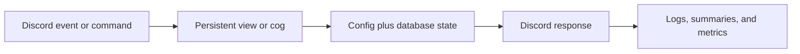
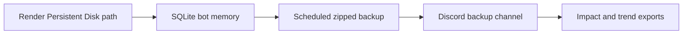
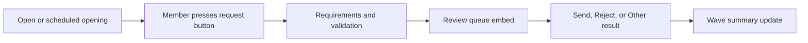
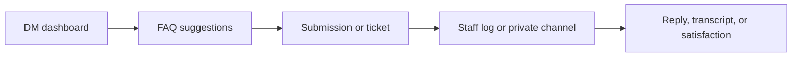
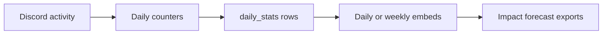
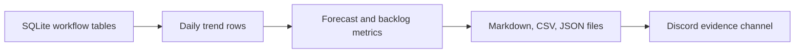

# Avenue Guard

Architecture, Workflow, Operations, And Impact Manual

Generated from the current Avenue Guard codebase and configuration.

## Contents

1. How To Read This Manual
2. Executive Overview
3. Development History
4. Runtime And Startup Architecture
5. Configuration Model
6. Database And Persistence
7. Cog Architecture
8. Permissions And Security Model
9. Moderation Guardrails
10. Live Request System
11. Request Validation And GD Metadata
12. Review Workflow
13. Weekly Activity And Rewards
14. Help, Tickets, And Staff Support
15. Background Telemetry
16. Admin Tools And Diagnostics
17. Impact Reporting
18. External Services And Dependencies
19. Failure Recovery
20. Maintenance And Testing
21. Appendix: Command Families
22. Appendix: Data And Evidence

## 1. How To Read This Manual

Avenue Guard is the operating system for GD Avenue's Discord workflows. It is not only a moderation bot, and it is not only a level request bot. It connects request waves, weekly activity rewards, tickets, help flows, forum formatting, staff logs, analytics, and admin diagnostics into one persistent bot.

This manual is written for three audiences at once: the server owner who needs to explain the bot, the staff member who needs to operate it safely, and the developer who needs to maintain it without guessing. It keeps the language readable, but it still names the real modules, tables, commands, and responsibilities.

> **Core idea:** The bot is built around a single configured Discord server, a JSON configuration file, persistent SQLite state, and a set of cogs that each own a clear part of the community workflow.

### Document Map

- Chapters 1 to 5 explain the architecture, runtime, config, and persistence model.
- Chapters 6 to 14 explain the major user and staff workflows.
- Chapters 15 to 18 explain diagnostics, recovery, external services, and impact reporting.
- The appendix gives quick reference tables for commands, cogs, data, and operating rules.

The bot has grown through many rounds of practical server needs. That matters because many design choices are not abstract engineering preferences. They exist because the community needed safer requesting, better review visibility, more reliable tickets, measurable activity, and staff tools that can recover from missing messages or restarts.

## 2. Executive Overview

At the highest level, Avenue Guard is a Discord operations bot. It listens to server events, direct messages, button interactions, modal submissions, slash commands, scheduled loops, and background telemetry. Each event is routed through a cog that owns the relevant workflow, and most important outcomes are stored in SQLite.

The bot's central value is continuity. A request wave should not disappear after a restart. A ticket should have an ID and a transcript. A weekly reward should know who was contacted and whether they replied. A forum post deleted for missing the required word should be logged. A reviewer should see which requests are still pending. An owner should be able to generate numbers that show the bot's impact.

#### Main Operating Loop

> Every major workflow follows this loop so visible Discord state and stored bot memory stay aligned.

| Area | What Avenue Guard Does | Why It Matters |
| --- | --- | --- |
| Request waves | Opens, limits, schedules, validates, reviews, summarizes, and repairs level request waves. | Turns a messy manual process into a controlled staff queue. |
| Weekly rewards | Tracks eligible activity, contacts winners, records claims, and routes weekly submissions into the review workflow. | Rewards activity while keeping staff review consistent. |
| Help and tickets | Runs a DM help dashboard, FAQ search, appeals, reports, bot issues, transcript requests, tickets, and satisfaction prompts. | Gives members private support without losing staff accountability. |
| Guardrails | Deletes restricted proof-channel misuse, applies restriction roles, sends role DMs, manages sticky/forum reminders, and enforces forum words. | Reduces repeated moderation work and keeps public channels organized. |
| Telemetry | Tracks daily summaries, command usage, voice time, activity, anti-farm events, and now persistent impact exports. | Makes the bot measurable and useful for operations, not just automation. |

### What Makes It Complex

Avenue Guard is complex because it combines multiple stateful systems. It has persistent Discord views, scheduled jobs, slash commands, mod-only and admin-only gates, external validation calls, modal workflows, message edits, channel creation and deletion, ticket transcripts, and configurable embed templates. Many bots do one of these things. Avenue Guard coordinates all of them in one server-specific package.

The most important invariant is that public Discord state and database state should describe the same reality. If requests are closed in SQLite, the request button should say closed. If a ticket is resolved, the opening message and transcript should reflect that. If a request is reviewed, the original buttons should be disabled. Much of the bot's repair and diagnostic design exists to preserve this agreement between what users see and what the bot remembers.

## 3. Development History

The current bot evolved from a simpler Render-ready Discord bot into a much more complete community operations platform. The early shape focused on practical automations: keeping the bot in the correct guild, deleting misplaced proof-channel messages, sending role-triggered DMs, and keeping sticky reminder messages visible.

The next major phase added weekly activity tracking. The bot began counting eligible member messages, skipping excluded roles and channels, and contacting weekly winners with request opportunities. This phase introduced the idea that activity and reward state must survive restarts, because weekly workflows can span hours or days.

The request system then became the largest feature area. Live request waves gained an open/closed state, count limits, timers, scheduled openings, request types, duplicate blocking, per-wave summaries, reviewer buttons, result channels, edit windows, request edit audits, validation cache, and repair commands. Weekly request submissions were later brought into the same review workflow so staff did not need to learn two systems.

The help system grew in parallel. Instead of only sending generic DMs, Avenue Guard now runs an in-DMs dashboard, FAQ search, pre-ticket FAQ suggestions, appeal/report/bug previews, staff reply relay, private ticket creation, ticket statuses, transcript saving, transcript search, transcript requests, and satisfaction prompts.

More recent phases focused on staff experience and measurement: cleaner log embeds, daily and weekly summaries, anti-farm detection, server icon rotation, admin dashboards, doctor/repair suggestions, and now impact reporting. The bot's direction has been consistent: when a process starts to need staff memory, the bot stores it, exposes it, and makes it reviewable.

> **History in one sentence:** Avenue Guard developed from a utility bot into a persistent community workflow engine for requests, support, moderation guardrails, analytics, and staff coordination.

## 4. Runtime And Startup Architecture

The runtime begins in main.py. The bot creates a py-cord Bot object with the intents needed for messages, members, reactions, moderation, presences, voice states, and direct messages. It loads config.json through utils.config.Config, resolves the configured database path, opens it through utils.db.Database, installs global error handlers, and loads each cog extension.

Startup is deliberately defensive. On ready, the bot connects the database, checks that it can see the allowed guild, starts the keepalive server, starts background tasks in the tracking, help, request, and background cogs, and registers persistent views. Persistent views are crucial because Discord button interactions can arrive after a restart. The custom IDs live in utils.views and route back to the correct cog.

| Startup Step | Owner | Purpose |
| --- | --- | --- |
| Load config | utils.config.Config | Reads config.json and exposes typed getters for IDs, lists, and strings. |
| Connect DB | utils.db.Database | Creates or migrates SQLite tables before workflows depend on them. |
| Load cogs | main.py | Attaches feature modules for moderation, tracking, help, responses, sticky messages, requests, commands, and background jobs. |
| Start tasks | on_ready | Starts loops for weekly handling, ticket scans, request auto-close, scheduled openings, summaries, status, and icon rotation. |
| Register views | utils.views | Keeps buttons and selects alive across restarts through stable custom IDs. |

### Hosted Environment

The bot is designed to run on a hosted service such as Render. A small keepalive HTTP server exists for hosted environments, but the important persistence requirement is the SQLite database. If the host uses ephemeral storage, the database path must live on a persistent disk or equivalent mounted storage.

The bot also assumes that startup may happen after Discord components already exist. That is why persistent views are registered every time the bot becomes ready and why request/ticket state is not reconstructed from memory. Startup should be safe whether the bot was restarted manually, redeployed by the host, or recovered after an exception.

## 5. Configuration Model

Avenue Guard uses config.json as the main control plane. The Config loader treats keys beginning with an underscore as comments by convention, but it does not need a separate schema file. IDs can be stored as strings; the getter methods convert them to integers or lists when code needs them.

This design makes server-specific changes practical. Admins can change channel IDs, role IDs, request wording, embed templates, validation settings, icon URLs, background summary settings, and help FAQ entries without editing Python code. The /resync command reloads config and response rules so many changes do not require a full restart.

| Config Section | Controls |
| --- | --- |
| guild | The allowed guild ID. The bot shuts down if it cannot operate in that server. |
| roles | Moderation, admin, tracking exclusion, reward, and watched-role IDs. |
| channels | Core log, request, transcript, command, proof, and help channels. |
| tracking | Weekly message counting, winner DMs, reminders, streaks, anti-farm checks, and logs. |
| tickets | Ticket category, staff ping role, cooldowns, inactivity, and satisfaction prompt. |
| help | FAQ entries, warnings, cooldown assumptions, duplicate windows, and submission limits. |
| level_requests | Request channels, roles, text, embeds, validation, wave summaries, colors, and opening announcements. |
| background | Daily summaries, weekly recaps, rotating status, and server icon rotation. |
| database | SQLite path and scheduled zipped database backups. |
| impact | Destination for persistent impact report attachments and snapshots. |

### Why JSON Instead Of Hardcoding

The server changes faster than code should. Roles are renamed, channels are moved, request copy is adjusted, and staff may want different embed language for review or result messages. Keeping those values in config.json lets the bot remain stable while the server's surface changes.

The most customizable parts are the embed templates. Request submissions, reviewed requests, weekly submissions, result messages, wave summaries, help logs, and announcements are built from template variables. This gives the server control over tone and layout while keeping the workflow rules in code. The config checker validates many of those templates so a typo in a variable is easier to catch before staff depend on the embed.

## 6. Database And Persistence

The SQLite layer is intentionally small and predictable. utils.db.Database owns one SQLite connection with check_same_thread disabled, serializes operations with an asyncio lock, and runs blocking database work inside threads. The migration code creates tables and adds columns for older databases so the bot can evolve without manual SQL work every time a feature is added.

The database is not only storage; it is the bot's memory. It knows the active request wave, scheduled openings, submitted users and level IDs, request edit history, validation cache, weekly claims, weekly sessions, weekly reviews, activity counts, tickets, transcript pointers, help submissions, cooldowns, daily stats, and impact snapshots.

#### Persistence Safety Model

> The primary durable copy is the mounted SQLite file; backup attachments and exports provide recovery evidence.

### Render Storage Rule

On Render, the project source and cache can be wiped by redeploys or cache clears. Avenue Guard therefore resolves its SQLite path from AVENUE_GUARD_DB_PATH first, then database.path in config.json, then an auto-detected Render Persistent Disk path at /var/data/avenue-guard/bot.db, and only then the local fallback. For production, mount a Render Persistent Disk at /var/data or point AVENUE_GUARD_DB_PATH at another durable path.

The /bot storage command checks the running path and the latest backup record. The /bot backup command creates a zipped copy immediately, and the background backup loop posts scheduled copies to the configured backup channel. If no persistent path is writable, the bot now starts with a local fallback and warns clearly, but that fallback should be treated as temporary.

| Table | Purpose |
| --- | --- |
| activity_counts | Weekly message totals per user. |
| weekly_claims / weekly_sessions / weekly_dm_log | Weekly reward workflow state and audit history. |
| weekly_request_reviews | Weekly submitted request review messages and results. |
| tickets / ticket_sequences | Ticket channels, users, status, IDs, satisfaction, and closure state. |
| ticket_transcripts / transcript_requests | Saved transcript locations and member transcript request decisions. |
| help_submissions / help_sessions / help_cooldowns | DM help flows, appeal/report/bug submissions, and rate limits. |
| level_request_state | Current live request state, wave ID, limits, timers, and request button pointer. |
| level_request_submissions | Per-wave submitted levels, requester, result, review, and embed data. |
| level_request_edit_audit | Before/after snapshots of request edits. |
| gd_level_validation_cache | Cached validation results from external GD providers. |
| daily_stats / weekly_recaps | Operational telemetry snapshots and private recap history. |
| impact_snapshots | Persistent impact report payloads produced by /bot impact. |
| database_backups | Backup timestamps, channels, message IDs, sizes, reasons, and filenames. |

> **Persistence rule:** If a workflow can span a restart or must be auditable later, it belongs in SQLite rather than only in memory.

The migration approach is intentionally additive. New columns are added if missing, older tables are normalized when their shape changes, and indexes are created for common lookups. This lets the live bot keep its history while gaining new features such as ticket opening message IDs, request edit audit entries, scheduled opening messages, weekly review data, and impact snapshots.

## 7. Cog Architecture

Each cog owns a feature family. This keeps the code understandable even though the bot is large. The cogs do interact with each other, but mostly through named methods and shared database/config utilities. CommandsCog is the command hub, while the workflow cogs handle the long-running state machines.

| Cog | Primary Responsibility |
| --- | --- |
| ModCog | Proof-channel restrictions and role-triggered DMs. |
| TrackingCog | Weekly activity tracking, weekly request reward DMs, anti-farm checks, and weekly request recording. |
| HelpCog | DM help dashboard, FAQ, appeal/report/bug submissions, tickets, transcripts, and satisfaction. |
| MessageResponsesCog | Configurable message-triggered auto-responses. |
| StickyCog | Sticky messages, forum first-message reminders, and required-word thread deletion/logging. |
| RequestLevelsCog | Live request waves, scheduled openings, validation, modals, edit windows, reviews, results, summaries, and repairs. |
| CommandsCog | Admin, tracking, ticket, forum, request, server icon, fun, diagnostics, and impact commands. |
| BackgroundCog | Daily stats, summaries, rotating status, server icon rotation, and background persistence. |

### Interaction Flow

Persistent views in utils.views act like switchboards. A button custom ID identifies the action, the view asks Discord for the relevant cog, and then the cog handles the real logic. This means the visible component can remain tiny while the business rules stay in the owning cog.

For example, the request button view only knows that a member clicked Request your level. RequestLevelsCog then checks whether requests are open, whether the member has the required role, whether they already submitted in the wave, whether the button should open an edit flow, and whether a modal should appear.

This separation is especially useful for persistent components. A button may be clicked long after the message was created, so the button itself should not carry fragile state. It carries a stable custom ID, and the owning cog retrieves current state from config and SQLite at click time.

## 8. Permissions And Security Model

The bot combines Discord permissions, configured role IDs, and command-level checks. Public commands are kept narrow, mod commands require the configured mod role or configured permission policy, and admin commands require one of the configured admin/owner roles. Sensitive interactions also check the user before editing dashboards or panels.

Avenue Guard also avoids unsafe mention behavior in staff logs and bot-generated messages where possible. The no_mentions helper prevents accidental mass pings in logs and auto-responses. Where pings are intentional, such as the default request-open announcement, the behavior is explicit and configurable.

- Guild restriction prevents the bot from operating outside the configured server.
- Admin commands are role-gated even if their command descriptions do not visually say so.
- Mod workflows check staff role or manage-guild policy before ticket/status operations.
- Request reviewer controls are limited by access to the review channel and configured reviewer roles where staff filters apply.
- Auto-response output is length-limited and mass mentions are blocked.
- External validation has per-user rate limits and provider backoff to reduce abuse and failure cascades.

> **Security posture:** The bot is not a bank-grade security system, but it uses practical Discord safety controls: role gates, guild gates, safe mentions, cooldowns, audit logs, and recovery commands.

Data safety is treated pragmatically. The bot stores IDs, message pointers, submitted text, review text, ticket metadata, and transcript pointers because those are necessary for accountability. It avoids storing secrets in the database and does not require Google credentials for impact reporting. Sensitive records should still be protected by keeping the database on trusted storage and limiting staff-log channel access.

## 9. Moderation Guardrails

The guardrail layer handles repetitive moderation actions that should not depend on a staff member being online. The proof-channel restriction watches a configured channel. If a non-whitelisted member posts there, the bot deletes the message and applies the configured restriction role. If they add a reaction there, it removes the reaction and applies the same restriction role.

Role-triggered DMs are another guardrail. When a member gains a watched role, the bot sends a configured DM that explains what changed and how to appeal or contact staff. This turns silent role changes into explainable actions.

### Forum And Sticky Reminders

Sticky messages keep important instructions visible at the bottom of busy text channels. The bot debounces sticky updates, deletes the old sticky message, and posts a fresh one after the configured delay. Forum first-message reminders post an embed in new forum threads, with tag-specific templates when configured.

Required-word enforcement is designed for forum formats that must include a specific word. The bot checks thread title/body text, supports contains, whole word, and regex modes, sends a configurable DM to the thread owner, deletes the thread after the configured delay, and logs the deletion with the author and thread context.

> **Why this exists:** Forum reminders are gentle guidance; required-word enforcement is the hard stop for posts that ignore a required format.

## 10. Live Request System

The live request system is the bot's most involved workflow. It starts with a persistent request button embed in the configured request channel. Staff can refresh or recreate that embed with /refresh-request-button. Admins can open requests immediately, close them manually, or schedule openings for later.

#### Live Request Wave

> Submission count increases only after a valid modal succeeds, not when the button is pressed.

A wave begins whenever requests open. A wave can be unlimited, limited by successful submission count, limited by time, or limited by both. If both count and time are defined, the count limit wins. A request only counts after a valid modal submission succeeds. Clicking the button or opening the form does not consume a slot.

### Per-Wave Rules

- One user can submit one live request per wave.
- One level ID can be submitted once per wave.
- Per-user and per-level duplicate tracking resets when a new wave starts.
- Requests can be edited until the wave closes plus the configured grace period.
- The wave summary is updated as reviews happen so staff can see remaining workload.

### Request Types

Request waves can optionally define a type, such as needs showcase, only demons, only platformers, only classic, classic non-demons, platformer non-demons, or long/XL levels. These types are enforced after validation when the bot has enough GD metadata to reason about difficulty, platformer status, and length.

Opening announcements are configurable. If no custom message is provided, the bot uses the default request role ping and inserts a human-readable condition summary. Scheduled openings can also store a custom opening message.

Scheduled openings are deliberately managed as records instead of timers only in memory. Admins can list, edit, delete, refresh, or open them immediately. If the bot restarts before the scheduled time, the pending opening still exists in SQLite and the scheduled-opening loop can act on it when the bot comes back.

## 11. Request Validation And GD Metadata

Validation protects the request queue from bad level IDs and gives reviewers more context. The bot checks level IDs before accepting a modal: IDs must be 7 to 9 digits, showcase links must be URLs, and missing levels can be auto-rejected when enabled providers confidently agree that the ID does not exist.

The validation layer uses two providers: GDBrowser and the direct GD/Boomlings endpoint. Results are combined into one normalized payload that can include level name, creator, difficulty, length, stars, rated status, featured/epic flags, demon status, and platformer status. The result is cached in SQLite to keep repeated checks fast and to avoid hammering external services.

| Validation Output | How It Is Used |
| --- | --- |
| exists | Blocks confidently missing IDs before they enter the review queue. |
| rated | Warns reviewers that a level may already be rated. |
| demon/platformer | Requires a showcase URL automatically. |
| difficulty/length/stars | Adds clean GD info to request embeds. |
| provider disagreement | Warns staff instead of hiding uncertainty. |
| cache expiry | Lets repair or new submissions refresh stale warnings later. |

> **Validation principle:** The bot is strict only when the evidence is strong. When providers disagree or fail, the bot surfaces a warning instead of pretending certainty.

Validation also feeds presentation. The request embed can show compact GD info without overcrowding the request: difficulty, length, stars/rated status, flags, creator, and provider warnings can be collapsed into clean fields. That means reviewers spend less time opening external pages just to understand what kind of level they are judging.

## 12. Review Workflow

After a successful request submission, the bot sends a configurable embed to the level_requested channel. The embed includes requester, level ID, level name, creators, showcase, notes, GD info, validation warning, duplicate history warning, edit trail count, and wave information. The same view provides Send, Reject, and Other buttons.

Send and Reject open a review modal with an optional review field. Once submitted, the original request embed is edited into its final state, the result color changes, the reviewer is recorded, the result embed is posted to the sent or rejected channel, the requester is pinged there, and all buttons on the original request are disabled.

The Other button offers fixed reasons: level does not exist, stolen level, and already rated. These are treated like not-sent results and notify the requester through the rejected channel. This keeps special rejection reasons structured rather than buried in arbitrary review text.

### Wave Summary

When a wave exists, the bot maintains a summary embed in level_requested. It shows total requested, reviewed count, sent count, not-sent count, percentages, remaining reviews, not-sent breakdown, and reviewer stats. This is the staff dashboard for the wave, and it updates each time a request is reviewed.

### Repair

/requests repair exists because Discord messages can be deleted, embeds can go stale, validation warnings can expire, and reviewed messages should stay locked. The repair command refreshes the request button, rebuilds summaries, recreates missing pending request messages, refreshes validation warnings, and disables buttons on reviewed messages.

Review actions are designed to be idempotent from a staff perspective. The bot checks the original request row, verifies that it is still pending, confirms the result channel, edits the original embed, writes the review fields, sends the final notification, and disables buttons. This reduces the chance that two reviewers can accidentally process the same request twice.

## 13. Weekly Activity And Rewards

TrackingCog counts eligible member messages by week. It skips excluded channels and roles, uses a cooldown to avoid overcounting rapid-fire messages, buffers writes to reduce SQLite load, and applies anti-farm checks before messages are added to the weekly leaderboard.

At reward time, the bot contacts configured winners through DM. A member can claim, decline, time out, or receive a reminder. The weekly claim tables and logs store who was contacted, what happened, and which user should be offered the next slot if someone declines or times out. Admins can disable and re-enable the automatic reward for the current week.

Weekly request submissions use the same Send, Reject, and Other review workflow as live requests, but they are not part of a live request wave. This means staff review behavior stays consistent while wave-specific limits and summaries remain clean.

### Streaks And Anti-Farm

Weekly streaks reward members who repeatedly place in the configured top rank band. Anti-farm detection watches for repeated low-effort messages and logs suspicious patterns instead of letting them inflate weekly counts. The result is a leaderboard that is harder to game and more useful for community reward decisions.

Manual force-DM exists for operational exceptions. Admins can send the weekly request DM to a member even if normal tracking would exclude them or the automatic reward is disabled for the week. The result is logged so manual overrides remain visible to future staff.

## 14. Help, Tickets, And Staff Support

The DM help system starts from a dashboard. Members can see active ticket status, weekly activity status, current request state, recent help submissions, and cooldowns. The menu hides the option the user is already viewing, cleans up previous screens when possible, and supports Back, Cancel, and Start Over controls.

#### Help And Ticket Flow

> The user experience stays private while staff still get auditable records.

FAQ search and auto-suggestions are meant to reduce unnecessary tickets. Before opening a staff ticket, the bot can show relevant FAQ entries so common questions are solved privately. If the user still needs help, they can open a routed private ticket channel by topic.

### Submission Workflows

Appeals, user reports, bot issue reports, and transcript requests use tracked submissions. The bot stores a code, keeps attachment links, shows a preview before submission, posts a structured staff log embed, and lets staff reply to a log message to relay a response back to the submitter by DM.

### Tickets

Tickets use atomic ticket IDs, private channels, status tags, inactivity scans, close prompts, transcripts, transcript search, and satisfaction prompts. The opening message is kept in sync when staff or users reply, when a staff member changes status, and when the ticket closes. Before deletion, the bot saves a transcript and records where the transcript was posted.

The help system is intentionally private-first. It gives members a place to ask for help without escalating every issue into a public channel, but it still creates staff-visible logs when something becomes an official submission. This balances member comfort with staff accountability.

## 15. Background Telemetry

BackgroundCog is the bot's measurement layer. It listens for messages, edits, deletes, reactions, joins, leaves, bans, unbans, boosts, voice state changes, command completions, and command errors. These events are accumulated into daily snapshots and persisted in daily_stats.

#### Telemetry Flow

> Operational telemetry is useful for trends, but it should be described as tracked data rather than absolute community reality.

The daily summary embed turns raw counters into something readable: message totals, day-over-day movement, active members, active channels, joins/leaves, moderation signals, voice time, command success rate, top channels, top members, and top commands. Weekly recaps summarize longer-term activity, request, review, streak, and anti-farm patterns.

### Presence And Icon Rotation

The bot can rotate its Discord status using placeholders such as members, online count, weekly messages, current top member, open tickets, and today's messages. It can also rotate the server icon through configured image URLs in disabled, linear, or random modes. The icon rotation code downloads images, checks that they look like supported image bytes, remembers failures, and stores current index/state back into config.json.

Daily stats are useful but should be read as operational telemetry, not perfect analytics. They depend on bot uptime, enabled intents, cache visibility, and events the bot can observe. That is why impact reports label large totals as tracked events rather than claiming to represent every possible interaction in the community.

## 16. Admin Tools And Diagnostics

CommandsCog exposes most operator-facing slash commands. It includes tracking commands, ticket commands, forum required-word management, request review filters, request history, request repair, server icon controls, fun commands, and bot diagnostics.

The admin dashboard is a button-driven status view. It gathers system health, request state, tracking state, icon rotation, config issues, and repair suggestions into one embed. This reduces the need for scattered health commands while still keeping older commands available for direct checks.

| Diagnostic | Purpose |
| --- | --- |
| /bot dashboard | Interactive overview of system health, config, and repair tips. |
| /bot health | Compact live health report. |
| /bot config_check | Checks configured channels, roles, templates, and response rules. |
| /bot doctor | Deeper permission and system diagnostics. |
| /requests repair | Repairs request system messages, validation warnings, summaries, and locks. |
| /bot impact | Owner-only impact and forecast exports with Markdown, CSV, trend CSV, breakdown CSV, and JSON. |
| /bot backup | Creates a zipped SQLite backup and posts it to the configured backup channel. |
| /bot storage | Shows active database path, persistence warning, backup channel, interval, and latest backup. |

> **Operator principle:** When a feature can fail because a Discord message, channel, permission, or config value changed, the bot should expose a command that explains or repairs it.

## 17. Impact Reporting

The owner-only /bot impact command turns the bot's persistent state into a quantifiable impact report. It collects current server size, unique members touched by tracked workflows, tracked interaction events, support/help volume, ticket volume, transcripts, request totals, review rates, weekly reward activity, command usage, voice minutes, anti-farm events, and summary history.

#### Impact Reporting Pipeline

> The report is both human-readable and spreadsheet-ready so it can support CV evidence and operational planning.

The command posts a Markdown report, summary CSV, daily trend CSV, breakdown CSV, and raw JSON file to the configured impact report channel, then stores the same report payload in the impact_snapshots database table. The Markdown file is human-readable and CV-friendly. The CSV files can be imported into Google Sheets for charts, portfolio evidence, forecasting, or regular impact tracking.

The report now includes a simple forecast model. It compares the last seven days with the previous seven days, projects the next seven days from that movement, labels the engagement signal, and highlights review backlog or command error risk. This should be read as an operations forecast, not a perfect prediction.

### Why This Is Defensible For A CV

The report uses numbers the bot actually tracks. Instead of claiming vague community influence, it produces concrete figures such as members reached, support items handled, level requests coordinated, tracked events, tickets resolved, and review throughput. This makes the result useful for a CV because it describes operational impact in measurable terms.

For best evidence, run /bot impact on a recurring cadence such as monthly or before major application updates. Keep the posted Discord attachments, and import the CSV files into a spreadsheet when you want trend charts. The database snapshot is useful for bot-side history, while the Discord attachment gives you a durable, shareable artifact.

> **Example CV wording:** Built and maintained Avenue Guard, a Discord operations bot supporting a multi-thousand-member community, coordinating level request workflows, staff tickets, weekly rewards, help flows, moderation guardrails, and persistent impact reporting.

## 18. External Services And Dependencies

Avenue Guard relies on Discord as its primary platform, py-cord as its Discord framework, aiohttp for asynchronous HTTP, SQLite for persistence, and optional hosted infrastructure for runtime availability. Most data remains local to the bot's database and Discord channels.

The Geometry Dash validation feature uses GDBrowser and the GD/Boomlings endpoint. These services can fail, disagree, rate limit, or return unexpected payloads. The bot handles that by normalizing provider responses, caching results, surfacing warnings, and backing off providers that fail repeatedly.

### Google Sheets Consideration

The bot now exports multiple CSV impact files. That is the safest immediate bridge to Google Sheets because it does not require storing Google credentials in the bot. If a future service account or Google Drive integration is added, the same metrics payload can be uploaded automatically. Until then, the summary, trend, and breakdown CSV files are designed to import cleanly into a spreadsheet.

## 19. Failure Recovery

Avenue Guard assumes that Discord state can drift. A message can be deleted, a channel can be moved, a role can be missing, a permission can change, a provider can fail, or a database can be older than the current code. Recovery is therefore built into migrations, diagnostics, admin logs, repair commands, and cautious external validation.

- Database migration creates missing tables and columns on startup.
- Global command and event error handlers log failures instead of silently swallowing them.
- Request repair can rebuild missing request messages and relock reviewed embeds.
- Ticket close restores status if transcript/close fails partway through.
- Weekly request recording failures are logged and do not silently mark claims as successful.
- Icon rotation remembers last errors and avoids changing too frequently.
- Impact reports persist both a DB payload and Discord attachments when the report channel is configured.
- Scheduled database backups post zipped SQLite copies to Discord when the backup channel is configured.

> **Recovery philosophy:** The bot does not need to be impossible to break. It needs to fail visibly, preserve state, and provide a clear path back to a working condition.

In practice, most failures fall into a few categories: config points at a missing channel, the bot lacks a permission, a message was deleted, an external provider failed, a user disabled DMs, or a deploy restarted the process mid-workflow. The bot's current recovery tools are aimed at exactly those categories.

## 20. Maintenance And Testing

The main test guide is TEST_CHECKLIST.md. It is intentionally server-side because many behaviors require Discord state: roles, channels, messages, DMs, buttons, modals, slash command permissions, forum threads, scheduled tasks, and external request validation.

Code-level checks still matter. The project should compile cleanly, config.json should parse, and database migrations should run against a temporary database. For risky changes, test the real Discord workflow with a staff account and a non-staff account.

### Recommended Maintenance Routine

1. Run a syntax and config check before deploying.
2. Run /bot dashboard after deploying to catch missing roles, channels, or permissions.
3. Use /requests repair after request-template, validation, or message-state changes.
4. Run /bot storage after deploying to confirm the database path is persistent.
5. Run /bot backup after first deploy and before major migrations.
6. Run /bot impact periodically and keep the CSV files for trend tracking.
7. Update this manual when new feature families are added.

## 21. Appendix: Command Families

The bot exposes commands by family so staff can discover tools without memorizing every implementation detail. Command descriptions are kept clean; role restrictions are enforced by code instead of being advertised awkwardly in every description.

| Family | Commands |
| --- | --- |
| Tracking | /tracking top, /tracking me, /tracking reset, /tracking force_dm, /tracking disable_reward, /tracking enable_reward |
| Requests | /refresh-request-button, /open-requests, /close-requests, /requests-are, /edit-request, /pending-openings, /requests pending, /requests history, /requests repair |
| Tickets | /ticket close, /ticket status, /ticket transcripts |
| Forum | /forum required_word |
| Bot/admin | /bot dashboard, /bot health, /bot config_check, /bot doctor, /bot impact, /bot backup, /bot storage, /resync, /restart |
| Server icon | /server_icon status, /server_icon mode, /server_icon add, /server_icon replace, /server_icon remove, /server_icon set, /server_icon next |
| Fun | /dance, /rock-paper-scissors, /gambling |

### Operating Rule Of Thumb

Use public commands for member self-service, mod commands for ticket and forum operations, admin commands for stateful or config-affecting actions, and repair/doctor commands whenever Discord state no longer matches the database.

## 22. Appendix: Data And Evidence

Avenue Guard's strongest evidence is the data it already generates. Tickets, transcripts, help submissions, request waves, weekly claims, daily stats, and impact reports can show how much community work the bot has handled. The important thing is to use labels that match what is measured.

| Metric Label | Source | Good Use |
| --- | --- | --- |
| Current server members | Discord guild member count | Shows the size of the community the bot supports. |
| Unique members touched | Union of tracked workflow user IDs | Shows historical reach across bot workflows. |
| Tracked interaction events | Messages, commands, requests, tickets, help, DMs, reviews, transcripts, and safety logs | Shows operational throughput, not every human action in the server. |
| Support/help items | Tickets, help submissions, transcript requests | Shows staff-support workload handled by the bot. |
| Level requests coordinated | Live requests plus weekly request reviews | Shows request-program volume. |
| Review rate | Reviewed requests divided by total requests | Shows staff queue completion. |

For a CV, the safest wording combines a clear build claim with measured impact. For example: Built Avenue Guard, a Discord operations bot for GD Avenue that automates request waves, weekly rewards, tickets, help workflows, moderation guardrails, and analytics, with persistent reports quantifying member reach, support volume, request throughput, and staff review outcomes.
