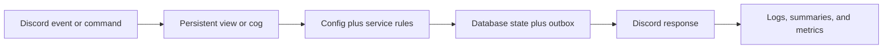
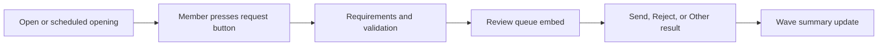
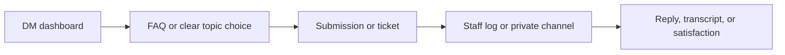
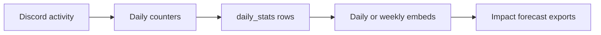
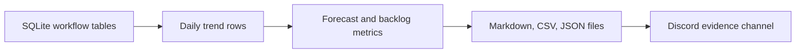
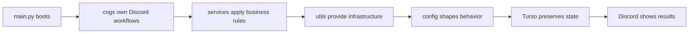
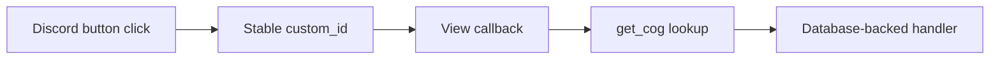
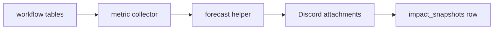
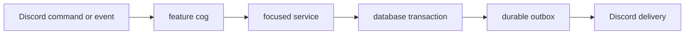
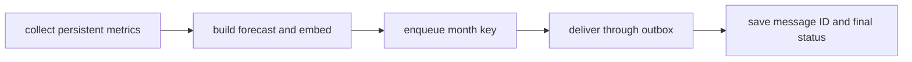

# Avenue Guard

Private Technical Manual: How The Bot Works Internally

Generated from the current Avenue Guard codebase and configuration for Rodrigo.

## Contents

1. Private Manual Notice
2. How To Read This Manual
3. Executive Overview
4. Development History
5. Runtime And Startup Architecture
6. Configuration Model
7. Database And Persistence
8. Cog Architecture
9. Permissions And Security Model
10. Moderation Guardrails
11. Live Request System
12. Request Validation And GD Metadata
13. Review Workflow
14. Weekly Activity And Rewards
15. Help, Tickets, And Staff Support
16. Background Telemetry
17. Admin Tools And Diagnostics
18. Impact Reporting
19. External Services And Dependencies
20. Failure Recovery
21. Maintenance And Testing
22. Appendix: Command Families
23. Appendix: Data And Evidence
24. Private Orientation: How To Study The Bot
25. Source Inventory
26. Command Surface Inventory
27. Database Table Inventory
28. Startup Code Walkthrough
29. Database Code Walkthrough
30. Config And Template Engine Walkthrough
31. Persistent Views Walkthrough
32. Live Request Code Walkthrough
33. Validation Code Walkthrough
34. Request Review Code Walkthrough
35. Scheduled Openings Walkthrough
36. Tracking Code Walkthrough
37. Weekly Request Workflow Walkthrough
38. Help And Ticket Code Walkthrough
39. Background Telemetry Code Walkthrough
40. Forum And Sticky Code Walkthrough
41. Impact And Backup Code Walkthrough
42. Server Icon Rotation Code Walkthrough
43. Durable Operations Platform 3 22
44. Engineering Thinking Behind The Bot
45. Debugging Notebook

## 1. Private Manual Notice

This document is now a private technical manual for Rodrigo. It explains Avenue Guard as a codebase, not as a public staff guide. It still describes staff-facing workflows because those workflows exist in the code, but the reader is assumed to be the person trying to understand, maintain, explain, and continue building the bot.

> **Reading promise:** The manual uses plain language, diagrams, tables, and real source excerpts. The aim is to make the bot understandable from top to bottom without flattening the technical details that make it work.

If you only need a quick answer, use the inventory and appendix chapters. If you want a deep read, follow the source walkthrough chapters in order. They move from startup to persistence, then into requests, tracking, help, telemetry, impact reporting, and debugging.

## 2. How To Read This Manual

Avenue Guard is the operating system for GD Avenue's Discord workflows. It is not only a moderation bot, and it is not only a level request bot. It connects request waves, weekly activity rewards, tickets, help flows, forum formatting, staff logs, analytics, and admin diagnostics into one persistent bot.

This manual is private technical documentation for Rodrigo. It is not written as a staff handbook. It explains how the bot is built, how the code thinks, which modules own which workflows, and why the implementation choices exist. Staff workflows are described only because they are part of the bot's code and state model.

> **Core idea:** The bot is built around a single configured Discord server, versioned JSON configuration, Turso/libSQL-compatible persistent state, feature cogs, focused service modules, and a supervised delivery layer.

### Document Map

- The first chapters give the big mental model: runtime, config, persistence, cogs, permissions, and history.
- The workflow chapters explain requests, weekly tracking, help/tickets, forums, telemetry, admin tools, and impact reporting.
- The private deep-dive chapters walk through actual source code excerpts and the less obvious engineering ideas.
- The appendices give quick lookup tables for commands, database tables, files, and maintenance habits.

The bot has grown through many rounds of practical server needs. That matters because many design choices are not abstract engineering preferences. They exist because the community needed safer requesting, better review visibility, more reliable tickets, measurable activity, and staff tools that can recover from missing messages or restarts.

## 3. Executive Overview

At the highest level, Avenue Guard is a Discord operations bot. It listens to server events, direct messages, button interactions, modal submissions, slash commands, scheduled loops, and background telemetry. Each event is routed through a cog that owns the relevant workflow, and most important outcomes are stored in SQLite.

The bot's central value is continuity. A request wave should not disappear after a restart. A ticket should have an ID and a transcript. A weekly reward should know who was contacted and whether they replied. A forum post deleted for missing the required word should be logged. A reviewer should see which requests are still pending. An owner should be able to generate numbers that show the bot's impact.

#### Main Operating Loop


```mermaid
flowchart LR
  S1["Discord event or command"]
  S2["Persistent view or cog"]
  S3["Config plus service rules"]
  S4["Database state plus outbox"]
  S5["Discord response"]
  S6["Logs, summaries, and metrics"]
  S1 --> S2
  S2 --> S3
  S3 --> S4
  S4 --> S5
  S5 --> S6
```

> Every major workflow follows this loop so visible Discord state and stored bot memory stay aligned.

| Area | What Avenue Guard Does | Why It Matters |
| --- | --- | --- |
| Request waves | Opens, limits, schedules, validates, reviews, summarizes, and repairs level request waves. | Turns a messy manual process into a controlled staff queue. |
| Weekly rewards | Tracks eligible activity, contacts winners, records claims, and routes weekly submissions into the review workflow. | Rewards activity while keeping staff review consistent. |
| Help and tickets | Runs a DM help dashboard, paginated FAQ, appeals, reports, bot issues, transcript requests, tickets, and satisfaction prompts. | Gives members private support without losing staff accountability. |
| Guardrails | Deletes restricted proof-channel misuse, applies restriction roles, sends role DMs, manages sticky/forum reminders, and enforces forum words. | Reduces repeated moderation work and keeps public channels organized. |
| Telemetry | Tracks daily summaries, command usage, voice time, activity, anti-farm events, and now persistent impact exports. | Makes the bot measurable and useful for operations, not just automation. |

### What Makes It Complex

Avenue Guard is complex because it combines multiple stateful systems. It has persistent Discord views, scheduled jobs, slash commands, mod-only and admin-only gates, external validation calls, modal workflows, message edits, channel creation and deletion, ticket transcripts, and configurable embed templates. Many bots do one of these things. Avenue Guard coordinates all of them in one server-specific package.

The most important invariant is that public Discord state and database state should describe the same reality. If requests are closed in SQLite, the request button should say closed. If a ticket is resolved, the opening message and transcript should reflect that. If a request is reviewed, the original buttons should be disabled. Much of the bot's repair and diagnostic design exists to preserve this agreement between what users see and what the bot remembers.

## 4. Development History

The current bot evolved from a simpler Render-ready Discord bot into a much more complete community operations platform. The early shape focused on practical automations: keeping the bot in the correct guild, deleting misplaced proof-channel messages, sending role-triggered DMs, and keeping sticky reminder messages visible.

The next major phase added weekly activity tracking. The bot began counting eligible member messages, skipping excluded roles and channels, and contacting weekly winners with request opportunities. This phase introduced the idea that activity and reward state must survive restarts, because weekly workflows can span hours or days.

The request system then became the largest feature area. Live request waves gained an open/closed state, count limits, timers, scheduled openings, request types, duplicate blocking, per-wave summaries, reviewer buttons, result channels, edit windows, request edit audits, validation cache, and repair commands. Weekly request submissions were later brought into the same review workflow so staff did not need to learn two systems.

The help system grew in parallel. Instead of only sending generic DMs, Avenue Guard now runs an in-DMs dashboard, a paginated FAQ, pre-ticket FAQ suggestions, appeal/report/bug previews, staff reply relay, private ticket creation, ticket statuses, transcript saving, transcript search, transcript requests, and satisfaction prompts.

More recent phases focused on staff experience and measurement: cleaner log embeds, daily and weekly summaries, anti-farm detection, server icon rotation, admin dashboards, doctor/repair suggestions, and now impact reporting. The bot's direction has been consistent: when a process starts to need staff memory, the bot stores it, exposes it, and makes it reviewable.

Version 3.22 added a shared operations platform: durable Discord delivery, task supervision, typed configuration, schema contracts, correlation IDs, incident grouping, health history, permission drift, restore drills, retention, monthly impact reporting, and more informative request-review analytics.

> **History in one sentence:** Avenue Guard developed from a utility bot into a persistent community workflow engine for requests, support, moderation guardrails, analytics, and staff coordination.

## 5. Runtime And Startup Architecture

The runtime begins in main.py. The bot creates a py-cord Bot object with the intents needed for messages, members, reactions, moderation, presences, voice states, and direct messages. It loads config.json through utils.config.Config, resolves the configured database path, opens it through utils.db.Database, installs global error handlers, and loads each cog extension.

Startup is deliberately defensive. A database preflight connects and migrates storage before Discord login. On ready, the bot checks that it can see the allowed guild, starts the keepalive server, starts feature loops plus OperationsCog, and registers persistent views. Persistent views are crucial because Discord button interactions can arrive after a restart. The custom IDs live in utils.views and route back to the correct cog.

| Startup Step | Owner | Purpose |
| --- | --- | --- |
| Load config | utils.config.Config | Reads config.json and exposes typed getters for IDs, lists, and strings. |
| Connect DB | utils.db.Database | Creates or migrates SQLite tables before workflows depend on them. |
| Load cogs | main.py | Attaches feature modules plus OperationsCog, which supervises shared background reliability. |
| Start tasks | on_ready and OperationsCog | Starts feature loops, outbox delivery, health sampling, maintenance, supervision, and smoke checks. |
| Register views | utils.views | Keeps buttons and selects alive across restarts through stable custom IDs. |

### Hosted Environment

The bot is designed to run on a hosted service such as Render. A small keepalive HTTP server exists for hosted environments, but the important persistence requirement is the database. Production uses a local embedded replica that forwards writes to Turso, so the host's temporary filesystem is a cache rather than the durable source of truth.

The bot also assumes that startup may happen after Discord components already exist. That is why persistent views are registered every time the bot becomes ready and why request/ticket state is not reconstructed from memory. Startup should be safe whether the bot was restarted manually, redeployed by the host, or recovered after an exception.

## 6. Configuration Model

Avenue Guard uses config.json as the main control plane. The Config loader treats keys beginning with an underscore as comments by convention, while utils.config_schema validates the version, IDs, option types, bounds, notification modes, and request embed placeholders. IDs can be stored as strings and converted by typed getters.

This design makes server-specific changes practical. Admins can change channel IDs, role IDs, request wording, embed templates, validation settings, icon URLs, background summary settings, and help FAQ entries without editing Python code. The /resync command reloads config and response rules so many changes do not require a full restart.

| Config Section | Controls |
| --- | --- |
| guild | The allowed guild ID. The bot shuts down if it cannot operate in that server. |
| roles | Moderation, admin, tracking exclusion, reward, and watched-role IDs. |
| channels | Core log, request, transcript, command, proof, and help channels. |
| tracking | Weekly message counting, winner DMs, reminders, streaks, anti-farm checks, and logs. |
| tickets | Ticket category, staff ping role, cooldowns, inactivity, and satisfaction prompt. |
| help | FAQ entries, warnings, cooldown assumptions, duplicate windows, and submission limits. |
| level_requests | Request channels, roles, text, embeds, validation, wave summaries, colors, and opening announcements. |
| background | Daily summaries, weekly recaps, rotating status, and server icon rotation. |
| database | SQLite path and scheduled zipped database backups. |
| impact | Destination for persistent impact report attachments and snapshots. |

### Why JSON Instead Of Hardcoding

The server changes faster than code should. Roles are renamed, channels are moved, request copy is adjusted, and staff may want different embed language for review or result messages. Keeping those values in config.json lets the bot remain stable while the server's surface changes.

The most customizable parts are the embed templates. Request submissions, reviewed requests, weekly submissions, result messages, wave summaries, help logs, and announcements are built from template variables. This gives the server control over tone and layout while keeping the workflow rules in code. The config checker validates many of those templates so a typo in a variable is easier to catch before staff depend on the embed.

## 7. Database And Persistence

The SQLite layer is intentionally small and predictable. utils.db.Database owns one SQLite connection with check_same_thread disabled, serializes operations with an asyncio lock, and runs blocking database work inside threads. The migration code creates tables and adds columns for older databases so the bot can evolve without manual SQL work every time a feature is added.

The database is not only storage; it is the bot's memory. It knows the active request wave, scheduled openings, submitted users and level IDs, request edit history, validation cache, weekly claims, weekly sessions, weekly reviews, activity counts, tickets, transcript pointers, help submissions, cooldowns, daily stats, and impact snapshots.

#### Persistence Safety Model


```mermaid
flowchart LR
  S1["Render Persistent Disk path"]
  S2["SQLite bot memory"]
  S3["Scheduled zipped backup"]
  S4["Discord backup channel"]
  S5["Impact and trend exports"]
  S1 --> S2
  S2 --> S3
  S3 --> S4
  S4 --> S5
```

> The primary durable copy is the mounted SQLite file; backup attachments and exports provide recovery evidence.

### Render Storage Rule

On Render, the project source and cache can be wiped by redeploys or cache clears. Avenue Guard therefore resolves its SQLite path from AVENUE_GUARD_DB_PATH first, then database.path in config.json, then an auto-detected Render Persistent Disk path at /var/data/avenue-guard/bot.db, and only then the local fallback. For production, mount a Render Persistent Disk at /var/data or point AVENUE_GUARD_DB_PATH at another durable path.

The /bot storage command checks the running path and the latest backup record. The /bot backup command creates a zipped copy immediately, and the background backup loop posts scheduled copies to the configured backup channel. If no persistent path is writable, the bot now starts with a local fallback and warns clearly, but that fallback should be treated as temporary.

| Table | Purpose |
| --- | --- |
| activity_counts | Weekly message totals per user. |
| weekly_claims / weekly_sessions / weekly_dm_log | Weekly reward workflow state and audit history. |
| weekly_request_reviews | Weekly submitted request review messages and results. |
| tickets / ticket_sequences | Ticket channels, users, status, IDs, satisfaction, and closure state. |
| ticket_transcripts / transcript_requests | Saved transcript locations and member transcript request decisions. |
| help_submissions / help_sessions / help_cooldowns | DM help flows, appeal/report/bug submissions, and rate limits. |
| level_request_state | Current live request state, wave ID, limits, timers, and request button pointer. |
| level_request_submissions | Per-wave submitted levels, requester, result, review, and embed data. |
| level_request_edit_audit | Before/after snapshots of request edits. |
| gd_level_validation_cache | Cached validation results from external GD providers. |
| daily_stats / weekly_recaps | Operational telemetry snapshots and private recap history. |
| impact_snapshots | Persistent impact report payloads produced by /bot impact. |
| database_backups | Backup timestamps, channels, message IDs, sizes, reasons, and filenames. |

> **Persistence rule:** If a workflow can span a restart or must be auditable later, it belongs in SQLite rather than only in memory.

The migration approach is intentionally additive. New columns are added if missing, older tables are normalized when their shape changes, and indexes are created for common lookups. This lets the live bot keep its history while gaining new features such as ticket opening message IDs, request edit audit entries, scheduled opening messages, weekly review data, and impact snapshots.

## 8. Cog Architecture

Each cog owns a feature family. This keeps the code understandable even though the bot is large. The cogs do interact with each other, but mostly through named methods and shared database/config utilities. CommandsCog is the command hub, while the workflow cogs handle the long-running state machines.

| Cog | Primary Responsibility |
| --- | --- |
| ModCog | Proof-channel restrictions and role-triggered DMs. |
| TrackingCog | Weekly activity tracking, weekly request reward DMs, anti-farm checks, and weekly request recording. |
| HelpCog | DM help dashboard, FAQ, appeal/report/bug submissions, tickets, transcripts, and satisfaction. |
| MessageResponsesCog | Configurable message-triggered auto-responses. |
| StickyCog | Sticky messages, forum first-message reminders, and required-word thread deletion/logging. |
| RequestLevelsCog | Live request waves, scheduled openings, validation, modals, edit windows, reviews, results, summaries, and repairs. |
| CommandsCog | Admin, tracking, ticket, forum, request, server icon, fun, diagnostics, and impact commands. |
| BackgroundCog | Daily stats, summaries, rotating status, server icon rotation, and background persistence. |

### Interaction Flow

Persistent views in utils.views act like switchboards. A button custom ID identifies the action, the view asks Discord for the relevant cog, and then the cog handles the real logic. This means the visible component can remain tiny while the business rules stay in the owning cog.

For example, the request button view only knows that a member clicked Request your level. RequestLevelsCog then checks whether requests are open, whether the member has the required role, whether they already submitted in the wave, whether the button should open an edit flow, and whether a modal should appear.

This separation is especially useful for persistent components. A button may be clicked long after the message was created, so the button itself should not carry fragile state. It carries a stable custom ID, and the owning cog retrieves current state from config and SQLite at click time.

## 9. Permissions And Security Model

The bot combines Discord permissions, configured role IDs, and command-level checks. Public commands are kept narrow, mod commands require the configured mod role or configured permission policy, and admin commands require one of the configured admin/owner roles. Sensitive interactions also check the user before editing dashboards or panels.

Avenue Guard also avoids unsafe mention behavior in staff logs and bot-generated messages where possible. The no_mentions helper prevents accidental mass pings in logs and auto-responses. Where pings are intentional, such as the default request-open announcement, the behavior is explicit and configurable.

- Guild restriction prevents the bot from operating outside the configured server.
- Admin commands are role-gated even if their command descriptions do not visually say so.
- Mod workflows check staff role or manage-guild policy before ticket/status operations.
- Request reviewer controls are limited by access to the review channel and configured reviewer roles where staff filters apply.
- Auto-response output is length-limited and mass mentions are blocked.
- External validation has per-user rate limits and provider backoff to reduce abuse and failure cascades.

> **Security posture:** The bot is not a bank-grade security system, but it uses practical Discord safety controls: role gates, guild gates, safe mentions, cooldowns, audit logs, and recovery commands.

Data safety is treated pragmatically. The bot stores IDs, message pointers, submitted text, review text, ticket metadata, and transcript pointers because those are necessary for accountability. It avoids storing secrets in the database and does not require Google credentials for impact reporting. Sensitive records should still be protected by keeping the database on trusted storage and limiting staff-log channel access.

## 10. Moderation Guardrails

The guardrail layer handles repetitive moderation actions that should not depend on a staff member being online. The proof-channel restriction watches a configured channel. If a non-whitelisted member posts there, the bot deletes the message and applies the configured restriction role. If they add a reaction there, it removes the reaction and applies the same restriction role.

Role-triggered DMs are another guardrail. When a member gains a watched role, the bot sends a configured DM that explains what changed and how to appeal or contact staff. This turns silent role changes into explainable actions.

### Forum And Sticky Reminders

Sticky messages keep important instructions visible at the bottom of busy text channels. The bot debounces sticky updates, deletes the old sticky message, and posts a fresh one after the configured delay. Forum first-message reminders post an embed in new forum threads, with tag-specific templates when configured.

Required-word enforcement is designed for forum formats that must include a specific word. The bot checks thread title/body text, supports contains, whole word, and regex modes, sends a configurable DM to the thread owner, deletes the thread after the configured delay, and logs the deletion with the author and thread context.

> **Why this exists:** Forum reminders are gentle guidance; required-word enforcement is the hard stop for posts that ignore a required format.

## 11. Live Request System

The live request system is the bot's most involved workflow. It starts with a persistent request button embed in the configured request channel. Staff can refresh or recreate that embed with /refresh-request-button. Admins can open requests immediately, close them manually, or schedule openings for later.

#### Live Request Wave


```mermaid
flowchart LR
  S1["Open or scheduled opening"]
  S2["Member presses request button"]
  S3["Requirements and validation"]
  S4["Review queue embed"]
  S5["Send, Reject, or Other result"]
  S6["Wave summary update"]
  S1 --> S2
  S2 --> S3
  S3 --> S4
  S4 --> S5
  S5 --> S6
```

> Submission count increases only after a valid modal succeeds, not when the button is pressed.

A wave begins whenever requests open. A wave can be unlimited, limited by successful submission count, limited by time, or limited by both. If both count and time are defined, the count limit wins. A request only counts after a valid modal submission succeeds. Clicking the button or opening the form does not consume a slot.

### Per-Wave Rules

- One user can submit one live request per wave.
- One level ID can be submitted once per wave.
- Per-user and per-level duplicate tracking resets when a new wave starts.
- Requests can be edited until the wave closes plus the configured grace period.
- The wave summary is updated as reviews happen so staff can see remaining workload.

### Request Types

Request waves can optionally define a type, such as needs showcase, only demons, only platformers, only classic, classic non-demons, platformer non-demons, or long/XL levels. These types are enforced after validation when the bot has enough GD metadata to reason about difficulty, platformer status, and length.

Opening announcements are configurable. If no custom message is provided, the bot uses the default request role ping and inserts a human-readable condition summary. Scheduled openings can also store a custom opening message.

Scheduled openings are deliberately managed as records instead of timers only in memory. Admins can list, edit, delete, refresh, or open them immediately. If the bot restarts before the scheduled time, the pending opening still exists in SQLite and the scheduled-opening loop can act on it when the bot comes back.

## 12. Request Validation And GD Metadata

Validation protects the request queue from bad level IDs and gives reviewers more context. The bot checks level IDs before accepting a modal: IDs must be 7 to 9 digits, showcase links must be URLs, and missing levels can be auto-rejected when enabled providers confidently agree that the ID does not exist.

The validation layer uses two providers: GDBrowser and the direct GD/Boomlings endpoint. Results are combined into one normalized payload that can include level name, creator, difficulty, length, stars, rated status, featured/epic flags, demon status, and platformer status. The result is cached in SQLite to keep repeated checks fast and to avoid hammering external services.

| Validation Output | How It Is Used |
| --- | --- |
| exists | Blocks confidently missing IDs before they enter the review queue. |
| rated | Warns reviewers that a level may already be rated. |
| demon/platformer | Requires a showcase URL automatically. |
| difficulty/length/stars | Adds clean GD info to request embeds. |
| provider disagreement | Warns staff instead of hiding uncertainty. |
| cache expiry | Lets repair or new submissions refresh stale warnings later. |

> **Validation principle:** The bot is strict only when the evidence is strong. When providers disagree or fail, the bot surfaces a warning instead of pretending certainty.

Validation also feeds presentation. The request embed can show compact GD info without overcrowding the request: difficulty, length, stars/rated status, flags, creator, and provider warnings can be collapsed into clean fields. That means reviewers spend less time opening external pages just to understand what kind of level they are judging.

## 13. Review Workflow

After a successful request submission, the bot sends a configurable embed to the level_requested channel. The embed includes requester, level ID, level name, creators, showcase, notes, GD info, validation warning, duplicate history warning, edit trail count, and wave information. The same view provides Send, Reject, and Other buttons.

Send and Reject open a review modal with an optional review field. Once submitted, the original request embed is edited into its final state, the result color changes, the reviewer is recorded, the result embed is posted to the sent or rejected channel, the requester is pinged there, and all buttons on the original request are disabled.

The Other button offers fixed reasons: level does not exist, stolen level, and already rated. These are treated like not-sent results and notify the requester through the rejected channel. This keeps special rejection reasons structured rather than buried in arbitrary review text.

### Wave Summary

When a wave exists, the bot maintains a summary embed in level_requested. It shows total requested, reviewed count, sent count, not-sent count, percentages, remaining reviews, not-sent breakdown, and reviewer stats. This is the staff dashboard for the wave, and it updates each time a request is reviewed.

### Repair

/requests repair exists because Discord messages can be deleted, embeds can go stale, validation warnings can expire, and reviewed messages should stay locked. The repair command refreshes the request button, rebuilds summaries, recreates missing pending request messages, refreshes validation warnings, and disables buttons on reviewed messages.

Review actions are designed to be idempotent from a staff perspective. The bot checks the original request row, verifies that it is still pending, confirms the result channel, edits the original embed, writes the review fields, sends the final notification, and disables buttons. This reduces the chance that two reviewers can accidentally process the same request twice.

## 14. Weekly Activity And Rewards

TrackingCog counts eligible member messages by week. It skips excluded channels and roles, uses a cooldown to avoid overcounting rapid-fire messages, buffers writes to reduce SQLite load, and applies anti-farm checks before messages are added to the weekly leaderboard.

At reward time, the bot contacts configured winners through DM. A member can claim, decline, time out, or receive a reminder. The weekly claim tables and logs store who was contacted, what happened, and which user should be offered the next slot if someone declines or times out. Admins can disable and re-enable the automatic reward for the current week.

Weekly request submissions use the same Send, Reject, and Other review workflow as live requests, but they are not part of a live request wave. This means staff review behavior stays consistent while wave-specific limits and summaries remain clean.

### Streaks And Anti-Farm

Weekly streaks reward members who repeatedly place in the configured top rank band. Anti-farm detection watches for repeated low-effort messages and logs suspicious patterns instead of letting them inflate weekly counts. The result is a leaderboard that is harder to game and more useful for community reward decisions.

Manual force-DM exists for operational exceptions. Admins can send the weekly request DM to a member even if normal tracking would exclude them or the automatic reward is disabled for the week. The result is logged so manual overrides remain visible to future staff.

## 15. Help, Tickets, And Staff Support

The DM help system starts from a dashboard. Members can see active ticket status, weekly activity status, current request state, recent help submissions, and cooldowns. The menu hides the option the user is already viewing, cleans up previous screens when possible, and supports Back, Cancel, and Start Over controls.

#### Help And Ticket Flow


```mermaid
flowchart LR
  S1["DM dashboard"]
  S2["FAQ or clear topic choice"]
  S3["Submission or ticket"]
  S4["Staff log or private channel"]
  S5["Reply, transcript, or satisfaction"]
  S1 --> S2
  S2 --> S3
  S3 --> S4
  S4 --> S5
```

> The user experience stays private while staff still get auditable records.

The FAQ is a short paginated list rather than an intelligent free-text search. Before an ordinary staff ticket opens, the bot can still suggest configured FAQ entries so common questions are solved privately. If the user still needs help, they can open a routed private ticket channel by topic.

### Submission Workflows

Appeals, user reports, bot issue reports, and transcript requests use tracked submissions. The bot stores a code, keeps attachment links, shows a preview before submission, posts a structured staff log embed, and lets staff reply to a log message to relay a response back to the submitter by DM.

### Tickets

Tickets use atomic ticket IDs, private channels, status tags, inactivity scans, close prompts, transcripts, transcript search, and satisfaction prompts. The opening message is kept in sync when staff or users reply, when a staff member changes status, and when the ticket closes. Before deletion, the bot saves a transcript and records where the transcript was posted.

The help system is intentionally private-first. It gives members a place to ask for help without escalating every issue into a public channel, but it still creates staff-visible logs when something becomes an official submission. This balances member comfort with staff accountability.

## 16. Background Telemetry

BackgroundCog is the bot's measurement layer. It listens for messages, edits, deletes, reactions, joins, leaves, bans, unbans, boosts, voice state changes, command completions, and command errors. These events are accumulated into daily snapshots and persisted in daily_stats.

#### Telemetry Flow


```mermaid
flowchart LR
  S1["Discord activity"]
  S2["Daily counters"]
  S3["daily_stats rows"]
  S4["Daily or weekly embeds"]
  S5["Impact forecast exports"]
  S1 --> S2
  S2 --> S3
  S3 --> S4
  S4 --> S5
```

> Operational telemetry is useful for trends, but it should be described as tracked data rather than absolute community reality.

The daily summary embed turns raw counters into something readable: message totals, day-over-day movement, active members, active channels, joins/leaves, moderation signals, voice time, command success rate, top channels, top members, and top commands. Weekly recaps summarize longer-term activity, request, review, streak, and anti-farm patterns.

### Presence And Icon Rotation

The bot can rotate its Discord status using placeholders such as members, online count, weekly messages, current top member, open tickets, and today's messages. It can also rotate the server icon through configured image URLs in disabled, linear, or random modes. The icon rotation code downloads images, checks that they look like supported image bytes, remembers failures, and stores current index/state back into config.json.

Daily stats are useful but should be read as operational telemetry, not perfect analytics. They depend on bot uptime, enabled intents, cache visibility, and events the bot can observe. That is why impact reports label large totals as tracked events rather than claiming to represent every possible interaction in the community.

## 17. Admin Tools And Diagnostics

CommandsCog exposes most operator-facing slash commands. It includes tracking commands, ticket commands, forum required-word management, request review filters, request history, request repair, server icon controls, fun commands, and bot diagnostics.

The admin dashboard is a button-driven status view. It gathers system health, request state, tracking state, icon rotation, config issues, and repair suggestions into one embed. This reduces the need for scattered health commands while still keeping older commands available for direct checks.

| Diagnostic | Purpose |
| --- | --- |
| /bot dashboard | Interactive overview of system health, config, and repair tips. |
| /bot health | Compact live health report. |
| /bot config_check | Checks configured channels, roles, templates, and response rules. |
| /bot doctor | Deeper permission and system diagnostics. |
| /requests repair | Repairs request system messages, validation warnings, summaries, and locks. |
| /bot impact | Owner-only impact and forecast exports with Markdown, CSV, trend CSV, breakdown CSV, and JSON. |
| /bot backup | Creates a zipped SQLite backup and posts it to the configured backup channel. |
| /bot storage | Shows active database path, persistence warning, backup channel, interval, and latest backup. |

> **Operator principle:** When a feature can fail because a Discord message, channel, permission, or config value changed, the bot should expose a command that explains or repairs it.

## 18. Impact Reporting

The owner-only /bot impact command turns the bot's persistent state into a quantifiable impact report. It collects current server size, unique members touched by tracked workflows, tracked interaction events, support/help volume, ticket volume, transcripts, request totals, review rates, weekly reward activity, command usage, voice minutes, anti-farm events, and summary history.

#### Impact Reporting Pipeline


```mermaid
flowchart LR
  S1["SQLite workflow tables"]
  S2["Daily trend rows"]
  S3["Forecast and backlog metrics"]
  S4["Markdown, CSV, JSON files"]
  S5["Discord evidence channel"]
  S1 --> S2
  S2 --> S3
  S3 --> S4
  S4 --> S5
```

> The report is both human-readable and spreadsheet-ready so it can support CV evidence and operational planning.

The command posts a Markdown report, summary CSV, daily trend CSV, breakdown CSV, and raw JSON file to the configured impact report channel, then stores the same report payload in the impact_snapshots database table. The Markdown file is human-readable and CV-friendly. The CSV files can be imported into Google Sheets for charts, portfolio evidence, forecasting, or regular impact tracking.

The report now includes a simple forecast model. It compares the last seven days with the previous seven days, projects the next seven days from that movement, labels the engagement signal, and highlights review backlog or command error risk. This should be read as an operations forecast, not a perfect prediction.

### Why This Is Defensible For A CV

The report uses numbers the bot actually tracks. Instead of claiming vague community influence, it produces concrete figures such as members reached, support items handled, level requests coordinated, tracked events, tickets resolved, and review throughput. This makes the result useful for a CV because it describes operational impact in measurable terms.

For best evidence, run /bot impact on a recurring cadence such as monthly or before major application updates. Keep the posted Discord attachments, and import the CSV files into a spreadsheet when you want trend charts. The database snapshot is useful for bot-side history, while the Discord attachment gives you a durable, shareable artifact.

> **Example CV wording:** Built and maintained Avenue Guard, a Discord operations bot supporting a multi-thousand-member community, coordinating level request workflows, staff tickets, weekly rewards, help flows, moderation guardrails, and persistent impact reporting.

## 19. External Services And Dependencies

Avenue Guard relies on Discord as its primary platform, py-cord as its Discord framework, aiohttp for asynchronous HTTP, SQLite for persistence, and optional hosted infrastructure for runtime availability. Most data remains local to the bot's database and Discord channels.

The Geometry Dash validation feature uses GDBrowser and the GD/Boomlings endpoint. These services can fail, disagree, rate limit, or return unexpected payloads. The bot handles that by normalizing provider responses, caching results, surfacing warnings, and backing off providers that fail repeatedly.

### Google Sheets Consideration

The bot now exports multiple CSV impact files. That is the safest immediate bridge to Google Sheets because it does not require storing Google credentials in the bot. If a future service account or Google Drive integration is added, the same metrics payload can be uploaded automatically. Until then, the summary, trend, and breakdown CSV files are designed to import cleanly into a spreadsheet.

## 20. Failure Recovery

Avenue Guard assumes that Discord state can drift. A message can be deleted, a channel can be moved, a role can be missing, a permission can change, a provider can fail, or a database can be older than the current code. Recovery is therefore built into migrations, diagnostics, admin logs, repair commands, and cautious external validation.

- Database migration creates missing tables and columns on startup.
- Global command and event error handlers log failures instead of silently swallowing them.
- Request repair can rebuild missing request messages and relock reviewed embeds.
- Ticket close restores status if transcript/close fails partway through.
- Weekly request recording failures are logged and do not silently mark claims as successful.
- Icon rotation remembers last errors and avoids changing too frequently.
- Impact reports persist both a DB payload and Discord attachments when the report channel is configured.
- Scheduled database backups post zipped SQLite copies to Discord when the backup channel is configured.

> **Recovery philosophy:** The bot does not need to be impossible to break. It needs to fail visibly, preserve state, and provide a clear path back to a working condition.

In practice, most failures fall into a few categories: config points at a missing channel, the bot lacks a permission, a message was deleted, an external provider failed, a user disabled DMs, or a deploy restarted the process mid-workflow. The bot's current recovery tools are aimed at exactly those categories.

## 21. Maintenance And Testing

The main test guide is TEST_CHECKLIST.md. It is intentionally server-side because many behaviors require Discord state: roles, channels, messages, DMs, buttons, modals, slash command permissions, forum threads, scheduled tasks, and external request validation.

Code-level checks still matter. The project should compile cleanly, config.json should parse, and database migrations should run against a temporary database. For risky changes, test the real Discord workflow with a staff account and a non-staff account.

### Recommended Maintenance Routine

1. Run a syntax and config check before deploying.
2. Run /bot dashboard after deploying to catch missing roles, channels, or permissions.
3. Use /requests repair after request-template, validation, or message-state changes.
4. Run /bot storage after deploying to confirm the database path is persistent.
5. Run /bot backup after first deploy and before major migrations.
6. Run /bot impact periodically and keep the CSV files for trend tracking.
7. Update this manual when new feature families are added.

## 22. Appendix: Command Families

The bot exposes commands by family so staff can discover tools without memorizing every implementation detail. Command descriptions are kept clean; role restrictions are enforced by code instead of being advertised awkwardly in every description.

| Family | Commands |
| --- | --- |
| Tracking | /tracking top, /tracking me, /tracking reset, /tracking force_dm, /tracking disable_reward, /tracking enable_reward |
| Requests | /refresh-request-button, /open-requests, /close-requests, /requests-are, /edit-request, /pending-openings, /requests pending, /requests history, /requests repair |
| Tickets | /ticket close, /ticket status, /ticket transcripts |
| Forum | /forum required_word |
| Bot/admin | /bot dashboard, /bot health, /bot config_check, /bot doctor, /bot impact, /bot backup, /bot storage, /resync, /restart |
| Server icon | /server_icon status, /server_icon mode, /server_icon add, /server_icon replace, /server_icon remove, /server_icon set, /server_icon next |
| Fun | /dance, /rock-paper-scissors, /gambling |

### Operating Rule Of Thumb

Use public commands for member self-service, mod commands for ticket and forum operations, admin commands for stateful or config-affecting actions, and repair/doctor commands whenever Discord state no longer matches the database.

## 23. Appendix: Data And Evidence

Avenue Guard's strongest evidence is the data it already generates. Tickets, transcripts, help submissions, request waves, weekly claims, daily stats, and impact reports can show how much community work the bot has handled. The important thing is to use labels that match what is measured.

| Metric Label | Source | Good Use |
| --- | --- | --- |
| Current server members | Discord guild member count | Shows the size of the community the bot supports. |
| Unique members touched | Union of tracked workflow user IDs | Shows historical reach across bot workflows. |
| Tracked interaction events | Messages, commands, requests, tickets, help, DMs, reviews, transcripts, and safety logs | Shows operational throughput, not every human action in the server. |
| Support/help items | Tickets, help submissions, transcript requests | Shows staff-support workload handled by the bot. |
| Level requests coordinated | Live requests plus weekly request reviews | Shows request-program volume. |
| Review rate | Reviewed requests divided by total requests | Shows staff queue completion. |

For a CV, the safest wording combines a clear build claim with measured impact. For example: Built Avenue Guard, a Discord operations bot for GD Avenue that automates request waves, weekly rewards, tickets, help workflows, moderation guardrails, and analytics, with persistent reports quantifying member reach, support volume, request throughput, and staff review outcomes.

## 24. Private Orientation: How To Study The Bot

This private section is written for you as the builder-owner of Avenue Guard. The goal is not only to know which commands exist. The goal is to understand how a Discord event becomes code, how code turns into stored state, how that state survives a restart, and how the bot repairs visible Discord messages when they drift.

A useful way to study the project is to read it in layers: main.py starts the system, cogs own Discord workflows, services hold reusable business rules, utils provide infrastructure, config.json controls server-specific behavior, and Turso remembers anything that matters after a restart. When you get lost, ask: who owns this event, where is the state stored, and what Discord object does the user see?

#### Code Reading Map


```mermaid
flowchart LR
  S1["main.py boots"]
  S2["cogs own Discord workflows"]
  S3["services apply business rules"]
  S4["utils provide infrastructure"]
  S5["config shapes behavior"]
  S6["Turso preserves state"]
  S7["Discord shows results"]
  S1 --> S2
  S2 --> S3
  S3 --> S4
  S4 --> S5
  S5 --> S6
  S6 --> S7
```

> This is the mental route for almost every feature in the bot.

| Question | Where To Look First |
| --- | --- |
| Why did the bot start or fail? | main.py and utils/db.py |
| Why did a command answer this way? | cogs/Commands.py or cogs/RequestLevels.py command method |
| Why did a button do something after restart? | utils/views.py custom ID and the owning cog handler |
| Why did a request enter or skip the queue? | RequestLevelsCog validation, requirements, and submission lock |
| Why did a weekly winner get contacted? | TrackingCog weekly loop, weekly_claims, weekly_sessions |
| Why did a ticket status change? | HelpCog on_message and ticket status helpers |
| Why did a report number appear in impact data? | CommandsCog _collect_impact_metrics |

> **The important pattern:** Avenue Guard is event-driven, but its serious workflows are state-driven. The event starts the logic; the database decides what is true.

## 25. Source Inventory

This chapter is generated from the current source files. It gives you a quick structural map before the deeper walkthroughs. Line counts are not a quality metric by themselves, but they reveal where most of the bot's complexity lives.

| File | Lines | Shape | Discord Hooks |
| --- | --- | --- | --- |
| main.py | 661 | 1 classes / 23 functions | 0 listeners / 0 loops |
| cogs/Background.py | 1397 | 3 classes / 89 functions | 12 listeners / 5 loops |
| cogs/Commands.py | 4803 | 3 classes / 142 functions | 0 listeners / 0 loops |
| cogs/Help.py | 4734 | 10 classes / 177 functions | 1 listeners / 0 loops |
| cogs/MessageResponses.py | 201 | 1 classes / 9 functions | 1 listeners / 0 loops |
| cogs/Mod.py | 351 | 1 classes / 11 functions | 3 listeners / 0 loops |
| cogs/Operations.py | 567 | 1 classes / 22 functions | 0 listeners / 0 loops |
| cogs/Release.py | 941 | 1 classes / 34 functions | 0 listeners / 0 loops |
| cogs/RequestLevels.py | 4196 | 9 classes / 167 functions | 0 listeners / 0 loops |
| cogs/Sticky.py | 634 | 1 classes / 28 functions | 2 listeners / 0 loops |
| cogs/Tracking.py | 2379 | 2 classes / 67 functions | 1 listeners / 0 loops |
| services/backups.py | 82 | 0 classes / 2 functions | 0 listeners / 0 loops |
| services/diagnostics.py | 169 | 1 classes / 2 functions | 0 listeners / 0 loops |
| services/impact.py | 77 | 1 classes / 2 functions | 0 listeners / 0 loops |
| services/request_reviews.py | 100 | 1 classes / 4 functions | 0 listeners / 0 loops |
| services/request_scheduling.py | 51 | 1 classes / 4 functions | 0 listeners / 0 loops |
| services/request_validation.py | 29 | 0 classes / 3 functions | 0 listeners / 0 loops |
| utils/config.py | 85 | 1 classes / 7 functions | 0 listeners / 0 loops |
| utils/config_schema.py | 394 | 2 classes / 7 functions | 0 listeners / 0 loops |
| utils/db.py | 1779 | 2 classes / 70 functions | 0 listeners / 0 loops |
| utils/errors.py | 235 | 0 classes / 11 functions | 0 listeners / 0 loops |
| utils/gd_validation.py | 440 | 0 classes / 17 functions | 0 listeners / 0 loops |
| utils/outbox.py | 265 | 2 classes / 12 functions | 0 listeners / 0 loops |
| utils/server_icons.py | 100 | 0 classes / 7 functions | 0 listeners / 0 loops |
| utils/views.py | 355 | 11 classes / 25 functions | 0 listeners / 0 loops |
| utils/workflows.py | 116 | 2 classes / 9 functions | 0 listeners / 0 loops |

The largest files are large because they own full workflows, not because they only hold utility helpers. RequestLevels.py owns a state machine with modals, validation, buttons, scheduled openings, review actions, and repairs. Commands.py owns the command surface and cross-system diagnostics. Help.py owns the DM and ticket state machines.

### How To Use This Inventory

When debugging, avoid starting from the biggest file and scrolling randomly. Start from the user action. If it is a slash command, search the command name. If it is a button, search the custom ID in utils/views.py and follow the handler. If it is a background action, search the task loop name or the database table it changes.

## 26. Command Surface Inventory

This table is extracted from command registrations. The bot has direct commands and grouped commands. Some legacy or programmatic commands appear by short name here, while their actual Discord path may include a group such as /bot, /tracking, /ticket, /requests, /forum, or /server_icon.

| Command | Registered In | Description |
| --- | --- | --- |
| /add | cogs/Commands.py | Add a server icon URL |
| /analytics | cogs/Commands.py | Show request outcomes and review performance |
| /backup | cogs/Commands.py | Create a durable database backup |
| /close | cogs/Commands.py | Close the current ticket channel |
| /config_check | cogs/Commands.py | Check configured channels and roles |
| /dance | cogs/Commands.py | Send a dance GIF |
| /dashboard | cogs/Commands.py | Open the admin system dashboard |
| /disable_reward | cogs/Commands.py | Disable this week's automatic weekly request reward |
| /doctor | cogs/Commands.py | Run deep bot permission diagnostics |
| /enable_reward | cogs/Commands.py | Re-enable this week's automatic weekly request reward |
| /force_dm | cogs/Commands.py | Force-send the weekly request DM to a user |
| /gambling | cogs/Commands.py | Try your luck in a quick slots game |
| /health | cogs/Commands.py | Show bot health and live system status |
| /history | cogs/Commands.py | Show request edit history |
| /impact | cogs/Commands.py | Generate a persistent community impact report |
| /me | cogs/Commands.py | Show your activity stats for this week |
| /mode | cogs/Commands.py | Set server icon rotation mode |
| /next | cogs/Commands.py | Change to the next configured server icon now |
| /notifications | cogs/Commands.py | Choose how request results notify you |
| /pending | cogs/Commands.py | Show and filter pending request reviews |
| /release | cogs/Commands.py | Prepare a version update for private approval |
| /releases | cogs/Commands.py | Show approved and pending bot releases |
| /remove | cogs/Commands.py | Remove a server icon URL by number |
| /repair | cogs/Commands.py | Repair request system messages |
| /replace | cogs/Commands.py | Replace a server icon URL by number |
| /required_word | cogs/Commands.py | View or update a forum required word |
| /reset | cogs/Commands.py | Reset current week's tracking stats |
| /restart | cogs/Commands.py | Restart the bot |
| /restore | cogs/Commands.py | Restore the database from an uploaded SQLite backup |
| /resync | cogs/Commands.py | Refresh Turso, config, views, and responses without restart |
| /retention | cogs/Commands.py | View, update, or run data retention |
| /rock-paper-scissors | cogs/Commands.py | Play Rock Paper Scissors |
| /set | cogs/Commands.py | Change to a specific configured server icon now |
| /status | cogs/Commands.py | Set the current ticket status |
| /status | cogs/Commands.py | Show server icon rotation status |
| /storage | cogs/Commands.py | Show database storage and backup status |
| /top | cogs/Commands.py | Show the current week's top 20 active members |
| /transcripts | cogs/Commands.py | Search saved ticket transcripts |
| /close-requests | cogs/RequestLevels.py | Close level requests |
| /edit-request | cogs/RequestLevels.py | Edit your current pending level request |
| /open-requests | cogs/RequestLevels.py | Open level requests now or schedule them |
| /pending-openings | cogs/RequestLevels.py | List, edit, or delete scheduled request openings |
| /refresh-request-button | cogs/RequestLevels.py | Refresh or recreate the request button embed |
| /requests-are | cogs/RequestLevels.py | Check whether level requests are open |

> **Descriptions are intentionally clean:** The code enforces permissions. The command descriptions do not need to carry visual labels like admin-only or owner-only.

## 27. Database Table Inventory

This table is extracted from utils/db.py. It is one of the most useful quick-reference sections because almost every serious Avenue Guard behavior has a table behind it.

| Table | Purpose |
| --- | --- |
| activity_counts | Weekly activity totals. |
| activity_last_counted | Per-user cooldown memory for activity counting. |
| anti_farm_events | Skipped low-effort activity events. |
| ban_info_requests | Persistent workflow state. |
| bot_releases | Persistent workflow state. |
| bot_uptime_tracker | Persistent workflow state. |
| daily_stats | Daily telemetry payloads. |
| daily_summary_reports | Persistent workflow state. |
| database_backups | Posted backup metadata. |
| database_restore_log | Persistent workflow state. |
| discord_outbox | Durable retryable Discord actions and delivery IDs. |
| error_incidents | Grouped error fingerprints, counts, and resolution state. |
| gd_level_validation_cache | Cached GD provider validation payloads. |
| health_metrics | Historical runtime, query, gateway, and provider samples. |
| help_cooldowns | Help action rate limits. |
| help_sessions | Current DM help flow stage. |
| help_submissions | Appeals, reports, and bot issue records. |
| impact_snapshots | Owner impact report payload history. |
| level_request_edit_audit | Before/after request edit snapshots. |
| level_request_scheduled_openings | Future request openings. |
| level_request_state | Current live request wave state. |
| level_request_submissions | Live request submissions and reviews. |
| level_request_wave_summaries | Live wave summary message pointers. |
| monthly_impact_reports | Monthly report generation and outbox delivery state. |
| permission_drift_events | Open and resolved channel or role permission drift. |
| restore_drills | Non-destructive backup integrity test history. |
| rps_streaks | Rock-paper-scissors win streaks. |
| runtime_settings | Persistent workflow state. |
| schema_metadata | Explicit database, config, runtime, and embed schema versions. |
| sticky_state | Last sticky message per channel. |
| ticket_cooldowns | Ticket creation cooldowns. |
| ticket_sequences | Atomic ticket ID counters by guild. |
| ticket_transcripts | Transcript log message pointers. |
| tickets | Ticket channel, owner, status, ID, and satisfaction state. |
| transcript_requests | Member transcript approval requests. |
| user_notification_preferences | Per-user request result delivery choice. |
| weekly_claims | Weekly reward contact and claim status. |
| weekly_dm_log | Weekly workflow audit events. |
| weekly_recaps | Private weekly recap message history. |
| weekly_reminders | Reminder delivery memory. |
| weekly_request_reviews | Weekly request review queue rows. |
| weekly_reward_disabled | Per-week switch for automatic reward delivery. |
| weekly_runs | Scheduler idempotency for weekly jobs. |
| weekly_sessions | Active weekly DM claim sessions. |
| weekly_streaks | Top-member streak tracking. |
| workflow_events | Correlation-based workflow and task timeline. |

The table names are grouped by feature family. activity_* and weekly_* belong to tracking. ticket_* and help_* belong to support. level_request_* and gd_level_validation_cache belong to live requests. daily_stats, impact_snapshots, and database_backups belong to measurement and durability.

## 28. Startup Code Walkthrough

main.py is the bot's entry point. The most important startup choice is that production resolves a writable embedded replica and valid Turso credentials before Discord login. That prevents a briefly online but unusable bot and refuses an accidental fallback to disposable host storage.

#### Database path resolution (main.py:258-325)

```python
 258: def resolve_db_path(config: Config) -> tuple[str, str, str, str, str]:
 259:     warnings: list[str] = []
 260:     require_remote = bool(config.get("database", "require_remote_when_configured", default=True))
 261:     allow_local_fallback = os.getenv("ALLOW_LOCAL_DATABASE_FALLBACK", "").strip().casefold() in {
 262:         "1",
 263:         "true",
 264:         "yes",
 265:         "on",
 266:     }
 267:     turso_url = (
 268:         os.getenv("TURSO_DATABASE_URL", "")
 269:         or os.getenv("LIBSQL_URL", "")
 270:         or str(config.get("database", "turso_url", default="") or "")
 271:     ).strip()
 272:     turso_token = (os.getenv("TURSO_AUTH_TOKEN", "") or os.getenv("LIBSQL_AUTH_TOKEN", "")).strip()
 273:     if turso_url:
 274:         if turso_token:
 275:             replica_path = (
 276:                 os.getenv("TURSO_REPLICA_PATH", "").strip()
 277:                 or str(config.get("database", "turso_replica_path", default="") or "").strip()
 278:                 or TURSO_REPLICA_PATH
 279:             )
 280:             ok, error = _database_path_usable(replica_path)
 281:             if ok:
 282:                 return replica_path, "Turso/libSQL embedded replica", "", turso_url, turso_token
 283:             message = f"Turso replica path is not writable: {replica_path} ({error})"
 284:             if require_remote and not allow_local_fallback:
 285:                 raise PersistenceConfigurationError(
 286:                     f"{message}. Refusing to start on disposable local storage. Fix TURSO_REPLICA_PATH or set "
 287:                     "ALLOW_LOCAL_DATABASE_FALLBACK=1 for intentional local development."
 288:                 )
 289:             warnings.append(f"{message}; falling back to local SQLite")
 290:         else:
 291:             message = "A Turso/libSQL database URL is set but TURSO_AUTH_TOKEN is missing"
 292:             if require_remote and not allow_local_fallback:
 293:                 raise PersistenceConfigurationError(
 294:                     f"{message}. Refusing to start on disposable local storage. Add the database token or set "
 295:                     "ALLOW_LOCAL_DATABASE_FALLBACK=1 for intentional local development."
 296:                 )
 297:             warnings.append(f"{message}; falling back to local SQLite")
 298:
 299:     env_path = os.getenv("AVENUE_GUARD_DB_PATH", "").strip()
 300:     candidates: list[tuple[str, str, bool]] = []
 301:     if env_path:
 302:         candidates.append(("AVENUE_GUARD_DB_PATH", env_path, True))
 303:     config_path = str(config.get("database", "path", default="") or "").strip()
 304:     if config_path:
 305:         candidates.append(("config.json database.path", config_path, False))
 306:     candidates.append(("Render Persistent Disk auto-detect", RENDER_DISK_DB_PATH, False))
 307:     candidates.append(("local fallback", DEFAULT_DB_PATH, False))
 308:
 309:     for source, path, explicit in candidates:
 310:         ok, error = _database_path_usable(path)
 311:         if ok:
 312:             warning = " | ".join(warnings)
 313:             if warning:
 314:                 startup_log(warning)
 315:             if source == "local fallback":
 316:                 warning = (
 317:                     f"{warning} | " if warning else ""
 318:                 ) + "Using local fallback database; data can be lost if Render clears cache and no Persistent Disk is mounted."
 319:             return path, source, warning, "", ""
 320:         message = f"Database path from {source} is not writable: {path} ({error})"
 321:         if explicit:
 322:             message += "; falling back so the bot can start"
 323:         warnings.append(message)
 324:
 325:     return DEFAULT_DB_PATH, "local fallback", "All configured database paths failed; using local fallback.", "", ""
```

When Turso is configured, the resolver requires both a database URL and database-scoped token, verifies the replica path, and refuses silent local fallback in production. Local-only mode still checks environment, config, mounted disk, and development paths with a real write probe before accepting one.

#### Bot creation, outbox, and cog loading (main.py:327-377)

```python
 327: def create_bot() -> discord.Bot:
 328:     intents = discord.Intents.default()
 329:     for intent_name in (
 330:         "bans",
 331:         "dm_messages",
 332:         "guild_messages",
 333:         "guild_reactions",
 334:         "members",
 335:         "message_content",
 336:         "messages",
 337:         "moderation",
 338:         "presences",
 339:         "reactions",
 340:         "voice_states",
 341:     ):
 342:         if hasattr(intents, intent_name):
 343:             setattr(intents, intent_name, True)
 344:     bot = discord.Bot(intents=intents)
 345:     bot.config_write_lock = asyncio.Lock()
 346:
 347:     bot.config = Config("config.json")
 348:     bot.db_path, bot.db_path_source, bot.db_path_warning, bot.db_remote_url, bot.db_remote_token = resolve_db_path(bot.config)
 349:     startup_log(f"Using database path: {bot.db_path} ({bot.db_path_source})")
 350:     bot.db = Database(bot.db_path, remote_url=bot.db_remote_url, auth_token=bot.db_remote_token)
 351:     bot.outbox = DiscordOutbox(bot)
 352:     _install_storage_close_hook(bot)
 353:
 354:     @bot.check_once
 355:     async def attach_command_correlation(ctx: discord.ApplicationContext) -> bool:
 356:         command = getattr(ctx, "command", None)
 357:         command_name = str(
 358:             getattr(command, "qualified_name", None)
 359:             or getattr(command, "name", None)
 360:             or "command"
 361:         )
 362:         ctx.correlation_id = begin_workflow_context(prefix=command_name)
 363:         return True
 364:
 365:     @bot.event
 366:     async def on_application_command_completion(
 367:         ctx: discord.ApplicationContext,
 368:     ) -> None:
 369:         clear_workflow_context()
 370:
 371:     setup_global_error_handlers(bot)
 372:
 373:     def _load_cogs():
 374:         bot.load_extension("cogs.Mod")
 375:         bot.load_extension("cogs.Tracking")
 376:         bot.load_extension("cogs.Help")
 377:         bot.load_extension("cogs.MessageResponses")
```

create_bot wires configuration, database, the durable outbox, command correlation, cogs, and on_ready behavior together. A preflight migration happens before login; on_ready then validates the guild, repairs legacy IDs, starts cog loops, starts the operations supervisor, and registers persistent views.

#### Persistent view registration (main.py:534-545)

```python
 534:         if callable(refresh_metrics):
 535:             try:
 536:                 await refresh_metrics(record_availability=False)
 537:             except Exception as e:
 538:                 await log_error(bot, f"Public bot status refresh after resume failed: {e!r}")
 539:
 540:     async def register_persistent_views():
 541:         bot.add_view(TrackingDeclineConfirmView())
 542:         bot.add_view(TicketClosePromptView())
 543:         bot.add_view(HelpMenuView())
 544:         bot.add_view(FormerMemberHelpView())
 545:         bot.add_view(BanInfoGiveInfoView())
```

Persistent view registration is easy to underestimate. Discord button messages can outlive the Python process. Without registering the views again after restart, users could click old buttons and Discord would not know which callback should run.

## 29. Database Code Walkthrough

The Database wrapper is small because it has one job: make SQLite safe enough for an async Discord bot. SQLite calls are blocking, so the wrapper serializes access with an asyncio.Lock and runs the actual SQLite work inside asyncio.to_thread.

#### Connection, WAL, migration, and backup (utils/db.py:14-66)

```python
  14:
  15: from utils.config_schema import (
  16:     CONFIG_SCHEMA_VERSION,
  17:     DATABASE_SCHEMA_VERSION,
  18:     EMBED_SCHEMA_VERSION,
  19:     RUNTIME_SCHEMA_VERSION,
  20: )
  21:
  22: try:
  23:     import libsql
  24: except Exception:
  25:     libsql = None
  26:
  27:
  28: class DictRow(dict):
  29:     """sqlite3.Row-like fallback for drivers that return tuples."""
  30:
  31:     def __init__(self, keys: Sequence[str], values: Sequence[Any]):
  32:         super().__init__((str(key), values[index] if index < len(values) else None) for index, key in enumerate(keys))
  33:         self._values = tuple(values)
  34:
  35:     def __getitem__(self, key: Any) -> Any:
  36:         if isinstance(key, int):
  37:             return self._values[key]
  38:         return super().__getitem__(key)
  39:
  40:
  41: def _row_get(row: Any, key: str, *, index: int = 0, default: Any = None) -> Any:
  42:     if row is None:
  43:         return default
  44:     try:
  45:         return row[key]
  46:     except Exception:
  47:         pass
  48:     try:
  49:         return row[index]
  50:     except Exception:
  51:         return default
  52:
  53:
  54: def _normalize_row(cursor: Any, row: Any) -> Any:
  55:     if row is None:
  56:         return None
  57:     try:
  58:         _ = row["__avenue_guard_missing_column__"]
  59:     except KeyError:
  60:         return row
  61:     except Exception:
  62:         pass
  63:     description = getattr(cursor, "description", None) or []
  64:     keys = [str(col[0]) for col in description if col]
  65:     if keys:
  66:         return DictRow(keys, tuple(row))
```

WAL mode helps SQLite handle concurrent readers while writes are happening. The lock still serializes bot-side operations, which prevents two coroutine paths from sharing one cursor incorrectly. This is less glamorous than a bigger database, but it fits a single-server bot well and keeps deployment simple.

#### Atomic ticket sequence and query helpers (utils/db.py:935-1003)

```python
 935:                 status TEXT NOT NULL,
 936:                 created_ts INTEGER NOT NULL,
 937:                 updated_ts INTEGER,
 938:                 ticket_id INTEGER,
 939:                 reviewed_by INTEGER,
 940:                 reviewed_ts INTEGER,
 941:                 error_text TEXT
 942:             );""",
 943:             """CREATE TABLE IF NOT EXISTS rps_streaks(
 944:                 guild_id INTEGER NOT NULL,
 945:                 user_id INTEGER NOT NULL,
 946:                 streak INTEGER NOT NULL,
 947:                 updated_ts INTEGER NOT NULL,
 948:                 PRIMARY KEY (guild_id, user_id)
 949:             );""",
 950:             """CREATE TABLE IF NOT EXISTS level_request_state(
 951:                 guild_id INTEGER PRIMARY KEY,
 952:                 state TEXT NOT NULL DEFAULT 'closed',
 953:                 wave_id INTEGER NOT NULL DEFAULT 0,
 954:                 request_limit INTEGER,
 955:                 close_ts INTEGER,
 956:                 submitted_count INTEGER NOT NULL DEFAULT 0,
 957:                 opened_ts INTEGER,
 958:                 closed_ts INTEGER,
 959:                 request_channel_id INTEGER,
 960:                 request_message_id INTEGER,
 961:                 request_type TEXT
 962:             );""",
 963:             """CREATE TABLE IF NOT EXISTS level_request_submissions(
 964:                 guild_id INTEGER NOT NULL,
 965:                 wave_id INTEGER NOT NULL,
 966:                 user_id INTEGER NOT NULL,
 967:                 level_id TEXT NOT NULL,
 968:                 request_message_id INTEGER UNIQUE,
 969:                 status TEXT NOT NULL,
 970:                 result TEXT,
 971:                 review_text TEXT,
 972:                 reviewed_by INTEGER,
 973:                 reviewed_ts INTEGER,
 974:                 created_ts INTEGER NOT NULL,
 975:                 data_json TEXT NOT NULL DEFAULT '{}',
 976:                 PRIMARY KEY (guild_id, wave_id, user_id),
 977:                 UNIQUE (guild_id, wave_id, level_id)
 978:             );""",
 979:             """CREATE TABLE IF NOT EXISTS level_request_wave_summaries(
 980:                 guild_id INTEGER NOT NULL,
 981:                 wave_id INTEGER NOT NULL,
 982:                 channel_id INTEGER NOT NULL,
 983:                 message_id INTEGER NOT NULL,
 984:                 created_ts INTEGER NOT NULL,
 985:                 updated_ts INTEGER NOT NULL,
 986:                 PRIMARY KEY (guild_id, wave_id)
 987:             );""",
 988:             """CREATE TABLE IF NOT EXISTS level_request_scheduled_openings(
 989:                 id INTEGER PRIMARY KEY AUTOINCREMENT,
 990:                 guild_id INTEGER NOT NULL,
 991:                 request_limit INTEGER,
 992:                 close_minutes INTEGER,
 993:                 open_ts INTEGER NOT NULL,
 994:                 request_type TEXT,
 995:                 open_message TEXT,
 996:                 created_by INTEGER NOT NULL,
 997:                 created_ts INTEGER NOT NULL,
 998:                 status TEXT NOT NULL DEFAULT 'pending',
 999:                 opened_wave_id INTEGER
1000:             );""",
1001:             """CREATE TABLE IF NOT EXISTS level_request_edit_audit(
1002:                 id INTEGER PRIMARY KEY AUTOINCREMENT,
1003:                 guild_id INTEGER NOT NULL,
```

The ticket ID function is the cleanest example of an atomic counter in this codebase. It reads and increments under the same database lock, commits before returning, and stores the next value by guild. This prevents two tickets opened at nearly the same time from receiving the same visible ticket number.

> **Atomic means indivisible:** In this bot, atomic usually means one protected operation that cannot be interleaved with another coroutine halfway through. The lock plus one database transaction gives that guarantee for counters and state transitions.

## 30. Config And Template Engine Walkthrough

config.json is treated as a practical control plane. The Config class is intentionally simple: load JSON, expose typed getters, and save atomically through a temporary file plus os.replace. This matters because a partially-written config file could break startup.

#### Typed config getters and atomic save (utils/config.py:13-65)

```python
  13:     - Keys that start with '_' are treated as comments by convention, but we simply ignore them when retrieving values.
  14:     - All getters accept a *path* of keys: get("section", "key", "subkey", default=...)
  15:     """
  16:
  17:     def __init__(self, path: str):
  18:         self.path = Path(path)
  19:         self.data: Dict[str, Any] = {}
  20:         self.validation_issues = []
  21:         self.reload()
  22:
  23:     def reload(self) -> None:
  24:         raw = self.path.read_text(encoding="utf-8")
  25:         self.data = json.loads(raw)
  26:         self.validation_issues = validate_config(self.data)
  27:
  28:     def save(self) -> None:
  29:         self.validation_issues = validate_config(self.data)
  30:         payload = json.dumps(self.data, indent=2, ensure_ascii=False) + "\n"
  31:         tmp_path = self.path.with_suffix(f"{self.path.suffix}.tmp")
  32:         tmp_path.write_text(payload, encoding="utf-8")
  33:         os.replace(tmp_path, self.path)
  34:
  35:     def get(self, *path: str, default: Any = None) -> Any:
  36:         cur: Any = self.data
  37:         for key in path:
  38:             if not isinstance(cur, dict):
  39:                 return default
  40:             if key not in cur:
  41:                 return default
  42:             cur = cur.get(key)
  43:         return cur if cur is not None else default
  44:
  45:     def get_str(self, *path: str, default: str = "") -> str:
  46:         v = self.get(*path, default=None)
  47:         if v is None:
  48:             return default
  49:         return str(v)
  50:
  51:     def get_int(self, *path: str, default: int = 0) -> int:
  52:         v = self.get(*path, default=None)
  53:         if v is None:
  54:             return default
  55:         try:
  56:             # avoid treating booleans as ints
  57:             if isinstance(v, bool):
  58:                 return default
  59:             return int(v)
  60:         except Exception:
  61:             return default
  62:
  63:     def get_int_list(self, *path: str, default: Optional[List[int]] = None) -> List[int]:
  64:         if default is None:
  65:             default = []
```

Many embeds use Python format_map with a SafeDict. If a template references a missing variable, the bot inserts an empty string instead of crashing the workflow. That is why template validation is useful: SafeDict keeps the bot alive, while config checks help you notice mistakes before users see blank fields.

#### Request embed template renderer (cogs/RequestLevels.py:1024-1064)

```python
1024:         return ""
1025:
1026:     def _provider_failure_cfg(self) -> tuple[int, int]:
1027:         cfg = self._level_validation_cfg()
1028:         try:
1029:             threshold = max(1, int(cfg.get("provider_failure_threshold", 5)))
1030:         except Exception:
1031:             threshold = 5
1032:         try:
1033:             seconds = max(30, int(cfg.get("provider_circuit_breaker_seconds", 300)))
1034:         except Exception:
1035:             seconds = 300
1036:         return threshold, seconds
1037:
1038:     def _provider_access_denied_backoff_seconds(self) -> int:
1039:         try:
1040:             return max(
1041:                 300,
1042:                 min(
1043:                     86400,
1044:                     int(
1045:                         self._level_validation_cfg().get(
1046:                             "provider_access_denied_backoff_seconds",
1047:                             21600,
1048:                         )
1049:                     ),
1050:                 ),
1051:             )
1052:         except Exception:
1053:             return 21600
1054:
1055:     def _provider_retry_attempts(self) -> int:
1056:         try:
1057:             return max(
1058:                 1,
1059:                 min(
1060:                     3,
1061:                     int(self._level_validation_cfg().get("provider_retry_attempts", 2)),
1062:                 ),
1063:             )
1064:         except Exception:
```

The embed renderer is shared by live request submissions, reviewed request embeds, result notifications, and wave summaries. It reads fields, footer, images, thumbnails, author info, color, title, and description from config. Workflow logic stays in Python; presentation stays in config.

## 31. Persistent Views Walkthrough

utils/views.py is the component router. It stores stable custom IDs and very small button/select classes. The view should not implement the business rules. It should only receive the click and call the owning cog.

#### Request button and review button router (utils/views.py:149-205)

```python
 149:             discord.SelectOption(
 150:                 label="Wanna partner?",
 151:                 value="partnership",
 152:                 description="Check the requirements and contact the partnership team",
 153:             ),
 154:             discord.SelectOption(
 155:                 label="Appeal punishment",
 156:                 value="appeal",
 157:                 description="Ask staff to reconsider a punishment",
 158:             ),
 159:             discord.SelectOption(
 160:                 label="Report a user",
 161:                 value="report",
 162:                 description="Privately report harmful behavior",
 163:             ),
 164:             discord.SelectOption(
 165:                 label="Report a bot issue",
 166:                 value="bot_issue",
 167:                 description="Tell us about a broken command or workflow",
 168:             ),
 169:             discord.SelectOption(
 170:                 label="Check my weekly status",
 171:                 value="weekly_status",
 172:                 description="See this week's message count and rank",
 173:             ),
 174:             discord.SelectOption(
 175:                 label="Request transcript",
 176:                 value="transcript",
 177:                 description="Ask for a copy of one of your staff tickets",
 178:             ),
 179:             discord.SelectOption(
 180:                 label="My submissions",
 181:                 value="submission_status",
 182:                 description="Check recent appeals, reports, bugs, and transcripts",
 183:             ),
 184:         ]
 185:         options = [option for option in options if option.value not in exclude]
 186:         super().__init__(
 187:             placeholder="Select what you need help with…",
 188:             min_values=1,
 189:             max_values=1,
 190:             options=options,
 191:             custom_id=CID_HELP_MENU,
 192:         )
 193:
 194:     async def callback(self, interaction: discord.Interaction):
 195:         cog = interaction.client.get_cog("HelpCog")
 196:         if cog:
 197:             await cog.handle_help_selection(interaction, self.values[0])
 198:         else:
 199:             await interaction.response.send_message(
 200:                 "Help system is unavailable right now. Please contact staff.",
 201:                 ephemeral=True,
 202:                 allowed_mentions=no_mentions(),
 203:             )
 204:
 205:
```

This is why a request review button can still work after a restart. The custom ID is stable, the view is registered on startup, and the callback asks the live bot instance for RequestLevelsCog. The cog then reloads the real request state from SQLite.

#### Persistent Button Dispatch


```mermaid
flowchart LR
  S1["Discord button click"]
  S2["Stable custom_id"]
  S3["View callback"]
  S4["get_cog lookup"]
  S5["Database-backed handler"]
  S1 --> S2
  S2 --> S3
  S3 --> S4
  S4 --> S5
```

> The button identifies the action; the database identifies the current truth.

## 32. Live Request Code Walkthrough

The request button is deceptively complex. On click, the bot checks whether the user already has a current-wave request. If they do and the edit window is still open, the same button becomes an edit entry point. If not, it checks open/closed state, required roles, banned role, first-time request role logic, and then opens the modal.

#### Request button state gate (cogs/RequestLevels.py:2078-2164)

```python
2078:             note += f" Type: **{self._request_type_label(request_type)}**."
2079:         note += " Announcement sent."
2080:         if close_ts:
2081:             note += f" Closes <t:{close_ts}:R> unless the limit is reached first."
2082:         await interaction.message.edit(
2083:             content=note,
2084:             embed=self._scheduled_openings_embed(rows),
2085:             view=ScheduledOpeningsView(self, interaction.user.id, rows),
2086:         )
2087:         await self._log_request_admin_action(
2088:             interaction.guild,
2089:             interaction.user.id,
2090:             "scheduled_opening_opened_now",
2091:             f"opening_id={opening_id} wave_id={wave_id} force={force} request_type={request_type or 'any'}",
2092:         )
2093:
2094:     async def handle_scheduled_opening_edit_modal(
2095:         self,
2096:         interaction: discord.Interaction,
2097:         opening_id: int,
2098:         when: str,
2099:         day: str,
2100:         number: str,
2101:         close_minutes: str,
2102:         request_type: str,
2103:     ):
2104:         if interaction.guild is None:
2105:             return await interaction.response.send_message("Wrong server.", ephemeral=True)
2106:         member = self._cached_interaction_member(interaction)
2107:         if member is None or not self._is_admin(member):
2108:             return await interaction.response.send_message("You don't have permission to use this.", ephemeral=True)
2109:
2110:         try:
2111:             day_int = int(day) if str(day or "").strip() else 0
2112:         except Exception:
2113:             return await interaction.response.send_message("Day must be a number between 1 and 31, or blank.", ephemeral=True)
2114:         open_ts, error = self._parse_scheduled_open_ts(when, day_int)
2115:         if open_ts is None:
2116:             return await interaction.response.send_message(error or "I couldn't parse that opening time.", ephemeral=True)
2117:
2118:         def optional_positive(value: str, label: str, maximum: int) -> tuple[Optional[int], str]:
2119:             text = str(value or "").strip()
2120:             if not text:
2121:                 return None, ""
2122:             try:
2123:                 parsed = int(text)
2124:             except Exception:
2125:                 return None, f"{label} must be a number, or blank."
2126:             if parsed > maximum:
2127:                 return None, f"{label} cannot be greater than {maximum:,}."
2128:             return (parsed if parsed > 0 else None), ""
2129:
2130:         request_limit, limit_error = optional_positive(number, "Request limit", 10000)
2131:         if limit_error:
2132:             return await interaction.response.send_message(limit_error, ephemeral=True)
2133:         close_value, close_error = optional_positive(close_minutes, "Close timer", 43200)
2134:         if close_error:
2135:             return await interaction.response.send_message(close_error, ephemeral=True)
2136:         normalized_type = self._normalize_request_type(request_type)
2137:         if normalized_type is None:
2138:             return await interaction.response.send_message(
2139:                 f"Unknown request type. Use one of: {self._request_type_help()}, or leave it blank.",
2140:                 ephemeral=True,
2141:             )
2142:
2143:         await interaction.response.defer(ephemeral=True)
2144:         async with self._scheduled_lock:
2145:             existing = await self.get_scheduled_opening(interaction.guild.id, opening_id)
2146:             if existing is None:
2147:                 return await interaction.followup.send("That opening is no longer pending.", ephemeral=True)
2148:             await self.bot.db.execute(
2149:                 "UPDATE level_request_scheduled_openings SET request_limit=?, close_minutes=?, open_ts=?, request_type=? WHERE guild_id=? AND id=? AND status='pending'",
2150:                 (request_limit, close_value, open_ts, normalized_type or None, interaction.guild.id, opening_id),
2151:             )
2152:         await self._log_request_admin_action(
2153:             interaction.guild,
2154:             interaction.user.id,
2155:             "scheduled_opening_edited",
2156:             f"opening_id={opening_id} open_ts={open_ts} limit={request_limit} close_minutes={close_value} request_type={normalized_type or 'any'}",
2157:         )
2158:         await interaction.followup.send(
2159:             f"Updated scheduled opening **#{opening_id}** for <t:{open_ts}:F> (<t:{open_ts}:R>).",
2160:             ephemeral=True,
2161:         )
2162:
2163:     def _data_vars(self, row, data: Dict[str, Any], result_key: str = "", review: str = "", reviewer_id: int = 0) -> Dict[str, Any]:
2164:         level_showcase = str(data.get("level_showcase") or "").strip() or "Not provided"
```

The submission handler uses a lock because request limits and duplicate checks must be consistent. Imagine a wave with one slot left and two users submit at the same moment. Without the lock, both could pass the count check. With the lock, one complete submission finishes before the next one evaluates the current state.

#### Request form core transaction (cogs/RequestLevels.py:2166-2296)

```python
2166:         result_label = self._result_label(result_key)
2167:         result_color = self._color_name(result_key, self._color_name("pending", "blurple"))
2168:         requester_id = int(self._row_value(row, "user_id", 0) or 0)
2169:         wave_raw = self._row_value(row, "wave_id", "")
2170:         try:
2171:             wave_id = int(wave_raw)
2172:         except Exception:
2173:             wave_id = str(wave_raw or "")
2174:         created_ts = self._row_value(row, "created_ts", "")
2175:         edit_deadline_ts = data.get("edit_deadline_ts") or self._row_value(row, "edit_deadline_ts", "")
2176:         raw_thresholds = self._cfg("aging_threshold_hours", default=[12, 24, 48])
2177:         thresholds = raw_thresholds if isinstance(raw_thresholds, list) else [12, 24, 48]
2178:         age = request_age(created_ts, thresholds=thresholds)
2179:         correlation_id = str(data.get("correlation_id") or self._row_value(row, "correlation_id", "") or "")
2180:         variables = {
2181:             **data,
2182:             "level_id": data.get("level_id", ""),
2183:             "level_name": data.get("level_name", ""),
2184:             "creators": data.get("creators", ""),
2185:             "request_type": str(data.get("request_type") or ""),
2186:             "request_type_label": str(data.get("request_type_label") or self._request_type_label(data.get("request_type"))),
2187:             "level_showcase": level_showcase,
2188:             "showcase": level_showcase,
2189:             "notes": notes,
2190:             "requester_id": requester_id,
2191:             "requester_mention": f"<@{requester_id}>",
2192:             "wave_id": wave_id,
2193:             "submitted_ts": created_ts,
2194:             "submitted_ago": self._submitted_ago(created_ts),
2195:             "sla_indicator": age.indicator,
2196:             "sla_status": age.status,
2197:             "sla_hours": f"{age.hours:.1f}",
2198:             "correlation_id": correlation_id,
2199:             "edit_deadline_ts": edit_deadline_ts,
2200:             "edit_deadline": f"<t:{edit_deadline_ts}:R>" if edit_deadline_ts else "",
2201:             "edit_count": data.get("edit_count", 0),
2202:             "duplicate_history_warning": str(data.get("duplicate_history_warning") or ""),
2203:             "level_validation_warning": str(data.get("level_validation_warning") or ""),
2204:             "level_validation_sources": str(data.get("level_validation_sources") or ""),
2205:             "level_validation_checked": str(data.get("level_validation_checked") or ""),
2206:             "level_validation_refresh": str(data.get("level_validation_refresh") or ""),
2207:             "level_exists": str(data.get("level_exists") or "unknown"),
2208:             "level_rated": str(data.get("level_rated") or "unknown"),
2209:             "level_requires_showcase": str(data.get("level_requires_showcase") or "unknown"),
2210:             "gd_level_name": str(data.get("gd_level_name") or "Unknown"),
2211:             "gd_creator": str(data.get("gd_creator") or "Unknown"),
2212:             "gd_difficulty": str(data.get("gd_difficulty") or "Unknown"),
2213:             "gd_length": str(data.get("gd_length") or "Unknown"),
2214:             "gd_stars": str(data.get("gd_stars") or "Unknown"),
2215:             "gd_rated": str(data.get("gd_rated") or "Unknown"),
2216:             "gd_demon": str(data.get("gd_demon") or "Unknown"),
2217:             "gd_platformer": str(data.get("gd_platformer") or "Unknown"),
2218:             "gd_featured": str(data.get("gd_featured") or "Unknown"),
2219:             "gd_epic": str(data.get("gd_epic") or "Unknown"),
2220:             "gd_flags": str(data.get("gd_flags") or "Unknown"),
2221:             "gd_info": str(data.get("gd_info") or "GD info is not available yet."),
2222:             "result": result_label,
2223:             "result_key": result_key,
2224:             "review": review or "No review provided.",
2225:             "reviewer_id": reviewer_id or "",
2226:             "reviewer_mention": f"<@{reviewer_id}>" if reviewer_id else "Unknown",
2227:             "pending_color": self._color_name("pending", "blurple"),
2228:             "result_color": result_color,
2229:         }
2230:         return variables
2231:
2232:     def _weekly_data_vars(self, row, data: Dict[str, Any], result_key: str = "", review: str = "", reviewer_id: int = 0) -> Dict[str, Any]:
2233:         rank = self._row_value(row, "rank", None)
2234:         try:
2235:             rank_text = f"#{int(rank)}"
2236:         except Exception:
2237:             rank_text = "Unknown"
2238:         variables = self._data_vars(
2239:             {
2240:                 "user_id": int(self._row_value(row, "user_id", 0) or 0),
2241:                 "wave_id": "Weekly",
2242:                 "created_ts": self._row_value(row, "created_ts", ""),
2243:             },
2244:             data,
2245:             result_key=result_key,
2246:             review=review,
2247:             reviewer_id=reviewer_id,
2248:         )
2249:         variables.update(
2250:             {
2251:                 "review_kind": "weekly",
2252:                 "week_start": self._row_value(row, "week_start", ""),
2253:                 "rank": rank_text,
2254:                 "weekly_rank": rank_text,
2255:                 "request_content": str(data.get("request_content") or ""),
2256:             }
2257:         )
2258:         return variables
2259:
2260:     def _result_label(self, result_key: str) -> str:
2261:         if result_key == "sent":
2262:             return "Sent"
2263:         if result_key == "rejected":
2264:             return "Rejected"
2265:         return OTHER_REASONS.get(result_key, result_key or "Pending")
2266:
2267:     def _status_channel_id(self, result_key: str) -> int:
2268:         if result_key == "sent":
2269:             return self._cfg_int("sent_channel")
2270:         return self._cfg_int("rejected_channel")
2271:
2272:     def _result_template_key(self, result_key: str) -> str:
2273:         if result_key == "sent":
2274:             return "sent_result_embed"
2275:         if result_key == "rejected":
2276:             return "rejected_result_embed"
2277:         return "other_result_embed"
2278:
2279:     async def _get_state(self, guild_id: int):
2280:         row = await self.bot.db.fetchone("SELECT * FROM level_request_state WHERE guild_id=?", (guild_id,))
2281:         if row is not None:
2282:             return row
2283:         await self.bot.db.execute(
2284:             "INSERT OR IGNORE INTO level_request_state(guild_id,state,wave_id,submitted_count) VALUES(?,?,?,?)",
2285:             (guild_id, STATE_CLOSED, 0, 0),
2286:         )
2287:         return await self.bot.db.fetchone("SELECT * FROM level_request_state WHERE guild_id=?", (guild_id,))
2288:
2289:     async def _get_state_local(self, guild_id: int):
2290:         return await self.bot.db.fetchone_local(
2291:             "SELECT * FROM level_request_state WHERE guild_id=?",
2292:             (guild_id,),
2293:         )
2294:
2295:     async def _set_state_closed(self, guild: discord.Guild, reason: str = "manual") -> None:
2296:         changed = False
```

Notice the order: validate local fields, defer the interaction, validate externally, enter the submit lock, reload current state, check duplicate user and duplicate level ID, send the review embed, store the Discord message ID, then increment the wave count. The request only counts after the staff queue message exists.

#### Request edit audit trail (cogs/RequestLevels.py:2368-2447)

```python
2368:                     if scheduled is None:
2369:                         raise RuntimeError("That scheduled opening is no longer pending.")
2370:                     correlation_id = str(
2371:                         self._row_value(scheduled, "correlation_id", "")
2372:                         or correlation_id
2373:                     )
2374:
2375:                 current = await self._get_state(guild.id)
2376:                 if current and str(current["state"]) == STATE_OPEN:
2377:                     if not replace_active:
2378:                         raise RuntimeError("Requests are already open.")
2379:                     previous_wave_id = int(current["wave_id"])
2380:
2381:                 wave_id = int(current["wave_id"]) + 1
2382:                 now_ts = int(time_module.time())
2383:                 prior_wave_id = int(current["wave_id"])
2384:                 prior_closed_ts = self._row_value(current, "closed_ts", None)
2385:                 prior_edit_deadline = (
2386:                     now_ts + self._post_close_edit_seconds()
2387:                     if str(current["state"]) == STATE_OPEN
2388:                     else int(prior_closed_ts or now_ts) + self._post_close_edit_seconds()
2389:                 )
2390:                 close_ts = now_ts + int(close_minutes) * 60 if close_minutes and int(close_minutes) > 0 else None
2391:                 normalized_type = self._normalize_request_type(request_type) or ""
2392:                 statements = [
2393:                     (
2394:                         "UPDATE level_request_state SET state=?, wave_id=?, request_limit=?, close_ts=?, "
2395:                         "submitted_count=0, opened_ts=?, closed_ts=NULL, request_type=? WHERE guild_id=?",
2396:                         (STATE_OPEN, wave_id, request_limit, close_ts, now_ts, normalized_type or None, guild.id),
2397:                     )
2398:                 ]
2399:                 if prior_wave_id:
2400:                     statements.insert(
2401:                         0,
2402:                         (
2403:                             "UPDATE level_request_submissions SET edit_deadline_ts=? "
2404:                             "WHERE guild_id=? AND wave_id=? AND status='pending' AND edit_deadline_ts IS NULL",
2405:                             (prior_edit_deadline, guild.id, prior_wave_id),
2406:                         ),
2407:                     )
2408:                 if scheduled_opening_id:
2409:                     statements.append(
2410:                         (
2411:                             "UPDATE level_request_scheduled_openings SET status='opened', opened_wave_id=? "
2412:                             "WHERE guild_id=? AND id=? AND status='pending'",
2413:                             (wave_id, guild.id, int(scheduled_opening_id)),
2414:                         )
2415:                     )
2416:                 await self.bot.db.execute_transaction(statements, retry_safe=True)
2417:
2418:         await record_workflow_event(
2419:             self.bot.db,
2420:             workflow_type="request_wave",
2421:             entity_id=str(wave_id),
2422:             event="opened",
2423:             correlation_id=correlation_id,
2424:             guild_id=guild.id,
2425:             payload={
2426:                 "request_limit": request_limit,
2427:                 "close_minutes": close_minutes,
2428:                 "close_ts": close_ts,
2429:                 "request_type": normalized_type,
2430:                 "scheduled_opening_id": int(scheduled_opening_id or 0),
2431:                 "replaced_wave_id": previous_wave_id,
2432:             },
2433:         )
2434:
2435:         if previous_wave_id:
2436:             try:
2437:                 await self.update_wave_summary(guild, previous_wave_id)
2438:             except Exception as e:
2439:                 await log_error(self.bot, f"Could not finalize replaced wave {previous_wave_id} summary: {repr(e)}")
2440:         try:
2441:             message = await self.refresh_or_create_request_button(guild)
2442:             if message is None:
2443:                 await log_error(self.bot, f"Request wave {wave_id} opened but its button message could not be created.")
2444:         except Exception as e:
2445:             await log_error(self.bot, f"Request wave {wave_id} opened but button refresh failed: {repr(e)}")
2446:         await self._send_open_announcement(
2447:             guild,
```

The edit path writes both the new data and an audit record. That lets reviewers know the request changed and lets you inspect what changed later. The audit table stores old and new JSON snapshots because request form data is template-driven and may gain fields over time.

## 33. Validation Code Walkthrough

Validation is split into two files. utils/gd_validation.py knows how to parse provider responses and combine them. RequestLevelsCog decides when to call validation, cache it, rate-limit it, and turn the result into user-facing errors or reviewer warnings.

#### Provider result combiner (utils/gd_validation.py:197-264)

```python
 197:         "difficulty": difficulty or "Unknown",
 198:         "length": length or "Unknown",
 199:         "stars": stars,
 200:         "rated": stars > 0 or featured or epic or cp > 0,
 201:         "featured": featured,
 202:         "epic": epic,
 203:         "demon": demon,
 204:         "platformer": platformer,
 205:     }
 206:
 207:
 208: def parse_boomlings_level(text: str, level_id: str) -> dict[str, Any]:
 209:     raw = str(text or "").strip()
 210:     if raw == "-1":
 211:         return {"provider": "boomlings", "ok": True, "exists": False}
 212:     if not raw or raw.startswith("<"):
 213:         return _provider_error(
 214:             "boomlings",
 215:             "Unexpected response",
 216:             failure_kind="invalid_response",
 217:         )
 218:
 219:     sections = raw.split("#")
 220:     levels_text = sections[0] if sections else ""
 221:     creators = _boomlings_creator_map(sections[1] if len(sections) > 1 else "")
 222:     level_parts = [part for part in levels_text.split("|") if part]
 223:     if not level_parts:
 224:         return _provider_error(
 225:             "boomlings",
 226:             "Response did not include level data",
 227:             failure_kind="invalid_response",
 228:         )
 229:
 230:     selected = None
 231:     for item in level_parts:
 232:         parsed = _kv_pairs(item)
 233:         if str(parsed.get("1") or "") == str(level_id):
 234:             selected = parsed
 235:             break
 236:     if selected is None:
 237:         # Search endpoints can return related/popular levels even when the
 238:         # exact ID is absent. Treating the first result as the requested level
 239:         # can validate and display metadata for the wrong submission.
 240:         return {"provider": "boomlings", "ok": True, "exists": False}
 241:
 242:     parsed_id = str(selected.get("1") or level_id)
 243:     stars = _as_int(selected.get("18"), 0)
 244:     feature_score = _as_int(selected.get("19"), 0)
 245:     epic = _as_int(selected.get("42"), 0)
 246:     demon = _as_bool(selected.get("17"))
 247:     length_code = _as_int(selected.get("15"), -1)
 248:     platformer = length_code == 5
 249:     difficulty = _demon_difficulty(selected.get("43")) if demon else _classic_difficulty(selected.get("9"))
 250:     if platformer and stars > 0:
 251:         difficulty = f"{difficulty} Platformer" if difficulty != "Unknown" else "Platformer"
 252:
 253:     return {
 254:         "provider": "boomlings",
 255:         "ok": True,
 256:         "exists": True,
 257:         "level_id": parsed_id,
 258:         "name": str(selected.get("2") or ""),
 259:         "creator": creators.get(str(selected.get("6") or ""), ""),
 260:         "difficulty": difficulty,
 261:         "length": _length_name(length_code),
 262:         "stars": stars,
 263:         "rated": stars > 0 or feature_score > 0 or epic > 0,
 264:         "featured": feature_score > 0,
```

The combiner does not pretend providers are always perfect. It tracks existing results, missing results, failed providers, disagreement, rating status, and whether a showcase appears required. This is why the bot can block confidently missing IDs but only warn when a provider failed or disagreed.

#### Cached provider lookup and circuit breaker use (cogs/RequestLevels.py:833-912)

```python
 833:         parts = []
 834:         if request_limit:
 835:             amount = int(request_limit)
 836:             parts.append(f"{amount} request{'s' if amount != 1 else ''}")
 837:         if close_minutes:
 838:             minutes = int(close_minutes)
 839:             parts.append(f"{minutes} minute{'s' if minutes != 1 else ''}")
 840:         if not parts:
 841:             return "an indefinite wave"
 842:         return " or ".join(parts)
 843:
 844:     async def _send_open_announcement(
 845:         self,
 846:         guild: discord.Guild,
 847:         wave_id: int,
 848:         request_limit: Optional[int],
 849:         close_minutes: Optional[int],
 850:         close_ts: Optional[int],
 851:         request_type: str,
 852:         open_message: Optional[str] = None,
 853:     ) -> None:
 854:         cfg = self._cfg("open_announcement", default={}) or {}
 855:         if not isinstance(cfg, dict):
 856:             cfg = {}
 857:         custom_message = self._clean_open_message(open_message)
 858:         disabled_words = {"off", "disable", "disabled", "none", "no"}
 859:         if custom_message and custom_message.casefold() in disabled_words:
 860:             return
 861:         if not custom_message and not bool(cfg.get("enabled", True)):
 862:             return
 863:
 864:         channel_id = 0
 865:         try:
 866:             channel_id = int(cfg.get("channel_id") or 0)
 867:         except Exception:
 868:             channel_id = 0
 869:         channel = await self._channel_by_id(guild, channel_id) if channel_id else await self._configured_channel(guild, "request_channel")
 870:         if channel is None:
 871:             return
 872:
 873:         try:
 874:             role_id = int(cfg.get("default_role_id") or 786245470636605440)
 875:         except Exception:
 876:             role_id = 786245470636605440
 877:         condition_text = self._request_open_condition_text(request_limit, close_minutes)
 878:         variables = {
 879:             "wave_id": wave_id,
 880:             "request_limit": "" if request_limit is None else int(request_limit),
 881:             "close_minutes": "" if close_minutes is None else int(close_minutes),
 882:             "close_ts": "" if close_ts is None else int(close_ts),
 883:             "condition_text": condition_text,
 884:             "request_type": request_type or "",
 885:             "request_type_label": self._request_type_label(request_type),
 886:             "role_id": role_id,
 887:             "role_mention": f"<@&{role_id}>" if role_id else "",
 888:         }
 889:         template = custom_message or str(cfg.get("message") or "").strip()
 890:         if not template:
 891:             template = "{role_mention}, requests have been opened for {condition_text}"
 892:         content = self._format(template, variables).strip()
 893:         if not content:
 894:             return
 895:         try:
 896:             await channel.send(content=content[:2000], allowed_mentions=user_and_role_mentions())
 897:         except Exception as e:
 898:             await log_error(self.bot, f"Could not send request open announcement wave_id={wave_id}: {repr(e)}")
 899:
 900:     def _color_name(self, key: str, default: str = "blurple") -> str:
 901:         return str(self._cfg("colors", key, default=default) or default)
 902:
 903:     def _format(self, text: Any, variables: Dict[str, Any]) -> str:
 904:         try:
 905:             return str(text or "").format_map(_SafeDict({k: str(v) for k, v in variables.items()}))
 906:         except Exception:
 907:             return str(text or "")
 908:
 909:     def _submitted_ago(self, created_ts: Any) -> str:
 910:         try:
 911:             ts = int(created_ts)
 912:         except Exception:
```

#### External validation policy (cogs/RequestLevels.py:976-1012)

```python
 976:         return {
 977:             "gdbrowser": bool(providers.get("gdbrowser", True)),
 978:             "boomlings": bool(providers.get("boomlings", True)),
 979:         }
 980:
 981:     def _level_validation_rate_limit_message(self, guild_id: int, user_id: int) -> str:
 982:         cfg = self._level_validation_cfg()
 983:         try:
 984:             window = max(10, int(cfg.get("per_user_window_seconds", 60)))
 985:         except Exception:
 986:             window = 60
 987:         try:
 988:             max_checks = max(1, int(cfg.get("per_user_max_checks", 6)))
 989:         except Exception:
 990:             max_checks = 6
 991:         try:
 992:             cooldown = max(0, int(cfg.get("per_user_cooldown_seconds", 20)))
 993:         except Exception:
 994:             cooldown = 20
 995:
 996:         now_ts = int(time_module.time())
 997:         key = (int(guild_id or 0), int(user_id or 0))
 998:         if len(self._validation_attempts) > 5000:
 999:             stale_keys = [
1000:                 attempt_key
1001:                 for attempt_key, timestamps in self._validation_attempts.items()
1002:                 if not timestamps or now_ts - int(timestamps[-1]) >= window
1003:             ]
1004:             for attempt_key in stale_keys[:1000]:
1005:                 self._validation_attempts.pop(attempt_key, None)
1006:         attempts = [ts for ts in self._validation_attempts.get(key, []) if now_ts - int(ts) < window]
1007:         if cooldown and attempts and now_ts - int(attempts[-1]) < cooldown:
1008:             wait = cooldown - (now_ts - int(attempts[-1]))
1009:             self._validation_attempts[key] = attempts
1010:             return f"Please wait {wait}s before validating another level ID."
1011:         if len(attempts) >= max_checks:
1012:             self._validation_attempts[key] = attempts
```

The cache is important for both speed and kindness to external services. The circuit breaker is a practical resilience feature: if one provider fails repeatedly, the bot temporarily stops using it instead of letting every submission wait on a broken service.

## 34. Request Review Code Walkthrough

Review actions are shared between live wave requests and weekly request submissions. The handler first figures out whether the clicked message belongs to level_request_submissions or weekly_request_reviews, then applies the same result logic.

#### Review target lookup and button gate (cogs/RequestLevels.py:2482-2521)

```python
2482:                     continue
2483:                 now_ts = int(time_module.time())
2484:                 async with self._scheduled_lock:
2485:                     rows = await self.bot.db.fetchall(
2486:                         "SELECT id, request_limit, close_minutes, created_by, request_type, open_message FROM level_request_scheduled_openings "
2487:                         "WHERE guild_id=? AND status='pending' AND open_ts<=? ORDER BY open_ts ASC LIMIT 5",
2488:                         (guild.id, now_ts),
2489:                     )
2490:                     for row in rows:
2491:                         opening_id = int(row["id"])
2492:                         try:
2493:                             state_row = await self._get_state(guild.id)
2494:                             if state_row and str(state_row["state"]) == STATE_OPEN:
2495:                                 # Keep overdue openings pending. They form a queue
2496:                                 # and the oldest one opens after the active wave.
2497:                                 break
2498:                             request_limit = int(row["request_limit"]) if row["request_limit"] is not None else None
2499:                             close_minutes = int(row["close_minutes"]) if row["close_minutes"] is not None else None
2500:                             request_type = self._request_type_from_row(row)
2501:                             await self._open_requests_now(
2502:                                 guild,
2503:                                 request_limit,
2504:                                 close_minutes,
2505:                                 request_type,
2506:                                 self._row_value(row, "open_message", None),
2507:                                 scheduled_opening_id=opening_id,
2508:                             )
2509:                         except RuntimeError as e:
2510:                             if "already open" in str(e).casefold():
2511:                                 break
2512:                             await log_error(self.bot, f"Scheduled request opening {opening_id} failed: {repr(e)}")
2513:                         except Exception as e:
2514:                             await log_error(self.bot, f"Scheduled request opening {opening_id} failed: {repr(e)}")
2515:             except asyncio.CancelledError:
2516:                 return
2517:             except Exception as e:
2518:                 await log_error(self.bot, f"Scheduled request opening loop error: {repr(e)}")
2519:
2520:     def _in_allowed_guild(self, ctx: discord.ApplicationContext) -> bool:
2521:         return ctx.guild is not None and ctx.guild.id == self.allowed_guild_id
```

#### Final review transaction (cogs/RequestLevels.py:2523-2613)

```python
2523:     async def _defer_command(self, ctx: discord.ApplicationContext) -> None:
2524:         response = getattr(getattr(ctx, "interaction", None), "response", None)
2525:         if response is not None and response.is_done():
2526:             return
2527:         await ctx.defer(ephemeral=True)
2528:
2529:     def _cached_interaction_member(self, interaction: discord.Interaction) -> Optional[discord.Member]:
2530:         if isinstance(interaction.user, discord.Member):
2531:             return interaction.user
2532:         if interaction.guild is None:
2533:             return None
2534:         return interaction.guild.get_member(int(interaction.user.id))
2535:
2536:     async def _resolve_member(self, guild: discord.Guild, user) -> Optional[discord.Member]:
2537:         if isinstance(user, discord.Member):
2538:             return user
2539:
2540:         user_id = getattr(user, "id", user)
2541:         try:
2542:             user_id = int(user_id)
2543:         except Exception:
2544:             return None
2545:
2546:         member = guild.get_member(user_id)
2547:         if member is not None:
2548:             return member
2549:
2550:         try:
2551:             return await guild.fetch_member(user_id)
2552:         except Exception:
2553:             return None
2554:
2555:     def _is_admin(self, member: discord.Member) -> bool:
2556:         return is_admin_or_owner(member, self.bot.config.get_int_list("roles", "admin_owner_role_ids"))
2557:
2558:     def _is_mod(self, member: discord.Member) -> bool:
2559:         allow_manage_guild = bool(self.bot.config.get("permissions", "manage_guild_counts_as_mod", default=True))
2560:         return is_mod(
2561:             member,
2562:             self.bot.config.get_int("roles", "MOD_ROLE_ID") or 0,
2563:             allow_manage_guild=allow_manage_guild,
2564:         )
2565:
2566:     async def _configured_channel(self, guild: discord.Guild, key: str) -> Optional[discord.TextChannel]:
2567:         channel_id = self._cfg_int(key)
2568:         channel = guild.get_channel(channel_id) if channel_id else None
2569:         if channel is None and channel_id:
2570:             try:
2571:                 channel = await guild.fetch_channel(channel_id)
2572:             except Exception:
2573:                 channel = None
2574:         return channel if isinstance(channel, discord.TextChannel) else None
2575:
2576:     async def refresh_or_create_request_button(self, guild: discord.Guild) -> Optional[discord.Message]:
2577:         async with self._request_message_lock:
2578:             return await self._refresh_or_create_request_button_unlocked(guild)
2579:
2580:     async def _refresh_or_create_request_button_unlocked(self, guild: discord.Guild) -> Optional[discord.Message]:
2581:         row = await self._get_state(guild.id)
2582:         channel = await self._configured_channel(guild, "request_channel")
2583:         if channel is None:
2584:             return None
2585:
2586:         embed = self._request_button_embed(row)
2587:         view = LevelRequestButtonView(label=self._request_button_label(), disabled=False)
2588:         message_id = row["request_message_id"]
2589:         current_channel_id = row["request_channel_id"]
2590:
2591:         if message_id and current_channel_id:
2592:             try:
2593:                 old_channel, recovered_channel = await fetch_persisted_channel(
2594:                     guild,
2595:                     int(current_channel_id),
2596:                 )
2597:             except Exception as e:
2598:                 raise RuntimeError(f"Could not fetch the saved request channel: {e}") from e
2599:             if isinstance(old_channel, discord.TextChannel):
2600:                 msg, recovered = await fetch_persisted_message(
2601:                     old_channel,
2602:                     int(message_id),
2603:                     author_id=int(
2604:                         getattr(getattr(self.bot, "user", None), "id", 0) or 0
2605:                     ),
2606:                 )
2607:                 if msg is not None and old_channel.id == channel.id:
2608:                     await msg.edit(embed=embed, view=view, allowed_mentions=no_mentions())
2609:                     if recovered or recovered_channel:
2610:                         await self.bot.db.execute(
2611:                             "UPDATE level_request_state SET request_channel_id=?, request_message_id=? WHERE guild_id=?",
2612:                             (old_channel.id, msg.id, guild.id),
2613:                         )
```

The review lock has the same purpose as the submit lock: one reviewer should win the state transition. The database status must still be pending when the review is saved. After that, the original buttons are disabled so Discord's visible UI matches the stored result.

#### Wave summary variables and reviewer stats (cogs/RequestLevels.py:1138-1226)

```python
1138:             return
1139:         failures = self._validation_provider_failures.get(provider, [])
1140:         failures.append(now_ts)
1141:         threshold, seconds = self._provider_failure_cfg()
1142:         self._validation_provider_failures[provider] = [ts for ts in failures if now_ts - int(ts) < seconds]
1143:         if len(self._validation_provider_failures[provider]) >= threshold:
1144:             self._validation_provider_open_until[provider] = now_ts + seconds
1145:             self._validation_provider_open_reason[provider] = "repeated failures"
1146:             self._validation_provider_failures[provider] = []
1147:
1148:     def validation_provider_snapshot(self) -> dict[str, dict[str, Any]]:
1149:         now_ts = int(time_module.time())
1150:         enabled = self._level_validation_providers()
1151:         snapshot: dict[str, dict[str, Any]] = {}
1152:         for provider in ("gdbrowser", "boomlings"):
1153:             open_until = int(self._validation_provider_open_until.get(provider, 0) or 0)
1154:             is_open = bool(enabled.get(provider)) and open_until > now_ts
1155:             last = self._validation_provider_last_result.get(provider, {})
1156:             snapshot[provider] = {
1157:                 "enabled": bool(enabled.get(provider)),
1158:                 "available": bool(enabled.get(provider)) and not is_open,
1159:                 "circuit_open": is_open,
1160:                 "retry_after_seconds": max(0, open_until - now_ts),
1161:                 "reason": self._validation_provider_open_reason.get(provider, ""),
1162:                 "last_failure_kind": "" if last.get("ok") else str(last.get("failure_kind") or ""),
1163:                 "last_status_code": last.get("status_code"),
1164:                 **self._provider_telemetry(provider),
1165:             }
1166:         return snapshot
1167:
1168:     def _provider_telemetry(self, provider: str) -> dict[str, Any]:
1169:         stats_by_provider = getattr(self, "_validation_provider_stats", None)
1170:         if not isinstance(stats_by_provider, dict):
1171:             stats_by_provider = {}
1172:             self._validation_provider_stats = stats_by_provider
1173:         stats = stats_by_provider.get(provider, {})
1174:         calls = int(stats.get("calls", 0) or 0)
1175:         return {
1176:             "calls": calls,
1177:             "successes": int(stats.get("successes", 0) or 0),
1178:             "failures": int(stats.get("failures", 0) or 0),
1179:             "average_latency_ms": round(float(stats.get("total_ms", 0.0) or 0.0) / calls, 2) if calls else 0.0,
1180:             "last_latency_ms": round(float(stats.get("last_ms", 0.0) or 0.0), 2),
1181:         }
1182:
1183:     def reset_validation_providers(self) -> None:
1184:         self._validation_provider_failures.clear()
1185:         self._validation_provider_open_until.clear()
1186:         self._validation_provider_open_reason.clear()
1187:         self._validation_provider_last_result.clear()
1188:         self._validation_provider_stats.clear()
1189:
1190:     def _provider_min_interval(self, provider: str) -> float:
1191:         configured = self._level_validation_cfg().get("provider_min_interval_seconds", {})
1192:         defaults = {"boomlings": 0.55, "gdbrowser": 0.10}
1193:         if isinstance(configured, dict):
1194:             raw = configured.get(provider, defaults.get(provider, 0.0))
1195:         else:
1196:             raw = defaults.get(provider, 0.0)
1197:         try:
1198:             return max(0.0, min(10.0, float(raw)))
1199:         except Exception:
1200:             return defaults.get(provider, 0.0)
1201:
1202:     async def _fetch_validation_provider(
1203:         self,
1204:         provider: str,
1205:         session: aiohttp.ClientSession,
1206:         level_id: str,
1207:     ) -> Dict[str, Any]:
1208:         lock = self._validation_provider_locks.setdefault(provider, asyncio.Lock())
1209:         async with lock:
1210:             if self._provider_circuit_open(provider):
1211:                 return self._provider_circuit_result(provider)
1212:             result: Dict[str, Any] = {
1213:                 "provider": provider,
1214:                 "ok": False,
1215:                 "exists": None,
1216:                 "error": "Provider did not run",
1217:             }
1218:             for attempt in range(1, self._provider_retry_attempts() + 1):
1219:                 interval = self._provider_min_interval(provider)
1220:                 elapsed = time_module.monotonic() - self._validation_provider_last_call.get(provider, 0.0)
1221:                 if elapsed < interval:
1222:                     await asyncio.sleep(interval - elapsed)
1223:                 request_started = time_module.perf_counter()
1224:                 if provider == "gdbrowser":
1225:                     result = await fetch_gdbrowser_level(session, level_id)
1226:                 elif provider == "boomlings":
```

The summary is generated from the database, not from memory. That means it can be rebuilt later and it stays correct even if the bot restarts between reviews.

## 35. Scheduled Openings Walkthrough

Scheduled request openings are stored as rows, not just sleeping tasks. This is deliberate. If the bot restarts, a sleeping task disappears, but the row in level_request_scheduled_openings remains. The scheduler loop can pick it up again when the bot is ready.

#### Scheduling command branch (cogs/RequestLevels.py:1833-1879)

```python
1833:                         pass
1834:                     except Exception as e:
1835:                         await log_error(self.bot, f"Old wave summary cleanup failed message_id={msg.id}: {repr(e)}")
1836:                     return new_msg
1837:
1838:         if not create_if_missing:
1839:             return None
1840:
1841:         msg = await channel.send(embed=embed, allowed_mentions=no_mentions())
1842:         try:
1843:             await self.bot.db.execute(
1844:                 "INSERT INTO level_request_wave_summaries(guild_id,wave_id,channel_id,message_id,created_ts,updated_ts) VALUES(?,?,?,?,?,?) "
1845:                 "ON CONFLICT(guild_id,wave_id) DO UPDATE SET channel_id=excluded.channel_id, message_id=excluded.message_id, updated_ts=excluded.updated_ts",
1846:                 (guild.id, wave_id, channel.id, msg.id, now_ts, now_ts),
1847:             )
1848:         except Exception:
1849:             try:
1850:                 await msg.delete()
1851:             except Exception:
1852:                 pass
1853:             raise
1854:         return msg
1855:
1856:     def _base_state_vars(self, row) -> Dict[str, Any]:
1857:         if not row:
1858:             return {
1859:                 "state": "Closed",
1860:                 "wave_id": 0,
1861:                 "submitted_count": 0,
1862:                 "request_limit": "",
1863:                 "close_ts": "",
1864:                 "request_type": "",
1865:                 "request_type_label": self._request_type_label(""),
1866:                 "request_type_line": "",
1867:             }
1868:         close_ts = row["close_ts"]
1869:         request_type = self._request_type_from_row(row) if str(row["state"]) == STATE_OPEN else ""
1870:         request_type_label = self._request_type_label(request_type)
1871:         return {
1872:             "state": self._state_label(str(row["state"])),
1873:             "wave_id": int(row["wave_id"]),
1874:             "submitted_count": int(row["submitted_count"]),
1875:             "request_limit": "" if row["request_limit"] is None else int(row["request_limit"]),
1876:             "close_ts": "" if close_ts is None else int(close_ts),
1877:             "request_type": request_type,
1878:             "request_type_label": request_type_label,
1879:             "request_type_line": "" if not request_type else f"Type: **{request_type_label}**",
```

#### Pending opening edit/list branch (cogs/RequestLevels.py:1881-1968)

```python
1881:
1882:     def _row_value(self, row, key: str, default: Any = "") -> Any:
1883:         if isinstance(row, dict):
1884:             return row.get(key, default)
1885:         try:
1886:             return row[key]
1887:         except Exception:
1888:             return default
1889:
1890:     async def _duplicate_history_warning(
1891:         self,
1892:         guild_id: int,
1893:         normalized_level_id: str,
1894:         current_wave_id: int = 0,
1895:         current_user_id: int = 0,
1896:     ) -> str:
1897:         if not normalized_level_id:
1898:             return ""
1899:         rows = await self.bot.db.fetchall(
1900:             "SELECT wave_id, user_id, status, result, created_ts FROM level_request_submissions "
1901:             "WHERE guild_id=? AND level_id=? AND NOT (wave_id=? AND user_id=?) "
1902:             "ORDER BY created_ts DESC LIMIT 5",
1903:             (guild_id, normalized_level_id, current_wave_id, current_user_id),
1904:         )
1905:         if not rows:
1906:             return ""
1907:         lines = ["This level was requested before:"]
1908:         for row in rows[:4]:
1909:             result = str(row["result"] or row["status"] or "pending").replace("_", " ")
1910:             lines.append(
1911:                 f"- Wave **{int(row['wave_id'])}** by <@{int(row['user_id'])}> "
1912:                 f"{self._submitted_ago(row['created_ts'])} ({result})"
1913:             )
1914:         return "\n".join(lines)[:1024]
1915:
1916:     def _days_in_month(self, year: int, month: int) -> int:
1917:         return calendar.monthrange(year, month)[1]
1918:
1919:     def _add_month(self, year: int, month: int) -> tuple[int, int]:
1920:         month += 1
1921:         if month > 12:
1922:             return year + 1, 1
1923:         return year, month
1924:
1925:     def _scheduled_local_time_exists(self, candidate: datetime) -> bool:
1926:         return local_time_round_trip(candidate, TZ)
1927:
1928:     def _parse_scheduled_open_ts(self, when: str, day: int = 0) -> tuple[Optional[int], str]:
1929:         when_text = str(when or "").strip()
1930:         if not when_text:
1931:             return None, ""
1932:         match = re.fullmatch(r"\s*(\d{1,2})(?::?(\d{2}))?\s*", when_text)
1933:         if not match:
1934:             return None, "Use `HH:MM`, for example `18:30`."
1935:
1936:         hour = int(match.group(1))
1937:         minute = int(match.group(2) or 0)
1938:         if hour > 23 or minute > 59:
1939:             return None, "Hour must be 0-23 and minute must be 0-59."
1940:
1941:         now = now_madrid()
1942:         if day and int(day) > 0:
1943:             target_day = int(day)
1944:             if target_day > 31:
1945:                 return None, "Day must be between 1 and 31."
1946:             year, month = now.year, now.month
1947:             for _ in range(24):
1948:                 if target_day <= self._days_in_month(year, month):
1949:                     candidate = datetime(year, month, target_day, hour, minute, tzinfo=TZ)
1950:                     if candidate > now:
1951:                         if not self._scheduled_local_time_exists(candidate):
1952:                             return (
1953:                                 None,
1954:                                 "That local time does not exist because of a daylight-saving clock change. Choose another time.",
1955:                             )
1956:                         return int(candidate.timestamp()), ""
1957:                 year, month = self._add_month(year, month)
1958:             return None, "I couldn't find that day in the next 24 months."
1959:
1960:         candidate = now.replace(hour=hour, minute=minute, second=0, microsecond=0)
1961:         if candidate <= now:
1962:             candidate = candidate + timedelta(days=1)
1963:         if not self._scheduled_local_time_exists(candidate):
1964:             return (
1965:                 None,
1966:                 "That local time does not exist because of a daylight-saving clock change. Choose another time.",
1967:             )
1968:         return int(candidate.timestamp()), ""
```

The command accepts immediate openings and scheduled openings through the same entry point. The when/day options create a future row; leaving when empty opens immediately. This keeps the admin interface compact while the stored state remains explicit.

> **Why Discord timestamps are used:** The bot stores Unix timestamps and displays Discord timestamp markup. Discord then renders the time in each viewer's client, which avoids putting a timezone label in the frontend while still keeping scheduling internally consistent.

## 36. Tracking Code Walkthrough

TrackingCog counts activity without writing to SQLite on every message. That would be slow and noisy. Instead, it keeps small in-memory buffers and periodically flushes them with UPSERT statements. If the flush fails, it puts the counts back into the buffer so they can be retried.

#### Message counting gate (cogs/Tracking.py:608-668)

```python
 608:                             "INSERT INTO weekly_sessions(guild_id,week_start,user_id,stage,expires_ts,active) VALUES(?,?,?,?,?,1) "
 609:                             "ON CONFLICT(guild_id,week_start,user_id) DO UPDATE SET "
 610:                             "stage='awaiting_request', expires_ts=excluded.expires_ts, active=1, decline_prompt_message_id=NULL",
 611:                             (guild.id, week_start_iso, user_id, "awaiting_request", expires),
 612:                         ),
 613:                     ),
 614:                     retry_safe=True,
 615:                 )
 616:                 event = "dm_sent" if offer_message is not None else "dm_recovery_ambiguous"
 617:                 event_detail = (
 618:                     "recovered_existing_offer=true"
 619:                     if offer_message is not None
 620:                     else "old_delivery_finalized_without_resend=true"
 621:                 )
 622:                 await self._log_weekly(
 623:                     guild,
 624:                     week_start_iso,
 625:                     user_id,
 626:                     event,
 627:                     event_detail,
 628:                 )
 629:             except Exception as e:
 630:                 # The DM was delivered. Keep the reservation so another member
 631:                 # is not offered the same reward while storage recovers.
 632:                 await self._log_background_error(
 633:                     "weekly_recovery_finalize",
 634:                     f"Recovered weekly DM sent but state finalize failed for user_id={user_id}: {repr(e)}",
 635:                 )
 636:
 637:     def on_config_reload(self) -> None:
 638:         # no cached config in this cog
 639:         pass
 640:
 641:     # ----------------------------
 642:     # Public API: used by Help cog
 643:     # ----------------------------
 644:     async def user_in_weekly_process(self, user_id: int) -> bool:
 645:         allowed_guild_id = self._cfg_int("guild", "allowed_guild_id", 0)
 646:         if not allowed_guild_id:
 647:             return False
 648:         reader = getattr(self.bot.db, "fetchone_local", self.bot.db.fetchone)
 649:         row = await reader(
 650:             "SELECT 1 FROM weekly_sessions WHERE guild_id=? AND user_id=? AND active=1 LIMIT 1",
 651:             (allowed_guild_id, user_id),
 652:         )
 653:         return row is not None
 654:
 655:     async def weekly_reward_disabled(self, guild_id: int, week_start_iso: str) -> bool:
 656:         row = await self.bot.db.fetchone(
 657:             "SELECT 1 FROM weekly_reward_disabled WHERE guild_id=? AND week_start=?",
 658:             (guild_id, week_start_iso),
 659:         )
 660:         return row is not None
 661:
 662:     async def disable_weekly_reward_for_current_week(self, guild: discord.Guild, disabled_by: int) -> str:
 663:         week_start_iso = week_start_sunday(now_madrid()).isoformat()
 664:         await self.bot.db.execute_transaction(
 665:             (
 666:                 (
 667:                     "INSERT OR REPLACE INTO weekly_reward_disabled(guild_id, week_start, disabled_ts, disabled_by) VALUES(?,?,?,?)",
 668:                     (guild.id, week_start_iso, int(time.time()), int(disabled_by)),
```

#### Buffered activity flush (cogs/Tracking.py:675-710)

```python
 675:                     "UPDATE weekly_sessions SET active=0, decline_prompt_message_id=NULL WHERE guild_id=? AND week_start=?",
 676:                     (guild.id, week_start_iso),
 677:                 ),
 678:             ),
 679:             retry_safe=True,
 680:         )
 681:         await self._log_weekly(guild, week_start_iso, disabled_by, "weekly_reward_disabled", "Reward disabled for this tracking week")
 682:         return week_start_iso
 683:
 684:     async def enable_weekly_reward_for_current_week(self, guild: discord.Guild, enabled_by: int) -> tuple[str, bool]:
 685:         week_start_iso = week_start_sunday(now_madrid()).isoformat()
 686:         was_disabled = await self.weekly_reward_disabled(guild.id, week_start_iso)
 687:         disabled_claims = await self.bot.db.fetchall(
 688:             "SELECT user_id,rank FROM weekly_claims "
 689:             "WHERE guild_id=? AND week_start=? AND status='disabled' ORDER BY rank ASC",
 690:             (guild.id, week_start_iso),
 691:         )
 692:         timeout_hours = max(1, self._cfg_int("tracking", "dm_timeout_hours", 48))
 693:         now_ts = int(time.time())
 694:         expires_ts = now_ts + timeout_hours * 3600
 695:         statements: list[tuple[str, tuple]] = [
 696:             (
 697:                 "DELETE FROM weekly_reward_disabled WHERE guild_id=? AND week_start=?",
 698:                 (guild.id, week_start_iso),
 699:             ),
 700:         ]
 701:         for row in disabled_claims:
 702:             statements.append(
 703:                 (
 704:                     "INSERT INTO weekly_sessions(guild_id,week_start,user_id,stage,expires_ts,active) "
 705:                     "VALUES(?,?,?,?,?,1) "
 706:                     "ON CONFLICT(guild_id,week_start,user_id) DO UPDATE SET "
 707:                     "stage='awaiting_request',expires_ts=excluded.expires_ts,active=1,decline_prompt_message_id=NULL",
 708:                     (guild.id, week_start_iso, int(row["user_id"]), "awaiting_request", expires_ts),
 709:                 )
 710:             )
```

The ON CONFLICT SQL is doing the increment atomically at database level: if a row already exists for that user and week, count becomes count + excluded.count. That keeps weekly totals correct even though the bot flushes multiple messages together.

#### Weekly job runner (cogs/Tracking.py:1176-1233)

```python
1176:                 if prompt is not None:
1177:                     try:
1178:                         await prompt.delete()
1179:                     except Exception:
1180:                         pass
1181:                 await self._log_background_error(
1182:                     "weekly_decline_prompt",
1183:                     f"Weekly decline confirmation setup failed for user_id={message.author.id}: {repr(e)}",
1184:                 )
1185:             return
1186:
1187:         if sess["stage"] == "confirm_decline":
1188:             return
1189:
1190:         missing = self._weekly_request_missing_fields(content)
1191:         if not missing:
1192:             async with self._weekly_submit_lock:
1193:                 await self._record_request(guild, message.author.id, sess["week_start"], content)
1194:             return
1195:
1196:         try:
1197:             await message.channel.send(
1198:                 "Please send your request using the format provided. "
1199:                 f"Missing: **{', '.join(missing)}**."
1200:             )
1201:         except Exception:
1202:             pass
1203:
1204:     async def _record_request(self, guild: discord.Guild, user_id: int, week_start_iso: str, content: str):
1205:         active = await self.bot.db.fetchone(
1206:             "SELECT c.rank AS rank FROM weekly_claims c "
1207:             "JOIN weekly_sessions s ON s.guild_id=c.guild_id AND s.week_start=c.week_start AND s.user_id=c.user_id "
1208:             "WHERE c.guild_id=? AND c.week_start=? AND c.user_id=? AND c.status='pending' AND s.active=1",
1209:             (guild.id, week_start_iso, user_id),
1210:         )
1211:         if not active:
1212:             return
1213:
1214:         weekly_channel_id = self._cfg_int("channels", "weekly_request_channel_ID", 0)
1215:         channel = await self._configured_channel(guild, weekly_channel_id)
1216:         if channel is None:
1217:             await self._log_weekly(guild, week_start_iso, user_id, "request_record_failed", "reason=weekly_request_channel_missing")
1218:             await log_error(self.bot, f"Weekly request from user_id={user_id} could not be recorded: weekly_request_channel_ID is missing or invalid.")
1219:             try:
1220:                 user = await self._resolve_dm_user(guild, user_id)
1221:                 await user.send("I couldn't record your request because the staff request channel is not configured correctly. Please contact staff.")
1222:             except Exception:
1223:                 pass
1224:             return
1225:
1226:         rank = int(active["rank"]) if active["rank"] is not None else None
1227:
1228:         review_data = self._weekly_request_review_data(content)
1229:         ok, review_data = await self._validate_weekly_request_for_review(guild, user_id, week_start_iso, review_data)
1230:         if not ok:
1231:             return
1232:         created_ts = int(time.time())
1233:         correlation_id = new_correlation_id("weekly-request")
```

The weekly job flushes pending activity first, ranks users, updates streaks, respects the weekly reward disabled switch, contacts winners, writes the weekly_runs idempotency row, and creates a private recap. The weekly_runs table prevents the same week from being processed repeatedly by the scheduler.

## 37. Weekly Request Workflow Walkthrough

Weekly request rewards happen in DMs. A winner receives a formatted request prompt, replies with the required fields, and TrackingCog parses the message into the same shape that RequestLevelsCog understands for review embeds.

#### Weekly DM request parser (cogs/Tracking.py:98-168)

```python
  98:                 raw = cfg.get(section, key, default=[])
  99:                 vals = raw
 100:             except Exception:
 101:                 vals = []
 102:         if not vals:
 103:             return []
 104:         out: list[int] = []
 105:         for v in vals:
 106:             try:
 107:                 out.append(int(v))
 108:             except Exception:
 109:                 continue
 110:         return out
 111:
 112:     def _format_template(self, value: object, variables: dict[str, object]) -> str:
 113:         class _SafeDict(dict):
 114:             def __missing__(self, key):
 115:                 return ""
 116:
 117:         try:
 118:             return str(value or "").format_map(_SafeDict({k: str(v) for k, v in variables.items()}))
 119:         except Exception:
 120:             return str(value or "")
 121:
 122:     def _embed_from_template(self, template: dict, variables: dict[str, object], default_title: str, default_color: str) -> discord.Embed:
 123:         if not isinstance(template, dict):
 124:             template = {}
 125:
 126:         title = self._format_template(template.get("title", default_title), variables)
 127:         description = self._format_template(template.get("description", ""), variables)
 128:         embed = discord.Embed(
 129:             title=title[:256] or None,
 130:             description=description[:4096] or None,
 131:             color=basic_color(self._format_template(template.get("color", default_color), variables) or default_color),
 132:         )
 133:         fields = template.get("fields", []) or []
 134:         if not isinstance(fields, list):
 135:             fields = []
 136:         total_chars = len(str(embed.title or "")) + len(str(embed.description or ""))
 137:         for field in fields[:25]:
 138:             if not isinstance(field, dict):
 139:                 continue
 140:             name = self._format_template(field.get("name", ""), variables)
 141:             value = self._format_template(field.get("value", ""), variables)
 142:             if name and value:
 143:                 name = name[:256]
 144:                 value = value[:1024]
 145:                 if total_chars + len(name) + len(value) > 5800:
 146:                     break
 147:                 embed.add_field(name=name, value=value, inline=bool(field.get("inline", False)))
 148:                 total_chars += len(name) + len(value)
 149:         footer = self._format_template(template.get("footer", ""), variables)
 150:         if footer:
 151:             footer = footer[: min(2048, max(0, 5900 - total_chars))]
 152:             if footer:
 153:                 embed.set_footer(text=footer)
 154:         thumbnail_url = self._format_template(template.get("thumbnail_url", ""), variables)
 155:         if thumbnail_url:
 156:             embed.set_thumbnail(url=thumbnail_url)
 157:         image_url = self._format_template(template.get("image_url", ""), variables)
 158:         if image_url:
 159:             embed.set_image(url=image_url)
 160:         return embed
 161:
 162:     def _weekly_request_review_data(self, content: str, apply_defaults: bool = True) -> dict[str, str]:
 163:         aliases = {
 164:             "name": "level_name",
 165:             "level name": "level_name",
 166:             "id": "level_id",
 167:             "level id": "level_id",
 168:             "creator": "creators",
```

#### Weekly request recording (cogs/Tracking.py:772-868)

```python
 772:             "weekly_job_done": ("Weekly scan finished", discord.Color.green()),
 773:             "dm_sent": ("Request DM sent", discord.Color.green()),
 774:             "dm_failed": ("Request DM failed", discord.Color.red()),
 775:             "dm_closed": ("DMs closed", discord.Color.red()),
 776:             "dm_recovery_ambiguous": (
 777:                 "Old DM state recovered without a repeat",
 778:                 discord.Color.gold(),
 779:             ),
 780:             "timeout_dm_sent": ("Timeout notice sent", discord.Color.orange()),
 781:             "timed_out": ("Request timed out", discord.Color.orange()),
 782:             "reminder_sent": ("Reminder sent", discord.Color.gold()),
 783:             "reminder_failed": ("Reminder failed", discord.Color.red()),
 784:             "request_recorded": ("Request recorded", discord.Color.green()),
 785:             "request_record_failed": ("Request record failed", discord.Color.red()),
 786:             "declined": ("Request declined", discord.Color.orange()),
 787:             "offered_next": ("Offered to next member", discord.Color.blurple()),
 788:             "no_eligible_member": ("No eligible member", discord.Color.dark_grey()),
 789:             "skipped_already_contacted": ("Skipped already contacted member", discord.Color.dark_grey()),
 790:             "weekly_reward_disabled": ("Weekly reward disabled", discord.Color.red()),
 791:             "weekly_reward_enabled": ("Weekly reward enabled", discord.Color.green()),
 792:             "weekly_reward_skipped": ("Weekly reward skipped", discord.Color.red()),
 793:             "skipped_reward_disabled": ("Skipped while reward disabled", discord.Color.dark_grey()),
 794:             "next_offer_skipped_reward_disabled": ("Next offer skipped", discord.Color.dark_grey()),
 795:             "force_dm_sent": ("Force DM sent", discord.Color.green()),
 796:             "force_dm_failed": ("Force DM failed", discord.Color.red()),
 797:             "force_dm_blocked": ("Force DM blocked", discord.Color.orange()),
 798:             "force_dm_override": ("Force DM override", discord.Color.gold()),
 799:         }
 800:         return mapping.get(str(event), (str(event).replace("_", " ").title(), discord.Color.blurple()))
 801:
 802:     def _weekly_detail_lines(self, detail: str) -> str:
 803:         detail = str(detail or "").strip()
 804:         if not detail:
 805:             return "No extra details."
 806:
 807:         parts = detail.split()
 808:         if parts and all("=" in part for part in parts):
 809:             lines = []
 810:             for part in parts:
 811:                 key, value = part.split("=", 1)
 812:                 label = key.replace("_", " ").title()
 813:                 lines.append(f"**{label}:** {value}")
 814:             return "\n".join(lines)[:1024]
 815:         return detail[:1024]
 816:
 817:     async def _log_weekly(self, guild: discord.Guild, week_start: str, user_id: int, event: str, detail: str = "") -> None:
 818:         # DB log (best-effort)
 819:         try:
 820:             await self.bot.db.execute(
 821:                 "INSERT INTO weekly_dm_log(guild_id, week_start, user_id, event, detail, ts) VALUES(?,?,?,?,?,?)",
 822:                 (guild.id, week_start, int(user_id), str(event), str(detail)[:500], int(time.time())),
 823:             )
 824:         except Exception as e:
 825:             await self._log_background_error("weekly_db_log", f"Weekly workflow database log failed: {repr(e)}")
 826:
 827:         # Optional channel log
 828:         log_channel_id = self._cfg_int("tracking", "log_channel_id", 0)
 829:         if not log_channel_id:
 830:             log_channel_id = self._cfg_int("channels", "general_logging_channel_id", 0)
 831:
 832:         ch = guild.get_channel(log_channel_id) if log_channel_id else None
 833:         if ch is None and log_channel_id:
 834:             try:
 835:                 ch = await guild.fetch_channel(log_channel_id)
 836:             except Exception:
 837:                 ch = None
 838:         if isinstance(ch, discord.TextChannel):
 839:             try:
 840:                 label, color = self._weekly_log_meta(event)
 841:                 emb = discord.Embed(
 842:                     title=f"Weekly Request: {label}",
 843:                     description="A weekly request workflow event was recorded.",
 844:                     color=color,
 845:                     timestamp=now_madrid(),
 846:                 )
 847:                 emb.add_field(name="Event", value=f"`{event}`", inline=True)
 848:                 emb.add_field(name="Week", value=week_start, inline=True)
 849:                 if user_id:
 850:                     emb.add_field(name="Member", value=f"<@{user_id}>\n`{user_id}`", inline=True)
 851:                 else:
 852:                     emb.add_field(name="Member", value="Server-wide", inline=True)
 853:                 emb.add_field(name="Details", value=self._weekly_detail_lines(detail), inline=False)
 854:                 emb.set_footer(text="Weekly request workflow")
 855:                 await ch.send(embed=emb, allowed_mentions=no_mentions())
 856:             except Exception as e:
 857:                 await self._log_background_error("weekly_channel_log", f"Weekly workflow channel log failed: {repr(e)}")
 858:
 859:     def _anti_farm_cfg(self) -> dict:
 860:         cfg = self.bot.config.get("tracking", "anti_farm", default={}) or {}
 861:         return cfg if isinstance(cfg, dict) else {}
 862:
 863:     def _anti_farm_enabled(self) -> bool:
 864:         return bool(self._anti_farm_cfg().get("enabled", False))
 865:
 866:     def _message_signature(self, content: str) -> str:
 867:         text = re.sub(r"https?://\S+", "", str(content or "").casefold())
 868:         text = re.sub(r"[^a-z0-9]+", " ", text)
```

The important bridge is LevelRequestReviewView. Weekly submissions are not part of a live wave, but they still use the same Send, Reject, and Other buttons. The review row lives in weekly_request_reviews, and RequestLevelsCog's review finalizer handles it.

#### Weekly contact state (cogs/Tracking.py:1235-1297)

```python
1235:         variables = {
1236:             **review_data,
1237:             "user_id": user_id,
1238:             "user_mention": f"<@{user_id}>",
1239:             "requester_id": user_id,
1240:             "requester_mention": f"<@{user_id}>",
1241:             "rank": f"#{rank}" if rank else "Unknown",
1242:             "weekly_rank": f"#{rank}" if rank else "Unknown",
1243:             "week_start": week_start_iso,
1244:             "request_content": content,
1245:             "created_ts": created_ts,
1246:             "submitted_ts": created_ts,
1247:             "submitted_ago": f"<t:{created_ts}:R>",
1248:         }
1249:         template = self.bot.config.get("level_requests", "weekly_request_submitted_embed", default={}) or {}
1250:         if isinstance(template, dict) and template:
1251:             embed = self._embed_from_template(template, variables, "Weekly Request Submitted", "gold")
1252:         else:
1253:             embed = discord.Embed(title="Weekly Request Submitted")
1254:             embed.add_field(name="User", value=f"<@{user_id}> ({user_id})", inline=False)
1255:             if rank:
1256:                 embed.add_field(name="Rank", value=f"#{rank}", inline=True)
1257:             embed.add_field(name="Week start", value=week_start_iso, inline=False)
1258:             embed.add_field(name="Content", value=content[:1024], inline=False)
1259:
1260:         msg = None
1261:         try:
1262:             msg = await channel.send(
1263:                 embed=embed,
1264:                 view=LevelRequestReviewView(),
1265:                 allowed_mentions=no_mentions(),
1266:             )
1267:         except Exception as e:
1268:             await self._log_weekly(guild, week_start_iso, user_id, "request_record_failed", f"reason=weekly_request_send_failed error={type(e).__name__}")
1269:             await log_error(self.bot, f"Weekly request from user_id={user_id} could not be sent to staff channel {channel.id}: {repr(e)}")
1270:             try:
1271:                 user = await self._resolve_dm_user(guild, user_id)
1272:                 await user.send("I couldn't record your request right now because I could not send it to the staff channel. Please contact staff.")
1273:             except Exception:
1274:                 pass
1275:             return
1276:
1277:         try:
1278:             await self.bot.db.execute_transaction(
1279:                 (
1280:                     (
1281:                         "INSERT INTO weekly_request_reviews("
1282:                         "guild_id,request_message_id,channel_id,user_id,week_start,rank,status,created_ts,data_json,correlation_id"
1283:                         ") VALUES(?,?,?,?,?,?,?,?,?,?)",
1284:                         (
1285:                             guild.id,
1286:                             msg.id,
1287:                             channel.id,
1288:                             user_id,
1289:                             week_start_iso,
1290:                             rank,
1291:                             "pending",
1292:                             created_ts,
1293:                             json.dumps(review_data, separators=(",", ":")),
1294:                             correlation_id,
1295:                         ),
1296:                     ),
1297:                     (
```

force_dm is an intentional override path. Normal weekly rewards respect exclusions and the disabled switch; manual force-DM can be used for exceptions and is logged so the override is visible later.

## 38. Help And Ticket Code Walkthrough

HelpCog is a state machine for DMs and ticket channels. The user's current help stage is stored in help_sessions. A typed message or button action reads the stage, updates the session, and sends the next prompt.

#### Help session message router (cogs/Help.py:1042-1117)

```python
1042:     async def _remaining_help_cooldown(self, guild_id: int, user_id: int, action: str, cooldown_seconds: int) -> int:
1043:         row = await self.bot.db.fetchone(
1044:             "SELECT last_used_ts FROM help_cooldowns WHERE guild_id=? AND user_id=? AND action=?",
1045:             (guild_id, user_id, action),
1046:         )
1047:         if not row:
1048:             return 0
1049:         last_ts = int(row["last_used_ts"])
1050:         return max(0, cooldown_seconds - (int(time.time()) - last_ts))
1051:
1052:     async def _touch_help_cooldown(self, guild_id: int, user_id: int, action: str) -> None:
1053:         await self.bot.db.execute(
1054:             "INSERT INTO help_cooldowns(guild_id,user_id,action,last_used_ts) VALUES(?,?,?,?) "
1055:             "ON CONFLICT(guild_id,user_id,action) DO UPDATE SET last_used_ts=excluded.last_used_ts",
1056:             (guild_id, user_id, action, int(time.time())),
1057:         )
1058:
1059:     async def _cooldown_until(self, guild_id: int, user_id: int, action: str, cooldown_seconds: int) -> int:
1060:         row = await self.bot.db.fetchone(
1061:             "SELECT last_used_ts FROM help_cooldowns WHERE guild_id=? AND user_id=? AND action=?",
1062:             (guild_id, user_id, action),
1063:         )
1064:         if not row:
1065:             return 0
1066:         until_ts = int(row["last_used_ts"]) + int(cooldown_seconds)
1067:         return until_ts if until_ts > int(time.time()) else 0
1068:
1069:     async def _cooldown_embed(self, guild_id: int, user_id: int, action: str, title: str, seconds: int) -> discord.Embed:
1070:         until_ts = await self._cooldown_until(guild_id, user_id, action, seconds)
1071:         embed = self._help_embed("Still cooling down", color="orange")
1072:         if until_ts:
1073:             embed.description = f"`{title}` will be available <t:{until_ts}:R>.\nYou can still use the dashboard, FAQ, status, or open an existing ticket."
1074:         else:
1075:             embed.description = f"`{title}` should be available now. Please try again."
1076:         return embed
1077:
1078:     def _flow_start_limit_message(self, user_id: int) -> str:
1079:         now = int(time.time())
1080:         try:
1081:             window = max(
1082:                 10,
1083:                 min(
1084:                     3600,
1085:                     int(
1086:                         self.bot.config.get(
1087:                             "help",
1088:                             "flow_start_window_seconds",
1089:                             default=60,
1090:                         )
1091:                         or 60
1092:                     ),
1093:                 ),
1094:             )
1095:         except Exception:
1096:             window = 60
1097:         try:
1098:             max_starts = max(
1099:                 1,
1100:                 min(
1101:                     50,
1102:                     int(
1103:                         self.bot.config.get(
1104:                             "help",
1105:                             "max_flow_starts_per_window",
1106:                             default=6,
1107:                         )
1108:                         or 6
1109:                     ),
1110:                 ),
1111:             )
1112:         except Exception:
1113:             max_starts = 6
1114:         attempts = [ts for ts in self._flow_start_attempts.get(user_id, []) if now - int(ts) < window]
1115:         if len(self._flow_start_attempts) > 5000:
1116:             stale_users = [uid for uid, values in self._flow_start_attempts.items() if not values or now - int(values[-1]) >= window]
1117:             for stale_user_id in stale_users[:1000]:
```

The preview step exists to prevent accidental submissions. For appeals, reports, and bot issues, the user can review the embed, edit the last answer, cancel, or submit. The staff log only receives the item after the preview is confirmed.

#### Help submission insert and staff log (cogs/Help.py:1001-1040)

```python
1001:             else:
1002:                 self._active_ticket_channels.discard(message.channel.id)
1003:             return
1004:
1005:         # DM help
1006:         if message.guild is None:
1007:             if guild is None:
1008:                 return
1009:
1010:             # An explicitly started support flow owns the next DM. This keeps
1011:             # the weekly reward listener from interpreting support answers as
1012:             # level-request text.
1013:             if await self.has_active_help_session(guild.id, message.author.id):
1014:                 self._claim_dm_message(getattr(message, "id", 0))
1015:                 if await self._handle_help_session_message(guild, message):
1016:                     return
1017:
1018:             member = await self._resolve_member(guild, message.author.id)
1019:             if member is not None:
1020:                 tracking = self.bot.get_cog("TrackingCog")
1021:                 if tracking:
1022:                     try:
1023:                         if await tracking.user_in_weekly_process(message.author.id):
1024:                             return
1025:                     except Exception as e:
1026:                         await self._log_background_error(
1027:                             "dm_weekly_session_check",
1028:                             f"Weekly DM session check failed for user_id={message.author.id}: {e!r}",
1029:                         )
1030:
1031:             try:
1032:                 await self._send_dm_dashboard(message.channel, guild, message.author.id)
1033:             except Exception as e:
1034:                 await self._log_background_error(
1035:                     "dm_dashboard",
1036:                     f"DM support dashboard failed user_id={message.author.id}: {e!r}",
1037:                 )
1038:
1039:     # -----------------------------
1040:     # Cooldowns (help actions)
```

#### Ticket creation (cogs/Help.py:1689-1765)

```python
1689:             key
1690:             for key, value in cache.items()
1691:             if now - int(value.get("created_ts") or 0) > lifetime
1692:         ]
1693:         stale_tombstone_keys = [
1694:             key
1695:             for key, cleared_ts in tombstones.items()
1696:             if now - int(cleared_ts or 0) > lifetime
1697:         ]
1698:         for key in stale_cache_keys[:1000]:
1699:             cache.pop(key, None)
1700:         for key in stale_tombstone_keys[:1000]:
1701:             tombstones.pop(key, None)
1702:         for key, lock in list(locks.items())[:1000]:
1703:             if key not in cache and key not in tombstones and not lock.locked():
1704:                 locks.pop(key, None)
1705:
1706:     def _help_session_lifetime(self) -> int:
1707:         try:
1708:             return max(
1709:                 300,
1710:                 min(24 * 3600, int(self.bot.config.get("help", "session_timeout_seconds", default=3600) or 3600)),
1711:             )
1712:         except Exception:
1713:             return 3600
1714:
1715:     async def _log_help_session_storage_error(self, action: str, user_id: int, exc: Exception) -> None:
1716:         try:
1717:             await self._log_background_error(
1718:                 f"help_session_{action}",
1719:                 f"Help session {action} failed for user_id={user_id}; using live memory state: {exc!r}",
1720:             )
1721:         except Exception:
1722:             pass
1723:
1724:     async def _start_help_session(self, user_id: int, guild_id: int, stage: str, data: Dict[str, Any]):
1725:         user_id = int(user_id)
1726:         guild_id = int(guild_id)
1727:         created_ts = int(time.time())
1728:         payload = json.loads(json.dumps(data))
1729:         self._prune_help_session_memory()
1730:         self._help_session_tombstone_store().pop((guild_id, user_id), None)
1731:         self._help_session_cache_store()[(guild_id, user_id)] = {
1732:             "stage": str(stage),
1733:             "created_ts": created_ts,
1734:             "data": payload,
1735:         }
1736:         try:
1737:             await self.bot.db.execute(
1738:                 "INSERT INTO help_sessions(guild_id,user_id,stage,created_ts,data_json) VALUES(?,?,?,?,?) "
1739:                 "ON CONFLICT(guild_id,user_id) DO UPDATE SET stage=excluded.stage, created_ts=excluded.created_ts, data_json=excluded.data_json",
1740:                 (guild_id, user_id, stage, created_ts, json.dumps(payload)),
1741:             )
1742:         except Exception as e:
1743:             await self._log_help_session_storage_error("save", user_id, e)
1744:
1745:     async def _clear_help_session(self, user_id: int, guild_id: int):
1746:         user_id = int(user_id)
1747:         guild_id = int(guild_id)
1748:         key = (guild_id, user_id)
1749:         self._help_session_cache_store().pop(key, None)
1750:         self._help_session_tombstone_store()[key] = int(time.time())
1751:         self._prune_help_session_memory()
1752:         try:
1753:             await self.bot.db.execute(
1754:                 "DELETE FROM help_sessions WHERE guild_id=? AND user_id=?",
1755:                 (guild_id, user_id),
1756:             )
1757:         except Exception as e:
1758:             await self._log_help_session_storage_error("clear", user_id, e)
1759:
1760:     async def _get_help_session(self, user_id: int, guild_id: int) -> Optional[Dict[str, Any]]:
1761:         user_id = int(user_id)
1762:         guild_id = int(guild_id)
1763:         key = (guild_id, user_id)
1764:         cleared_ts = self._help_session_tombstone_store().get(key)
1765:         if cleared_ts is not None:
```

Ticket IDs come from the database counter, not from Discord channel IDs. That creates short human labels like T123 while still preserving the real channel ID for lookups, transcript indexing, and closure.

#### Ticket closure safety (cogs/Help.py:1850-1949)

```python
1850:                 "Send your **ticket channel** (mention or channel ID), or your **Ticket ID** such as `T21`.",
1851:                 "blurple",
1852:             )
1853:         else:
1854:             embed = self._help_embed("Continue support", "Send your answer as your next DM.", "blurple")
1855:         embed.set_footer(text="Send your answer as your next DM")
1856:         return embed
1857:
1858:     def _preview_stage(self, kind: str) -> str:
1859:         return f"preview_{kind}"
1860:
1861:     def _edit_stage_for_kind(self, kind: str) -> str:
1862:         return {
1863:             "appeal": "appeal_punishment",
1864:             "report": "report_details",
1865:             "bot_issue": "bot_issue_details",
1866:         }.get(kind, "")
1867:
1868:     def _fresh_edit_data(self, kind: str, data: Dict[str, Any]) -> Dict[str, Any]:
1869:         if kind == "appeal":
1870:             return {
1871:                 "appeal_type": str(data.get("appeal_type") or "punishment"),
1872:                 "former_member": bool(data.get("former_member", False)),
1873:             }
1874:         return {}
1875:
1876:     def _submission_core_text(self, kind: str, data: Dict[str, Any]) -> str:
1877:         if kind == "report":
1878:             return str(data.get("report") or "")
1879:         if kind == "bot_issue":
1880:             return str(data.get("issue") or "")
1881:         if kind == "appeal":
1882:             return f"{data.get('punishment', '')}\n{data.get('reason', '')}\n{data.get('behavior_change', '')}"
1883:         return json.dumps(data, sort_keys=True)
1884:
1885:     def _submission_preview_embed(self, kind: str, data: Dict[str, Any]) -> discord.Embed:
1886:         embed = self._help_embed(f"Review {self._submission_label(kind)}", "Check the details before staff sees them.", "gold")
1887:         if kind == "appeal":
1888:             punishment_label = "What happened before the ban" if data.get("appeal_type") == "ban" else "Punishment / What happened"
1889:             embed.add_field(name=punishment_label, value=self._short_text(data.get("punishment"), 1024), inline=False)
1890:             embed.add_field(name="Why it should be lifted", value=self._short_text(data.get("reason"), 1024), inline=False)
1891:             embed.add_field(
1892:                 name="What will change",
1893:                 value=self._short_text(data.get("behavior_change"), 1024),
1894:                 inline=False,
1895:             )
1896:         elif kind == "report":
1897:             embed.add_field(name="Report details", value=self._short_text(data.get("report"), 1024), inline=False)
1898:         elif kind == "bot_issue":
1899:             embed.add_field(name="Issue details", value=self._short_text(data.get("issue"), 1024), inline=False)
1900:         if self._has_attachments(data):
1901:             embed.add_field(name="Attachments", value=self._attachments_text(data), inline=False)
1902:         embed.set_footer(text="Submit sends this to staff. Edit replaces the answers and attachments.")
1903:         return embed
1904:
1905:     async def _show_submission_preview(self, channel, user_id: int, guild_id: int, kind: str, data: Dict[str, Any]) -> None:
1906:         await self._start_help_session(user_id, guild_id, self._preview_stage(kind), data)
1907:         await channel.send(
1908:             embed=self._submission_preview_embed(kind, data),
1909:             view=HelpSubmissionPreviewView(self, user_id, guild_id, kind),
1910:             allowed_mentions=no_mentions(),
1911:         )
1912:
1913:     async def _is_duplicate_help_submission(self, guild_id: int, user_id: int, kind: str, data: Dict[str, Any]) -> bool:
1914:         if kind not in {"report", "bot_issue"}:
1915:             return False
1916:         try:
1917:             window_hours = max(
1918:                 1,
1919:                 min(
1920:                     720,
1921:                     int(
1922:                         self.bot.config.get(
1923:                             "help",
1924:                             "duplicate_window_hours",
1925:                             default=24,
1926:                         )
1927:                         or 24
1928:                     ),
1929:                 ),
1930:             )
1931:         except Exception:
1932:             window_hours = 24
1933:         cutoff = int(time.time()) - window_hours * 3600
1934:         new_text = self._normalize_duplicate_text(self._submission_core_text(kind, data))
1935:         if not new_text:
1936:             return False
1937:         rows = await self.bot.db.fetchall(
1938:             "SELECT data_json FROM help_submissions WHERE guild_id=? AND user_id=? AND kind=? AND created_ts>=? ORDER BY created_ts DESC LIMIT 10",
1939:             (guild_id, user_id, kind, cutoff),
1940:         )
1941:         for row in rows:
1942:             try:
1943:                 old_data = json.loads(row["data_json"] or "{}")
1944:             except Exception:
1945:                 old_data = {}
1946:             if self._normalize_duplicate_text(self._submission_core_text(kind, old_data)) == new_text:
1947:                 return True
1948:         return False
1949:
```

Ticket close is cautious. It marks the ticket resolved, builds a transcript, posts the transcript to the log channel, indexes the transcript, deletes the channel, and prompts satisfaction. If a dangerous middle step fails, it restores the previous status instead of deleting the channel blindly.

## 39. Background Telemetry Code Walkthrough

BackgroundCog turns many Discord events into a daily payload. The dataclass keeps today's counters in memory, while daily_stats stores snapshots so restart and impact reporting do not wipe the day.

#### DailyStats shape (cogs/Background.py:61-86)

```python
  61:     if previous is None:
  62:         return "no previous day"
  63:     diff = int(current) - int(previous)
  64:     if diff == 0:
  65:         return "no change"
  66:     sign = "+" if diff > 0 else ""
  67:     return f"{sign}{diff:,}"
  68:
  69: def _fmt_percent(part: int, total: int) -> str:
  70:     if total <= 0:
  71:         return "0%"
  72:     return f"{(part / total) * 100:.1f}%"
  73:
  74: @dataclass
  75: class DailyStats:
  76:     messages: int = 0
  77:     edits: int = 0
  78:     deletes: int = 0
  79:     reactions: int = 0
  80:
  81:     joins: int = 0
  82:     leaves: int = 0
  83:     bans: int = 0
  84:     unbans: int = 0
  85:
  86:     boosts: int = 0
```

#### Daily stat persistence (cogs/Background.py:473-515)

```python
 473:
 474:     async def _persist_server_icon_state(self, cfg: dict) -> None:
 475:         await persist_server_icon_config(self.bot, cfg)
 476:         try:
 477:             self.bot.config.save()
 478:         except Exception as e:
 479:             await log_error(self.bot, f"Server icon state persisted remotely but local config save failed: {repr(e)}")
 480:
 481:     async def _remember_server_icon_error(self, cfg: dict, message: str) -> None:
 482:         cfg["last_error"] = str(message or "")[:500]
 483:         cfg["last_error_ts"] = int(time.time())
 484:         try:
 485:             await self._persist_server_icon_state(cfg)
 486:         except Exception as e:
 487:             await log_error(self.bot, f"Server icon error state could not be persisted: {repr(e)}")
 488:
 489:     def _config_write_lock(self) -> asyncio.Lock:
 490:         lock = getattr(self.bot, "config_write_lock", None)
 491:         if isinstance(lock, asyncio.Lock):
 492:             return lock
 493:         lock = asyncio.Lock()
 494:         self.bot.config_write_lock = lock
 495:         return lock
 496:
 497:     async def rotate_server_icon_once(
 498:         self,
 499:         guild: discord.Guild,
 500:         *,
 501:         force: bool = False,
 502:         actor_id: int = 0,
 503:         target_index: int = -1,
 504:     ) -> tuple[bool, str]:
 505:         async with self._server_icon_lock, self._config_write_lock():
 506:             return await self._rotate_server_icon_once_locked(
 507:                 guild,
 508:                 force=force,
 509:                 actor_id=actor_id,
 510:                 target_index=target_index,
 511:             )
 512:
 513:     async def _rotate_server_icon_once_locked(
 514:         self,
 515:         guild: discord.Guild,
```

The rollover logic is subtle because voice time can span midnight. The bot calculates minutes up to the boundary, persists the old day, then starts a fresh day with current voice sessions carried forward from the guild state.

#### Daily message listener (cogs/Background.py:588-602)

```python
 588:                 return "0"
 589:
 590:         now = now_madrid()
 591:         members = guild.member_count or len(getattr(guild, 'members', []) or [])
 592:         # online can be approximate depending on intents/Discord caching
 593:         try:
 594:             online = sum(1 for m in guild.members if (not m.bot) and m.status != discord.Status.offline)
 595:         except Exception:
 596:             online = 0
 597:
 598:         ws_iso = week_start_sunday(now).isoformat()
 599:         week_msgs = 0
 600:         week_top = ""
 601:         open_tickets = 0
 602:         today_msgs = int(getattr(self.stats, 'messages', 0) or 0)
```

#### Daily report embed (cogs/Background.py:933-1082)

```python
 933:             if joined_ts:
 934:                 minutes = int((now_ts - joined_ts) // 60)
 935:                 if minutes > 0:
 936:                     snapshot.voice_minutes += minutes
 937:         elif after.channel and not before.channel:
 938:             self.voice_sessions[member.id] = now_ts
 939:
 940:         # Peak voice users snapshot
 941:         try:
 942:             in_voice = sum(1 for m in member.guild.members if (not m.bot) and m.voice and m.voice.channel)
 943:             snapshot.peak_voice_users = max(snapshot.peak_voice_users, in_voice)
 944:         except Exception as e:
 945:             await log_error(self.bot, f"Voice snapshot update failed: {repr(e)}")
 946:
 947:     @commands.Cog.listener()
 948:     async def on_application_command_completion(self, ctx: discord.ApplicationContext):
 949:         if ctx.guild is None:
 950:             return
 951:         allowed = self.bot.config.get_int("guild", "allowed_guild_id")
 952:         if not ensure_allowed_guild_id(ctx.guild, allowed):
 953:             return
 954:         self._rollover_if_needed(ctx.guild)
 955:         snapshot = self.stats
 956:         snapshot.commands += 1
 957:         name = getattr(ctx.command, "qualified_name", None) or getattr(ctx.command, "name", "unknown")
 958:         snapshot.commands_by_name[str(name)] = snapshot.commands_by_name.get(str(name), 0) + 1
 959:         user_id = int(getattr(getattr(ctx, "user", None), "id", 0) or 0)
 960:         if user_id:
 961:             snapshot.commands_by_user[user_id] = snapshot.commands_by_user.get(user_id, 0) + 1
 962:
 963:     @commands.Cog.listener()
 964:     async def on_application_command_error(self, ctx: discord.ApplicationContext, error: Exception):
 965:         if ctx.guild is None:
 966:             return
 967:         allowed = self.bot.config.get_int("guild", "allowed_guild_id")
 968:         if not ensure_allowed_guild_id(ctx.guild, allowed):
 969:             return
 970:         self._rollover_if_needed(ctx.guild)
 971:         snapshot = self.stats
 972:         snapshot.commands += 1
 973:         snapshot.command_errors += 1
 974:         name = getattr(ctx.command, "qualified_name", None) or getattr(ctx.command, "name", "unknown")
 975:         snapshot.commands_by_name[str(name)] = snapshot.commands_by_name.get(str(name), 0) + 1
 976:         user_id = int(getattr(getattr(ctx, "user", None), "id", 0) or 0)
 977:         if user_id:
 978:             snapshot.commands_by_user[user_id] = snapshot.commands_by_user.get(user_id, 0) + 1
 979:
 980:     # --------------------
 981:     # Tasks
 982:     # --------------------
 983:     @tasks.loop(minutes=5)
 984:     async def update_snapshot(self):
 985:         allowed = self.bot.config.get_int("guild", "allowed_guild_id")
 986:         guild = self.bot.get_guild(allowed) if allowed else None
 987:         if guild is None:
 988:             return
 989:         self._rollover_if_needed(guild)
 990:         snapshot = self.stats
 991:         try:
 992:             online = sum(1 for m in guild.members if (not m.bot) and m.status != discord.Status.offline)
 993:             snapshot.peak_online_members = max(snapshot.peak_online_members, online)
 994:         except Exception as e:
 995:             await log_error(self.bot, f"Presence snapshot update failed: {repr(e)}")
 996:         try:
 997:             await self._persist_current_day()
 998:         except Exception as e:
 999:             await self._log_snapshot_failure(e)
1000:         if self._daily_summary_enabled() and self._daily_summary_due():
1001:             report_day = _day_key(now_madrid() - timedelta(days=1))
1002:             try:
1003:                 await self._send_daily_summary_for_day(guild, report_day)
1004:             except Exception as e:
1005:                 await log_error(self.bot, f"Daily summary retry failed for {report_day}: {repr(e)}")
1006:
1007:     async def _log_snapshot_failure(self, error: Exception) -> None:
1008:         await log_error(self.bot, f"Daily snapshot persist failed: {repr(error)}")
1009:
1010:     @update_snapshot.before_loop
1011:     async def _before_snapshot(self):
1012:         await self.bot.wait_until_ready()
1013:
1014:     @update_snapshot.error
1015:     async def _snapshot_error(self, error: Exception):
1016:         await log_error(self.bot, f"Daily snapshot task error: {repr(error)}")
1017:
1018:     @tasks.loop(minutes=5)
1019:     async def database_backup(self):
1020:         if not self._database_backup_enabled():
1021:             return
1022:         allowed = self.bot.config.get_int("guild", "allowed_guild_id")
1023:         guild = self.bot.get_guild(allowed) if allowed else None
1024:         if guild is None:
1025:             return
1026:
1027:         now_ts = int(time.time())
1028:         interval = self._database_backup_interval_seconds()
1029:         try:
1030:             row = await self.bot.db.fetchone(
1031:                 "SELECT backup_ts FROM database_backups WHERE guild_id=? ORDER BY backup_ts DESC LIMIT 1",
1032:                 (int(guild.id),),
1033:             )
1034:             if row and row["backup_ts"] is not None:
1035:                 self._last_db_backup_ts = max(self._last_db_backup_ts, int(row["backup_ts"]))
1036:         except Exception as e:
1037:             await log_error(self.bot, f"Database backup schedule lookup failed: {repr(e)}")
1038:
1039:         if self._last_db_backup_ts and now_ts - self._last_db_backup_ts < interval:
1040:             return
1041:
1042:         commands_cog = self.bot.get_cog("CommandsCog")
1043:         if commands_cog is None or not hasattr(commands_cog, "_post_database_backup"):
1044:             await log_error(self.bot, "Database backup task could not find CommandsCog backup helper.")
1045:             return
1046:         try:
1047:             sent = await commands_cog._post_database_backup(guild, reason="scheduled", requested_by=0)
1048:             if sent is not None:
1049:                 self._last_db_backup_ts = now_ts
1050:         except Exception as e:
1051:             await log_error(self.bot, f"Scheduled database backup failed: {repr(e)}")
1052:
1053:     @database_backup.before_loop
1054:     async def _before_database_backup(self):
1055:         await self.bot.wait_until_ready()
1056:
1057:     @database_backup.error
1058:     async def _database_backup_error(self, error: Exception):
1059:         await log_error(self.bot, f"Database backup task error: {repr(error)}")
1060:
1061:     @tasks.loop(seconds=10)
1062:     async def rotate_status(self):
1063:         if not self._status_rotation_enabled():
1064:             return
1065:         allowed = self.bot.config.get_int("guild", "allowed_guild_id")
1066:         guild = self.bot.get_guild(allowed) if allowed else None
1067:         if guild is None:
1068:             return
1069:         interval = max(10, self._status_rotation_interval())
1070:         now = time.time()
1071:         if now - self._last_status_swap < interval:
1072:             return
1073:         self._last_status_swap = now
1074:
1075:         statuses = self._status_list()
1076:         if not statuses:
1077:             return
1078:
1079:         self._status_index = (self._status_index + 1) % len(statuses)
1080:         item = statuses[self._status_index]
1081:         t = item["type"]
1082:         txt = item["text"]
```

The summary embed is built from the stored counters plus derived values: net member movement, command success rate, average messages per active member, top channels, top users, and top commands. This is the raw material for later impact reports.

## 40. Forum And Sticky Code Walkthrough

StickyCog has two different jobs that both involve keeping instructions visible: channel sticky messages and forum first messages. It also enforces the required-word rule for forum threads.

#### Sticky debounced repost (cogs/Sticky.py:120-181)

```python
 120:             or fallback.get("required_word_match_mode")
 121:             or "contains"
 122:         ).strip().casefold()
 123:         if match_mode not in {"contains", "whole_word", "regex"}:
 124:             match_mode = "contains"
 125:
 126:         return {
 127:             "word": word,
 128:             "dm_message": dm_message,
 129:             "delete_delay_seconds": max(0.0, min(delay, 3600.0)),
 130:             "match_mode": match_mode,
 131:         }
 132:
 133:     def _get_sticky_for_channel(self, channel_id: int) -> Optional[Dict[str, Any]]:
 134:         for e in self._sticky_entries:
 135:             try:
 136:                 if int(e.get("channel_id")) == channel_id:
 137:                     return e
 138:             except Exception:
 139:                 continue
 140:         return None
 141:
 142:     # ---------------------------
 143:     # Sticky message feature
 144:     # ---------------------------
 145:     @commands.Cog.listener()
 146:     async def on_message(self, message: discord.Message):
 147:         if message.author.bot or message.guild is None:
 148:             return
 149:
 150:         cfg = self.bot.config
 151:         allowed_guild_id = cfg.get_int("guild", "allowed_guild_id")
 152:         if not ensure_allowed_guild_id(message.guild, allowed_guild_id):
 153:             return
 154:         review_access_channel_id = cfg.get_int("channels", "review_access_channel_id")
 155:         if review_access_channel_id and message.channel.id == review_access_channel_id:
 156:             return
 157:
 158:         # Forum-first-message fallback:
 159:         # Normal path (on_thread_create) should run first. This fallback:
 160:         # - checks if the bot already posted in the thread (manual check)
 161:         # - if yes, does nothing
 162:         # - if no, sends
 163:         try:
 164:             if isinstance(message.channel, discord.Thread) and message.channel.parent_id in self._forum_rules:
 165:                 self._start_background_task(
 166:                     self._forum_first_message_flow(message.channel, prefer_normal=False),
 167:                     label=f"Forum fallback for thread {message.channel.id}",
 168:                 )
 169:         except Exception as e:
 170:             await log_error(self.bot, f"Could not schedule forum fallback for channel_id={message.channel.id}: {repr(e)}")
 171:
 172:         entry = self._get_sticky_for_channel(message.channel.id)
 173:         if not entry:
 174:             return
 175:
 176:         # debounce per channel
 177:         task = self._debounce_tasks.get(message.channel.id)
 178:         if task and not task.done():
 179:             task.cancel()
 180:
 181:         try:
```

#### Required word detection (cogs/Sticky.py:276-324)

```python
 276:                         await log_error(self.bot, f"Sticky cleanup could not delete duplicate sticky message_id={old.id} channel_id={channel.id}: {repr(e)}")
 277:             except Exception as e:
 278:                 await log_error(self.bot, f"Sticky cleanup history scan failed for channel_id={channel.id}: {repr(e)}")
 279:
 280:         sent = None
 281:         try:
 282:             sent = await channel.send(text, allowed_mentions=no_mentions())
 283:             if row:
 284:                 # UPDATE lets the database compatibility layer locate a row
 285:                 # whose guild/channel keys were rounded by old libsql builds
 286:                 # and rewrite those keys with Discord's exact values.
 287:                 await db.execute(
 288:                     "UPDATE sticky_state SET guild_id=?, channel_id=?, last_sticky_message_id=? "
 289:                     "WHERE guild_id=? AND channel_id=?",
 290:                     (guild.id, channel.id, sent.id, guild.id, channel.id),
 291:                 )
 292:             else:
 293:                 await db.execute(
 294:                     "INSERT INTO sticky_state(guild_id, channel_id, last_sticky_message_id) "
 295:                     "VALUES(?,?,?)",
 296:                     (guild.id, channel.id, sent.id),
 297:                 )
 298:         except Exception as e:
 299:             if sent is not None:
 300:                 try:
 301:                     await sent.delete()
 302:                 except discord.NotFound:
 303:                     pass
 304:                 except Exception as cleanup_error:
 305:                     await log_error(
 306:                         self.bot,
 307:                         f"Untracked sticky cleanup failed message_id={sent.id} channel_id={channel.id}: {repr(cleanup_error)}",
 308:                     )
 309:             await log_error(self.bot, f"Sticky send/state update failed for channel_id={channel.id}: {repr(e)}")
 310:
 311:     # ---------------------------
 312:     # Forum first-message feature
 313:     # ---------------------------
 314:     def _get_thread_lock(self, thread_id: int) -> asyncio.Lock:
 315:         self._trim_forum_runtime_state()
 316:         lock = self._forum_thread_locks.get(thread_id)
 317:         if lock is None:
 318:             lock = asyncio.Lock()
 319:             self._forum_thread_locks[thread_id] = lock
 320:         return lock
 321:
 322:     def _trim_forum_runtime_state(self) -> None:
 323:         max_items = 5000
 324:         for runtime_set in (self._forum_sent_threads, self._forum_required_checked_threads):
```

#### Required word deletion flow (cogs/Sticky.py:354-399)

```python
 354:                 if not msg.author or msg.author.id != me.id:
 355:                     continue
 356:                 for embed in msg.embeds:
 357:                     if (embed.title or "") == expected_title and (embed.description or "") == expected_description:
 358:                         return True
 359:         except Exception:
 360:             # If we can't read history, play safe and avoid double posting.
 361:             return True
 362:         return False
 363:
 364:     async def _send_forum_first_message(self, thread: discord.Thread) -> bool:
 365:         """Send the configured first-message embed once. Returns True if sent."""
 366:         if thread.guild is None:
 367:             return False
 368:
 369:         if thread.parent_id not in self._forum_rules:
 370:             return False
 371:         template = self._forum_template_for_thread(thread)
 372:
 373:         title = str(template.get("title", "") or "")[:256]
 374:         desc = str(template.get("description", "") or "")[:4096]
 375:         color = basic_color(str(template.get("color", "") or "blurple"))
 376:         embed = discord.Embed(title=title or None, description=desc or None, color=color)
 377:
 378:         await thread.send(embed=embed, allowed_mentions=no_mentions())
 379:         return True
 380:
 381:     def _schedule_required_word_check(self, thread: discord.Thread) -> None:
 382:         if thread.parent_id not in self._forum_required_rules:
 383:             return
 384:         if thread.id in self._forum_required_checked_threads:
 385:             return
 386:         self._forum_required_checked_threads.add(thread.id)
 387:         self._start_background_task(
 388:             self._enforce_required_word(thread),
 389:             label=f"Required-word check for thread {thread.id}",
 390:         )
 391:
 392:     def _normalize_required_word_text(self, value: Any) -> str:
 393:         text = str(value or "")
 394:         text = re.sub(r"[\u200b-\u200f\ufeff]", "", text)
 395:         return text.casefold()
 396:
 397:     def _required_regex_is_safe(self, pattern: str) -> bool:
 398:         """Allow useful search regexes while rejecting high-risk constructs."""
 399:         if not pattern or len(pattern) > 128:
```

The required-word delete flow is intentionally conservative. If the bot cannot read history, it avoids deletion to prevent false positives. It DMs the thread owner when possible, logs the deletion with author and forum context, unarchives/unlocks if needed, and then deletes the thread.

## 41. Impact And Backup Code Walkthrough

The impact system is a reporting pipeline built on top of the bot's existing persistent tables. It does not invent numbers; it aggregates workflow records the bot already stores.

#### Database backup posting (cogs/Commands.py:291-360)

```python
 291:
 292:         @bot.slash_command(name="rock-paper-scissors", description="Play Rock Paper Scissors", guild_ids=[self.allowed_guild_id] if self.allowed_guild_id else None)
 293:         async def rps(ctx: discord.ApplicationContext):
 294:             await self._rps(ctx)
 295:
 296:         @bot.slash_command(name="gambling", description="Try your luck in a quick slots game", guild_ids=[self.allowed_guild_id] if self.allowed_guild_id else None)
 297:         async def gambling(ctx: discord.ApplicationContext):
 298:             await self._gambling(ctx)
 299:
 300:     def _in_allowed_guild(self, ctx: discord.ApplicationContext) -> bool:
 301:         return ctx.guild is not None and ctx.guild.id == self.allowed_guild_id
 302:
 303:     async def _defer(self, ctx: discord.ApplicationContext, ephemeral: bool = True) -> None:
 304:         response = getattr(getattr(ctx, "interaction", None), "response", None)
 305:         if response is not None and response.is_done():
 306:             return
 307:         # Do not swallow an expired interaction here. Mutating commands must
 308:         # stop instead of completing an operation the user sees as failed.
 309:         await ctx.defer(ephemeral=ephemeral)
 310:
 311:     async def _send(self, ctx: discord.ApplicationContext, *args, **kwargs):
 312:         # Pycord routes Interaction.respond to the initial response or the
 313:         # follow-up webhook depending on whether the command was deferred.
 314:         return await ctx.respond(*args, **kwargs)
 315:
 316:     @staticmethod
 317:     def _claim_fun_cooldown(
 318:         cache: dict[int, float],
 319:         user_id: int,
 320:         *,
 321:         cooldown_seconds: float = 10.0,
 322:         max_entries: int = 5000,
 323:     ) -> int:
 324:         """Claim a monotonic cooldown and keep its per-user cache bounded."""
 325:         now = time.monotonic()
 326:         last = cache.get(int(user_id), 0.0)
 327:         elapsed = now - last
 328:         if elapsed < cooldown_seconds:
 329:             return max(1, int(cooldown_seconds - elapsed + 0.999))
 330:
 331:         cache[int(user_id)] = now
 332:         if len(cache) > max_entries:
 333:             stale_before = now - max(60.0, cooldown_seconds * 2)
 334:             for stale_user in [
 335:                 key for key, claimed_at in cache.items() if claimed_at < stale_before
 336:             ]:
 337:                 cache.pop(stale_user, None)
 338:             if len(cache) > max_entries:
 339:                 for stale_user, _ in sorted(
 340:                     cache.items(),
 341:                     key=lambda item: item[1],
 342:                 )[: len(cache) - max_entries]:
 343:                     cache.pop(stale_user, None)
 344:         return 0
 345:
 346:     async def _log_admin_action(self, guild: discord.Guild, user_id: int, action: str, detail: str = "") -> None:
 347:         channel_id = self.bot.config.get_int("channels", "general_logging_channel_id", default=0)
 348:         channel = guild.get_channel(channel_id) if channel_id else None
 349:         if not isinstance(channel, discord.TextChannel):
 350:             return
 351:         embed = discord.Embed(
 352:             title="Admin Action",
 353:             description=str(action).replace("_", " ").title(),
 354:             color=discord.Color.blurple(),
 355:             timestamp=now_madrid(),
 356:         )
 357:         embed.add_field(name="Admin", value=f"<@{int(user_id)}>\n`{int(user_id)}`", inline=True)
 358:         embed.add_field(name="Action", value=f"`{str(action)[:120]}`", inline=True)
 359:         if detail:
 360:             embed.add_field(name="Details", value=str(detail)[:1024], inline=False)
```

#### Impact metric collection entry (cogs/Commands.py:564-642)

```python
 564:             raise ValueError("Upload a `.sqlite3`, `.sqlite`, `.db`, `.db3`, or `.zip` backup file.")
 565:
 566:         upload_dir = self._restore_upload_dir()
 567:         slug = f"{int(time.time())}-{secrets.token_hex(4)}"
 568:         uploaded_path = upload_dir / f"{slug}-{original_name}"
 569:         await attachment.save(str(uploaded_path))
 570:         return uploaded_path, original_name
 571:
 572:     def _extract_sqlite_restore_file(self, uploaded_path: Path) -> Path:
 573:         suffix = uploaded_path.suffix.casefold()
 574:         if suffix in SQLITE_RESTORE_EXTENSIONS:
 575:             return uploaded_path
 576:         if suffix not in SQLITE_ARCHIVE_EXTENSIONS:
 577:             raise ValueError("Unsupported backup file type.")
 578:
 579:         with zipfile.ZipFile(uploaded_path, "r") as zf:
 580:             members = [info for info in zf.infolist() if not info.is_dir()]
 581:             sqlite_members = []
 582:             for info in members:
 583:                 member_path = Path(info.filename)
 584:                 if member_path.is_absolute() or ".." in member_path.parts:
 585:                     raise ValueError("The zip archive contains an unsafe file path.")
 586:                 if member_path.suffix.casefold() in SQLITE_RESTORE_EXTENSIONS:
 587:                     sqlite_members.append(info)
 588:             if len(sqlite_members) != 1:
 589:                 raise ValueError("The zip archive must contain exactly one SQLite database file.")
 590:
 591:             selected = sqlite_members[0]
 592:             if int(selected.file_size or 0) > SQLITE_RESTORE_MAX_BYTES:
 593:                 raise ValueError("The SQLite file inside the zip is too large.")
 594:             extracted_path = uploaded_path.with_suffix("").with_name(f"{uploaded_path.stem}-extracted{Path(selected.filename).suffix}")
 595:             with zf.open(selected, "r") as src, extracted_path.open("wb") as dest:
 596:                 shutil.copyfileobj(src, dest)
 597:         return extracted_path
 598:
 599:     async def _validate_restore_database(self, db_path: Path) -> dict:
 600:         def _run() -> dict:
 601:             if not db_path.exists() or not db_path.is_file():
 602:                 raise ValueError("The uploaded database file could not be found after upload.")
 603:             with closing(
 604:                 sqlite3.connect(f"file:{db_path}?mode=ro", uri=True)
 605:             ) as conn:
 606:                 integrity_row = conn.execute("PRAGMA integrity_check;").fetchone()
 607:                 integrity = str(integrity_row[0] if integrity_row else "")
 608:                 if integrity.casefold() != "ok":
 609:                     raise ValueError(f"SQLite integrity check failed: {integrity}")
 610:                 table_rows = conn.execute("SELECT name FROM sqlite_master WHERE type='table'").fetchall()
 611:                 tables = {str(row[0]) for row in table_rows}
 612:                 known_tables = sorted(tables & AVENUE_GUARD_CORE_TABLES)
 613:                 if not known_tables:
 614:                     raise ValueError("This SQLite file does not look like an Avenue Guard database.")
 615:             return {
 616:                 "size_bytes": int(db_path.stat().st_size),
 617:                 "tables_count": len(tables),
 618:                 "known_tables": known_tables,
 619:             }
 620:
 621:         return await asyncio.to_thread(_run)
 622:
 623:     async def _impact_scalar(self, sql: str, params: tuple = ()) -> int:
 624:         row = await self.bot.db.fetchone(sql, params)
 625:         if not row:
 626:             return 0
 627:         try:
 628:             return int(row["value"] or 0)
 629:         except Exception:
 630:             try:
 631:                 return int(row[0] or 0)
 632:             except Exception:
 633:                 return 0
 634:
 635:     async def _impact_float(self, sql: str, params: tuple = ()) -> float:
 636:         row = await self.bot.db.fetchone(sql, params)
 637:         if not row:
 638:             return 0.0
 639:         try:
 640:             return round(float(row["value"] or 0), 2)
 641:         except Exception:
 642:             try:
```

#### Impact report persistence (cogs/Commands.py:1106-1164)

```python
1106:             (guild_id,),
1107:         )
1108:         state_payload = {
1109:             "state": str(request_state["state"] if request_state else "closed"),
1110:             "wave_id": int(request_state["wave_id"] or 0) if request_state else 0,
1111:             "submitted_count": int(request_state["submitted_count"] or 0) if request_state else 0,
1112:             "request_limit": int(request_state["request_limit"]) if request_state and request_state["request_limit"] is not None else 0,
1113:             "close_ts": int(request_state["close_ts"]) if request_state and request_state["close_ts"] is not None else 0,
1114:             "request_type": str(request_state["request_type"] or "") if request_state else "",
1115:         }
1116:
1117:         message_events = max(int(activity_messages), int(daily.get("messages", 0) or 0))
1118:         review_events = int(live_reviewed) + int(weekly_reviewed)
1119:         tracked_event_total = (
1120:             message_events
1121:             + int(daily.get("reactions", 0) or 0)
1122:             + int(daily.get("commands", 0) or 0)
1123:             + int(live_requests)
1124:             + int(weekly_reviews)
1125:             + int(weekly_claims)
1126:             + int(weekly_dm_logs)
1127:             + int(tickets)
1128:             + int(help_submissions)
1129:             + int(ban_info_requests)
1130:             + int(transcript_requests)
1131:             + int(transcripts_saved)
1132:             + int(request_edits)
1133:             + int(review_events)
1134:             + int(anti_farm_events)
1135:             + int(database_backups)
1136:             + int(database_restores)
1137:         )
1138:
1139:         support_items = int(tickets) + int(help_submissions) + int(ban_info_requests) + int(transcript_requests)
1140:         level_requests_total = int(live_requests) + int(weekly_reviews)
1141:         current_members = int(getattr(guild, "member_count", 0) or 0)
1142:         cached_members = len(getattr(guild, "members", []) or [])
1143:         forecast = self._impact_forecast(daily.get("series", []), int(live_pending) + int(weekly_pending))
1144:
1145:         return {
1146:             "report": {
1147:                 "guild_id": guild_id,
1148:                 "guild_name": str(guild.name),
1149:                 "snapshot_ts": snapshot_ts,
1150:                 "snapshot_label": now_madrid().strftime("%Y-%m-%d %H:%M"),
1151:                 "generated_by_user_id": int(generated_by_id),
1152:             },
1153:             "headline": {
1154:                 "current_members": current_members,
1155:                 "unique_members_touched": int(unique_touched),
1156:                 "tracked_event_total": int(tracked_event_total),
1157:                 "support_items": int(support_items),
1158:                 "level_requests_total": int(level_requests_total),
1159:             },
1160:             "community": {
1161:                 "current_members": current_members,
1162:                 "cached_members": int(cached_members),
1163:                 "unique_members_touched": int(unique_touched),
1164:                 "tracked_active_members": int(active_members),
```

A backup is a zipped SQLite copy posted to Discord and recorded in database_backups. An impact report is a Markdown/CSV/JSON bundle posted to Discord and recorded in impact_snapshots. The two systems serve different purposes: backup is recovery; impact is evidence and forecasting.

#### Impact Data Path


```mermaid
flowchart LR
  S1["workflow tables"]
  S2["metric collector"]
  S3["forecast helper"]
  S4["Discord attachments"]
  S5["impact_snapshots row"]
  S1 --> S2
  S2 --> S3
  S3 --> S4
  S4 --> S5
```

> The report channel gives you durable evidence files; the database row keeps a bot-side history.

## 42. Server Icon Rotation Code Walkthrough

Server icon rotation is a good example of making a visually simple feature reliable. The feature needs config validation, URL cleaning, mode selection, interval enforcement, download checks, state persistence, and commands for manual control.

#### Icon config normalization (utils/server_icons.py:8-57)

```python
   8:
   9:
  10: def normalize_server_icon_mode(value: Any) -> str:
  11:     mode = str(value or "disabled").strip().casefold()
  12:     return mode if mode in VALID_SERVER_ICON_MODES else "disabled"
  13:
  14:
  15: def is_valid_icon_url(value: Any) -> bool:
  16:     url = str(value or "").strip()
  17:     if not url or len(url) > 2000:
  18:         return False
  19:     parsed = urlparse(url)
  20:     if parsed.scheme not in {"http", "https"} or not parsed.hostname:
  21:         return False
  22:     if parsed.username is not None or parsed.password is not None:
  23:         return False
  24:     hostname = parsed.hostname.casefold().rstrip(".")
  25:     if hostname == "localhost" or hostname.endswith(".localhost"):
  26:         return False
  27:     try:
  28:         address = ipaddress.ip_address(hostname)
  29:     except ValueError:
  30:         return True
  31:     return address.is_global
  32:
  33:
  34: def is_expiring_discord_attachment_url(value: Any) -> bool:
  35:     url = str(value or "").strip()
  36:     parsed = urlparse(url)
  37:     host = parsed.netloc.casefold()
  38:     if not (host.endswith("discordapp.net") or host.endswith("discordapp.com")):
  39:         return False
  40:     if "/attachments/" not in parsed.path:
  41:         return False
  42:     query = parse_qs(parsed.query)
  43:     return bool({"ex", "is", "hm"} & set(query))
  44:
  45:
  46: def server_icon_url_warning(value: Any) -> str:
  47:     if is_expiring_discord_attachment_url(value):
  48:         return "Discord attachment URLs expire and eventually return 404. Use a permanent image URL instead."
  49:     return ""
  50:
  51:
  52: def clean_icon_urls(value: Any) -> list[str]:
  53:     if not isinstance(value, list):
  54:         return []
  55:     out: list[str] = []
  56:     seen: set[str] = set()
  57:     for item in value:
```

#### Automatic icon rotation loop (cogs/Background.py:857-879)

```python
 857:         self._rollover_if_needed(message.guild)
 858:         snapshot = self.stats
 859:         snapshot.deletes += 1
 860:
 861:     @commands.Cog.listener()
 862:     async def on_reaction_add(self, reaction: discord.Reaction, user: discord.User):
 863:         if user.bot or reaction.message.guild is None:
 864:             return
 865:         allowed = self.bot.config.get_int("guild", "allowed_guild_id")
 866:         if not ensure_allowed_guild_id(reaction.message.guild, allowed):
 867:             return
 868:         if reaction.message.channel.id in self._excluded_channels():
 869:             return
 870:         self._rollover_if_needed(reaction.message.guild)
 871:         snapshot = self.stats
 872:         snapshot.reactions += 1
 873:
 874:     @commands.Cog.listener()
 875:     async def on_member_join(self, member: discord.Member):
 876:         allowed = self.bot.config.get_int("guild", "allowed_guild_id")
 877:         if member.bot or not ensure_allowed_guild_id(member.guild, allowed):
 878:             return
 879:         self._rollover_if_needed(member.guild)
```

#### Server icon command surface (cogs/Commands.py:1375-1465)

```python
1375:                 f"- Current review backlog: **{_fmt_num(forecast.get('review_backlog', 0))}** pending requests",
1376:                 "",
1377:                 "### Suggested Actions",
1378:                 "",
1379:                 *[f"- {item}" for item in recommendations],
1380:                 "",
1381:                 "## Community Reach",
1382:                 "",
1383:                 f"- Current server size: **{_fmt_num(metrics['community']['current_members'])}** members",
1384:                 f"- Unique members touched by tracked workflows: **{_fmt_num(metrics['community']['unique_members_touched'])}**",
1385:                 f"- Members with tracked weekly activity: **{_fmt_num(metrics['community']['tracked_active_members'])}**",
1386:                 f"- Weeks with activity history: **{_fmt_num(metrics['community']['tracked_weeks'])}**",
1387:                 "",
1388:                 "## Activity And Commands",
1389:                 "",
1390:                 f"- Tracked messages: **{_fmt_num(activity['tracked_messages'])}**",
1391:                 f"- Reactions recorded in daily summaries: **{_fmt_num(activity['reactions'])}**",
1392:                 f"- Slash commands recorded in daily summaries: **{_fmt_num(activity['commands'])}**",
1393:                 f"- Command errors recorded: **{_fmt_num(activity['command_errors'])}**",
1394:                 f"- Voice time recorded: **{_fmt_num(activity['voice_minutes'])} minutes**",
1395:                 f"- Top command: **/{activity['top_command'] or 'none'}** ({_fmt_num(activity['top_command_count'])} uses)",
1396:                 "",
1397:                 "## Level Requests",
1398:                 "",
1399:                 f"- Current request state: **{live_state['state']}**, wave **{live_state['wave_id']}**",
1400:                 f"- Live wave requests: **{_fmt_num(requests['live_total'])}** total, **{_fmt_num(requests['live_reviewed'])}** reviewed, **{_fmt_num(requests['live_pending'])}** pending ({requests['live_review_rate']} reviewed)",
1401:                 f"- Average live request review time: **{requests['live_avg_review_hours']} hours**",
1402:                 f"- Weekly request submissions: **{_fmt_num(requests['weekly_total'])}** total, **{_fmt_num(requests['weekly_reviewed'])}** reviewed, **{_fmt_num(requests['weekly_pending'])}** pending ({requests['weekly_review_rate']} reviewed)",
1403:                 f"- Average weekly request review time: **{requests['weekly_avg_review_hours']} hours**",
1404:                 f"- Request waves handled: **{_fmt_num(requests['live_waves'])}**",
1405:                 f"- Unique live level IDs submitted: **{_fmt_num(requests['unique_live_level_ids'])}**",
1406:                 f"- Request edit audit entries: **{_fmt_num(requests['edit_audit_entries'])}**",
1407:                 f"- Scheduled openings currently pending: **{_fmt_num(requests['pending_openings'])}**",
1408:                 "",
1409:                 "## Tickets And Help",
1410:                 "",
1411:                 f"- Tickets opened: **{_fmt_num(support['tickets_total'])}**",
1412:                 f"- Tickets closed/resolved: **{_fmt_num(support['tickets_closed'])}**",
1413:                 f"- Average ticket close time: **{support['avg_ticket_close_hours']} hours**",
1414:                 f"- Ticket transcripts saved: **{_fmt_num(support['ticket_transcripts_saved'])}**",
1415:                 f"- Satisfaction responses: **{_fmt_num(support['satisfaction_responses'])}** with average **{support['satisfaction_average']}**",
1416:                 f"- Help submissions: **{_fmt_num(support['help_submissions_total'])}**",
1417:                 f"- Ban information requests: **{_fmt_num(support['ban_info_requests_total'])}** total, **{_fmt_num(support['ban_info_delivered'])}** delivered",
1418:                 f"- Transcript requests: **{_fmt_num(support['transcript_requests_total'])}**",
1419:                 "",
1420:                 "## Weekly Rewards And Safety",
1421:                 "",
1422:                 f"- Weekly reward claim records: **{_fmt_num(weekly['claims'])}**",
1423:                 f"- Weekly DM log events: **{_fmt_num(weekly['dm_log_events'])}**",
1424:                 f"- Members with repeated top-5 streaks: **{_fmt_num(weekly['members_with_streaks'])}**",
1425:                 f"- Best top-5 streak: **{_fmt_num(weekly['best_top5_streak'])} weeks**",
1426:                 f"- Anti-farm events logged: **{_fmt_num(operations['anti_farm_events'])}**",
1427:                 "",
1428:                 "## Persistence Notes",
1429:                 "",
1430:                 f"- Database backups recorded: **{_fmt_num(operations['database_backups'])}**",
1431:                 f"- Database restores recorded: **{_fmt_num(operations['database_restores'])}**",
1432:                 "This report was saved into the bot database and posted as Markdown, CSV, trend CSV, breakdown CSV, and raw JSON attachments. The CSV files can be imported directly into Google Sheets for charts, CV evidence, forecasting, or future portfolio reporting.",
1433:                 "",
1434:             ]
1435:         )
1436:
1437:     def _impact_report_embed(self, metrics: dict) -> discord.Embed:
1438:         headline = metrics["headline"]
1439:         requests = metrics["requests"]
1440:         support = metrics["support"]
1441:         activity = metrics["activity"]
1442:         forecast = metrics.get("forecast", {})
1443:         embed = discord.Embed(
1444:             title="Avenue Guard Impact And Forecast Report",
1445:             description=(
1446:                 f"Generated <t:{int(metrics['report']['snapshot_ts'])}:R>. "
1447:                 "Files are attached for long-term records, spreadsheet import, and trend tracking."
1448:             ),
1449:             color=discord.Color.blurple(),
1450:             timestamp=now_madrid(),
1451:         )
1452:         embed.add_field(
1453:             name="CV Headline",
1454:             value=(
1455:                 f"Community: **{_fmt_num(headline['current_members'])}** members\n"
1456:                 f"Unique members touched: **{_fmt_num(headline['unique_members_touched'])}**\n"
1457:                 f"Tracked events: **{_fmt_num(headline['tracked_event_total'])}**"
1458:             ),
1459:             inline=False,
1460:         )
1461:         embed.add_field(
1462:             name="Requests",
1463:             value=(
1464:                 f"Live: **{_fmt_num(requests['live_total'])}** ({requests['live_review_rate']} reviewed)\n"
1465:                 f"Weekly: **{_fmt_num(requests['weekly_total'])}** ({requests['weekly_review_rate']} reviewed)\n"
```

The current_index and current_url fields prevent linear rotation from getting stuck and help the bot know what it last tried. The interval is normalized to at least five minutes to respect Discord rate limits and avoid accidental rapid icon changes.

## 43. Durable Operations Platform 3 22

Version 3.22 turns reliability from a collection of local fixes into a shared platform. The request, ticket, tracking, release, summary, and support systems still own their business rules, but background supervision, Discord delivery, workflow tracing, schema validation, health history, retention, and recovery drills now have central owners. This reduces duplicated recovery code and makes failures visible as one connected incident.

#### The New Runtime Shape


```mermaid
flowchart LR
  S1["Discord command or event"]
  S2["feature cog"]
  S3["focused service"]
  S4["database transaction"]
  S5["durable outbox"]
  S6["Discord delivery"]
  S1 --> S2
  S2 --> S3
  S3 --> S4
  S4 --> S5
  S5 --> S6
```

> The database commit defines the durable workflow result. Discord is then updated from a retryable queue instead of being the only record that something happened.

### Why The Outbox Exists

A direct channel.send followed by a database update has an unavoidable failure window. If Discord accepts the message and Turso fails before the second write, the bot may send the same result again after restart. If the database changes first and Discord fails, the workflow looks complete while the user never receives the result. The transactional outbox closes most of this gap by writing the business result and the delivery intent in one transaction.

#### Durable action creation and idempotency (utils/outbox.py:35-76)

```python
  35:     async def enqueue(
  36:         self,
  37:         action_type: str,
  38:         *,
  39:         payload: dict[str, Any] | None = None,
  40:         guild_id: int = 0,
  41:         channel_id: int = 0,
  42:         user_id: int = 0,
  43:         message_id: int = 0,
  44:         correlation_id: str = "",
  45:         idempotency_key: str = "",
  46:     ) -> int:
  47:         action = str(action_type).strip().casefold()
  48:         if action not in SUPPORTED_ACTIONS:
  49:             raise ValueError(f"unsupported outbox action: {action}")
  50:         correlation = str(correlation_id or new_correlation_id("outbox"))
  51:         key = str(idempotency_key or f"{correlation}:{action}")[:180]
  52:         now = int(time.time())
  53:         await self.bot.db.execute(
  54:             "INSERT OR IGNORE INTO discord_outbox(correlation_id,idempotency_key,action_type,guild_id,channel_id,user_id,message_id,payload_json,status,attempts,next_attempt_ts,created_ts,updated_ts) "
  55:             "VALUES(?,?,?,?,?,?,?,?,?,?,?,?,?)",
  56:             (
  57:                 correlation,
  58:                 key,
  59:                 action,
  60:                 int(guild_id or 0),
  61:                 int(channel_id or 0),
  62:                 int(user_id or 0),
  63:                 int(message_id or 0),
  64:                 json.dumps(payload or {}, separators=(",", ":"), ensure_ascii=False),
  65:                 "pending",
  66:                 0,
  67:                 now,
  68:                 now,
  69:                 now,
  70:             ),
  71:         )
  72:         row = await self.bot.db.fetchone(
  73:             "SELECT id FROM discord_outbox WHERE idempotency_key=?",
  74:             (key,),
  75:         )
  76:         return int(row["id"] or 0) if row else 0
```

#### Atomic claim, retry, and delivered state (utils/outbox.py:102-172)

```python
 102:     async def _process_row(self, row) -> str:
 103:         outbox_id = int(row["id"])
 104:         source = str(row["status"])
 105:         OUTBOX_STATES.require(source, "processing")
 106:         now = int(time.time())
 107:         claimed_count = await self.bot.db.execute_affected(
 108:             "UPDATE discord_outbox SET status='processing',attempts=attempts+1,updated_ts=? "
 109:             "WHERE id=? AND status=?",
 110:             (now, outbox_id, source),
 111:         )
 112:         if claimed_count != 1:
 113:             return "retried"
 114:         claimed = await self.bot.db.fetchone(
 115:             "SELECT * FROM discord_outbox WHERE id=? AND status='processing'",
 116:             (outbox_id,),
 117:         )
 118:         if claimed is None:
 119:             return "retried"
 120:         attempts = int(claimed["attempts"] or 1)
 121:         try:
 122:             delivered_message_id = await self._deliver(claimed)
 123:         except Exception as exc:
 124:             terminal = self._terminal_failure(exc) or attempts >= self.max_attempts
 125:             target = "dead" if terminal else "pending"
 126:             OUTBOX_STATES.require("processing", target)
 127:             delay = 0 if terminal else min(3600, 5 * (2 ** min(attempts - 1, 9)))
 128:             await self.bot.db.execute(
 129:                 "UPDATE discord_outbox SET status=?,next_attempt_ts=?,updated_ts=?,last_error=? WHERE id=?",
 130:                 (
 131:                     target,
 132:                     int(time.time()) + delay,
 133:                     int(time.time()),
 134:                     f"{type(exc).__name__}: {exc}"[:1000],
 135:                     outbox_id,
 136:                 ),
 137:             )
 138:             await record_workflow_event(
 139:                 self.bot.db,
 140:                 workflow_type="discord_outbox",
 141:                 entity_id=str(outbox_id),
 142:                 event=target,
 143:                 correlation_id=str(claimed["correlation_id"] or ""),
 144:                 guild_id=int(claimed["guild_id"] or 0),
 145:                 payload={
 146:                     "action": claimed["action_type"],
 147:                     "attempts": attempts,
 148:                     "error": str(exc)[:300],
 149:                 },
 150:             )
 151:             return "dead" if terminal else "retried"
 152:         OUTBOX_STATES.require("processing", "delivered")
 153:         await self.bot.db.execute(
 154:             "UPDATE discord_outbox SET status='delivered',delivered_ts=?,updated_ts=?,"
 155:             "delivered_message_id=?,last_error=NULL WHERE id=?",
 156:             (
 157:                 int(time.time()),
 158:                 int(time.time()),
 159:                 int(delivered_message_id or 0) or None,
 160:                 outbox_id,
 161:             ),
 162:         )
 163:         await record_workflow_event(
 164:             self.bot.db,
 165:             workflow_type="discord_outbox",
 166:             entity_id=str(outbox_id),
 167:             event="delivered",
 168:             correlation_id=str(claimed["correlation_id"] or ""),
 169:             guild_id=int(claimed["guild_id"] or 0),
 170:             payload={"action": claimed["action_type"], "attempts": attempts},
 171:         )
 172:         return "delivered"
```

| Outbox State | Meaning | Recovery Rule |
| --- | --- | --- |
| pending | Ready to be claimed by a worker. | A worker atomically changes exactly one matching row to processing. |
| processing | A worker owns this attempt. | Startup recovers rows abandoned by an interrupted process. |
| delivered | Discord accepted the operation. | The Discord message ID is stored when one exists. |
| dead | The error is permanent or attempts are exhausted. | The dashboard exposes it for explicit retry or repair. |

#### Simplified transaction boundary with commentary

```python
# 1. Store the irreversible business decision.
statements = [
    ("UPDATE level_request_submissions SET status='reviewed' WHERE message_id=?", (message_id,)),

    # 2. Store what Discord must receive in the SAME transaction.
    #    The unique idempotency key prevents a second queue row for this result.
    ("INSERT OR IGNORE INTO discord_outbox(...) VALUES(...)", outbox_values),
]
await db.execute_transaction(statements, retry_safe=True)

# 3. A separate worker performs Discord I/O. A network failure no longer
#    erases the review decision and can be retried after a restart.
```

### Supervising Background Work

A task that exists is not necessarily a healthy task. asyncio tasks can finish after an uncaught exception, while the process and slash commands stay online. OperationsCog inventories the expected loops in every cog, recognizes when optional work is deliberately disabled, records state changes, and asks each affected cog to start its work again.

#### Task inventory and restart decision (cogs/Operations.py:108-199)

```python
 108:
 109:     def _external_task_specs(self):
 110:         return (
 111:             ("tracking.weekly", "TrackingCog", "_weekly_task"),
 112:             ("tracking.timeouts", "TrackingCog", "_timeout_task"),
 113:             ("tracking.flush", "TrackingCog", "_activity_flush_task"),
 114:             ("tracking.recap", "TrackingCog", "_recap_task"),
 115:             ("help.ticket_scan", "HelpCog", "_ticket_scan_task"),
 116:             ("requests.auto_close", "RequestLevelsCog", "_close_task"),
 117:             ("requests.scheduled", "RequestLevelsCog", "_scheduled_open_task"),
 118:             ("release.metrics", "ReleaseCog", "_metrics_task"),
 119:             ("background.daily", "BackgroundCog", "daily_report"),
 120:             ("background.snapshot", "BackgroundCog", "update_snapshot"),
 121:             ("background.backup", "BackgroundCog", "database_backup"),
 122:             ("background.status", "BackgroundCog", "rotate_status"),
 123:             ("background.icon", "BackgroundCog", "rotate_server_icon"),
 124:         )
 125:
 126:     def _task_expected(self, label: str, cog: Any) -> bool:
 127:         checks = {
 128:             "background.daily": "_daily_summary_enabled",
 129:             "background.backup": "_database_backup_enabled",
 130:             "background.status": "_status_rotation_enabled",
 131:             "background.icon": "_server_icon_rotation_enabled",
 132:         }
 133:         method_name = checks.get(label)
 134:         if method_name is None:
 135:             return True
 136:         check = getattr(cog, method_name, None)
 137:         if not callable(check):
 138:             return False
 139:         try:
 140:             return bool(check())
 141:         except Exception:
 142:             return False
 143:
 144:     @staticmethod
 145:     def _task_state(value: Any) -> str:
 146:         if value is None:
 147:             return "missing"
 148:         is_running = getattr(value, "is_running", None)
 149:         if callable(is_running):
 150:             try:
 151:                 return "running" if is_running() else "stopped"
 152:             except Exception:
 153:                 return "unknown"
 154:         done = getattr(value, "done", None)
 155:         if callable(done):
 156:             try:
 157:                 if not done():
 158:                     return "running"
 159:                 exception = value.exception()
 160:                 return f"failed:{type(exception).__name__}" if exception else "stopped"
 161:             except (asyncio.CancelledError, Exception):
 162:                 return "stopped"
 163:         return "unknown"
 164:
 165:     async def restart_stopped_tasks(self, *, force: bool = False) -> dict[str, str]:
 166:         affected_cogs: set[str] = set()
 167:         before: dict[str, str] = {}
 168:         cancelled_tasks: list[asyncio.Task] = []
 169:         for label, cog_name, attr in self._external_task_specs():
 170:             cog = self.bot.get_cog(cog_name)
 171:             if cog is not None and not self._task_expected(label, cog):
 172:                 before[label] = "disabled"
 173:                 continue
 174:             value = getattr(cog, attr, None) if cog else None
 175:             state = self._task_state(value)
 176:             before[label] = state
 177:             if force or state not in {"running", "missing"}:
 178:                 affected_cogs.add(cog_name)
 179:             if force and value is not None:
 180:                 cancel = getattr(value, "cancel", None)
 181:                 if callable(cancel):
 182:                     cancel()
 183:                     if isinstance(value, asyncio.Task):
 184:                         cancelled_tasks.append(value)
 185:         if cancelled_tasks:
 186:             await asyncio.gather(*cancelled_tasks, return_exceptions=True)
 187:         if force:
 188:             await asyncio.sleep(0)
 189:         for cog_name in sorted(affected_cogs):
 190:             cog = self.bot.get_cog(cog_name)
 191:             start = getattr(cog, "start_background", None)
 192:             if callable(start):
 193:                 try:
 194:                     await start()
 195:                 except Exception as exc:
 196:                     await log_error(
 197:                         self.bot,
 198:                         f"Task supervisor could not restart {cog_name}: {exc!r}",
 199:                     )
```

#### Supervisor loop and state-change timeline (cogs/Operations.py:218-268)

```python
 218:
 219:     async def _supervisor_loop(self) -> None:
 220:         while not self.bot.is_closed():
 221:             try:
 222:                 changed: list[tuple[str, str, str]] = []
 223:                 for label, cog_name, attr in self._external_task_specs():
 224:                     cog = self.bot.get_cog(cog_name)
 225:                     if cog is not None and not self._task_expected(label, cog):
 226:                         state = "disabled"
 227:                     else:
 228:                         state = self._task_state(
 229:                             getattr(cog, attr, None) if cog else None
 230:                         )
 231:                     previous = self._task_states.get(label)
 232:                     self._task_states[label] = state
 233:                     if previous is not None and state != previous:
 234:                         changed.append((label, previous, state))
 235:                 failed = [
 236:                     label
 237:                     for label, state in self._task_states.items()
 238:                     if state.startswith(("failed", "stopped"))
 239:                 ]
 240:                 if failed:
 241:                     await self.restart_stopped_tasks()
 242:                 internal_factories = {
 243:                     "outbox": self._outbox_loop,
 244:                     "health": self._health_loop,
 245:                     "maintenance": self._maintenance_loop,
 246:                 }
 247:                 for name, factory in internal_factories.items():
 248:                     task = self._tasks.get(name)
 249:                     if task is not None and task.done():
 250:                         self._tasks[name] = asyncio.create_task(
 251:                             factory(),
 252:                             name=f"avenue-guard:{name}",
 253:                         )
 254:                         changed.append((f"operations.{name}", "stopped", "running"))
 255:                 for label, previous, state in changed:
 256:                     await record_workflow_event(
 257:                         self.bot.db,
 258:                         workflow_type="background_task",
 259:                         entity_id=label,
 260:                         event="state_changed",
 261:                         payload={"from": previous, "to": state},
 262:                     )
 263:             except asyncio.CancelledError:
 264:                 raise
 265:             except Exception as exc:
 266:                 await log_error(self.bot, f"Background task supervisor error: {exc!r}")
 267:             await asyncio.sleep(
 268:                 operations_settings(self.bot.config.data).supervisor_interval_seconds
```

> **Important distinction:** Disabled is a valid configured state. Stopped or failed is an operational problem. Treating both as the same would make the supervisor repeatedly start features that the owner intentionally turned off.

### Correlation IDs And State Machines

Every slash-command execution can receive a correlation ID stored in a ContextVar. ContextVar is an asyncio-aware context slot: concurrent commands can each see their own ID without passing it through every helper parameter. Long workflows also persist that ID in their request, ticket, help, scheduled-opening, outbox, event, and incident rows.

#### Workflow context and transition guards (utils/workflows.py:12-85)

```python
  12: _correlation_id: ContextVar[str] = ContextVar("avenue_guard_correlation_id", default="")
  13:
  14:
  15: def new_correlation_id(prefix: str = "wf") -> str:
  16:     safe_prefix = (
  17:         re.sub(r"[^a-z0-9]+", "-", str(prefix).casefold()).strip("-")[:12] or "wf"
  18:     )
  19:     return f"{safe_prefix}-{int(time.time()):x}-{secrets.token_hex(4)}"
  20:
  21:
  22: def current_correlation_id() -> str:
  23:     return _correlation_id.get("")
  24:
  25:
  26: def begin_workflow_context(correlation_id: str = "", *, prefix: str = "wf") -> str:
  27:     """Attach a correlation ID to the current asyncio task until it completes."""
  28:     value = str(correlation_id or new_correlation_id(prefix))
  29:     _correlation_id.set(value)
  30:     return value
  31:
  32:
  33: def clear_workflow_context() -> None:
  34:     _correlation_id.set("")
  35:
  36:
  37: @contextmanager
  38: def workflow_context(correlation_id: str = "", *, prefix: str = "wf"):
  39:     value = str(correlation_id or new_correlation_id(prefix))
  40:     token = _correlation_id.set(value)
  41:     try:
  42:         yield value
  43:     finally:
  44:         _correlation_id.reset(token)
  45:
  46:
  47: class InvalidWorkflowTransition(ValueError):
  48:     pass
  49:
  50:
  51: class WorkflowStateMachine:
  52:     """Small explicit state-transition guard used by durable workflows."""
  53:
  54:     def __init__(self, transitions: dict[str, Iterable[str]]):
  55:         self.transitions = {
  56:             str(source): {str(target) for target in targets}
  57:             for source, targets in transitions.items()
  58:         }
  59:
  60:     def allows(self, source: str, target: str) -> bool:
  61:         return str(target) in self.transitions.get(str(source), set())
  62:
  63:     def require(self, source: str, target: str) -> None:
  64:         if not self.allows(source, target):
  65:             raise InvalidWorkflowTransition(
  66:                 f"invalid workflow transition: {source!r} -> {target!r}"
  67:             )
  68:
  69:
  70: OUTBOX_STATES = WorkflowStateMachine(
  71:     {
  72:         "pending": ("processing", "dead"),
  73:         "processing": ("delivered", "pending", "failed", "dead"),
  74:         "failed": ("processing", "pending", "dead"),
  75:         "delivered": (),
  76:         "dead": ("pending",),
  77:     }
  78: )
  79:
  80: REQUEST_REVIEW_STATES = WorkflowStateMachine(
  81:     {
  82:         "pending": ("reviewed",),
  83:         "reviewed": (),
  84:     }
  85: )
```

#### Persistent workflow timeline event (utils/workflows.py:88-116)

```python
  88: async def record_workflow_event(
  89:     db,
  90:     *,
  91:     workflow_type: str,
  92:     event: str,
  93:     entity_id: str = "",
  94:     correlation_id: str = "",
  95:     guild_id: int = 0,
  96:     actor_id: int = 0,
  97:     payload: dict[str, Any] | None = None,
  98: ) -> str:
  99:     correlation = str(
 100:         correlation_id or current_correlation_id() or new_correlation_id(workflow_type)
 101:     )
 102:     await db.execute(
 103:         "INSERT INTO workflow_events(correlation_id,workflow_type,entity_id,event,guild_id,actor_id,payload_json,created_ts) "
 104:         "VALUES(?,?,?,?,?,?,?,?)",
 105:         (
 106:             correlation,
 107:             str(workflow_type)[:80],
 108:             str(entity_id)[:120],
 109:             str(event)[:100],
 110:             int(guild_id or 0),
 111:             int(actor_id or 0),
 112:             json.dumps(payload or {}, separators=(",", ":"), ensure_ascii=False),
 113:             int(time.time()),
 114:         ),
 115:     )
 116:     return correlation
```

The state machine is deliberately small. It does not execute workflows; it rejects illegal transitions such as delivered back to processing or a reviewed request back to pending. This makes the lifecycle explicit while leaving database and Discord work in the modules that own it.

### Typed Configuration And Schema Contracts

The original Config object remains the convenient runtime reader, but config_schema.py now validates the structure before staff discovers a typo through a broken button. It verifies IDs, lists, operation bounds, notification modes, request-template field shapes, colors, and which placeholders each embed is allowed to use. Runtime overrides trigger validation again.

#### Versioned config contracts (utils/config_schema.py:7-74)

```python
   7: CONFIG_SCHEMA_VERSION = 2
   8: RUNTIME_SCHEMA_VERSION = 2
   9: EMBED_SCHEMA_VERSION = 2
  10: DATABASE_SCHEMA_VERSION = 4
  11:
  12:
  13: @dataclass(frozen=True)
  14: class ConfigIssue:
  15:     path: str
  16:     message: str
  17:     severity: str = "error"
  18:
  19:     def render(self) -> str:
  20:         return f"{self.path}: {self.message}"
  21:
  22:
  23: @dataclass(frozen=True)
  24: class OperationsSettings:
  25:     supervisor_interval_seconds: int = 60
  26:     health_sample_interval_seconds: int = 300
  27:     outbox_poll_seconds: int = 5
  28:     permission_scan_interval_seconds: int = 1800
  29:     smoke_test_delay_seconds: int = 30
  30:     monthly_report_channel_id: int = 0
  31:     monthly_report_day: int = 1
  32:     monthly_report_hour: int = 9
  33:     retention_days: dict[str, int] = field(default_factory=dict)
  34:
  35:
  36: def _integer(value: Any, default: int, minimum: int, maximum: int) -> int:
  37:     try:
  38:         parsed = int(value)
  39:     except (TypeError, ValueError):
  40:         return default
  41:     return max(minimum, min(maximum, parsed))
  42:
  43:
  44: def operations_settings(data: dict[str, Any]) -> OperationsSettings:
  45:     raw = data.get("operations") if isinstance(data.get("operations"), dict) else {}
  46:     retention = (
  47:         raw.get("retention_days") if isinstance(raw.get("retention_days"), dict) else {}
  48:     )
  49:     normalized_retention = {
  50:         str(table): _integer(days, 365, 1, 3650)
  51:         for table, days in retention.items()
  52:         if str(table)
  53:     }
  54:     return OperationsSettings(
  55:         supervisor_interval_seconds=_integer(
  56:             raw.get("supervisor_interval_seconds"), 60, 15, 3600
  57:         ),
  58:         health_sample_interval_seconds=_integer(
  59:             raw.get("health_sample_interval_seconds"), 300, 30, 86400
  60:         ),
  61:         outbox_poll_seconds=_integer(raw.get("outbox_poll_seconds"), 5, 1, 300),
  62:         permission_scan_interval_seconds=_integer(
  63:             raw.get("permission_scan_interval_seconds"), 1800, 60, 86400
  64:         ),
  65:         smoke_test_delay_seconds=_integer(
  66:             raw.get("smoke_test_delay_seconds"), 30, 0, 600
  67:         ),
  68:         monthly_report_channel_id=_integer(
  69:             raw.get("monthly_report_channel_id"), 0, 0, 2**63 - 1
  70:         ),
  71:         monthly_report_day=_integer(raw.get("monthly_report_day"), 1, 1, 28),
  72:         monthly_report_hour=_integer(raw.get("monthly_report_hour"), 9, 0, 23),
  73:         retention_days=normalized_retention,
  74:     )
```

#### Request template variable contract (utils/config_schema.py:95-177)

```python
  95: REQUEST_TEMPLATE_VARIABLES = {
  96:     "creators",
  97:     "duplicate_history_warning",
  98:     "edit_count",
  99:     "gd_info",
 100:     "level_id",
 101:     "level_name",
 102:     "level_showcase",
 103:     "level_validation_warning",
 104:     "notes",
 105:     "pending_color",
 106:     "request_type",
 107:     "request_type_label",
 108:     "requester_id",
 109:     "requester_mention",
 110:     "result",
 111:     "result_color",
 112:     "review",
 113:     "reviewer_mention",
 114:     "submitted_ago",
 115:     "wave_id",
 116:     "sla_indicator",
 117:     "sla_status",
 118:     "sla_hours",
 119:     "correlation_id",
 120:     "showcase",
 121:     "submitted_ts",
 122:     "edit_deadline",
 123:     "edit_deadline_ts",
 124:     "level_validation_sources",
 125:     "level_validation_checked",
 126:     "level_validation_refresh",
 127:     "level_exists",
 128:     "level_rated",
 129:     "level_requires_showcase",
 130:     "gd_level_name",
 131:     "gd_creator",
 132:     "gd_difficulty",
 133:     "gd_length",
 134:     "gd_stars",
 135:     "gd_rated",
 136:     "gd_platformer",
 137:     "reviewer_id",
 138: }
 139:
 140: REQUEST_BUTTON_VARIABLES = {
 141:     "state",
 142:     "wave_id",
 143:     "submitted_count",
 144:     "request_limit",
 145:     "close_ts",
 146:     "request_type",
 147:     "request_type_label",
 148:     "request_type_line",
 149: }
 150:
 151: WAVE_SUMMARY_VARIABLES = {
 152:     "wave_id",
 153:     "request_type",
 154:     "request_type_label",
 155:     "total_requests",
 156:     "reviewed_count",
 157:     "sent_count",
 158:     "not_sent_count",
 159:     "rejected_count",
 160:     "other_count",
 161:     "level_doesnt_exist_count",
 162:     "stolen_level_count",
 163:     "already_rated_count",
 164:     "pending_count",
 165:     "left_to_review",
 166:     "reviewed_percent",
 167:     "pending_percent",
 168:     "sent_percent",
 169:     "not_sent_percent",
 170:     "sent_percent_reviewed",
 171:     "not_sent_percent_reviewed",
 172:     "reviewer_stats",
 173:     "summary_color",
 174:     "wave_comparison",
 175:     "request_delta",
 176:     "sent_rate_delta",
 177: }
```

| Contract | Current Version | What It Protects |
| --- | --- | --- |
| Config | 2 | The checked-in JSON structure and supported option types. |
| Runtime | 2 | Persisted settings written by slash commands and maintenance controls. |
| Embed templates | 2 | Allowed request placeholders and Discord field shapes. |
| Database | 4 | Tables and columns expected by the deployed code. |

### Historical Health Rather Than A Snapshot

The dashboard still answers what is happening now, but OperationsCog also stores what happened over time. A sample contains gateway latency, a measured database probe, internal database health, per-operation query timing, command errors, task state, and provider latency. Provider samples make it possible to distinguish a slow external level API from a slow database or Discord connection.

#### Persistent runtime and provider samples (cogs/Operations.py:270-325)

```python
 270:
 271:     async def collect_health_sample(self) -> dict[str, Any]:
 272:         started = time.perf_counter()
 273:         db_ok = True
 274:         try:
 275:             await self.bot.db.fetchone("SELECT 1 AS ready")
 276:         except Exception:
 277:             db_ok = False
 278:         db_probe_ms = round((time.perf_counter() - started) * 1000, 2)
 279:         background = self.bot.get_cog("BackgroundCog")
 280:         stats = getattr(background, "stats", None)
 281:         request_cog = self.bot.get_cog("RequestLevelsCog")
 282:         providers = (
 283:             request_cog.validation_provider_snapshot()
 284:             if request_cog is not None
 285:             and hasattr(request_cog, "validation_provider_snapshot")
 286:             else {}
 287:         )
 288:         payload = {
 289:             "gateway_latency_ms": round(
 290:                 float(getattr(self.bot, "latency", 0.0) or 0.0) * 1000, 2
 291:             ),
 292:             "db_ok": db_ok,
 293:             "db_probe_ms": db_probe_ms,
 294:             "db": self.bot.db.health_snapshot(),
 295:             "query_timing": self.bot.db.query_timing_snapshot(reset=True),
 296:             "tasks": self.task_snapshot(),
 297:             "daily_commands": int(getattr(stats, "commands", 0) or 0),
 298:             "daily_command_errors": int(getattr(stats, "command_errors", 0) or 0),
 299:             "providers": providers,
 300:             "sample_ts": int(time.time()),
 301:         }
 302:         guild_id = int(
 303:             self.bot.config.get_int("guild", "allowed_guild_id", default=0) or 0
 304:         )
 305:         await self.bot.db.execute(
 306:             "INSERT INTO health_metrics(guild_id,sample_ts,metric_type,value,payload_json) VALUES(?,?,?,?,?)",
 307:             (
 308:                 guild_id,
 309:                 payload["sample_ts"],
 310:                 "runtime",
 311:                 db_probe_ms,
 312:                 json.dumps(payload, separators=(",", ":")),
 313:             ),
 314:         )
 315:         for provider, provider_payload in providers.items():
 316:             await self.bot.db.execute(
 317:                 "INSERT INTO health_metrics(guild_id,sample_ts,metric_type,value,payload_json) VALUES(?,?,?,?,?)",
 318:                 (
 319:                     guild_id,
 320:                     payload["sample_ts"],
 321:                     f"provider:{provider}",
 322:                     float(provider_payload.get("average_latency_ms", 0) or 0),
 323:                     json.dumps(provider_payload, separators=(",", ":")),
 324:                 ),
 325:             )
```

Error logging follows the same principle. The message text is normalized and hashed into a fingerprint. Repeated failures update one incident with an occurrence count and latest correlation ID instead of behaving like unrelated errors. Permission drift is stored similarly, including when a previously missing permission is resolved.

### Retention, Restore Drills, And Monthly Impact

#### Allowlisted retention and restore drill entry (cogs/Operations.py:361-391)

```python
 361:
 362:     async def run_retention(self) -> dict[str, int]:
 363:         settings = operations_settings(self.bot.config.data)
 364:         now = int(time.time())
 365:         removed: dict[str, int] = {}
 366:         for table, days in settings.retention_days.items():
 367:             target = RETENTION_TARGETS.get(table)
 368:             if target is None:
 369:                 continue
 370:             column, condition = target
 371:             cutoff = now - int(days) * 86400
 372:             removed[table] = await self.bot.db.execute_affected(  # nosec B608
 373:                 f"DELETE FROM {table} WHERE {column}<? {condition}",
 374:                 (cutoff,),
 375:             )
 376:         await self.bot.db.execute(
 377:             "UPDATE error_incidents SET status='resolved',resolved_ts=? WHERE status='open' AND last_seen_ts<?",
 378:             (now, now - 7 * 86400),
 379:         )
 380:         self._last_retention_run = now
 381:         await self._persist_maintenance_timestamps()
 382:         return removed
 383:
 384:     async def run_restore_drill(self, *, trigger: str = "manual") -> dict[str, object]:
 385:         guild_id = int(
 386:             self.bot.config.get_int("guild", "allowed_guild_id", default=0) or 0
 387:         )
 388:         result = await run_restore_drill(
 389:             self.bot.db, guild_id=guild_id, trigger=trigger
 390:         )
 391:         self._last_restore_drill = int(time.time())
```

#### Non-destructive SQLite restore drill (services/backups.py:22-82)

```python
  22: async def run_restore_drill(
  23:     db, *, guild_id: int = 0, trigger: str = "scheduled"
  24: ) -> dict[str, object]:
  25:     started = time.monotonic()
  26:     timestamp = int(time.time())
  27:     outcome = "passed"
  28:     error = ""
  29:     table_count = 0
  30:     missing: list[str] = []
  31:     with tempfile.TemporaryDirectory(prefix="avenue-guard-drill-") as directory:
  32:         target = Path(directory) / "restore-drill.sqlite3"
  33:         try:
  34:             size_bytes = await db.backup_to(target)
  35:
  36:             def _inspect() -> tuple[int, list[str]]:
  37:                 with closing(
  38:                     sqlite3.connect(f"file:{target}?mode=ro", uri=True)
  39:                 ) as connection:
  40:                     integrity = connection.execute("PRAGMA integrity_check").fetchone()
  41:                     if not integrity or str(integrity[0]).casefold() != "ok":
  42:                         raise ValueError(f"integrity check returned {integrity!r}")
  43:                     rows = connection.execute(
  44:                         "SELECT name FROM sqlite_master WHERE type='table'"
  45:                     ).fetchall()
  46:                     tables = {str(row[0]) for row in rows}
  47:                     return len(tables), sorted(CORE_TABLES - tables)
  48:
  49:             import asyncio
  50:
  51:             table_count, missing = await asyncio.to_thread(_inspect)
  52:             if missing:
  53:                 raise ValueError(f"missing core tables: {', '.join(missing)}")
  54:         except Exception as exc:
  55:             outcome = "failed"
  56:             error = f"{type(exc).__name__}: {exc}"[:1000]
  57:             size_bytes = int(target.stat().st_size) if target.exists() else 0
  58:
  59:     duration_ms = int((time.monotonic() - started) * 1000)
  60:     await db.execute(
  61:         "INSERT INTO restore_drills(guild_id,drill_ts,status,duration_ms,size_bytes,table_count,missing_tables_json,error_text,trigger) "
  62:         "VALUES(?,?,?,?,?,?,?,?,?)",
  63:         (
  64:             guild_id,
  65:             timestamp,
  66:             outcome,
  67:             duration_ms,
  68:             size_bytes,
  69:             table_count,
  70:             json.dumps(missing, separators=(",", ":")),
  71:             error,
  72:             trigger,
  73:         ),
  74:     )
  75:     return {
  76:         "status": outcome,
  77:         "duration_ms": duration_ms,
  78:         "size_bytes": size_bytes,
  79:         "table_count": table_count,
  80:         "missing_tables": missing,
  81:         "error": error,
  82:     }
```

Retention is allowlisted, not arbitrary SQL supplied by a command. Only operational history tables can be trimmed, each with a bounded number of days. Business records such as tickets, requests, reviews, and tracking history are outside that map. A restore drill creates a temporary backup, opens it read-only, runs PRAGMA integrity_check, verifies core tables, stores the result, and then deletes the temporary directory without replacing production data.

#### Idempotent monthly impact delivery (cogs/Operations.py:393-442)

```python
 393:
 394:     async def generate_monthly_report(self, *, force: bool = False) -> bool:
 395:         settings = operations_settings(self.bot.config.data)
 396:         now = now_madrid()
 397:         month_key = (now.replace(day=1) - timedelta(days=1)).strftime("%Y-%m")
 398:         guild_id = int(
 399:             self.bot.config.get_int("guild", "allowed_guild_id", default=0) or 0
 400:         )
 401:         guild = self.bot.get_guild(guild_id)
 402:         commands_cog = self.bot.get_cog("CommandsCog")
 403:         if guild is None or commands_cog is None:
 404:             return False
 405:         exists = await self.bot.db.fetchone(
 406:             "SELECT status FROM monthly_impact_reports WHERE guild_id=? AND month_key=?",
 407:             (guild_id, month_key),
 408:         )
 409:         if exists and not force:
 410:             return False
 411:         metrics = await commands_cog._collect_impact_metrics(guild, 0)
 412:         embed = commands_cog._impact_report_embed(metrics)
 413:         channel_id = int(
 414:             settings.monthly_report_channel_id
 415:             or self.bot.config.get_int("impact", "report_channel_id", default=0)
 416:             or 0
 417:         )
 418:         if not channel_id:
 419:             return False
 420:         correlation = new_correlation_id("impact")
 421:         await self.bot.outbox.enqueue(
 422:             "send_channel",
 423:             guild_id=guild_id,
 424:             channel_id=channel_id,
 425:             correlation_id=correlation,
 426:             idempotency_key=f"monthly-impact:{guild_id}:{month_key}",
 427:             payload={
 428:                 "content": f"Avenue Guard monthly impact report for {month_key}",
 429:                 "embed": embed.to_dict(),
 430:             },
 431:         )
 432:         await self.bot.db.execute(
 433:             "INSERT OR REPLACE INTO monthly_impact_reports(guild_id,month_key,generated_ts,channel_id,payload_json,status) VALUES(?,?,?,?,?,?)",
 434:             (
 435:                 guild_id,
 436:                 month_key,
 437:                 int(time.time()),
 438:                 channel_id,
 439:                 json.dumps(metrics, separators=(",", ":")),
 440:                 "queued",
 441:             ),
 442:         )
```

#### Monthly Impact Report Lifecycle


```mermaid
flowchart LR
  S1["collect persistent metrics"]
  S2["build forecast and embed"]
  S3["enqueue month key"]
  S4["deliver through outbox"]
  S5["save message ID and final status"]
  S1 --> S2
  S2 --> S3
  S3 --> S4
  S4 --> S5
```

> The guild and month form the idempotency key, so a restart during the scheduled window cannot create a second report for the same month.

### Request Review Improvements Built On The Platform

Request cards now calculate queue age from the original submitted timestamp and configurable thresholds. The displayed label can move from Fresh to Aging, Due soon, and Overdue without mutating the source timestamp. Reviewer rechecks bypass stale provider cache, save the refreshed evidence, and edit the same review card. Final-result notification preference is stored per user as channel, DM, both, or none. The result decision and its channel-delivery row are committed together, while any requested DM is queued with its own idempotency key.

#### Queue age and SLA calculation (services/request_reviews.py:18-55)

```python
  18: @dataclass(frozen=True)
  19: class RequestAge:
  20:     seconds: int
  21:     hours: float
  22:     label: str
  23:     indicator: str
  24:     status: str
  25:
  26:
  27: def request_age(
  28:     created_ts: Any, now_ts: int | None = None, thresholds: Iterable[int] = (12, 24, 48)
  29: ) -> RequestAge:
  30:     now = int(now_ts or time.time())
  31:     try:
  32:         seconds = max(0, now - int(created_ts or now))
  33:     except (TypeError, ValueError):
  34:         seconds = 0
  35:     hours = seconds / 3600
  36:     limits = sorted(max(1, int(value)) for value in thresholds)
  37:     while len(limits) < 3:
  38:         limits.append((limits[-1] if limits else 12) * 2)
  39:     if hours >= limits[2]:
  40:         status, indicator = "Overdue", "🔴"
  41:     elif hours >= limits[1]:
  42:         status, indicator = "Due soon", "🟠"
  43:     elif hours >= limits[0]:
  44:         status, indicator = "Aging", "🟡"
  45:     else:
  46:         status, indicator = "Fresh", "🟢"
  47:     if seconds < 60:
  48:         label = "just now"
  49:     elif seconds < 3600:
  50:         label = f"{seconds // 60}m ago"
  51:     elif seconds < 86400:
  52:         label = f"{seconds // 3600}h ago"
  53:     else:
  54:         label = f"{seconds // 86400}d ago"
  55:     return RequestAge(seconds, hours, label, indicator, status)
```

#### Wave comparison calculation (services/request_reviews.py:70-100)

```python
  70: def compare_waves(
  71:     current: dict[str, Any], previous: dict[str, Any] | None
  72: ) -> dict[str, str]:
  73:     if not previous:
  74:         return {
  75:             "wave_comparison": "No earlier wave is available yet.",
  76:             "request_delta": "n/a",
  77:             "sent_rate_delta": "n/a",
  78:         }
  79:     current_total = int(current.get("total_requests", 0) or 0)
  80:     previous_total = int(previous.get("total_requests", 0) or 0)
  81:     current_reviewed = int(current.get("reviewed_count", 0) or 0)
  82:     previous_reviewed = int(previous.get("reviewed_count", 0) or 0)
  83:     current_sent = int(current.get("sent_count", 0) or 0)
  84:     previous_sent = int(previous.get("sent_count", 0) or 0)
  85:     request_delta = current_total - previous_total
  86:     current_rate = current_sent / current_reviewed * 100 if current_reviewed else 0.0
  87:     previous_rate = (
  88:         previous_sent / previous_reviewed * 100 if previous_reviewed else 0.0
  89:     )
  90:     rate_delta = current_rate - previous_rate
  91:     direction = "+" if request_delta > 0 else ""
  92:     rate_direction = "+" if rate_delta > 0 else ""
  93:     return {
  94:         "request_delta": f"{direction}{request_delta}",
  95:         "sent_rate_delta": f"{rate_direction}{rate_delta:.1f} pp",
  96:         "wave_comparison": (
  97:             f"Requests: **{direction}{request_delta}** vs wave {previous.get('wave_id', '?')}\n"
  98:             f"Sent rate: **{rate_direction}{rate_delta:.1f} percentage points**"
  99:         ),
 100:     }
```

The wave summary combines total demand, reviewed and pending work, sent rate, structured non-sent reasons, per-reviewer throughput, average review time, and the delta from the previous wave. This makes the summary useful for staffing and policy decisions instead of being only a completion counter.

### Post Deployment Smoke Test

After a short configurable delay, the operations layer probes the database, confirms the configured guild, validates typed config, checks its outbox worker and request cog, compares schema versions, and inventories slash commands. This is an in-process release check, not a full staging environment. It catches incomplete deployments and startup wiring mistakes while the dashboard can still explain them.

#### Post-deployment smoke checks (cogs/Operations.py:502-545)

```python
 502:
 503:     async def _post_deploy_smoke_test(self) -> None:
 504:         delay = operations_settings(self.bot.config.data).smoke_test_delay_seconds
 505:         if delay:
 506:             await asyncio.sleep(delay)
 507:         checks: dict[str, bool] = {}
 508:         details: dict[str, str] = {}
 509:         try:
 510:             checks["database"] = bool(await self.bot.db.fetchone("SELECT 1 AS ready"))
 511:         except Exception as exc:
 512:             checks["database"] = False
 513:             details["database"] = f"{type(exc).__name__}: {exc}"[:300]
 514:         guild_id = int(
 515:             self.bot.config.get_int("guild", "allowed_guild_id", default=0) or 0
 516:         )
 517:         checks["guild"] = self.bot.get_guild(guild_id) is not None
 518:         checks["config"] = not any(
 519:             issue.severity == "error" for issue in self.bot.config.validation_issues
 520:         )
 521:         checks["outbox"] = not self._tasks.get("outbox", asyncio.current_task()).done()
 522:         checks["request_cog"] = self.bot.get_cog("RequestLevelsCog") is not None
 523:         schema_rows = await self.bot.db.fetchall(
 524:             "SELECT component,schema_version FROM schema_metadata"
 525:         )
 526:         schema_versions = {
 527:             str(row["component"]): int(row["schema_version"]) for row in schema_rows
 528:         }
 529:         expected_schemas = {
 530:             "database": DATABASE_SCHEMA_VERSION,
 531:             "config": CONFIG_SCHEMA_VERSION,
 532:             "runtime_settings": RUNTIME_SCHEMA_VERSION,
 533:             "embed_templates": EMBED_SCHEMA_VERSION,
 534:         }
 535:         checks["schema_versions"] = schema_versions == expected_schemas
 536:         if not checks["schema_versions"]:
 537:             details["schema_versions"] = (
 538:                 f"expected={expected_schemas} actual={schema_versions}"
 539:             )
 540:         command_count = sum(1 for _ in self.bot.walk_application_commands())
 541:         checks["slash_commands"] = command_count >= 17
 542:         details["slash_commands"] = str(command_count)
 543:         status = "passed" if all(checks.values()) else "failed"
 544:         correlation = await record_workflow_event(
 545:             self.bot.db,
```

> **Mental model:** Cogs own Discord workflows. Services own reusable business rules. Utils own infrastructure. Turso owns durable truth. OperationsCog watches the watchers, and the outbox turns important Discord effects into recoverable work.

## 44. Engineering Thinking Behind The Bot

Avenue Guard's best design choices are about recovering from imperfect reality. Discord is not a database. Messages disappear, permissions change, users close DMs, external APIs fail, and hosted storage can be wiped. The bot works because the important truth lives in SQLite and visible Discord messages are treated as projections that can be refreshed or rebuilt.

| Problem | Design Response |
| --- | --- |
| A button can be clicked after restart | Register persistent views with stable custom IDs. |
| Two users can submit at the same time | Use submit locks and database duplicate constraints. |
| Two reviewers can click the same request | Use review lock, pending status check, and disabled buttons. |
| A provider can fail or disagree | Cache normalized validation, warn on uncertainty, and circuit-break repeated failures. |
| A ticket close can fail midway | Save transcript before deletion and restore status on failure. |
| Render can wipe source storage | Use a Turso-backed embedded replica, zipped backups, and read-only restore drills. |
| Config can drift from Discord | Validate typed schema, scan permissions, and expose dashboard repair controls. |

The bot is not architected as many isolated mini-bots. It is one coherent system where request data can feed impact reports, weekly tracking can feed request reviews, help data can feed support metrics, and background telemetry can feed forecasts.

> **How we planned it:** The pattern was usually: identify a manual staff pain, decide what state must survive, store that state, expose a Discord UI, log the outcome, then add a repair or diagnostic path for the ways Discord can drift.

## 45. Debugging Notebook

When something breaks, resist the urge to read everything. Use the failure type to choose the shortest path.

| Symptom | First Places To Check |
| --- | --- |
| Bot fails on startup | Render logs, main.py resolve_db_path, utils/db.py connect/migrate, config.json syntax. |
| Command says no permission | CommandsCog permission helper, roles.admin_owner_role_ids, MOD_ROLE_ID, reviewer_role_ids. |
| Request button wrong state | level_request_state row, refresh_or_create_request_button, request channel/message IDs. |
| Request modal rejects valid user | required_role_ids, request_banned_role_id, _requirements_ok, guild member role cache. |
| ID validation seems wrong | gd_level_validation_cache, provider settings, external provider output, circuit breaker state. |
| Weekly winner not DMed | weekly_reward_disabled, weekly_runs, weekly_claims, excluded roles, DM failure log. |
| Ticket status does not update | tickets.opening_message_id, update_ticket_opening_status, HelpCog on_message. |
| Impact data missing | daily_stats persistence, impact.allowed_user_ids, impact report channel, database path persistence. |

### The Five Checks

1. Check config: is the channel/role/table setting pointing at the right thing?
2. Check database state: does SQLite say the workflow is open, closed, pending, reviewed, or missing?
3. Check Discord object: does the message/channel/thread still exist?
4. Check permissions: can the bot see, send, edit, delete, manage roles, or manage channels there?
5. Check repair path: does /bot dashboard, /bot doctor, /requests repair, /bot storage, or /bot backup explain the issue?

This debugging style matches the code's architecture. Config chooses targets, SQLite stores truth, Discord shows a projection, permissions decide whether the projection can be updated, and repair commands rebuild the projection when it drifts.
