# Avenue Guard

Private Technical Manual: How The Bot Works Internally

Generated from the current Avenue Guard codebase and configuration for Rodrigo.

## Contents

1. Private Manual Notice
2. How To Read This Manual
3. Executive Overview
4. Development History
5. Runtime And Startup Architecture
6. Configuration Model
7. Database And Persistence
8. Cog Architecture
9. Permissions And Security Model
10. Moderation Guardrails
11. Live Request System
12. Request Validation And GD Metadata
13. Review Workflow
14. Priority Point System V1
15. Weekly Activity And Rewards
16. Help, Tickets, And Staff Support
17. Background Telemetry
18. Admin Tools And Diagnostics
19. Impact Reporting
20. External Services And Dependencies
21. Failure Recovery
22. Maintenance And Testing
23. Appendix: Command Families
24. Appendix: Data And Evidence
25. Private Orientation: How To Study The Bot
26. Source Inventory
27. Command Surface Inventory
28. Database Table Inventory
29. Startup Code Walkthrough
30. Database Code Walkthrough
31. Config And Template Engine Walkthrough
32. Persistent Views Walkthrough
33. Live Request Code Walkthrough
34. Validation Code Walkthrough
35. Request Review Code Walkthrough
36. Scheduled Openings Walkthrough
37. Tracking Code Walkthrough
38. Weekly Request Workflow Walkthrough
39. Help And Ticket Code Walkthrough
40. Background Telemetry Code Walkthrough
41. Forum And Sticky Code Walkthrough
42. Impact And Backup Code Walkthrough
43. Server Icon Rotation Code Walkthrough
44. Durable Operations Platform 3 22
45. Runtime Isolation And Incident Recovery 3 22 1
46. Engineering Thinking Behind The Bot
47. Debugging Notebook

## 1. Private Manual Notice

This document is now a private technical manual for Rodrigo. It explains Avenue Guard as a codebase, not as a public staff guide. It still describes staff-facing workflows because those workflows exist in the code, but the reader is assumed to be the person trying to understand, maintain, explain, and continue building the bot.

> **Reading promise:** The manual uses plain language, diagrams, tables, and real source excerpts. The aim is to make the bot understandable from top to bottom without flattening the technical details that make it work.

If you only need a quick answer, use the inventory and appendix chapters. If you want a deep read, follow the source walkthrough chapters in order. They move from startup to persistence, then into requests, tracking, help, telemetry, impact reporting, and debugging.

## 2. How To Read This Manual

Avenue Guard is the operating system for GD Avenue's Discord workflows. It is not only a moderation bot, and it is not only a level request bot. It connects request waves, weekly activity rewards, tickets, help flows, forum formatting, staff logs, analytics, and admin diagnostics into one persistent bot.

This manual is private technical documentation for Rodrigo. It is not written as a staff handbook. It explains how the bot is built, how the code thinks, which modules own which workflows, and why the implementation choices exist. Staff workflows are described only because they are part of the bot's code and state model.

> **Core idea:** The bot is built around a single configured Discord server, versioned JSON configuration, Turso/libSQL-compatible persistent state, feature cogs, focused service modules, and a supervised delivery layer.

### Document Map

- The first chapters give the big mental model: runtime, config, persistence, cogs, permissions, and history.
- The workflow chapters explain requests, weekly tracking, help/tickets, forums, telemetry, admin tools, and impact reporting.
- The private deep-dive chapters walk through actual source code excerpts and the less obvious engineering ideas.
- The appendices give quick lookup tables for commands, database tables, files, and maintenance habits.

The bot has grown through many rounds of practical server needs. That matters because many design choices are not abstract engineering preferences. They exist because the community needed safer requesting, better review visibility, more reliable tickets, measurable activity, and staff tools that can recover from missing messages or restarts.

## 3. Executive Overview

At the highest level, Avenue Guard is a Discord operations bot. It listens to server events, direct messages, button interactions, modal submissions, slash commands, scheduled loops, and background telemetry. Each event is routed through a cog that owns the relevant workflow, and most important outcomes are stored in SQLite.

The bot's central value is continuity. A request wave should not disappear after a restart. A ticket should have an ID and a transcript. A weekly reward should know who was contacted and whether they replied. A forum post deleted for missing the required word should be logged. A reviewer should see which requests are still pending. An owner should be able to generate numbers that show the bot's impact.

#### Main Operating Loop

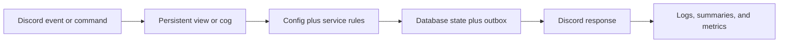
```mermaid
flowchart LR
  S1["Discord event or command"]
  S2["Persistent view or cog"]
  S3["Config plus service rules"]
  S4["Database state plus outbox"]
  S5["Discord response"]
  S6["Logs, summaries, and metrics"]
  S1 --> S2
  S2 --> S3
  S3 --> S4
  S4 --> S5
  S5 --> S6
```

> Every major workflow follows this loop so visible Discord state and stored bot memory stay aligned.

| Area | What Avenue Guard Does | Why It Matters |
| --- | --- | --- |
| Request waves | Opens, limits, schedules, validates, reviews, summarizes, and repairs level request waves. | Turns a messy manual process into a controlled staff queue. |
| Weekly rewards | Tracks eligible activity, contacts winners, records claims, and routes weekly submissions into the review workflow. | Rewards activity while keeping staff review consistent. |
| Help and tickets | Runs a DM help dashboard, paginated FAQ, appeals, reports, bot issues, transcript requests, tickets, and satisfaction prompts. | Gives members private support without losing staff accountability. |
| Guardrails | Deletes restricted proof-channel misuse, applies restriction roles, sends role DMs, manages sticky/forum reminders, and enforces forum words. | Reduces repeated moderation work and keeps public channels organized. |
| Telemetry | Tracks daily summaries, command usage, voice time, activity, anti-farm events, and now persistent impact exports. | Makes the bot measurable and useful for operations, not just automation. |

### What Makes It Complex

Avenue Guard is complex because it combines multiple stateful systems. It has persistent Discord views, scheduled jobs, slash commands, mod-only and admin-only gates, external validation calls, modal workflows, message edits, channel creation and deletion, ticket transcripts, and configurable embed templates. Many bots do one of these things. Avenue Guard coordinates all of them in one server-specific package.

The most important invariant is that public Discord state and database state should describe the same reality. If requests are closed in SQLite, the request button should say closed. If a ticket is resolved, the opening message and transcript should reflect that. If a request is reviewed, the original buttons should be disabled. Much of the bot's repair and diagnostic design exists to preserve this agreement between what users see and what the bot remembers.

## 4. Development History

The current bot evolved from a simpler Render-ready Discord bot into a much more complete community operations platform. The early shape focused on practical automations: keeping the bot in the correct guild, deleting misplaced proof-channel messages, sending role-triggered DMs, and keeping sticky reminder messages visible.

The next major phase added weekly activity tracking. The bot began counting eligible member messages, skipping excluded roles and channels, and contacting weekly winners with request opportunities. This phase introduced the idea that activity and reward state must survive restarts, because weekly workflows can span hours or days.

The request system then became the largest feature area. Live request waves gained an open/closed state, count limits, timers, scheduled openings, request types, duplicate blocking, per-wave summaries, reviewer buttons, result channels, edit windows, request edit audits, validation cache, and repair commands. Weekly request submissions were later brought into the same review workflow so staff did not need to learn two systems.

The help system grew in parallel. Instead of only sending generic DMs, Avenue Guard now runs an in-DMs dashboard, a paginated FAQ, pre-ticket FAQ suggestions, appeal/report/bug previews, staff reply relay, private ticket creation, ticket statuses, transcript saving, transcript search, transcript requests, and satisfaction prompts.

More recent phases focused on staff experience and measurement: cleaner log embeds, daily and weekly summaries, anti-farm detection, server icon rotation, admin dashboards, doctor/repair suggestions, and now impact reporting. The bot's direction has been consistent: when a process starts to need staff memory, the bot stores it, exposes it, and makes it reviewable.

Version 3.22 added a shared operations platform: durable Discord delivery, task supervision, typed configuration, schema contracts, correlation IDs, incident grouping, health history, permission drift, restore drills, retention, monthly impact reporting, and more informative request-review analytics.

> **History in one sentence:** Avenue Guard developed from a utility bot into a persistent community workflow engine for requests, support, moderation guardrails, analytics, and staff coordination.

## 5. Runtime And Startup Architecture

The runtime begins in main.py. The bot creates a py-cord Bot object with the intents needed for messages, members, reactions, moderation, presences, voice states, and direct messages. It loads config.json through utils.config.Config, resolves the configured database path, opens it through utils.db.Database, installs global error handlers, and loads each cog extension.

Startup is deliberately defensive. A database preflight connects and migrates storage before Discord login. On ready, the bot checks that it can see the allowed guild, starts the keepalive server, starts feature loops plus OperationsCog, and registers persistent views. Persistent views are crucial because Discord button interactions can arrive after a restart. The custom IDs live in utils.views and route back to the correct cog.

| Startup Step | Owner | Purpose |
| --- | --- | --- |
| Load config | utils.config.Config | Reads config.json and exposes typed getters for IDs, lists, and strings. |
| Connect DB | utils.db.Database | Creates or migrates SQLite tables before workflows depend on them. |
| Load cogs | main.py | Attaches feature modules plus OperationsCog, which supervises shared background reliability. |
| Start tasks | on_ready and OperationsCog | Starts feature loops, outbox delivery, health sampling, maintenance, supervision, and smoke checks. |
| Register views | utils.views | Keeps buttons and selects alive across restarts through stable custom IDs. |

### Hosted Environment

The bot is designed to run on a hosted service such as Render. A small keepalive HTTP server exists for hosted environments, but the important persistence requirement is the database. Production uses a local embedded replica that forwards writes to Turso, so the host's temporary filesystem is a cache rather than the durable source of truth.

The bot also assumes that startup may happen after Discord components already exist. That is why persistent views are registered every time the bot becomes ready and why request/ticket state is not reconstructed from memory. Startup should be safe whether the bot was restarted manually, redeployed by the host, or recovered after an exception.

## 6. Configuration Model

Avenue Guard uses config.json as the main control plane. The Config loader treats keys beginning with an underscore as comments by convention, while utils.config_schema validates the version, IDs, option types, bounds, notification modes, and request embed placeholders. IDs can be stored as strings and converted by typed getters.

This design makes server-specific changes practical. Admins can change channel IDs, role IDs, request wording, embed templates, validation settings, icon URLs, background summary settings, and help FAQ entries without editing Python code. The /resync command reloads config and response rules so many changes do not require a full restart.

| Config Section | Controls |
| --- | --- |
| guild | The allowed guild ID. The bot shuts down if it cannot operate in that server. |
| roles | Moderation, admin, tracking exclusion, reward, and watched-role IDs. |
| channels | Core log, request, transcript, command, proof, and help channels. |
| tracking | Weekly message counting, winner DMs, reminders, streaks, anti-farm checks, and logs. |
| tickets | Ticket category, staff ping role, cooldowns, inactivity, and satisfaction prompt. |
| help | FAQ entries, warnings, cooldown assumptions, duplicate windows, and submission limits. |
| level_requests | Request channels, roles, text, embeds, validation, wave summaries, colors, and opening announcements. |
| background | Daily summaries, weekly recaps, rotating status, and server icon rotation. |
| database | SQLite path and scheduled zipped database backups. |
| impact | Destination for persistent impact report attachments and snapshots. |

### Why JSON Instead Of Hardcoding

The server changes faster than code should. Roles are renamed, channels are moved, request copy is adjusted, and staff may want different embed language for review or result messages. Keeping those values in config.json lets the bot remain stable while the server's surface changes.

The most customizable parts are the embed templates. Request submissions, reviewed requests, weekly submissions, result messages, wave summaries, help logs, and announcements are built from template variables. This gives the server control over tone and layout while keeping the workflow rules in code. The config checker validates many of those templates so a typo in a variable is easier to catch before staff depend on the embed.

## 7. Database And Persistence

utils.db.Database owns the storage boundary. Local-only mode uses a SQLite connection in threads. Production Turso mode keeps the native libSQL connection in an isolated process because that extension can retain Python's interpreter lock even inside a thread. An asyncio lock serializes primary operations, bounded deadlines contain stalls, and cancellation preserves ownership until the operation finishes. The migration code creates tables and adds columns so the bot can evolve without manual SQL work every time a feature is added.

The database is not only storage; it is the bot's memory. It knows the active request wave, scheduled openings, submitted users and level IDs, request edit history, validation cache, weekly claims, weekly sessions, weekly reviews, activity counts, tickets, transcript pointers, help submissions, cooldowns, daily stats, and impact snapshots.

#### Persistence Safety Model

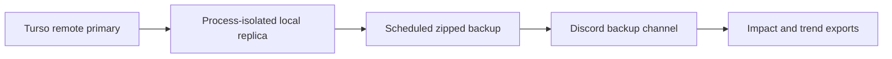
```mermaid
flowchart LR
  S1["Turso remote primary"]
  S2["Process-isolated local replica"]
  S3["Scheduled zipped backup"]
  S4["Discord backup channel"]
  S5["Impact and trend exports"]
  S1 --> S2
  S2 --> S3
  S3 --> S4
  S4 --> S5
```

> Production durable truth lives in Turso. The host replica can be replaced; backup attachments and exports provide a second recovery path.

### Render Storage Rule

On Render, the project source and cache can be wiped by redeploys or cache clears. Turso mode therefore requires a database URL and valid database-scoped token before Discord login and rebuilds disposable replicas from the cloud. Only local-only mode resolves its SQLite path from AVENUE_GUARD_DB_PATH first, then database.path in config.json, then an auto-detected Render Persistent Disk path at /var/data/avenue-guard/bot.db, and only then the local fallback. For production, use Turso, or mount a persistent disk if deliberately choosing local-only SQLite.

The /bot storage command checks the running path and the latest backup record. The /bot backup command creates a zipped copy immediately, and the background backup loop posts scheduled copies to the configured backup channel. If no persistent path is writable, production must not silently fall back to disposable storage. Incomplete Turso credentials prevent login; development local fallback is not a persistence guarantee.

| Table | Purpose |
| --- | --- |
| activity_counts | Weekly message totals per user. |
| weekly_claims / weekly_sessions / weekly_dm_log | Weekly reward workflow state and audit history. |
| weekly_request_reviews | Weekly submitted request review messages and results. |
| tickets / ticket_sequences | Ticket channels, users, status, IDs, satisfaction, and closure state. |
| ticket_transcripts / transcript_requests | Saved transcript locations and member transcript request decisions. |
| help_submissions / help_sessions / help_cooldowns | DM help flows, appeal/report/bug submissions, and rate limits. |
| level_request_state | Current live request state, wave ID, limits, timers, and request button pointer. |
| level_request_submissions | Per-wave submitted levels, requester, result, review, and embed data. |
| level_request_edit_audit | Before/after snapshots of request edits. |
| gd_level_validation_cache | Cached validation results from external GD providers. |
| daily_stats / weekly_recaps | Operational telemetry snapshots and private recap history. |
| impact_snapshots | Persistent impact report payloads produced by /bot impact. |
| database_backups | Backup timestamps, channels, message IDs, sizes, reasons, and filenames. |

> **Persistence rule:** If a workflow can span a restart or must be auditable later, it belongs in SQLite rather than only in memory.

The migration approach is intentionally additive. New columns are added if missing, older tables are normalized when their shape changes, and indexes are created for common lookups. This lets the live bot keep its history while gaining new features such as ticket opening message IDs, request edit audit entries, scheduled opening messages, weekly review data, and impact snapshots.

## 8. Cog Architecture

Each cog owns a feature family. This keeps the code understandable even though the bot is large. The cogs do interact with each other, but mostly through named methods and shared database/config utilities. CommandsCog is the command hub, while the workflow cogs handle the long-running state machines.

| Cog | Primary Responsibility |
| --- | --- |
| ModCog | Proof-channel restrictions and role-triggered DMs. |
| TrackingCog | Weekly activity tracking, weekly request reward DMs, anti-farm checks, and weekly request recording. |
| HelpCog | DM help dashboard, FAQ, appeal/report/bug submissions, tickets, transcripts, and satisfaction. |
| MessageResponsesCog | Configurable message-triggered auto-responses. |
| StickyCog | Sticky messages, forum first-message reminders, and required-word thread deletion/logging. |
| RequestLevelsCog | Live request waves, scheduled openings, validation, modals, edit windows, reviews, results, summaries, and repairs. |
| CommandsCog | Admin, tracking, ticket, forum, request, server icon, fun, diagnostics, and impact commands. |
| BackgroundCog | Daily stats, summaries, rotating status, server icon rotation, and background persistence. |

### Interaction Flow

Persistent views in utils.views act like switchboards. A button custom ID identifies the action, the view asks Discord for the relevant cog, and then the cog handles the real logic. This means the visible component can remain tiny while the business rules stay in the owning cog.

For example, the request button view only knows that a member clicked Request your level. RequestLevelsCog then checks whether requests are open, whether the member has the required role, whether they already submitted in the wave, whether the button should open an edit flow, and whether a modal should appear.

This separation is especially useful for persistent components. A button may be clicked long after the message was created, so the button itself should not carry fragile state. It carries a stable custom ID, and the owning cog retrieves current state from config and SQLite at click time.

## 9. Permissions And Security Model

The bot combines Discord permissions, configured role IDs, and command-level checks. Public commands are kept narrow, mod commands require the configured mod role or configured permission policy, and admin commands require one of the configured admin/owner roles. Sensitive interactions also check the user before editing dashboards or panels.

Avenue Guard also avoids unsafe mention behavior in staff logs and bot-generated messages where possible. The no_mentions helper prevents accidental mass pings in logs and auto-responses. Where pings are intentional, such as the default request-open announcement, the behavior is explicit and configurable.

- Guild restriction prevents the bot from operating outside the configured server.
- Admin commands are role-gated even if their command descriptions do not visually say so.
- Mod workflows check staff role or manage-guild policy before ticket/status operations.
- Request reviewer controls are limited by access to the review channel and configured reviewer roles where staff filters apply.
- Auto-response output is length-limited and mass mentions are blocked.
- External validation has per-user rate limits and provider backoff to reduce abuse and failure cascades.

> **Security posture:** The bot is not a bank-grade security system, but it uses practical Discord safety controls: role gates, guild gates, safe mentions, cooldowns, audit logs, and recovery commands.

Data safety is treated pragmatically. The bot stores IDs, message pointers, submitted text, review text, ticket metadata, and transcript pointers because those are necessary for accountability. It avoids storing secrets in the database and does not require Google credentials for impact reporting. Sensitive records should still be protected by keeping the database on trusted storage and limiting staff-log channel access.

## 10. Moderation Guardrails

The guardrail layer handles repetitive moderation actions that should not depend on a staff member being online. The proof-channel restriction watches a configured channel. If a non-whitelisted member posts there, the bot deletes the message and applies the configured restriction role. If they add a reaction there, it removes the reaction and applies the same restriction role.

Role-triggered DMs are another guardrail. When a member gains a watched role, the bot sends a configured DM that explains what changed and how to appeal or contact staff. This turns silent role changes into explainable actions.

### Forum And Sticky Reminders

Sticky messages keep important instructions visible at the bottom of busy text channels. The bot debounces sticky updates, deletes the old sticky message, and posts a fresh one after the configured delay. Forum first-message reminders post an embed in new forum threads, with tag-specific templates when configured.

Required-word enforcement is designed for forum formats that must include a specific word. The bot checks thread title/body text, supports contains, whole word, and regex modes, sends a configurable DM to the thread owner, deletes the thread after the configured delay, and logs the deletion with the author and thread context.

> **Why this exists:** Forum reminders are gentle guidance; required-word enforcement is the hard stop for posts that ignore a required format.

## 11. Live Request System

The live request system is the bot's most involved workflow. It starts with a persistent request button embed in the configured request channel. Staff can refresh or recreate that embed with /refresh-request-button. Admins can open requests immediately, close them manually, or schedule openings for later.

#### Live Request Wave

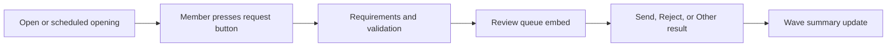
```mermaid
flowchart LR
  S1["Open or scheduled opening"]
  S2["Member presses request button"]
  S3["Requirements and validation"]
  S4["Review queue embed"]
  S5["Send, Reject, or Other result"]
  S6["Wave summary update"]
  S1 --> S2
  S2 --> S3
  S3 --> S4
  S4 --> S5
  S5 --> S6
```

> Submission count increases only after a valid modal succeeds, not when the button is pressed.

A wave begins whenever requests open. A wave can be unlimited, limited by successful submission count, limited by time, or limited by both. If both count and time are defined, the count limit wins. A request only counts after a valid modal submission succeeds. Clicking the button or opening the form does not consume a slot.

### Per-Wave Rules

- One user can submit one live request per wave.
- One level ID can be submitted once per wave.
- Per-user and per-level duplicate tracking resets when a new wave starts.
- Requests can be edited until the wave closes plus the configured grace period.
- The wave summary is updated as reviews happen so staff can see remaining workload.

### Request Types

Request waves can optionally define a type, such as needs showcase, only demons, only platformers, only classic, classic non-demons, platformer non-demons, or long/XL levels. These types are enforced after validation when the bot has enough GD metadata to reason about difficulty, platformer status, and length.

Opening announcements are configurable. If no custom message is provided, the bot uses the default request role ping and inserts a human-readable condition summary. Scheduled openings can also store a custom opening message.

Scheduled openings are deliberately managed as records instead of timers only in memory. Admins can list, edit, delete, refresh, or open them immediately. If the bot restarts before the scheduled time, the pending opening still exists in SQLite and the scheduled-opening loop can act on it when the bot comes back.

## 12. Request Validation And GD Metadata

Validation protects the request queue from bad level IDs and gives reviewers more context. The bot checks level IDs before accepting a modal: IDs must be 7 to 9 digits, showcase links must be URLs, and missing levels can be auto-rejected when enabled providers confidently agree that the ID does not exist.

The validation layer uses two providers: GDBrowser and the direct GD/Boomlings endpoint. Results are combined into one normalized payload that can include level name, creator, difficulty, length, stars, rated status, featured/epic flags, demon status, and platformer status. The result is cached in SQLite to keep repeated checks fast and to avoid hammering external services.

| Validation Output | How It Is Used |
| --- | --- |
| exists | Blocks confidently missing IDs before they enter the review queue. |
| rated | Warns reviewers that a level may already be rated. |
| demon/platformer | Requires a showcase URL automatically. |
| difficulty/length/stars | Adds clean GD info to request embeds. |
| provider disagreement | Warns staff instead of hiding uncertainty. |
| cache expiry | Lets repair or new submissions refresh stale warnings later. |

> **Validation principle:** The bot is strict only when the evidence is strong. When providers disagree or fail, the bot surfaces a warning instead of pretending certainty.

Validation also feeds presentation. The request embed can show compact GD info without overcrowding the request: difficulty, length, stars/rated status, flags, creator, and provider warnings can be collapsed into clean fields. That means reviewers spend less time opening external pages just to understand what kind of level they are judging.

## 13. Review Workflow

After a successful request submission, the bot sends a configurable embed to the level_requested channel. The embed includes requester, level ID, level name, creators, showcase, notes, GD info, validation warning, duplicate history warning, edit trail count, and wave information. The same view provides Send, Reject, and Other buttons.

Send and Reject open a review modal with an optional review field. Once submitted, the original request embed is edited into its final state, the result color changes, the reviewer is recorded, the result embed is posted to the sent or rejected channel, the requester is pinged there, and all buttons on the original request are disabled.

The Other button offers fixed reasons: level does not exist, stolen level, and already rated. These are treated like not-sent results and notify the requester through the rejected channel. This keeps special rejection reasons structured rather than buried in arbitrary review text.

### Wave Summary

When a wave exists, the bot maintains a summary embed in level_requested. It shows total requested, reviewed count, sent count, not-sent count, percentages, remaining reviews, not-sent breakdown, and reviewer stats. This is the staff dashboard for the wave, and it updates each time a request is reviewed.

### Repair

/requests repair exists because Discord messages can be deleted, embeds can go stale, validation warnings can expire, and reviewed messages should stay locked. The repair command refreshes the request button, rebuilds summaries, recreates missing pending request messages, refreshes validation warnings, and disables buttons on reviewed messages.

Review actions are designed to be idempotent from a staff perspective. The bot checks the original request row, verifies that it is still pending, confirms the result channel, edits the original embed, writes the review fields, sends the final notification, and disables buttons. This reduces the chance that two reviewers can accidentally process the same request twice.

## 14. Priority Point System V1

PPS v1 is Avenue Guard's prospective, deterministic outreach queue. A reviewer still makes the human decision, and staff still perform moderator outreach manually. The system records a recommendation tier, resolves the current Creator Points of the Geometry Dash uploader, adds evidence-backed waiting, and gives the owner a durable ordering. The score is an operational priority, never a probability.

> **The rollout boundary:** The wave present when schema 8 deploys remains legacy forever, including later submissions to that wave. Only a newly created wave ID receives pps_v1. Every card and repair path reads the saved row version instead of a global switch.

#### Versioned Review Path

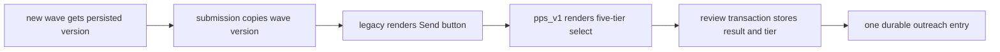
```mermaid
flowchart LR
  S1["new wave gets persisted version"]
  S2["submission copies wave version"]
  S3["legacy renders Send button"]
  S4["pps_v1 renders five-tier select"]
  S5["review transaction stores result and tier"]
  S6["one durable outreach entry"]
  S1 --> S2
  S2 --> S3
  S3 --> S4
  S4 --> S5
  S5 --> S6
```

> Weekly reward requests are separate and stay on the legacy controls.

### Recommendation UI And Meaning

A PPS review card replaces generic Send with Rate, Feature, Epic, Legendary, and Mythic. Selecting a tier opens the optional comment modal immediately so Discord receives an acknowledgement before database or network work. Modal submission reloads the authoritative row, verifies permissions and pending status, stores result=sent plus send_type, and creates the queue record in the guarded transaction. The user sees Recommended and Added to the outreach queue; the bot never claims the level already reached a moderator.

### The Three Components

| Component | Definition | Important safety rule |
| --- | --- | --- |
| F | 1.8^T - 1, where T comes from the review tier | Fixed by the original recommendation |
| G | max(0, ln(0.25 / (0.06*C + 0.01))) | C is uploader CP; unknown is null, never zero |
| H | 1.5 * min(W, 4)^1.5 | W increases only after a successful outreach cycle |
| P | F + G + H | Null while any required component is unknown |

#### PPS v1 formula with plain-language commentary

```python
# The review tier supplies a stable prestige coordinate.
tier = prestige_x[send_type]
f = prestige_base ** tier - 1.0

# A failed profile lookup returns None. It is not converted to zero CP.
g = None if current_cp is None else max(
    0.0,
    math.log(0.25 / (0.06 * current_cp + 0.01)),
)

# Keep the real W for evidence and tie-breaking, but cap its score effect.
h = 1.5 * min(waiting_cycles, 4) ** 1.5

# An incomplete score remains visibly incomplete.
priority = None if g is None else f + g + h
```

#### Actual score-component implementation (utils/priority_system.py:177-195)

```python
 177: def score_components(
 178:     send_type: str,
 179:     creator_points: int | None,
 180:     waiting_cycles: int,
 181:     settings: PrioritySettings,
 182: ) -> dict[str, Any]:
 183:     tier, prestige = prestige_component(send_type, settings)
 184:     creator = creator_opportunity_component(creator_points, settings)
 185:     waiting = waiting_component(waiting_cycles, settings)
 186:     complete = creator is not None
 187:     return {
 188:         "prestige_t": tier,
 189:         "prestige_component_f": prestige,
 190:         "creator_component_g": creator,
 191:         "waiting_component_h": waiting,
 192:         "priority_points": prestige + creator + waiting if complete else None,
 193:         "priority_complete": int(complete),
 194:         "model_version": settings.model_version,
 195:     }
```

### Outreach Cycles

A request wave collects community submissions; an outreach cycle records a real staff round of trying to get recommended levels to moderators. Starting a cycle snapshots every currently queued candidate and its F/G/H/P, CP, W, and model version. Levels added later do not belong to that snapshot and cannot age from it.

#### Successful Cycle Aging

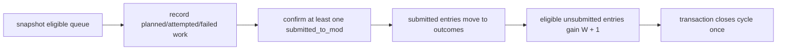
```mermaid
flowchart LR
  S1["snapshot eligible queue"]
  S2["record planned/attempted/failed work"]
  S3["confirm at least one submitted_to_mod"]
  S4["submitted entries move to outcomes"]
  S5["eligible unsubmitted entries gain W + 1"]
  S6["transaction closes cycle once"]
  S1 --> S2
  S2 --> S3
  S3 --> S4
  S4 --> S5
  S5 --> S6
```

> A zero-submission cycle is cancelled without increasing W. Repeating completion cannot double-increment it.

#### Actual successful-cycle transaction (services/priority_system.py:348-430)

```python
 348:     async def complete_cycle(self, guild_id: int, cycle_id: int, actor_id: int):
 349:         async with self._cycle_lock:
 350:             cycle = await self.db.fetchone(
 351:                 "SELECT * FROM level_outreach_cycles WHERE id=? AND guild_id=?",
 352:                 (cycle_id, guild_id),
 353:             )
 354:             if not cycle:
 355:                 raise ValueError("Outreach cycle not found")
 356:             if str(cycle["status"]) == "completed":
 357:                 return cycle, 0
 358:             if str(cycle["status"]) != "active":
 359:                 raise ValueError("Only an active outreach cycle can be completed")
 360:             entries = await self.db.fetchall(
 361:                 "SELECT e.*,q.send_type,q.current_creator_points,q.waiting_cycles,q.queue_state "
 362:                 "FROM level_outreach_cycle_entries e JOIN level_outreach_queue q ON q.id=e.queue_id "
 363:                 "WHERE e.cycle_id=?",
 364:                 (cycle_id,),
 365:             )
 366:             if not any(int(row["submitted_to_mod"] or 0) == 1 for row in entries):
 367:                 raise ValueError("This cycle has no confirmed moderator submission; cancel it as unsuccessful instead")
 368:             now = int(time.time())
 369:             statements: list[tuple[str, tuple[Any, ...]]] = []
 370:             incremented = 0
 371:             for row in entries:
 372:                 if int(row["submitted_to_mod"] or 0) or int(row["waiting_incremented"] or 0):
 373:                     continue
 374:                 if str(row["queue_state"]) != "in_cycle":
 375:                     continue
 376:                 waiting_cycles = int(row["waiting_cycles"] or 0) + 1
 377:                 score = score_components(
 378:                     str(row["send_type"]),
 379:                     row["current_creator_points"],
 380:                     waiting_cycles,
 381:                     self.settings,
 382:                 )
 383:                 statements.extend(
 384:                     [
 385:                         (
 386:                             "UPDATE level_outreach_queue SET waiting_cycles=?,waiting_component_h=?,creator_component_g=?,"
 387:                             "priority_points=?,priority_complete=?,queue_state='queued',updated_ts=? WHERE id=? AND queue_state='in_cycle' "
 388:                             "AND EXISTS(SELECT 1 FROM level_outreach_cycle_entries e JOIN level_outreach_cycles c ON c.id=e.cycle_id "
 389:                             "WHERE e.cycle_id=? AND e.queue_id=? AND e.waiting_incremented=0 AND e.submitted_to_mod=0 AND c.status='active')",
 390:                             (
 391:                                 waiting_cycles,
 392:                                 score["waiting_component_h"],
 393:                                 score["creator_component_g"],
 394:                                 score["priority_points"],
 395:                                 score["priority_complete"],
 396:                                 now,
 397:                                 int(row["queue_id"]),
 398:                                 cycle_id,
 399:                                 int(row["queue_id"]),
 400:                             ),
 401:                         ),
 402:                         (
 403:                             "UPDATE level_outreach_cycle_entries SET waiting_incremented=1 WHERE cycle_id=? AND queue_id=? "
 404:                             "AND waiting_incremented=0 AND submitted_to_mod=0 "
 405:                             "AND EXISTS(SELECT 1 FROM level_outreach_cycles WHERE id=? AND status='active')",
 406:                             (cycle_id, int(row["queue_id"]), cycle_id),
 407:                         ),
 408:                     ]
 409:                 )
 410:                 incremented += 1
 411:             statements.extend(
 412:                 [
 413:                     (
 414:                         "UPDATE level_outreach_cycles SET status='completed',completed_by=?,completed_ts=?,successful=1 "
 415:                         "WHERE id=? AND guild_id=? AND status='active'",
 416:                         (actor_id, now, cycle_id, guild_id),
 417:                     ),
 418:                     (
 419:                         "INSERT INTO workflow_events(correlation_id,workflow_type,entity_id,event,guild_id,actor_id,payload_json,created_ts) "
 420:                         "SELECT correlation_id,'priority_system',?,'cycle_completed',?,?,?,? FROM level_outreach_cycles c "
 421:                         "WHERE c.id=? AND c.status='completed' AND NOT EXISTS(SELECT 1 FROM workflow_events w WHERE w.correlation_id=c.correlation_id AND w.event='cycle_completed')",
 422:                         (f"cycle:{cycle_id}", guild_id, actor_id, json.dumps({"waiting_incremented": incremented}), now, cycle_id),
 423:                     ),
 424:                 ]
 425:             )
 426:             await self.db.execute_transaction(statements, retry_safe=True)
 427:             saved = await self.db.fetchone(
 428:                 "SELECT * FROM level_outreach_cycles WHERE id=?", (cycle_id,)
 429:             )
 430:             return saved, incremented
```

### Prospective Evidence

PPS keeps append-only CP and level snapshots, cycle membership, private attempts, confirmed moderator-submission time, rating observations, and a fixed 30-day result. This creates the evidence the earlier historical audit could not reconstruct. No Bayesian model is calculated in this release.

#### Bounded maintenance pass (services/priority_system.py:791-871)

```python
 791:     async def maintenance_once(self, guild_id: int) -> dict[str, int]:
 792:         now = int(time.time())
 793:         settings = self.settings
 794:         placeholders = ",".join("?" for _ in PPS_QUEUE_REFRESH_STATES)
 795:         rows = await self.db.fetchall(
 796:             f"SELECT id FROM level_outreach_queue WHERE guild_id=? AND queue_state IN({placeholders}) "  # nosec B608
 797:             "AND (COALESCE(level_refresh_after_ts,0)<=? OR (uploader_account_id IS NOT NULL AND COALESCE(creator_points_refresh_after_ts,0)<=?)) "
 798:             "ORDER BY MIN(COALESCE(level_refresh_after_ts,0),COALESCE(creator_points_refresh_after_ts,0)),id LIMIT ?",
 799:             (
 800:                 guild_id,
 801:                 *PPS_QUEUE_REFRESH_STATES,
 802:                 now,
 803:                 now,
 804:                 settings.maintenance_batch_size,
 805:             ),
 806:         )
 807:         refreshed = failed = 0
 808:         attempted_refreshes: set[int] = set()
 809:         successful_refreshes: set[int] = set()
 810:         for item in rows:
 811:             queue_id = int(item["id"])
 812:             attempted_refreshes.add(queue_id)
 813:             try:
 814:                 await self.refresh_queue_entry(queue_id)
 815:                 successful_refreshes.add(queue_id)
 816:                 refreshed += 1
 817:             except Exception as exc:
 818:                 failed += 1
 819:                 await log_error(
 820:                     self.bot,
 821:                     f"PPS queue refresh deferred queue_id={queue_id}: {type(exc).__name__}: {str(exc)[:300]}",
 822:                 )
 823:         due = await self.db.fetchall(
 824:             "SELECT id,rated_observed_ts,outcome_window_due_ts FROM level_outreach_queue "
 825:             "WHERE guild_id=? AND submitted_to_mod_ts IS NOT NULL AND outcome_window_due_ts<=? "
 826:             "AND outcome_window_completed_ts IS NULL ORDER BY outcome_window_due_ts LIMIT ?",
 827:             (guild_id, now, settings.maintenance_batch_size),
 828:         )
 829:         completed = 0
 830:         for row in due:
 831:             queue_id = int(row["id"])
 832:             if queue_id in attempted_refreshes and queue_id not in successful_refreshes:
 833:                 continue
 834:             try:
 835:                 if queue_id in successful_refreshes:
 836:                     refreshed_row = await self.db.fetchone(
 837:                         "SELECT * FROM level_outreach_queue WHERE id=?", (queue_id,)
 838:                     )
 839:                 else:
 840:                     refreshed_row = await self.refresh_queue_entry(
 841:                         queue_id, force_level=True
 842:                     )
 843:                 latest_snapshot = await self.db.fetchone(
 844:                     "SELECT lookup_status FROM level_outreach_level_snapshots WHERE queue_id=? ORDER BY checked_ts DESC,id DESC LIMIT 1",
 845:                     (queue_id,),
 846:                 )
 847:                 if (
 848:                     not refreshed_row
 849:                     or not latest_snapshot
 850:                     or str(latest_snapshot["lookup_status"]) != "ok"
 851:                 ):
 852:                     failed += 1
 853:                     continue
 854:                 row = refreshed_row
 855:             except Exception as exc:
 856:                 failed += 1
 857:                 await log_error(
 858:                     self.bot,
 859:                     f"PPS outcome-window refresh deferred queue_id={queue_id}: {type(exc).__name__}: {str(exc)[:300]}",
 860:                 )
 861:                 continue
 862:             rated_within = int(
 863:                 row["rated_observed_ts"] is not None
 864:                 and int(row["rated_observed_ts"]) <= int(row["outcome_window_due_ts"])
 865:             )
 866:             completed += await self.db.execute_affected(
 867:                 "UPDATE level_outreach_queue SET rated_within_window=?,outcome_window_completed_ts=?,updated_ts=? "
 868:                 "WHERE id=? AND outcome_window_completed_ts IS NULL",
 869:                 (rated_within, now, now, int(row["id"])),
 870:             )
 871:         return {"refreshed": refreshed, "failed": failed, "outcomes_completed": completed}
```

| Private command | What it controls |
| --- | --- |
| /pps dashboard | Rollout version, queue health, active cycle and outcome totals |
| /pps queue | Ranked complete and CP-pending entries |
| /pps level | Score components, snapshots, cycle membership and private attempts |
| /pps cycle | Start, inspect, complete or cancel a durable cycle |
| /pps outreach | Record an attempt or confirmed moderator submission |
| /pps refresh | Refresh providers or record a reasoned CP override |
| /pps stats | Prospective evidence totals without probabilities |

### Recovery

Both legacy and PPS persistent views register at startup. Request repair restores controls from the submission's saved version, relocks reviewed cards, and can idempotently recreate a missing queue entry only for a reviewed pps_v1 sent row with a valid tier. Background maintenance is supervised, works in bounded batches, and preserves unknown provider results rather than making them look like negative evidence.

#### Saved-version view selection (cogs/RequestLevels.py:2048-2052)

```python
2048:     def _review_view(self, row, target_kind: str = "wave", *, disabled: bool = False):
2049:         return request_review_view(
2050:             self._review_system_version(row, target_kind),
2051:             disabled=disabled,
2052:         )
```

## 15. Weekly Activity And Rewards

TrackingCog counts eligible member messages by week. It skips excluded channels and roles, uses a cooldown to avoid overcounting rapid-fire messages, buffers writes to reduce SQLite load, and applies anti-farm checks before messages are added to the weekly leaderboard.

At reward time, the bot contacts configured winners through DM. A member can claim, decline, time out, or receive a reminder. The weekly claim tables and logs store who was contacted, what happened, and which user should be offered the next slot if someone declines or times out. Admins can disable and re-enable the automatic reward for the current week.

Weekly request submissions use the same Send, Reject, and Other review workflow as live requests, but they are not part of a live request wave. This means staff review behavior stays consistent while wave-specific limits and summaries remain clean.

### Streaks And Anti-Farm

Weekly streaks reward members who repeatedly place in the configured top rank band. Anti-farm detection watches for repeated low-effort messages and logs suspicious patterns instead of letting them inflate weekly counts. The result is a leaderboard that is harder to game and more useful for community reward decisions.

Manual force-DM exists for operational exceptions. Admins can send the weekly request DM to a member even if normal tracking would exclude them or the automatic reward is disabled for the week. The result is logged so manual overrides remain visible to future staff.

## 16. Help, Tickets, And Staff Support

The DM help system starts from a dashboard. Members can see active ticket status, weekly activity status, current request state, recent help submissions, and cooldowns. The menu hides the option the user is already viewing, cleans up previous screens when possible, and supports Back, Cancel, and Start Over controls.

#### Help And Ticket Flow

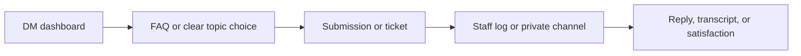
```mermaid
flowchart LR
  S1["DM dashboard"]
  S2["FAQ or clear topic choice"]
  S3["Submission or ticket"]
  S4["Staff log or private channel"]
  S5["Reply, transcript, or satisfaction"]
  S1 --> S2
  S2 --> S3
  S3 --> S4
  S4 --> S5
```

> The user experience stays private while staff still get auditable records.

The FAQ is a short paginated list rather than an intelligent free-text search. Before an ordinary staff ticket opens, the bot can still suggest configured FAQ entries so common questions are solved privately. If the user still needs help, they can open a routed private ticket channel by topic.

### Submission Workflows

Appeals, user reports, bot issue reports, and transcript requests use tracked submissions. The bot stores a code, keeps attachment links, shows a preview before submission, posts a structured staff log embed, and lets staff reply to a log message to relay a response back to the submitter by DM.

### Tickets

Tickets use atomic ticket IDs, private channels, status tags, inactivity scans, close prompts, transcripts, transcript search, and satisfaction prompts. The opening message is kept in sync when staff or users reply, when a staff member changes status, and when the ticket closes. Before deletion, the bot saves a transcript and records where the transcript was posted.

The help system is intentionally private-first. It gives members a place to ask for help without escalating every issue into a public channel, but it still creates staff-visible logs when something becomes an official submission. This balances member comfort with staff accountability.

## 17. Background Telemetry

BackgroundCog is the bot's measurement layer. It listens for messages, edits, deletes, reactions, joins, leaves, bans, unbans, boosts, voice state changes, command completions, and command errors. These events are accumulated into daily snapshots and persisted in daily_stats.

#### Telemetry Flow

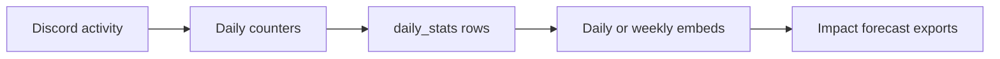
```mermaid
flowchart LR
  S1["Discord activity"]
  S2["Daily counters"]
  S3["daily_stats rows"]
  S4["Daily or weekly embeds"]
  S5["Impact forecast exports"]
  S1 --> S2
  S2 --> S3
  S3 --> S4
  S4 --> S5
```

> Operational telemetry is useful for trends, but it should be described as tracked data rather than absolute community reality.

The daily summary embed turns raw counters into something readable: message totals, day-over-day movement, active members, active channels, joins/leaves, moderation signals, voice time, command success rate, top channels, top members, and top commands. Weekly recaps summarize longer-term activity, request, review, streak, and anti-farm patterns.

### Presence And Icon Rotation

The bot can rotate its Discord status using placeholders such as members, online count, weekly messages, current top member, open tickets, and today's messages. It can also rotate the server icon through configured image URLs in disabled, linear, or random modes. The icon rotation code downloads images, checks that they look like supported image bytes, remembers failures, and stores current index/state back into config.json.

Daily stats are useful but should be read as operational telemetry, not perfect analytics. They depend on bot uptime, enabled intents, cache visibility, and events the bot can observe. That is why impact reports label large totals as tracked events rather than claiming to represent every possible interaction in the community.

## 18. Admin Tools And Diagnostics

CommandsCog exposes most operator-facing slash commands. It includes tracking commands, ticket commands, forum required-word management, request review filters, request history, request repair, server icon controls, fun commands, and bot diagnostics.

The admin dashboard is a button-driven status view. It gathers system health, request state, tracking state, icon rotation, config issues, and repair suggestions into one embed. This reduces the need for scattered health commands while still keeping older commands available for direct checks.

| Diagnostic | Purpose |
| --- | --- |
| /bot dashboard | Interactive overview of system health, config, and repair tips. |
| /bot health | Compact live health report. |
| /bot config_check | Checks configured channels, roles, templates, and response rules. |
| /bot doctor | Deeper permission and system diagnostics. |
| /requests repair | Repairs request system messages, validation warnings, summaries, and locks. |
| /bot impact | Owner-only impact and forecast exports with Markdown, CSV, trend CSV, breakdown CSV, and JSON. |
| /bot backup | Creates a zipped SQLite backup and posts it to the configured backup channel. |
| /bot storage | Shows active database path, persistence warning, backup channel, interval, and latest backup. |

> **Operator principle:** When a feature can fail because a Discord message, channel, permission, or config value changed, the bot should expose a command that explains or repairs it.

## 19. Impact Reporting

The owner-only /bot impact command turns the bot's persistent state into a quantifiable impact report. It collects current server size, unique members touched by tracked workflows, tracked interaction events, support/help volume, ticket volume, transcripts, request totals, review rates, weekly reward activity, command usage, voice minutes, anti-farm events, and summary history.

#### Impact Reporting Pipeline

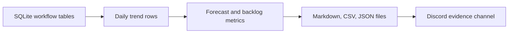
```mermaid
flowchart LR
  S1["SQLite workflow tables"]
  S2["Daily trend rows"]
  S3["Forecast and backlog metrics"]
  S4["Markdown, CSV, JSON files"]
  S5["Discord evidence channel"]
  S1 --> S2
  S2 --> S3
  S3 --> S4
  S4 --> S5
```

> The report is both human-readable and spreadsheet-ready so it can support CV evidence and operational planning.

The command posts a Markdown report, summary CSV, daily trend CSV, breakdown CSV, and raw JSON file to the configured impact report channel, then stores the same report payload in the impact_snapshots database table. The Markdown file is human-readable and CV-friendly. The CSV files can be imported into Google Sheets for charts, portfolio evidence, forecasting, or regular impact tracking.

The report now includes a simple forecast model. It compares the last seven days with the previous seven days, projects the next seven days from that movement, labels the engagement signal, and highlights review backlog or command error risk. This should be read as an operations forecast, not a perfect prediction.

### Why This Is Defensible For A CV

The report uses numbers the bot actually tracks. Instead of claiming vague community influence, it produces concrete figures such as members reached, support items handled, level requests coordinated, tracked events, tickets resolved, and review throughput. This makes the result useful for a CV because it describes operational impact in measurable terms.

For best evidence, run /bot impact on a recurring cadence such as monthly or before major application updates. Keep the posted Discord attachments, and import the CSV files into a spreadsheet when you want trend charts. The database snapshot is useful for bot-side history, while the Discord attachment gives you a durable, shareable artifact.

> **Example CV wording:** Built and maintained Avenue Guard, a Discord operations bot supporting a multi-thousand-member community, coordinating level request workflows, staff tickets, weekly rewards, help flows, moderation guardrails, and persistent impact reporting.

## 20. External Services And Dependencies

Avenue Guard relies on Discord as its primary platform, py-cord as its Discord framework, aiohttp for asynchronous HTTP, SQLite for persistence, and optional hosted infrastructure for runtime availability. Most data remains local to the bot's database and Discord channels.

The Geometry Dash validation feature uses GDBrowser and the GD/Boomlings endpoint. These services can fail, disagree, rate limit, or return unexpected payloads. The bot handles that by normalizing provider responses, caching results, surfacing warnings, and backing off providers that fail repeatedly.

### Google Sheets Consideration

The bot now exports multiple CSV impact files. That is the safest immediate bridge to Google Sheets because it does not require storing Google credentials in the bot. If a future service account or Google Drive integration is added, the same metrics payload can be uploaded automatically. Until then, the summary, trend, and breakdown CSV files are designed to import cleanly into a spreadsheet.

## 21. Failure Recovery

Avenue Guard assumes that Discord state can drift. A message can be deleted, a channel can be moved, a role can be missing, a permission can change, a provider can fail, or a database can be older than the current code. Recovery is therefore built into migrations, diagnostics, admin logs, repair commands, and cautious external validation.

- Database migration creates missing tables and columns on startup.
- Global command and event error handlers log failures instead of silently swallowing them.
- Request repair can rebuild missing request messages and relock reviewed embeds.
- Ticket close restores status if transcript/close fails partway through.
- Weekly request recording failures are logged and do not silently mark claims as successful.
- Icon rotation remembers last errors and avoids changing too frequently.
- Impact reports persist both a DB payload and Discord attachments when the report channel is configured.
- Scheduled database backups post zipped SQLite copies to Discord when the backup channel is configured.

> **Recovery philosophy:** The bot does not need to be impossible to break. It needs to fail visibly, preserve state, and provide a clear path back to a working condition.

In practice, most failures fall into a few categories: config points at a missing channel, the bot lacks a permission, a message was deleted, an external provider failed, a user disabled DMs, or a deploy restarted the process mid-workflow. The bot's current recovery tools are aimed at exactly those categories.

## 22. Maintenance And Testing

The main test guide is TEST_CHECKLIST.md. It is intentionally server-side because many behaviors require Discord state: roles, channels, messages, DMs, buttons, modals, slash command permissions, forum threads, scheduled tasks, and external request validation.

Code-level checks still matter. The project should compile cleanly, config.json should parse, and database migrations should run against a temporary database. For risky changes, test the real Discord workflow with a staff account and a non-staff account.

### Recommended Maintenance Routine

1. Run a syntax and config check before deploying.
2. Run /bot dashboard after deploying to catch missing roles, channels, or permissions.
3. Use /requests repair after request-template, validation, or message-state changes.
4. Run /bot storage after deploying to confirm the database path is persistent.
5. Run /bot backup after first deploy and before major migrations.
6. Run /bot impact periodically and keep the CSV files for trend tracking.
7. Update this manual when new feature families are added.

## 23. Appendix: Command Families

The bot exposes commands by family so staff can discover tools without memorizing every implementation detail. Command descriptions are kept clean; role restrictions are enforced by code instead of being advertised awkwardly in every description.

| Family | Commands |
| --- | --- |
| Tracking | /tracking top, /tracking me, /tracking reset, /tracking force_dm, /tracking disable_reward, /tracking enable_reward |
| Requests | /refresh-request-button, /open-requests, /close-requests, /requests-are, /edit-request, /pending-openings, /requests pending, /requests history, /requests repair |
| Tickets | /ticket close, /ticket status, /ticket transcripts |
| Forum | /forum required_word |
| Bot/admin | /bot dashboard, /bot health, /bot config_check, /bot doctor, /bot impact, /bot backup, /bot storage, /resync, /restart |
| Server icon | /server_icon status, /server_icon mode, /server_icon add, /server_icon replace, /server_icon remove, /server_icon set, /server_icon next |
| Fun | /dance, /rock-paper-scissors, /gambling |

### Operating Rule Of Thumb

Use public commands for member self-service, mod commands for ticket and forum operations, admin commands for stateful or config-affecting actions, and repair/doctor commands whenever Discord state no longer matches the database.

## 24. Appendix: Data And Evidence

Avenue Guard's strongest evidence is the data it already generates. Tickets, transcripts, help submissions, request waves, weekly claims, daily stats, and impact reports can show how much community work the bot has handled. The important thing is to use labels that match what is measured.

| Metric Label | Source | Good Use |
| --- | --- | --- |
| Current server members | Discord guild member count | Shows the size of the community the bot supports. |
| Unique members touched | Union of tracked workflow user IDs | Shows historical reach across bot workflows. |
| Tracked interaction events | Messages, commands, requests, tickets, help, DMs, reviews, transcripts, and safety logs | Shows operational throughput, not every human action in the server. |
| Support/help items | Tickets, help submissions, transcript requests | Shows staff-support workload handled by the bot. |
| Level requests coordinated | Live requests plus weekly request reviews | Shows request-program volume. |
| Review rate | Reviewed requests divided by total requests | Shows staff queue completion. |

For a CV, the safest wording combines a clear build claim with measured impact. For example: Built Avenue Guard, a Discord operations bot for GD Avenue that automates request waves, weekly rewards, tickets, help workflows, moderation guardrails, and analytics, with persistent reports quantifying member reach, support volume, request throughput, and staff review outcomes.

## 25. Private Orientation: How To Study The Bot

This private section is written for you as the builder-owner of Avenue Guard. The goal is not only to know which commands exist. The goal is to understand how a Discord event becomes code, how code turns into stored state, how that state survives a restart, and how the bot repairs visible Discord messages when they drift.

A useful way to study the project is to read it in layers: main.py starts the system, cogs own Discord workflows, services hold reusable business rules, utils provide infrastructure, config.json controls server-specific behavior, and Turso remembers anything that matters after a restart. When you get lost, ask: who owns this event, where is the state stored, and what Discord object does the user see?

#### Code Reading Map

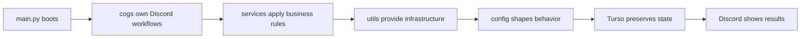
```mermaid
flowchart LR
  S1["main.py boots"]
  S2["cogs own Discord workflows"]
  S3["services apply business rules"]
  S4["utils provide infrastructure"]
  S5["config shapes behavior"]
  S6["Turso preserves state"]
  S7["Discord shows results"]
  S1 --> S2
  S2 --> S3
  S3 --> S4
  S4 --> S5
  S5 --> S6
  S6 --> S7
```

> This is the mental route for almost every feature in the bot.

| Question | Where To Look First |
| --- | --- |
| Why did the bot start or fail? | main.py and utils/db.py |
| Why did a command answer this way? | cogs/Commands.py or cogs/RequestLevels.py command method |
| Why did a button do something after restart? | utils/views.py custom ID and the owning cog handler |
| Why did a request enter or skip the queue? | RequestLevelsCog validation, requirements, and submission lock |
| Why did a weekly winner get contacted? | TrackingCog weekly loop, weekly_claims, weekly_sessions |
| Why did a ticket status change? | HelpCog on_message and ticket status helpers |
| Why did a report number appear in impact data? | CommandsCog _collect_impact_metrics |

> **The important pattern:** Avenue Guard is event-driven, but its serious workflows are state-driven. The event starts the logic; the database decides what is true.

## 26. Source Inventory

This chapter is generated from the current source files. It gives you a quick structural map before the deeper walkthroughs. Line counts are not a quality metric by themselves, but they reveal where most of the bot's complexity lives.

| File | Lines | Shape | Discord Hooks |
| --- | --- | --- | --- |
| main.py | 755 | 2 classes / 26 functions | 0 listeners / 0 loops |
| cogs/Background.py | 1397 | 3 classes / 89 functions | 12 listeners / 5 loops |
| cogs/Commands.py | 5006 | 3 classes / 152 functions | 0 listeners / 0 loops |
| cogs/Help.py | 4759 | 10 classes / 178 functions | 1 listeners / 0 loops |
| cogs/MessageResponses.py | 201 | 1 classes / 9 functions | 1 listeners / 0 loops |
| cogs/Mod.py | 351 | 1 classes / 11 functions | 3 listeners / 0 loops |
| cogs/Operations.py | 651 | 1 classes / 26 functions | 0 listeners / 0 loops |
| cogs/PrioritySystem.py | 557 | 1 classes / 19 functions | 0 listeners / 0 loops |
| cogs/Release.py | 987 | 1 classes / 41 functions | 0 listeners / 0 loops |
| cogs/RequestLevels.py | 4748 | 9 classes / 178 functions | 0 listeners / 0 loops |
| cogs/Sticky.py | 634 | 1 classes / 28 functions | 2 listeners / 0 loops |
| cogs/Tracking.py | 2380 | 2 classes / 68 functions | 1 listeners / 0 loops |
| services/backups.py | 82 | 0 classes / 2 functions | 0 listeners / 0 loops |
| services/diagnostics.py | 169 | 1 classes / 2 functions | 0 listeners / 0 loops |
| services/impact.py | 77 | 1 classes / 2 functions | 0 listeners / 0 loops |
| services/priority_system.py | 922 | 1 classes / 23 functions | 0 listeners / 0 loops |
| services/request_reviews.py | 100 | 1 classes / 4 functions | 0 listeners / 0 loops |
| services/request_scheduling.py | 51 | 1 classes / 4 functions | 0 listeners / 0 loops |
| services/request_validation.py | 29 | 0 classes / 3 functions | 0 listeners / 0 loops |
| utils/config.py | 85 | 1 classes / 7 functions | 0 listeners / 0 loops |
| utils/config_schema.py | 415 | 2 classes / 7 functions | 0 listeners / 0 loops |
| utils/db.py | 2057 | 3 classes / 77 functions | 0 listeners / 0 loops |
| utils/errors.py | 314 | 1 classes / 19 functions | 0 listeners / 0 loops |
| utils/gd_validation.py | 492 | 0 classes / 19 functions | 0 listeners / 0 loops |
| utils/outbox.py | 323 | 2 classes / 12 functions | 0 listeners / 0 loops |
| utils/priority_system.py | 195 | 1 classes / 9 functions | 0 listeners / 0 loops |
| utils/priority_system_schema.py | 139 | 0 classes / 0 functions | 0 listeners / 0 loops |
| utils/server_icons.py | 100 | 0 classes / 7 functions | 0 listeners / 0 loops |
| utils/views.py | 427 | 13 classes / 31 functions | 0 listeners / 0 loops |
| utils/workflows.py | 116 | 2 classes / 9 functions | 0 listeners / 0 loops |

The largest files are large because they own full workflows, not because they only hold utility helpers. RequestLevels.py owns a state machine with modals, validation, buttons, scheduled openings, review actions, and repairs. Commands.py owns the command surface and cross-system diagnostics. Help.py owns the DM and ticket state machines.

### How To Use This Inventory

When debugging, avoid starting from the biggest file and scrolling randomly. Start from the user action. If it is a slash command, search the command name. If it is a button, search the custom ID in utils/views.py and follow the handler. If it is a background action, search the task loop name or the database table it changes.

## 27. Command Surface Inventory

This table is extracted from command registrations. The bot has direct commands and grouped commands. Some legacy or programmatic commands appear by short name here, while their actual Discord path may include a group such as /bot, /tracking, /ticket, /requests, /forum, or /server_icon.

| Command | Registered In | Description |
| --- | --- | --- |
| /add | cogs/Commands.py | Add a server icon URL |
| /analytics | cogs/Commands.py | Show request outcomes and review performance |
| /backup | cogs/Commands.py | Create a durable database backup |
| /close | cogs/Commands.py | Close the current ticket channel |
| /config_check | cogs/Commands.py | Check configured channels and roles |
| /cycle | cogs/Commands.py | Start, inspect, complete, or cancel an outreach cycle |
| /dance | cogs/Commands.py | Send a dance GIF |
| /dashboard | cogs/Commands.py | Open the admin system dashboard |
| /dashboard | cogs/Commands.py | Show the private PPS queue and worker overview |
| /disable_reward | cogs/Commands.py | Disable this week's automatic weekly request reward |
| /doctor | cogs/Commands.py | Run deep bot permission diagnostics |
| /enable_reward | cogs/Commands.py | Re-enable this week's automatic weekly request reward |
| /force_dm | cogs/Commands.py | Force-send the weekly request DM to a user |
| /gambling | cogs/Commands.py | Try your luck in a quick slots game |
| /health | cogs/Commands.py | Show bot health and live system status |
| /historical_audit | cogs/Commands.py | Run or inspect a private historical request audit |
| /history | cogs/Commands.py | Show request edit history |
| /impact | cogs/Commands.py | Generate a persistent community impact report |
| /level | cogs/Commands.py | Inspect one queue entry and its private evidence |
| /me | cogs/Commands.py | Show your activity stats for this week |
| /mode | cogs/Commands.py | Set server icon rotation mode |
| /next | cogs/Commands.py | Change to the next configured server icon now |
| /notifications | cogs/Commands.py | Choose how request results notify you |
| /outreach | cogs/Commands.py | Record a private outreach attempt or confirmed submission |
| /pending | cogs/Commands.py | Show and filter pending request reviews |
| /queue | cogs/Commands.py | Browse the ranked outreach queue |
| /refresh | cogs/Commands.py | Refresh queue metadata or audit a CP override |
| /release | cogs/Commands.py | Prepare a version update for private approval |
| /releases | cogs/Commands.py | Show approved and pending bot releases |
| /remove | cogs/Commands.py | Remove a server icon URL by number |
| /repair | cogs/Commands.py | Repair request system messages |
| /replace | cogs/Commands.py | Replace a server icon URL by number |
| /required_word | cogs/Commands.py | View or update a forum required word |
| /reset | cogs/Commands.py | Reset current week's tracking stats |
| /restart | cogs/Commands.py | Restart the bot |
| /restore | cogs/Commands.py | Restore the database from an uploaded SQLite backup |
| /resync | cogs/Commands.py | Refresh Turso, config, views, and responses without restart |
| /retention | cogs/Commands.py | View, update, or run data retention |
| /rock-paper-scissors | cogs/Commands.py | Play Rock Paper Scissors |
| /set | cogs/Commands.py | Change to a specific configured server icon now |
| /stats | cogs/Commands.py | Show prospective PPS evidence totals |
| /status | cogs/Commands.py | Set the current ticket status |
| /status | cogs/Commands.py | Show server icon rotation status |
| /storage | cogs/Commands.py | Show database storage and backup status |
| /top | cogs/Commands.py | Show the current week's top 20 active members |
| /transcripts | cogs/Commands.py | Search saved ticket transcripts |
| /close-requests | cogs/RequestLevels.py | Close level requests |
| /edit-request | cogs/RequestLevels.py | Edit your current pending level request |
| /open-requests | cogs/RequestLevels.py | Open level requests now or schedule them |
| /pending-openings | cogs/RequestLevels.py | List, edit, or delete scheduled request openings |
| /refresh-request-button | cogs/RequestLevels.py | Refresh or recreate the request button embed |
| /requests-are | cogs/RequestLevels.py | Check whether level requests are open |

> **Descriptions are intentionally clean:** The code enforces permissions. The command descriptions do not need to carry visual labels like admin-only or owner-only.

## 28. Database Table Inventory

This table is extracted from utils/db.py. It is one of the most useful quick-reference sections because almost every serious Avenue Guard behavior has a table behind it.

| Table | Purpose |
| --- | --- |
| activity_counts | Weekly activity totals. |
| activity_flush_batches | Persistent workflow state. |
| activity_last_counted | Per-user cooldown memory for activity counting. |
| anti_farm_events | Skipped low-effort activity events. |
| ban_info_requests | Persistent workflow state. |
| bot_releases | Persistent workflow state. |
| bot_uptime_tracker | Persistent workflow state. |
| daily_stats | Daily telemetry payloads. |
| daily_summary_reports | Persistent workflow state. |
| database_backups | Posted backup metadata. |
| database_restore_log | Persistent workflow state. |
| discord_outbox | Durable retryable Discord actions and delivery IDs. |
| error_incident_batches | Committed UUID batches prevent incident retries from counting twice. |
| error_incidents | Grouped error fingerprints, counts, and resolution state. |
| gd_level_validation_cache | Cached GD provider validation payloads. |
| health_metrics | Historical runtime, query, gateway, and provider samples. |
| help_cooldowns | Help action rate limits. |
| help_sessions | Current DM help flow stage. |
| help_submissions | Appeals, reports, and bot issue records. |
| historical_audit_creators | Persistent workflow state. |
| historical_audit_levels | Persistent workflow state. |
| historical_audit_requests | Persistent workflow state. |
| historical_audit_runs | Persistent workflow state. |
| historical_creator_audit_snapshots | Persistent workflow state. |
| historical_level_audit_snapshots | Persistent workflow state. |
| historical_prestige_labels | Persistent workflow state. |
| impact_snapshots | Owner impact report payload history. |
| level_outreach_attempts | Private outreach routes, outcomes, targets and notes. |
| level_outreach_cp_snapshots | Append-only current uploader CP evidence. |
| level_outreach_cycle_entries | Start-of-cycle candidate and score snapshots. |
| level_outreach_cycles | Owner-managed outreach round lifecycle. |
| level_outreach_level_snapshots | Append-only current level and rating evidence. |
| level_outreach_queue | PPS scores, source requests, queue state, CP and outcomes. |
| level_request_edit_audit | Before/after request edit snapshots. |
| level_request_scheduled_openings | Future request openings. |
| level_request_state | Current live request wave state. |
| level_request_submissions | Live request submissions and reviews. |
| level_request_wave_summaries | Live wave summary message pointers. |
| monthly_impact_reports | Monthly report generation and outbox delivery state. |
| permission_drift_events | Open and resolved channel or role permission drift. |
| restore_drills | Non-destructive backup integrity test history. |
| rps_streaks | Rock-paper-scissors win streaks. |
| runtime_settings | Persistent workflow state. |
| schema_metadata | Explicit database, config, runtime, and embed schema versions. |
| sticky_state | Last sticky message per channel. |
| ticket_cooldowns | Ticket creation cooldowns. |
| ticket_sequences | Atomic ticket ID counters by guild. |
| ticket_transcripts | Transcript log message pointers. |
| tickets | Ticket channel, owner, status, ID, and satisfaction state. |
| transcript_requests | Member transcript approval requests. |
| user_notification_preferences | Per-user request result delivery choice. |
| weekly_claims | Weekly reward contact and claim status. |
| weekly_dm_log | Weekly workflow audit events. |
| weekly_recaps | Private weekly recap message history. |
| weekly_reminders | Reminder delivery memory. |
| weekly_request_reviews | Weekly request review queue rows. |
| weekly_reward_disabled | Per-week switch for automatic reward delivery. |
| weekly_runs | Scheduler idempotency for weekly jobs. |
| weekly_sessions | Active weekly DM claim sessions. |
| weekly_streaks | Top-member streak tracking. |
| workflow_events | Correlation-based workflow and task timeline. |

The table names are grouped by feature family. activity_* and weekly_* belong to tracking. ticket_* and help_* belong to support. level_request_* and gd_level_validation_cache belong to live requests. daily_stats, impact_snapshots, and database_backups belong to measurement and durability.

## 29. Startup Code Walkthrough

main.py is the bot's entry point. The most important startup choice is that production resolves a writable embedded replica and valid Turso credentials before Discord login. That prevents a briefly online but unusable bot and refuses an accidental fallback to disposable host storage.

#### Database path resolution excerpt (main.py:313-380)

```python
 313: def resolve_db_path(config: Config) -> tuple[str, str, str, str, str]:
 314:     warnings: list[str] = []
 315:     require_remote = bool(config.get("database", "require_remote_when_configured", default=True))
 316:     allow_local_fallback = os.getenv("ALLOW_LOCAL_DATABASE_FALLBACK", "").strip().casefold() in {
 317:         "1",
 318:         "true",
 319:         "yes",
 320:         "on",
 321:     }
 322:     turso_url = (
 323:         os.getenv("TURSO_DATABASE_URL", "")
 324:         or os.getenv("LIBSQL_URL", "")
 325:         or str(config.get("database", "turso_url", default="") or "")
 326:     ).strip()
 327:     turso_token = (os.getenv("TURSO_AUTH_TOKEN", "") or os.getenv("LIBSQL_AUTH_TOKEN", "")).strip()
 328:     if turso_url:
 329:         if turso_token:
 330:             replica_path = (
 331:                 os.getenv("TURSO_REPLICA_PATH", "").strip()
 332:                 or str(config.get("database", "turso_replica_path", default="") or "").strip()
 333:                 or TURSO_REPLICA_PATH
 334:             )
 335:             ok, error = _database_path_usable(replica_path)
 336:             if ok:
 337:                 return replica_path, "Turso/libSQL embedded replica", "", turso_url, turso_token
 338:             message = f"Turso replica path is not writable: {replica_path} ({error})"
 339:             if require_remote and not allow_local_fallback:
 340:                 raise PersistenceConfigurationError(
 341:                     f"{message}. Refusing to start on disposable local storage. Fix TURSO_REPLICA_PATH or set "
 342:                     "ALLOW_LOCAL_DATABASE_FALLBACK=1 for intentional local development."
 343:                 )
 344:             warnings.append(f"{message}; falling back to local SQLite")
 345:         else:
 346:             message = "A Turso/libSQL database URL is set but TURSO_AUTH_TOKEN is missing"
 347:             if require_remote and not allow_local_fallback:
 348:                 raise PersistenceConfigurationError(
 349:                     f"{message}. Refusing to start on disposable local storage. Add the database token or set "
 350:                     "ALLOW_LOCAL_DATABASE_FALLBACK=1 for intentional local development."
 351:                 )
 352:             warnings.append(f"{message}; falling back to local SQLite")
 353:
 354:     env_path = os.getenv("AVENUE_GUARD_DB_PATH", "").strip()
 355:     candidates: list[tuple[str, str, bool]] = []
 356:     if env_path:
 357:         candidates.append(("AVENUE_GUARD_DB_PATH", env_path, True))
 358:     config_path = str(config.get("database", "path", default="") or "").strip()
 359:     if config_path:
 360:         candidates.append(("config.json database.path", config_path, False))
 361:     candidates.append(("Render Persistent Disk auto-detect", RENDER_DISK_DB_PATH, False))
 362:     candidates.append(("local fallback", DEFAULT_DB_PATH, False))
 363:
 364:     for source, path, explicit in candidates:
 365:         ok, error = _database_path_usable(path)
 366:         if ok:
 367:             warning = " | ".join(warnings)
 368:             if warning:
 369:                 startup_log(warning)
 370:             if source == "local fallback":
 371:                 warning = (
 372:                     f"{warning} | " if warning else ""
 373:                 ) + "Using local fallback database; data can be lost if Render clears cache and no Persistent Disk is mounted."
 374:             return path, source, warning, "", ""
 375:         message = f"Database path from {source} is not writable: {path} ({error})"
 376:         if explicit:
 377:             message += "; falling back so the bot can start"
 378:         warnings.append(message)
 379:
 380:     return DEFAULT_DB_PATH, "local fallback", "All configured database paths failed; using local fallback.", "", ""
```

When Turso is configured, the resolver requires both a database URL and database-scoped token, verifies the replica path, and refuses silent local fallback in production. Local-only mode still checks environment, config, mounted disk, and development paths with a real write probe before accepting one.

#### Bot creation and outbox wiring excerpt (main.py:382-446)

```python
 382: def create_bot() -> discord.Bot:
 383:     intents = discord.Intents.default()
 384:     for intent_name in (
 385:         "bans",
 386:         "dm_messages",
 387:         "guild_messages",
 388:         "guild_reactions",
 389:         "members",
 390:         "message_content",
 391:         "messages",
 392:         "moderation",
 393:         "presences",
 394:         "reactions",
 395:         "voice_states",
 396:     ):
 397:         if hasattr(intents, intent_name):
 398:             setattr(intents, intent_name, True)
 399:     bot = AvenueBot(intents=intents)
 400:     bot.config_write_lock = asyncio.Lock()
 401:     bot._runtime_initialization_lock = asyncio.Lock()
 402:     bot._runtime_initialized = False
 403:
 404:     bot.config = Config("config.json")
 405:     bot.db_path, bot.db_path_source, bot.db_path_warning, bot.db_remote_url, bot.db_remote_token = resolve_db_path(bot.config)
 406:     startup_log(f"Using database path: {bot.db_path} ({bot.db_path_source})")
 407:     bot.db = Database(bot.db_path, remote_url=bot.db_remote_url, auth_token=bot.db_remote_token)
 408:     bot.outbox = DiscordOutbox(bot)
 409:     _install_storage_close_hook(bot)
 410:
 411:     @bot.check_once
 412:     async def attach_command_correlation(ctx: discord.ApplicationContext) -> bool:
 413:         command = getattr(ctx, "command", None)
 414:         command_name = str(
 415:             getattr(command, "qualified_name", None)
 416:             or getattr(command, "name", None)
 417:             or "command"
 418:         )
 419:         ctx.correlation_id = begin_workflow_context(prefix=command_name)
 420:         return True
 421:
 422:     @bot.event
 423:     async def on_application_command_completion(
 424:         ctx: discord.ApplicationContext,
 425:     ) -> None:
 426:         clear_workflow_context()
 427:
 428:     setup_global_error_handlers(bot)
 429:
 430:     def _load_cogs():
 431:         bot.load_extension("cogs.Mod")
 432:         bot.load_extension("cogs.Tracking")
 433:         bot.load_extension("cogs.Help")
 434:         bot.load_extension("cogs.MessageResponses")
 435:         bot.load_extension("cogs.Sticky")
 436:         bot.load_extension("cogs.RequestLevels")
 437:         bot.load_extension("cogs.PrioritySystem")
 438:         bot.load_extension("cogs.HistoricalAudit")
 439:         bot.load_extension("cogs.Release")
 440:         bot.load_extension("cogs.Commands")
 441:         bot.load_extension("cogs.Background")
 442:         bot.load_extension("cogs.Operations")
 443:
 444:     async def initialize_runtime():
 445:         await bot.register_persistent_views()
 446:         previous_gateway_state = str(
```

create_bot wires configuration, database, the durable outbox, command correlation, cogs, and on_ready behavior together. Persistent views and preflight migration happen before login; on_ready then validates the guild, repairs legacy IDs, starts cog loops and the operations pillars exactly once. Reconnects do not repeat the whole initialization.

#### Persistent view registration (main.py:622-635)

```python
 622:     async def register_persistent_views():
 623:         if getattr(bot, "_persistent_views_registered", False):
 624:             return
 625:         bot.add_view(TrackingDeclineConfirmView())
 626:         bot.add_view(TicketClosePromptView())
 627:         bot.add_view(HelpMenuView())
 628:         bot.add_view(FormerMemberHelpView())
 629:         bot.add_view(BanInfoGiveInfoView())
 630:         bot.add_view(TranscriptRequestView())
 631:         bot.add_view(ReleaseApprovalView())
 632:         bot.add_view(LevelRequestButtonView())
 633:         bot.add_view(LevelRequestReviewView())
 634:         bot.add_view(LevelRequestPPSReviewView())
 635:         bot._persistent_views_registered = True
```

Persistent view registration is easy to underestimate. Discord button messages can outlive the Python process. Without registering the views again after restart, users could click old buttons and Discord would not know which callback should run.

## 30. Database Code Walkthrough

The Database wrapper serializes primary access and preserves transaction ownership. Local SQLite calls use threads. Native libSQL calls use a process facade, with a parent thread waiting for IPC. Threads alone are insufficient when an extension retains the GIL; the runtime recovery chapter explains the measured failure and the isolation boundary.

#### Local SQLite and isolated Turso connection (utils/db.py:463-487)

```python
 463:     def _open_connection_sync(self) -> Any:
 464:         if self.uses_remote:
 465:             if libsql is None:
 466:                 raise RuntimeError("TURSO_DATABASE_URL is configured, but the libsql Python package is not installed.")
 467:             if _looks_like_turso_platform_token(self.auth_token):
 468:                 raise RuntimeError(
 469:                     "TURSO_AUTH_TOKEN looks like a Turso platform/API token, not a database auth token. "
 470:                     "Create a database token with `turso db tokens create <database-name>` and use that value instead."
 471:                 )
 472:             conn = IsolatedConnection(str(self.path), sync_url=self.remote_url, auth_token=self.auth_token)
 473:         else:
 474:             conn = sqlite3.connect(str(self.path), check_same_thread=False)
 475:             conn.row_factory = sqlite3.Row
 476:             conn.execute("PRAGMA journal_mode=WAL;")
 477:         try:
 478:             conn.execute("PRAGMA foreign_keys=ON;")
 479:         except Exception:
 480:             pass
 481:         for pragma in ("PRAGMA busy_timeout=5000;", "PRAGMA synchronous=NORMAL;"):
 482:             try:
 483:                 conn.execute(pragma)
 484:             except Exception:
 485:                 pass
 486:         conn.commit()
 487:         return conn
```

WAL mode helps SQLite handle concurrent readers while writes are happening. The lock still serializes bot-side operations, which prevents two coroutine paths from sharing one cursor incorrectly. This is less glamorous than a bigger database, but it fits a single-server bot well and keeps deployment simple.

#### Atomic ticket sequence (utils/db.py:1630-1654)

```python
1630:     async def next_ticket_id(self, guild_id: int) -> int:
1631:         def _run():
1632:             assert self._conn is not None
1633:             cur = self._execute_sync(
1634:                 "SELECT next_ticket_id FROM ticket_sequences WHERE guild_id=?",
1635:                 (guild_id,),
1636:             )
1637:             row = cur.fetchone()
1638:             if row is None:
1639:                 next_id = 1
1640:                 self._execute_sync(
1641:                     "INSERT INTO ticket_sequences(guild_id, next_ticket_id) VALUES(?,?)",
1642:                     (guild_id, 2),
1643:                 )
1644:                 self._commit_and_sync_sync()
1645:                 return next_id
1646:             next_id = int(_row_get(row, "next_ticket_id", index=0, default=1) or 1)
1647:             self._execute_write_compat_sync(
1648:                 "UPDATE ticket_sequences SET next_ticket_id=? WHERE guild_id=?",
1649:                 (next_id + 1, guild_id),
1650:             )
1651:             self._commit_and_sync_sync()
1652:             return next_id
1653:
1654:         return await self._run_locked_with_retry(_run, retry_operation=False, operation_name="next_ticket_id")
```

The ticket ID function is the cleanest example of an atomic counter in this codebase. It reads and increments under the same database lock, commits before returning, and stores the next value by guild. This prevents two tickets opened at nearly the same time from receiving the same visible ticket number.

> **Atomic means indivisible:** In this bot, atomic usually means one protected operation that cannot be interleaved with another coroutine halfway through. The lock plus one database transaction gives that guarantee for counters and state transitions.

## 31. Config And Template Engine Walkthrough

config.json is treated as a practical control plane. The Config class is intentionally simple: load JSON, expose typed getters, and save atomically through a temporary file plus os.replace. This matters because a partially-written config file could break startup.

#### Typed config getters and atomic save (utils/config.py:13-65)

```python
  13:     - Keys that start with '_' are treated as comments by convention, but we simply ignore them when retrieving values.
  14:     - All getters accept a *path* of keys: get("section", "key", "subkey", default=...)
  15:     """
  16:
  17:     def __init__(self, path: str):
  18:         self.path = Path(path)
  19:         self.data: Dict[str, Any] = {}
  20:         self.validation_issues = []
  21:         self.reload()
  22:
  23:     def reload(self) -> None:
  24:         raw = self.path.read_text(encoding="utf-8")
  25:         self.data = json.loads(raw)
  26:         self.validation_issues = validate_config(self.data)
  27:
  28:     def save(self) -> None:
  29:         self.validation_issues = validate_config(self.data)
  30:         payload = json.dumps(self.data, indent=2, ensure_ascii=False) + "\n"
  31:         tmp_path = self.path.with_suffix(f"{self.path.suffix}.tmp")
  32:         tmp_path.write_text(payload, encoding="utf-8")
  33:         os.replace(tmp_path, self.path)
  34:
  35:     def get(self, *path: str, default: Any = None) -> Any:
  36:         cur: Any = self.data
  37:         for key in path:
  38:             if not isinstance(cur, dict):
  39:                 return default
  40:             if key not in cur:
  41:                 return default
  42:             cur = cur.get(key)
  43:         return cur if cur is not None else default
  44:
  45:     def get_str(self, *path: str, default: str = "") -> str:
  46:         v = self.get(*path, default=None)
  47:         if v is None:
  48:             return default
  49:         return str(v)
  50:
  51:     def get_int(self, *path: str, default: int = 0) -> int:
  52:         v = self.get(*path, default=None)
  53:         if v is None:
  54:             return default
  55:         try:
  56:             # avoid treating booleans as ints
  57:             if isinstance(v, bool):
  58:                 return default
  59:             return int(v)
  60:         except Exception:
  61:             return default
  62:
  63:     def get_int_list(self, *path: str, default: Optional[List[int]] = None) -> List[int]:
  64:         if default is None:
  65:             default = []
```

Many embeds use Python format_map with a SafeDict. If a template references a missing variable, the bot inserts an empty string instead of crashing the workflow. That is why template validation is useful: SafeDict keeps the bot alive, while config checks help you notice mistakes before users see blank fields.

#### Request embed template renderer (cogs/RequestLevels.py:1616-1665)

```python
1616:     def _embed_from_template(self, template: Dict[str, Any], variables: Dict[str, Any], default_color: str = "blurple") -> discord.Embed:
1617:         if not isinstance(template, dict):
1618:             template = {}
1619:
1620:         color_text = self._format(template.get("color", default_color), variables) or default_color
1621:         title = self._format(template.get("title", ""), variables)
1622:         description = self._format(template.get("description", ""), variables)
1623:         embed = discord.Embed(
1624:             title=title[:256] or None,
1625:             description=description[:4096] or None,
1626:             color=basic_color(color_text),
1627:         )
1628:
1629:         fields = template.get("fields", []) or []
1630:         if not isinstance(fields, list):
1631:             fields = []
1632:         total_chars = len(str(embed.title or "")) + len(str(embed.description or ""))
1633:         for field in fields[:25]:
1634:             if not isinstance(field, dict):
1635:                 continue
1636:             name = self._format(field.get("name", ""), variables)
1637:             value = self._format(field.get("value", ""), variables)
1638:             if not name or not value:
1639:                 continue
1640:             name = name[:256]
1641:             value = value[:1024]
1642:             if total_chars + len(name) + len(value) > 5700:
1643:                 break
1644:             embed.add_field(name=name, value=value, inline=bool(field.get("inline", False)))
1645:             total_chars += len(name) + len(value)
1646:
1647:         footer = self._format(template.get("footer", ""), variables)
1648:         if footer:
1649:             footer = footer[: min(2048, max(0, 5850 - total_chars))]
1650:             if footer:
1651:                 embed.set_footer(text=footer)
1652:                 total_chars += len(footer)
1653:         thumbnail_url = self._format(template.get("thumbnail_url", ""), variables)
1654:         if thumbnail_url:
1655:             embed.set_thumbnail(url=thumbnail_url)
1656:         image_url = self._format(template.get("image_url", ""), variables)
1657:         if image_url:
1658:             embed.set_image(url=image_url)
1659:         author_name = self._format(template.get("author_name", ""), variables)
1660:         if author_name:
1661:             author_name = author_name[: min(256, max(0, 5950 - total_chars))]
1662:             author_icon = self._format(template.get("author_icon_url", ""), variables)
1663:             if author_name:
1664:                 embed.set_author(name=author_name, icon_url=author_icon or None)
1665:         return embed
```

The embed renderer is shared by live request submissions, reviewed request embeds, result notifications, and wave summaries. It reads fields, footer, images, thumbnails, author info, color, title, and description from config. Workflow logic stays in Python; presentation stays in config.

## 32. Persistent Views Walkthrough

utils/views.py is the component router. It stores stable custom IDs and very small button/select classes. The view should not implement the business rules. It should only receive the click and call the owning cog.

#### Persistent request button router (utils/views.py:308-329)

```python
 308: class LevelRequestButtonView(discord.ui.View):
 309:     def __init__(self, label: str = "Request your level!", disabled: bool = False):
 310:         super().__init__(timeout=None)
 311:         button = discord.ui.Button(
 312:             label=label or "Request your level!",
 313:             style=discord.ButtonStyle.primary,
 314:             custom_id=CID_LEVEL_REQUEST_BUTTON,
 315:             disabled=disabled,
 316:         )
 317:         button.callback = self.request
 318:         self.add_item(button)
 319:
 320:     async def request(self, interaction: discord.Interaction):
 321:         cog = interaction.client.get_cog("RequestLevelsCog")
 322:         if cog:
 323:             await cog.handle_request_button(interaction)
 324:         else:
 325:             await interaction.response.send_message(
 326:                 "Level requests are temporarily unavailable.",
 327:                 ephemeral=True,
 328:                 allowed_mentions=no_mentions(),
 329:             )
```

#### Persistent review button router (utils/views.py:332-356)

```python
 332: class LevelRequestReviewView(discord.ui.View):
 333:     def __init__(self, disabled: bool = False):
 334:         super().__init__(timeout=None)
 335:         for label, style, custom_id, action in (
 336:             ("Send", discord.ButtonStyle.success, CID_LEVEL_REQUEST_SEND, "sent"),
 337:             ("Reject", discord.ButtonStyle.danger, CID_LEVEL_REQUEST_REJECT, "rejected"),
 338:             ("Other", discord.ButtonStyle.secondary, CID_LEVEL_REQUEST_OTHER, "other"),
 339:             ("Recheck", discord.ButtonStyle.secondary, CID_LEVEL_REQUEST_RECHECK, "recheck"),
 340:         ):
 341:             button = discord.ui.Button(label=label, style=style, custom_id=custom_id, disabled=disabled)
 342:             button.callback = self._make_callback(action)
 343:             self.add_item(button)
 344:
 345:     def _make_callback(self, action: str):
 346:         async def _callback(interaction: discord.Interaction):
 347:             cog = interaction.client.get_cog("RequestLevelsCog")
 348:             if cog:
 349:                 await cog.handle_review_button(interaction, action)
 350:             else:
 351:                 await interaction.response.send_message(
 352:                     "Request review controls are temporarily unavailable.",
 353:                     ephemeral=True,
 354:                     allowed_mentions=no_mentions(),
 355:                 )
 356:         return _callback
```

This is why a request review button can still work after a restart. The custom ID is stable, the view is registered on startup, and the callback asks the live bot instance for RequestLevelsCog. The cog then reloads the real request state from SQLite.

#### Persistent Button Dispatch

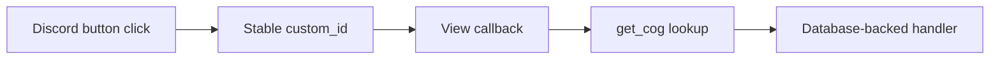
```mermaid
flowchart LR
  S1["Discord button click"]
  S2["Stable custom_id"]
  S3["View callback"]
  S4["get_cog lookup"]
  S5["Database-backed handler"]
  S1 --> S2
  S2 --> S3
  S3 --> S4
  S4 --> S5
```

> The button identifies the action; the database identifies the current truth.

## 33. Live Request Code Walkthrough

The request button is deceptively complex. On click, the bot checks whether the user already has a current-wave request. If they do and the edit window is still open, the same button becomes an edit entry point. If not, it checks open/closed state, required roles, banned role, first-time request role logic, and then opens the modal.

#### Request button state gate excerpt (cogs/RequestLevels.py:3145-3214)

```python
3145:     async def handle_request_button(self, interaction: discord.Interaction):
3146:         if interaction.guild is None:
3147:             return await interaction.response.send_message("Wrong server.", ephemeral=True)
3148:
3149:         # A modal must be the initial response. Replica-only reads avoid waiting
3150:         # for Turso synchronization before Discord's response deadline.
3151:         row = await self._get_state_local(interaction.guild.id)
3152:         if row is None:
3153:             return await interaction.response.send_message(
3154:                 "The request system is still initializing. Please try again in a moment.",
3155:                 ephemeral=True,
3156:             )
3157:
3158:         now_ts = int(time_module.time())
3159:         close_ts = self._row_value(row, "close_ts", None)
3160:         timed_out = (
3161:             str(row["state"]) == STATE_OPEN
3162:             and close_ts is not None
3163:             and int(close_ts) <= now_ts
3164:         )
3165:
3166:         request_row = await self._current_user_submission_local(
3167:             interaction.guild.id,
3168:             int(row["wave_id"]),
3169:             interaction.user.id,
3170:         )
3171:         if timed_out:
3172:             self._start_background_task(
3173:                 self._set_state_closed(interaction.guild, reason="time limit"),
3174:                 label=f"Timed request close guild_id={interaction.guild.id}",
3175:             )
3176:             if request_row and self._can_edit_submission(row, request_row):
3177:                 return await interaction.response.send_modal(
3178:                     LevelRequestModal(
3179:                         self,
3180:                         interaction.user.id,
3181:                         edit=True,
3182:                         initial=self._request_initial_values(request_row),
3183:                         edit_wave_id=int(request_row["wave_id"]),
3184:                     )
3185:                 )
3186:             return await interaction.response.send_message(
3187:                 self._message("closed", "Requests are closed :/"),
3188:                 ephemeral=True,
3189:             )
3190:
3191:         if request_row:
3192:             if self._can_edit_submission(row, request_row):
3193:                 return await interaction.response.send_modal(
3194:                     LevelRequestModal(
3195:                         self,
3196:                         interaction.user.id,
3197:                         edit=True,
3198:                         initial=self._request_initial_values(request_row),
3199:                         edit_wave_id=int(request_row["wave_id"]),
3200:                     )
3201:                 )
3202:             if str(request_row["status"]) != "pending":
3203:                 return await interaction.response.send_message("That request has already been reviewed.", ephemeral=True)
3204:             if str(row["state"]) != STATE_OPEN:
3205:                 return await interaction.response.send_message(self._message("edit_window_expired", "Your request can no longer be edited."), ephemeral=True)
3206:             return await interaction.response.send_message(
3207:                 self._message("already_submitted", "You already submitted a level during this request wave."),
3208:                 ephemeral=True,
3209:             )
3210:
3211:         if str(row["state"]) != STATE_OPEN:
3212:             return await interaction.response.send_message(self._message("closed", "Requests are closed :/"), ephemeral=True)
3213:
3214:         member = self._cached_interaction_member(interaction)
```

The submission handler uses a lock because request limits and duplicate checks must be consistent. Imagine a wave with one slot left and two users submit at the same moment. Without the lock, both could pass the count check. With the lock, one complete submission finishes before the next one evaluates the current state.

#### Request form submission excerpt (cogs/RequestLevels.py:3272-3361)

```python
3272:     async def handle_request_form(self, interaction: discord.Interaction, data: Dict[str, str]):
3273:         if interaction.guild is None:
3274:             return await self._reply_ephemeral(interaction, "Wrong server.")
3275:         member = await self._resolve_member(interaction.guild, interaction.user)
3276:         if member is None or not await self._requirements_ok(member):
3277:             return await self._reply_ephemeral(
3278:                 interaction,
3279:                 self._message("no_requirements", "You don't meet the requirements, please read the requesting rules"),
3280:             )
3281:         if not data.get("level_id") or not data.get("level_name") or not data.get("creators"):
3282:             return await self._reply_ephemeral(interaction, "Missing required fields.")
3283:         validation_errors = self._validate_request_data(data)
3284:         if validation_errors:
3285:             return await self._reply_ephemeral(
3286:                 interaction,
3287:                 self._message_formatted(
3288:                     "validation_error",
3289:                     "Please fix your request before submitting: {errors}",
3290:                     {"errors": " ".join(validation_errors)},
3291:                 ),
3292:             )
3293:
3294:         if not interaction.response.is_done():
3295:             await interaction.response.defer(ephemeral=True)
3296:
3297:         external_errors, level_validation = await self._validate_level_external(data, interaction.guild.id, interaction.user.id)
3298:         if external_errors:
3299:             return await self._reply_ephemeral(
3300:                 interaction,
3301:                 self._message_formatted(
3302:                     "validation_error",
3303:                     "Please fix your request before submitting: {errors}",
3304:                     {"errors": " ".join(external_errors)},
3305:                 ),
3306:             )
3307:
3308:         refresh_after_close = False
3309:         closed_before_submit = False
3310:         closed_by_timer = False
3311:         async with self._state_lock, self._submit_lock:
3312:             row = await self._get_state(interaction.guild.id)
3313:             if str(row["state"]) != STATE_OPEN:
3314:                 closed_before_submit = True
3315:             elif row["close_ts"] is not None and int(row["close_ts"]) <= int(time_module.time()):
3316:                 closed_ts = int(row["close_ts"])
3317:                 await self.bot.db.execute_transaction(
3318:                     (
3319:                         (
3320:                             "UPDATE level_request_state SET state=?, close_ts=NULL, closed_ts=? WHERE guild_id=?",
3321:                             (STATE_CLOSED, closed_ts, interaction.guild.id),
3322:                         ),
3323:                         (
3324:                             "UPDATE level_request_submissions SET edit_deadline_ts=? "
3325:                             "WHERE guild_id=? AND wave_id=? AND status='pending' AND edit_deadline_ts IS NULL",
3326:                             (
3327:                                 closed_ts + self._post_close_edit_seconds(),
3328:                                 interaction.guild.id,
3329:                                 int(row["wave_id"]),
3330:                             ),
3331:                         ),
3332:                     ),
3333:                     retry_safe=True,
3334:                 )
3335:                 refresh_after_close = True
3336:                 closed_by_timer = True
3337:
3338:             if not closed_before_submit and not refresh_after_close:
3339:                 wave_id = int(row["wave_id"])
3340:                 user_id = interaction.user.id
3341:                 normalized_level_id = self._normalize_level_id(data["level_id"])
3342:                 request_type = self._request_type_from_row(row)
3343:                 type_error = self._request_type_validation_error(request_type, data, level_validation)
3344:                 if type_error:
3345:                     return await self._reply_ephemeral(interaction, type_error)
3346:
3347:                 existing_user = await self.bot.db.fetchone(
3348:                     "SELECT 1 FROM level_request_submissions WHERE guild_id=? AND wave_id=? AND user_id=?",
3349:                     (interaction.guild.id, wave_id, user_id),
3350:                 )
3351:                 if existing_user:
3352:                     return await self._reply_ephemeral(interaction, self._message("already_submitted", "You already submitted a level during this request wave."))
3353:
3354:                 existing_level = await self.bot.db.fetchone(
3355:                     "SELECT 1 FROM level_request_submissions WHERE guild_id=? AND wave_id=? AND level_id=?",
3356:                     (interaction.guild.id, wave_id, normalized_level_id),
3357:                 )
3358:                 if existing_level:
3359:                     return await self._reply_ephemeral(interaction, self._message("duplicate_level", "That level ID has already been submitted during this request wave."))
3360:
3361:                 target_channel = await self._configured_channel(interaction.guild, "level_requested")
```

Notice the order: validate local fields, defer the interaction, validate externally, enter the submit lock, reload current state, check duplicate user and duplicate level ID, send the review embed, store the Discord message ID, then increment the wave count. The request only counts after the staff queue message exists.

#### Request edit audit trail excerpt (cogs/RequestLevels.py:3509-3598)

```python
3509:     async def handle_request_edit_form(
3510:         self,
3511:         interaction: discord.Interaction,
3512:         data: Dict[str, str],
3513:         edit_wave_id: int = 0,
3514:     ):
3515:         if interaction.guild is None:
3516:             return await self._reply_ephemeral(interaction, "Wrong server.")
3517:         member = await self._resolve_member(interaction.guild, interaction.user)
3518:         if member is None or not await self._requirements_ok(member):
3519:             return await self._reply_ephemeral(
3520:                 interaction,
3521:                 self._message("no_requirements", "You don't meet the requirements, please read the requesting rules"),
3522:             )
3523:         if not data.get("level_id") or not data.get("level_name") or not data.get("creators"):
3524:             return await self._reply_ephemeral(interaction, "Missing required fields.")
3525:         validation_errors = self._validate_request_data(data)
3526:         if validation_errors:
3527:             return await self._reply_ephemeral(
3528:                 interaction,
3529:                 self._message_formatted(
3530:                     "validation_error",
3531:                     "Please fix your request before submitting: {errors}",
3532:                     {"errors": " ".join(validation_errors)},
3533:                 ),
3534:             )
3535:         if not interaction.response.is_done():
3536:             await interaction.response.defer(ephemeral=True)
3537:
3538:         external_errors, level_validation = await self._validate_level_external(data, interaction.guild.id, interaction.user.id)
3539:         if external_errors:
3540:             return await self._reply_ephemeral(
3541:                 interaction,
3542:                 self._message_formatted(
3543:                     "validation_error",
3544:                     "Please fix your request before submitting: {errors}",
3545:                     {"errors": " ".join(external_errors)},
3546:                 ),
3547:             )
3548:
3549:         async with self._state_lock, self._submit_lock:
3550:             state_row = await self._get_state(interaction.guild.id)
3551:             if (
3552:                 str(state_row["state"]) == STATE_OPEN
3553:                 and state_row["close_ts"] is not None
3554:                 and int(state_row["close_ts"]) <= int(time_module.time())
3555:             ):
3556:                 closing_wave_id = int(state_row["wave_id"])
3557:                 closed_ts = int(state_row["close_ts"])
3558:                 await self.bot.db.execute_transaction(
3559:                     (
3560:                         (
3561:                             "UPDATE level_request_state SET state=?, close_ts=NULL, closed_ts=? WHERE guild_id=?",
3562:                             (STATE_CLOSED, closed_ts, interaction.guild.id),
3563:                         ),
3564:                         (
3565:                             "UPDATE level_request_submissions SET edit_deadline_ts=? "
3566:                             "WHERE guild_id=? AND wave_id=? AND status='pending' AND edit_deadline_ts IS NULL",
3567:                             (
3568:                                 closed_ts + self._post_close_edit_seconds(),
3569:                                 interaction.guild.id,
3570:                                 closing_wave_id,
3571:                             ),
3572:                         ),
3573:                     ),
3574:                     retry_safe=True,
3575:                 )
3576:                 self._start_background_task(
3577:                     self._refresh_closed_wave(interaction.guild, closing_wave_id),
3578:                     label=f"Closed-wave refresh wave_id={closing_wave_id}",
3579:                 )
3580:                 state_row = await self._get_state(interaction.guild.id)
3581:             wave_id = int(edit_wave_id or state_row["wave_id"])
3582:             row = await self.bot.db.fetchone(
3583:                 "SELECT * FROM level_request_submissions WHERE guild_id=? AND wave_id=? AND user_id=?",
3584:                 (interaction.guild.id, wave_id, interaction.user.id),
3585:             )
3586:             if not row:
3587:                 return await self._reply_ephemeral(interaction, "That request could not be found.")
3588:             if str(row["status"]) != "pending":
3589:                 return await self._reply_ephemeral(interaction, "That request has already been reviewed.")
3590:             if not self._can_edit_submission(state_row, row):
3591:                 return await self._reply_ephemeral(interaction, self._message("edit_window_expired", "Your request can no longer be edited."))
3592:
3593:             old_data_json = row["data_json"] or "{}"
3594:             old_data = self._safe_json_loads(old_data_json, {})
3595:             normalized_level_id = self._normalize_level_id(data["level_id"])
3596:             if wave_id == int(state_row["wave_id"]):
3597:                 request_type = self._request_type_from_row(state_row)
3598:             else:
```

The edit path writes both the new data and an audit record. That lets reviewers know the request changed and lets you inspect what changed later. The audit table stores old and new JSON snapshots because request form data is template-driven and may gain fields over time.

## 34. Validation Code Walkthrough

Validation is split into two files. utils/gd_validation.py knows how to parse provider responses and combine them. RequestLevelsCog decides when to call validation, cache it, rate-limit it, and turn the result into user-facing errors or reviewer warnings.

#### Provider result combiner excerpt (utils/gd_validation.py:384-453)

```python
 384: def combine_level_validation(
 385:     level_id: str,
 386:     provider_results: dict[str, dict[str, Any]],
 387:     checked_ts: int | None = None,
 388:     expires_ts: int | None = None,
 389: ) -> dict[str, Any]:
 390:     checked_ts = int(checked_ts or time.time())
 391:     expires_ts = int(expires_ts or checked_ts)
 392:     # Audit-only metadata must not change live cache payloads or the public
 393:     # level_validation_json template variable. The audit reads provider results
 394:     # directly, before this live validation boundary.
 395:     results = {str(k): {key: value for key, value in dict(v or {}).items() if key != "audit_metadata"}
 396:                for k, v in provider_results.items()}
 397:     successful = [result for result in results.values() if result.get("ok")]
 398:     existing = [result for result in successful if result.get("exists") is True]
 399:     missing = [result for result in successful if result.get("exists") is False]
 400:     failed = [result for result in results.values() if not result.get("ok")]
 401:     disagreement = bool(existing and missing)
 402:     all_requested_succeeded = bool(results) and not failed
 403:
 404:     if existing:
 405:         exists: bool | None = True
 406:     elif missing and all_requested_succeeded:
 407:         exists = False
 408:     else:
 409:         exists = None
 410:
 411:     missing_confident = exists is False and all_requested_succeeded and bool(missing)
 412:     rated = any(bool(result.get("rated")) for result in existing)
 413:     requires_showcase = any(bool(result.get("demon")) or bool(result.get("platformer")) for result in existing)
 414:     chosen = existing[0] if existing else {}
 415:
 416:     warnings: list[str] = []
 417:     if disagreement:
 418:         warnings.append("GDBrowser and the GD API disagreed. Please check this level manually.")
 419:     elif exists is None and missing:
 420:         warnings.append("This level doesn't seem to exist, but one validation source failed, so it was not auto-blocked.")
 421:     elif exists is None:
 422:         warnings.append("Level validation could not run right now. Please check this level manually.")
 423:     elif exists is False and not missing_confident:
 424:         warnings.append("This level doesn't seem to exist, but validation was not confident enough to block it.")
 425:     if rated:
 426:         warnings.append("This level seems to have been rated already.")
 427:     if requires_showcase:
 428:         warnings.append("This level appears to be a demon or platformer; a showcase is required.")
 429:
 430:     sources = []
 431:     for provider, result in sorted(results.items()):
 432:         if result.get("ok") and result.get("exists") is True:
 433:             status = "found"
 434:         elif result.get("ok") and result.get("exists") is False:
 435:             status = "missing"
 436:         else:
 437:             kind = str(
 438:                 result.get("circuit_reason")
 439:                 or result.get("failure_kind")
 440:                 or ""
 441:             ).replace("_", " ")
 442:             detail = kind or str(result.get("error") or "unknown")
 443:             status = f"unavailable ({detail})"
 444:         sources.append(f"{provider}: {status}")
 445:
 446:     return {
 447:         "level_id": str(level_id),
 448:         "checked_ts": checked_ts,
 449:         "expires_ts": expires_ts,
 450:         "providers": results,
 451:         "exists": exists,
 452:         "missing_confident": missing_confident,
 453:         "rated": rated,
```

The combiner does not pretend providers are always perfect. It tracks existing results, missing results, failed providers, disagreement, rating status, and whether a showcase appears required. This is why the bot can block confidently missing IDs but only warn when a provider failed or disagreed.

#### Cached provider lookup excerpt (cogs/RequestLevels.py:1394-1463)

```python
1394:     async def _lookup_level_validation(self, level_id: str, force: bool = False) -> Dict[str, Any]:
1395:         level_id = self._clean_level_id(level_id)
1396:         if not self._level_validation_enabled() or not level_id:
1397:             return {}
1398:
1399:         now_ts = int(time_module.time())
1400:         if not force:
1401:             cached = await self._cached_level_validation(level_id)
1402:             if cached:
1403:                 return cached
1404:
1405:             existing = self._validation_inflight.get(level_id)
1406:             if existing is not None and not existing.done():
1407:                 return await asyncio.shield(existing)
1408:
1409:             task = asyncio.create_task(self._lookup_level_validation(level_id, force=True))
1410:             self._validation_inflight[level_id] = task
1411:             try:
1412:                 return await asyncio.shield(task)
1413:             finally:
1414:                 if self._validation_inflight.get(level_id) is task:
1415:                     self._validation_inflight.pop(level_id, None)
1416:
1417:         providers = self._level_validation_providers()
1418:         results: dict[str, dict[str, Any]] = {}
1419:         ready_providers: list[str] = []
1420:         for provider in ("gdbrowser", "boomlings"):
1421:             if not providers.get(provider):
1422:                 continue
1423:             if self._provider_circuit_open(provider):
1424:                 results[provider] = self._provider_circuit_result(provider)
1425:             else:
1426:                 ready_providers.append(provider)
1427:
1428:         if not ready_providers and not results:
1429:             return {}
1430:
1431:         tasks = []
1432:         if ready_providers:
1433:             session = await self._get_level_validation_session()
1434:             tasks = [
1435:                 (provider, self._fetch_validation_provider(provider, session, level_id))
1436:                 for provider in ready_providers
1437:             ]
1438:
1439:         fetched = await asyncio.gather(*(task for _, task in tasks), return_exceptions=True)
1440:         for (provider, _), result in zip(tasks, fetched, strict=True):
1441:             if isinstance(result, Exception):
1442:                 results[provider] = {"provider": provider, "ok": False, "exists": None, "error": type(result).__name__}
1443:                 self._record_provider_validation_result(provider, results[provider])
1444:             elif isinstance(result, dict):
1445:                 results[provider] = result
1446:             else:
1447:                 results[provider] = {"provider": provider, "ok": False, "exists": None, "error": "Unexpected result"}
1448:                 self._record_provider_validation_result(provider, results[provider])
1449:
1450:         successful_provider = any(result.get("ok") for result in results.values())
1451:         cache_seconds = (
1452:             self._level_validation_cache_seconds()
1453:             if successful_provider
1454:             else self._level_validation_failure_cache_seconds()
1455:         )
1456:         expires_ts = now_ts + cache_seconds
1457:         combined = combine_level_validation(level_id, results, checked_ts=now_ts, expires_ts=expires_ts)
1458:         try:
1459:             await self.bot.db.execute(
1460:                 "INSERT INTO gd_level_validation_cache(level_id,checked_ts,expires_ts,data_json) VALUES(?,?,?,?) "
1461:                 "ON CONFLICT(level_id) DO UPDATE SET checked_ts=excluded.checked_ts, expires_ts=excluded.expires_ts, data_json=excluded.data_json",
1462:                 (level_id, now_ts, expires_ts, json.dumps(combined, separators=(",", ":"))),
1463:             )
```

#### External validation policy (cogs/RequestLevels.py:1550-1577)

```python
1550:     async def _validate_level_external(self, data: Dict[str, str], guild_id: int = 0, user_id: int = 0) -> tuple[list[str], Dict[str, Any]]:
1551:         if not self._level_validation_enabled():
1552:             return [], {}
1553:         level_id = self._clean_level_id(data.get("level_id"))
1554:         if not re.fullmatch(r"\d{7,9}", level_id):
1555:             return [], {}
1556:         cached = await self._cached_level_validation(level_id)
1557:         if not cached and guild_id and user_id and level_id not in self._validation_inflight:
1558:             rate_limited = self._level_validation_rate_limit_message(guild_id, user_id)
1559:             if rate_limited:
1560:                 return [rate_limited], {}
1561:
1562:         validation = cached or await self._lookup_level_validation(level_id)
1563:         errors: list[str] = []
1564:         auto_reject = bool(self._level_validation_cfg().get("auto_reject_missing", True))
1565:         if validation.get("missing_confident") and auto_reject:
1566:             errors.append(self._level_validation_message("missing", "That level ID does not seem to exist. Please check the ID and try again."))
1567:
1568:         showcase = str(data.get("level_showcase") or "").strip()
1569:         if validation.get("requires_showcase") and not self._valid_url(showcase):
1570:             errors.append(
1571:                 self._level_validation_message(
1572:                     "showcase_required",
1573:                     "This level appears to be a demon or platformer, so a showcase URL is required.",
1574:                 )
1575:             )
1576:
1577:         return errors, validation
```

The cache is important for both speed and kindness to external services. The circuit breaker is a practical resilience feature: if one provider fails repeatedly, the bot temporarily stops using it instead of letting every submission wait on a broken service.

## 35. Request Review Code Walkthrough

Review actions are shared between live wave requests and weekly request submissions. The handler first figures out whether the clicked message belongs to level_request_submissions or weekly_request_reviews, then applies the same result logic.

#### Immediate review button routing (cogs/RequestLevels.py:3857-3871)

```python
3857:     async def handle_review_button(self, interaction: discord.Interaction, action: str):
3858:         if interaction.guild is None or interaction.message is None:
3859:             return await interaction.response.send_message("Request not found.", ephemeral=True)
3860:         member = self._cached_interaction_member(interaction)
3861:         if member is None or not self._has_reviewer_role(member):
3862:             return await interaction.response.send_message("Only reviewers can use these controls.", ephemeral=True)
3863:         if action == "recheck":
3864:             await interaction.response.defer(ephemeral=True)
3865:             return await self._recheck_review_validation(interaction, interaction.message.id)
3866:         # The modal itself is the acknowledgement. Authoritative existence and
3867:         # pending-state checks run after submission, never before this deadline.
3868:         if action == "other":
3869:             return await interaction.response.send_message("Choose a result:", view=OtherReasonView(self, interaction.message.id), ephemeral=True)
3870:
3871:         await interaction.response.send_modal(ReviewModal(self, interaction.message.id, action))
```

#### Final review transaction excerpt (cogs/RequestLevels.py:4047-4136)

```python
4047:     async def _finalize_review(
4048:         self,
4049:         interaction: discord.Interaction,
4050:         message_id: int,
4051:         result_key: str,
4052:         review: str,
4053:         *,
4054:         send_type: str | None = None,
4055:     ):
4056:         if interaction.guild is None:
4057:             return await self._reply_ephemeral(interaction, "Wrong server.")
4058:
4059:         if not interaction.response.is_done():
4060:             await interaction.response.defer(ephemeral=True)
4061:
4062:         member = self._cached_interaction_member(interaction)
4063:         if member is None or not self._has_reviewer_role(member):
4064:             return await self._reply_ephemeral(interaction, "Only reviewers can use these controls.")
4065:
4066:         async with self._review_lock:
4067:             target_kind, row = await self._review_target_by_message(interaction.guild.id, message_id)
4068:             if not row:
4069:                 return await self._reply_ephemeral(interaction, "Request not found.")
4070:             if str(row["status"]) != "pending":
4071:                 return await self._reply_ephemeral(interaction, "This request has already been reviewed.")
4072:
4073:             review_system_version = self._review_system_version(row, target_kind)
4074:             normalized_send_type = normalize_send_type(send_type)
4075:             if result_key == "sent" and review_system_version == PPS_V1_REVIEW_SYSTEM:
4076:                 if normalized_send_type is None:
4077:                     return await self._reply_ephemeral(
4078:                         interaction,
4079:                         "Choose Rate, Feature, Epic, Legendary, or Mythic from the Send type menu.",
4080:                     )
4081:             elif normalized_send_type is not None:
4082:                 return await self._reply_ephemeral(
4083:                     interaction,
4084:                     "This request uses the legacy review workflow and cannot accept a PPS send type.",
4085:                 )
4086:
4087:             data = self._safe_json_loads(row["data_json"], {})
4088:             if not isinstance(data, dict):
4089:                 data = {}
4090:             reviewer_id = interaction.user.id
4091:             result_label = self._result_label(result_key)
4092:             if target_kind == "weekly":
4093:                 variables = self._weekly_data_vars(row, data, result_key=result_key, review=review, reviewer_id=reviewer_id)
4094:             else:
4095:                 variables = self._data_vars(
4096:                     row,
4097:                     data,
4098:                     result_key=result_key,
4099:                     review=review,
4100:                     reviewer_id=reviewer_id,
4101:                     send_type=normalized_send_type,
4102:                 )
4103:
4104:             request_channel = await self._review_target_channel(interaction.guild, target_kind, row)
4105:             if request_channel is None:
4106:                 return await self._reply_ephemeral(interaction, "I couldn't find the original request channel, so I did not mark it reviewed.")
4107:             msg = interaction.message
4108:             if msg is None or int(msg.id) != int(message_id):
4109:                 try:
4110:                     msg = await request_channel.fetch_message(message_id)
4111:                 except Exception as e:
4112:                     await log_error(self.bot, f"Could not fetch reviewed level request {message_id}: {repr(e)}")
4113:                     return await self._reply_ephemeral(interaction, "I couldn't find the original request message, so I did not mark it reviewed.")
4114:
4115:             result_channel_id = self._status_channel_id(result_key)
4116:             if not result_channel_id:
4117:                 return await self._reply_ephemeral(interaction, "I couldn't find the result channel, so I did not mark it reviewed.")
4118:
4119:             reviewed_ts = int(time_module.time())
4120:             requester_id = int(self._row_value(row, "user_id", 0) or 0)
4121:             preference_row = await self.bot.db.fetchone(
4122:                 "SELECT request_result_mode FROM user_notification_preferences WHERE guild_id=? AND user_id=?",
4123:                 (interaction.guild.id, requester_id),
4124:             )
4125:             default_mode = self._cfg("default_result_notification", default="channel")
4126:             notification_mode = normalize_notification_mode(
4127:                 preference_row["request_result_mode"] if preference_row else default_mode
4128:             )
4129:             correlation_id = str(
4130:                 self._row_value(row, "correlation_id", "")
4131:                 or data.get("correlation_id")
4132:                 or new_correlation_id("review")
4133:             )
4134:             try:
4135:                 result_embed = self._embed_from_template(
4136:                     self._cfg(self._result_template_key(result_key), default={}) or {},
```

The review lock has the same purpose as the submit lock: one reviewer should win the state transition. The database status must still be pending when the review is saved. After that, the original buttons are disabled so Discord's visible UI matches the stored result.

#### Wave summary variables and reviewer stats (cogs/RequestLevels.py:1721-1790)

```python
1721:     async def _wave_summary_vars(self, guild_id: int, wave_id: int) -> Dict[str, Any]:
1722:         rows = await self.bot.db.fetchall(
1723:             "SELECT status, result, send_type, review_system_version, reviewed_by, reviewed_ts, created_ts, data_json "
1724:             "FROM level_request_submissions WHERE guild_id=? AND wave_id=?",
1725:             (guild_id, wave_id),
1726:         )
1727:         total = len(rows)
1728:         reviewed = sum(1 for row in rows if str(row["status"]) == "reviewed")
1729:         sent = sum(1 for row in rows if str(row["status"]) == "reviewed" and str(row["result"]) == "sent")
1730:         rejected = sum(1 for row in rows if str(row["status"]) == "reviewed" and str(row["result"]) == "rejected")
1731:         level_doesnt_exist = sum(1 for row in rows if str(row["result"]) == "level_doesnt_exist")
1732:         stolen_level = sum(1 for row in rows if str(row["result"]) == "stolen_level")
1733:         already_rated = sum(1 for row in rows if str(row["result"]) == "already_rated")
1734:         other = level_doesnt_exist + stolen_level + already_rated
1735:         not_sent = rejected + other
1736:         pending = max(total - reviewed, 0)
1737:         reviewer_stats = await self._reviewer_stats_lines(rows)
1738:         review_system_version = next(
1739:             (
1740:                 self._review_system_version(row)
1741:                 for row in rows
1742:                 if self._review_system_version(row) == PPS_V1_REVIEW_SYSTEM
1743:             ),
1744:             LEGACY_REVIEW_SYSTEM,
1745:         )
1746:         if not rows:
1747:             state_version = await self.bot.db.fetchone(
1748:                 "SELECT review_system_version FROM level_request_state WHERE guild_id=? AND wave_id=?",
1749:                 (guild_id, wave_id),
1750:             )
1751:             if state_version:
1752:                 review_system_version = self._review_system_version(state_version)
1753:         send_type_counts = {
1754:             send_type: sum(
1755:                 1
1756:                 for row in rows
1757:                 if str(row["status"]) == "reviewed"
1758:                 and str(row["result"]) == "sent"
1759:                 and str(row["send_type"] or "") == send_type
1760:             )
1761:             for send_type in ("rate", "feature", "epic", "legendary", "mythic")
1762:         }
1763:         request_type = ""
1764:         for row in rows:
1765:             data = self._safe_json_loads(row["data_json"], {})
1766:             if isinstance(data, dict):
1767:                 request_type = str(data.get("request_type") or "")
1768:                 if request_type:
1769:                     break
1770:         variables = {
1771:             "wave_id": wave_id,
1772:             "request_type": request_type,
1773:             "request_type_label": self._request_type_label(request_type),
1774:             "total_requests": total,
1775:             "reviewed_count": reviewed,
1776:             "sent_count": sent,
1777:             "not_sent_count": not_sent,
1778:             "rejected_count": rejected,
1779:             "other_count": other,
1780:             "level_doesnt_exist_count": level_doesnt_exist,
1781:             "stolen_level_count": stolen_level,
1782:             "already_rated_count": already_rated,
1783:             "pending_count": pending,
1784:             "left_to_review": pending,
1785:             "reviewed_percent": self._pct(reviewed, total),
1786:             "pending_percent": self._pct(pending, total),
1787:             "sent_percent": self._pct(sent, total),
1788:             "not_sent_percent": self._pct(not_sent, total),
1789:             "sent_percent_reviewed": self._pct(sent, reviewed),
1790:             "not_sent_percent_reviewed": self._pct(not_sent, reviewed),
```

The summary is generated from the database, not from memory. That means it can be rebuilt later and it stays correct even if the bot restarts between reviews.

## 36. Scheduled Openings Walkthrough

Scheduled request openings are stored as rows, not just sleeping tasks. This is deliberate. If the bot restarts, a sleeping task disappears, but the row in level_request_scheduled_openings remains. The scheduler loop can pick it up again when the bot is ready.

#### Scheduling command excerpt (cogs/RequestLevels.py:2911-2980)

```python
2911:     async def open_requests(
2912:         self,
2913:         ctx: discord.ApplicationContext,
2914:         number: int = 0,
2915:         time: int = 0,
2916:         when: str = "",
2917:         day: int = 0,
2918:         request_type: str = "",
2919:         open_message: str = "",
2920:     ):
2921:         if not self._in_allowed_guild(ctx):
2922:             return await ctx.respond("Wrong server.", ephemeral=True)
2923:         await self._defer_command(ctx)
2924:         member = await self._resolve_member(ctx.guild, ctx.user)
2925:         if member is None or not self._is_admin(member):
2926:             return await ctx.respond("You don't have permission to use this.", ephemeral=True)
2927:
2928:         request_limit = int(number) if number and int(number) > 0 else None
2929:         close_minutes = int(time) if time and int(time) > 0 else None
2930:         if int(number or 0) < 0 or int(number or 0) > 10000:
2931:             return await ctx.respond("Request limit must be between 0 and 10,000.", ephemeral=True)
2932:         if int(time or 0) < 0 or int(time or 0) > 43200:
2933:             return await ctx.respond("Close timer must be between 0 and 43,200 minutes (30 days).", ephemeral=True)
2934:         normalized_type = self._normalize_request_type(request_type)
2935:         if normalized_type is None:
2936:             return await ctx.respond(f"Unknown request type. Use one of: {self._request_type_help()}, or leave it blank.", ephemeral=True)
2937:         type_label = self._request_type_label(normalized_type)
2938:         cleaned_open_message = self._clean_open_message(open_message)
2939:
2940:         if str(when or "").strip():
2941:             open_ts, error = self._parse_scheduled_open_ts(when, day)
2942:             if open_ts is None:
2943:                 return await ctx.respond(error or "I couldn't parse that opening time.", ephemeral=True)
2944:             await self.bot.db.execute(
2945:                 "INSERT INTO level_request_scheduled_openings(guild_id,request_limit,close_minutes,open_ts,created_by,created_ts,status,request_type,open_message,correlation_id) "
2946:                 "VALUES(?,?,?,?,?,?,?,?,?,?)",
2947:                 (
2948:                     ctx.guild.id,
2949:                     request_limit,
2950:                     close_minutes,
2951:                     open_ts,
2952:                     ctx.user.id,
2953:                     int(time_module.time()),
2954:                     "pending",
2955:                     normalized_type or None,
2956:                     cleaned_open_message,
2957:                     new_correlation_id("scheduled"),
2958:                 ),
2959:             )
2960:             details = [f"Request opening scheduled for <t:{open_ts}:F> (<t:{open_ts}:R>)."]
2961:             if normalized_type:
2962:                 details.append(f"Type: **{type_label}**.")
2963:             details.append("Announcement: **custom**." if cleaned_open_message else "Announcement: **default role ping**.")
2964:             if request_limit:
2965:                 details.append(f"Limit: **{request_limit}** successful requests.")
2966:             if close_minutes:
2967:                 details.append(f"Requests will close after **{close_minutes}** minutes unless the limit is reached first.")
2968:             details.append("Use `/pending-openings` to edit, delete, or open it early.")
2969:             await self._log_request_admin_action(
2970:                 ctx.guild,
2971:                 ctx.user.id,
2972:                 "scheduled_opening_created",
2973:                 f"open_ts={open_ts} limit={request_limit} close_minutes={close_minutes} request_type={normalized_type or 'any'} announcement={'custom' if cleaned_open_message else 'default'}",
2974:             )
2975:             return await ctx.respond(" ".join(details), ephemeral=True)
2976:
2977:         try:
2978:             wave_id, close_ts = await self._open_requests_now(
2979:                 ctx.guild,
2980:                 request_limit,
```

#### Pending opening edit/list excerpt (cogs/RequestLevels.py:3006-3075)

```python
3006:     async def pending_openings(
3007:         self,
3008:         ctx: discord.ApplicationContext,
3009:         action: str = "list",
3010:         opening_id: int = 0,
3011:         number: int = -1,
3012:         time: int = -1,
3013:         when: str = "",
3014:         day: int = 0,
3015:         request_type: str = "",
3016:         open_message: str = "",
3017:     ):
3018:         if not self._in_allowed_guild(ctx):
3019:             return await ctx.respond("Wrong server.", ephemeral=True)
3020:         await self._defer_command(ctx)
3021:         member = await self._resolve_member(ctx.guild, ctx.user)
3022:         if member is None or not self._is_admin(member):
3023:             return await ctx.respond("You don't have permission to use this.", ephemeral=True)
3024:
3025:         action = str(action or "list").strip().casefold()
3026:         if action in {"delete", "remove", "cancel"}:
3027:             if not opening_id:
3028:                 return await ctx.respond("Please provide the scheduled opening ID to delete.", ephemeral=True)
3029:             async with self._scheduled_lock:
3030:                 existing = await self.get_scheduled_opening(ctx.guild.id, opening_id)
3031:                 if existing is None:
3032:                     return await ctx.respond("I couldn't find a pending opening with that ID.", ephemeral=True)
3033:                 await self.bot.db.execute(
3034:                     "UPDATE level_request_scheduled_openings SET status='deleted' WHERE guild_id=? AND id=? AND status='pending'",
3035:                     (ctx.guild.id, opening_id),
3036:                 )
3037:             await self._log_request_admin_action(ctx.guild, ctx.user.id, "scheduled_opening_deleted", f"opening_id={opening_id}")
3038:             return await ctx.respond(f"Deleted scheduled opening **#{opening_id}** if it was still pending.", ephemeral=True)
3039:
3040:         if action in {"edit", "update"}:
3041:             if not opening_id:
3042:                 return await ctx.respond("Please provide the scheduled opening ID to edit.", ephemeral=True)
3043:             row = await self.bot.db.fetchone(
3044:                 "SELECT * FROM level_request_scheduled_openings WHERE guild_id=? AND id=? AND status='pending'",
3045:                 (ctx.guild.id, opening_id),
3046:             )
3047:             if not row:
3048:                 return await ctx.respond("I couldn't find a pending opening with that ID.", ephemeral=True)
3049:
3050:             new_limit = row["request_limit"]
3051:             new_close = row["close_minutes"]
3052:             new_open_ts = int(row["open_ts"])
3053:             new_type = row["request_type"] if "request_type" in row.keys() else None
3054:             new_message = self._row_value(row, "open_message", None)
3055:             if number < -1 or time < -1:
3056:                 return await ctx.respond("Use -1 to keep a value, 0 to clear it, or a positive number.", ephemeral=True)
3057:             if number > 10000:
3058:                 return await ctx.respond("Request limit cannot be greater than 10,000.", ephemeral=True)
3059:             if time > 43200:
3060:                 return await ctx.respond("Close timer cannot be greater than 43,200 minutes (30 days).", ephemeral=True)
3061:             if number >= 0:
3062:                 new_limit = int(number) if int(number) > 0 else None
3063:             if time >= 0:
3064:                 new_close = int(time) if int(time) > 0 else None
3065:             if str(request_type or "").strip():
3066:                 parsed_type = self._normalize_request_type(request_type)
3067:                 if parsed_type is None:
3068:                     return await ctx.respond(
3069:                         f"Unknown request type. Use one of: {self._request_type_help()}, or use `any` to clear it.",
3070:                         ephemeral=True,
3071:                     )
3072:                 new_type = parsed_type or None
3073:             if str(open_message or "").strip():
3074:                 new_message = self._clean_open_message(open_message)
3075:             if str(when or "").strip():
```

The command accepts immediate openings and scheduled openings through the same entry point. The when/day options create a future row; leaving when empty opens immediately. This keeps the admin interface compact while the stored state remains explicit.

> **Why Discord timestamps are used:** The bot stores Unix timestamps and displays Discord timestamp markup. Discord then renders the time in each viewer's client, which avoids putting a timezone label in the frontend while still keeping scheduling internally consistent.

## 37. Tracking Code Walkthrough

TrackingCog counts activity without writing to SQLite on every message. That would be slow and noisy. Instead, it keeps small in-memory buffers and periodically flushes them with UPSERT statements. If the flush fails, it puts the counts back into the buffer so they can be retried.

#### Message counting gate (cogs/Tracking.py:985-1046)

```python
 985:     async def on_message(self, message: discord.Message):
 986:         if message.author.bot:
 987:             return
 988:
 989:         # DM handling for weekly request process
 990:         if message.guild is None:
 991:             await self._handle_dm(message)
 992:             return
 993:
 994:         allowed_guild_id = self._cfg_int("guild", "allowed_guild_id", 0)
 995:         if not ensure_allowed_guild_id(message.guild, allowed_guild_id):
 996:             return
 997:
 998:         # Exclude blacklisted roles
 999:         excluded_role_ids = set(self._cfg_int_list("roles", "excluded_tracking_role_id"))
1000:         if excluded_role_ids:
1001:             m = await self._resolve_member(message.guild, message.author)
1002:             if m and any(r.id in excluded_role_ids for r in m.roles):
1003:                 return
1004:
1005:         # Exclude channels
1006:         excluded_channels = set(self._cfg_int_list("channels", "excluded_tracking_channel_ids")) | set(
1007:             self._cfg_int_list("channels", "bot_commands_channel_ids")
1008:         )
1009:         review_access_channel_id = self._cfg_int("channels", "review_access_channel_id", 0)
1010:         if review_access_channel_id:
1011:             excluded_channels.add(review_access_channel_id)
1012:         if message.channel.id in excluded_channels:
1013:             return
1014:
1015:         now = int(time.time())
1016:         if len(self._last_counted_cache) > 20000:
1017:             oldest = sorted(self._last_counted_cache.items(), key=lambda item: item[1])[:5000]
1018:             for old_key, _ in oldest:
1019:                 self._last_counted_cache.pop(old_key, None)
1020:         anti_farm_reason = await self._anti_farm_reason(message, now)
1021:         if anti_farm_reason:
1022:             await self._record_anti_farm_event(message, anti_farm_reason, now)
1023:             return
1024:
1025:         cd = max(0, min(3600, self._cfg_int("tracking", "count_cooldown_seconds", 10)))
1026:         cache_key = (message.guild.id, message.author.id)
1027:
1028:         last_counted = self._last_counted_cache.get(cache_key)
1029:         if last_counted is None:
1030:             row = await self.bot.db.fetchone(
1031:                 "SELECT last_counted_ts FROM activity_last_counted WHERE guild_id=? AND user_id=?",
1032:                 (message.guild.id, message.author.id),
1033:             )
1034:             last_counted = int(row["last_counted_ts"]) if row else 0
1035:             self._last_counted_cache[cache_key] = last_counted
1036:
1037:         if last_counted and now - int(last_counted) < cd:
1038:             return
1039:
1040:         ws_iso = week_start_sunday(now_madrid()).isoformat()
1041:         self._last_counted_cache[cache_key] = now
1042:
1043:         async with self._activity_lock:
1044:             count_key = (message.guild.id, message.author.id, ws_iso)
1045:             self._pending_activity_counts[count_key] = self._pending_activity_counts.get(count_key, 0) + 1
1046:             self._pending_last_counted[cache_key] = now
```

#### Buffered activity flush (cogs/Tracking.py:1059-1088)

```python
1059:     async def flush_activity_counts(self, *, drain: bool = False) -> None:
1060:         if self._activity_flush_lock.locked() and not drain:
1061:             return
1062:         async with self._activity_flush_lock:
1063:             # Keep a failed batch immutable: its receipt may already exist
1064:             # remotely after an uncertain commit. New activity stays separate.
1065:             batches = 0
1066:             while drain or batches < 4:
1067:                 batches += 1
1068:                 if self._activity_retry_batch is None:
1069:                     async with self._activity_lock:
1070:                         count_keys = list(self._pending_activity_counts)[:50]
1071:                         counts = [(*key, self._pending_activity_counts.pop(key)) for key in count_keys]
1072:                         unflushed_users = {(key[0], key[1]) for key in self._pending_activity_counts}
1073:                         seen_keys = [key for key in self._pending_last_counted if key not in unflushed_users][:50]
1074:                         last_seen = [(*key, self._pending_last_counted.pop(key)) for key in seen_keys if key in self._pending_last_counted]
1075:                     if not counts and not last_seen:
1076:                         return
1077:                     self._activity_retry_batch = (new_correlation_id("activity"), counts, last_seen)
1078:                 batch_id, counts, last_seen = self._activity_retry_batch
1079:                 try:
1080:                     await self.bot.db.apply_activity_batch(batch_id, counts, last_seen)
1081:                 except DatabaseBusyError:
1082:                     return
1083:                 except Exception as e:
1084:                     await self._log_background_error("activity_flush_counts", f"Activity batch persistence deferred: {e!r}")
1085:                     return
1086:                 self._activity_retry_batch = None
1087:                 # Let interactive writers acquire the queue between chunks.
1088:                 await asyncio.sleep(0)
```

The ON CONFLICT SQL is doing the increment atomically at database level: if a row already exists for that user and week, count becomes count + excluded.count. That keeps weekly totals correct even though the bot flushes multiple messages together.

#### Weekly job runner (cogs/Tracking.py:1796-1844)

```python
1796:     async def run_weekly_job(self, week_start_iso: str):
1797:         allowed_guild_id = self._cfg_int("guild", "allowed_guild_id", 0)
1798:         guild = self.bot.get_guild(allowed_guild_id) if allowed_guild_id else None
1799:         if guild is None:
1800:             return
1801:         await self.flush_activity_counts(drain=True)
1802:         async with self._activity_lock:
1803:             pending = any(key[0] == guild.id and key[2] == week_start_iso for key in self._pending_activity_counts)
1804:             retry = self._activity_retry_batch
1805:             pending = pending or bool(retry and any(row[0] == guild.id and row[2] == week_start_iso for row in retry[1]))
1806:         if pending:
1807:             raise DatabaseBusyError("Weekly reward postponed until this week's activity batch is confirmed; no winners were selected")
1808:
1809:         top_limit = max(1, min(500, self._cfg_int("tracking", "top_limit", 20)))
1810:         winners_to_dm = max(0, min(top_limit, self._cfg_int("tracking", "winners_to_dm", 1)))
1811:         timeout_h = max(1, min(24 * 30, self._cfg_int("tracking", "dm_timeout_hours", 48)))
1812:
1813:         await self._log_weekly(guild, week_start_iso, 0, "weekly_job_start", f"top_limit={top_limit} winners_to_dm={winners_to_dm} timeout_h={timeout_h}")
1814:
1815:         ranked: List[int] = []
1816:         ranked_rows = await self._ranked_rows_for_week(
1817:             guild,
1818:             week_start_iso,
1819:             top_limit,
1820:             include_unresolved=False,
1821:         )
1822:         for r in ranked_rows:
1823:             uid = int(r["user_id"])
1824:             ranked.append(uid)
1825:
1826:         try:
1827:             await self._update_weekly_streaks(guild, week_start_iso, ranked)
1828:         except Exception as e:
1829:             await self._log_background_error("weekly_streaks", f"Weekly streak update failed: {repr(e)}")
1830:
1831:         if await self.weekly_reward_disabled(guild.id, week_start_iso):
1832:             await self._log_weekly(guild, week_start_iso, 0, "weekly_reward_skipped", "Reward disabled for this tracking week")
1833:             await self._log_weekly(guild, week_start_iso, 0, "weekly_job_done", f"contacted=0 eligible_ranked={len(ranked)}")
1834:             return
1835:
1836:         contacted = 0
1837:         for idx, uid in enumerate(ranked, start=1):
1838:             if contacted >= winners_to_dm:
1839:                 break
1840:             ok = await self._contact_user_for_week(guild, week_start_iso, uid, rank=idx, timeout_hours=timeout_h)
1841:             if ok:
1842:                 contacted += 1
1843:
1844:         await self._log_weekly(guild, week_start_iso, 0, "weekly_job_done", f"contacted={contacted} eligible_ranked={len(ranked)}")
```

The weekly job flushes pending activity first, ranks users, updates streaks, respects the weekly reward disabled switch, contacts winners, writes the weekly_runs idempotency row, and creates a private recap. The weekly_runs table prevents the same week from being processed repeatedly by the scheduler.

## 38. Weekly Request Workflow Walkthrough

Weekly request rewards happen in DMs. A winner receives a formatted request prompt, replies with the required fields, and TrackingCog parses the message into the same shape that RequestLevelsCog understands for review embeds.

#### Weekly DM request parser (cogs/Tracking.py:165-226)

```python
 165:     def _weekly_request_review_data(self, content: str, apply_defaults: bool = True) -> dict[str, str]:
 166:         aliases = {
 167:             "name": "level_name",
 168:             "level name": "level_name",
 169:             "id": "level_id",
 170:             "level id": "level_id",
 171:             "creator": "creators",
 172:             "creators": "creators",
 173:             "creator s": "creators",
 174:             "level showcase": "level_showcase",
 175:             "showcase": "level_showcase",
 176:             "video": "level_showcase",
 177:             "notes": "notes",
 178:             "note": "notes",
 179:         }
 180:         data: dict[str, str] = {"request_content": str(content or "").strip()}
 181:         current_key: Optional[str] = None
 182:
 183:         for raw_line in str(content or "").splitlines():
 184:             line = raw_line.strip()
 185:             if line.startswith(">"):
 186:                 line = line.lstrip("> ").strip()
 187:             if not line:
 188:                 continue
 189:
 190:             if ":" in line:
 191:                 raw_key, value = line.split(":", 1)
 192:                 normalized = re.sub(r"[^a-z0-9]+", " ", raw_key.casefold()).strip()
 193:                 field_key = aliases.get(normalized)
 194:                 if field_key:
 195:                     current_key = field_key
 196:                     if value.strip() or field_key not in data:
 197:                         data[field_key] = value.strip()
 198:                     continue
 199:
 200:             if current_key:
 201:                 previous = str(data.get(current_key) or "").strip()
 202:                 data[current_key] = f"{previous}\n{line}".strip() if previous else line
 203:
 204:         if not data.get("level_id"):
 205:             match = re.search(r"\b(?:level\s*)?id\s*[:#-]?\s*([0-9]{7,9})\b", str(content or ""), flags=re.I)
 206:             if match:
 207:                 data["level_id"] = match.group(1)
 208:         if not data.get("level_name"):
 209:             match = re.search(r"\b(?:level\s*)?name\s*[:#-]?\s*(.+)", str(content or ""), flags=re.I)
 210:             if match:
 211:                 data["level_name"] = match.group(1).strip()
 212:         if not data.get("creators"):
 213:             match = re.search(r"\bcreators?\s*[:#-]?\s*(.+)", str(content or ""), flags=re.I)
 214:             if match:
 215:                 data["creators"] = match.group(1).strip()
 216:
 217:         if not apply_defaults:
 218:             return data
 219:
 220:         data["level_id"] = str(data.get("level_id") or "Not provided").strip()
 221:         data["level_id_normalized"] = data["level_id"].casefold()
 222:         data["level_name"] = str(data.get("level_name") or "Weekly request").strip()
 223:         data["creators"] = str(data.get("creators") or "Not provided").strip()
 224:         data["level_showcase"] = str(data.get("level_showcase") or "Not provided").strip()
 225:         data["notes"] = str(data.get("notes") or data["request_content"] or "No notes provided").strip()
 226:         return data
```

#### Weekly request recording excerpt (cogs/Tracking.py:1217-1286)

```python
1217:     async def _record_request(self, guild: discord.Guild, user_id: int, week_start_iso: str, content: str):
1218:         active = await self.bot.db.fetchone(
1219:             "SELECT c.rank AS rank FROM weekly_claims c "
1220:             "JOIN weekly_sessions s ON s.guild_id=c.guild_id AND s.week_start=c.week_start AND s.user_id=c.user_id "
1221:             "WHERE c.guild_id=? AND c.week_start=? AND c.user_id=? AND c.status='pending' AND s.active=1",
1222:             (guild.id, week_start_iso, user_id),
1223:         )
1224:         if not active:
1225:             return
1226:
1227:         weekly_channel_id = self._cfg_int("channels", "weekly_request_channel_ID", 0)
1228:         channel = await self._configured_channel(guild, weekly_channel_id)
1229:         if channel is None:
1230:             await self._log_weekly(guild, week_start_iso, user_id, "request_record_failed", "reason=weekly_request_channel_missing")
1231:             await log_error(self.bot, f"Weekly request from user_id={user_id} could not be recorded: weekly_request_channel_ID is missing or invalid.")
1232:             try:
1233:                 user = await self._resolve_dm_user(guild, user_id)
1234:                 await user.send("I couldn't record your request because the staff request channel is not configured correctly. Please contact staff.")
1235:             except Exception:
1236:                 pass
1237:             return
1238:
1239:         rank = int(active["rank"]) if active["rank"] is not None else None
1240:
1241:         review_data = self._weekly_request_review_data(content)
1242:         ok, review_data = await self._validate_weekly_request_for_review(guild, user_id, week_start_iso, review_data)
1243:         if not ok:
1244:             return
1245:         created_ts = int(time.time())
1246:         correlation_id = new_correlation_id("weekly-request")
1247:         review_data["correlation_id"] = correlation_id
1248:         variables = {
1249:             **review_data,
1250:             "user_id": user_id,
1251:             "user_mention": f"<@{user_id}>",
1252:             "requester_id": user_id,
1253:             "requester_mention": f"<@{user_id}>",
1254:             "rank": f"#{rank}" if rank else "Unknown",
1255:             "weekly_rank": f"#{rank}" if rank else "Unknown",
1256:             "week_start": week_start_iso,
1257:             "request_content": content,
1258:             "created_ts": created_ts,
1259:             "submitted_ts": created_ts,
1260:             "submitted_ago": f"<t:{created_ts}:R>",
1261:         }
1262:         template = self.bot.config.get("level_requests", "weekly_request_submitted_embed", default={}) or {}
1263:         if isinstance(template, dict) and template:
1264:             embed = self._embed_from_template(template, variables, "Weekly Request Submitted", "gold")
1265:         else:
1266:             embed = discord.Embed(title="Weekly Request Submitted")
1267:             embed.add_field(name="User", value=f"<@{user_id}> ({user_id})", inline=False)
1268:             if rank:
1269:                 embed.add_field(name="Rank", value=f"#{rank}", inline=True)
1270:             embed.add_field(name="Week start", value=week_start_iso, inline=False)
1271:             embed.add_field(name="Content", value=content[:1024], inline=False)
1272:
1273:         msg = None
1274:         try:
1275:             msg = await channel.send(
1276:                 embed=embed,
1277:                 view=LevelRequestReviewView(),
1278:                 allowed_mentions=no_mentions(),
1279:             )
1280:         except Exception as e:
1281:             await self._log_weekly(guild, week_start_iso, user_id, "request_record_failed", f"reason=weekly_request_send_failed error={type(e).__name__}")
1282:             await log_error(self.bot, f"Weekly request from user_id={user_id} could not be sent to staff channel {channel.id}: {repr(e)}")
1283:             try:
1284:                 user = await self._resolve_dm_user(guild, user_id)
1285:                 await user.send("I couldn't record your request right now because I could not send it to the staff channel. Please contact staff.")
1286:             except Exception:
```

The important bridge is LevelRequestReviewView. Weekly submissions are not part of a live wave, but they still use the same Send, Reject, and Other buttons. The review row lives in weekly_request_reviews, and RequestLevelsCog's review finalizer handles it.

#### Weekly contact state excerpt (cogs/Tracking.py:1846-1915)

```python
1846:     async def _contact_user_for_week(self, guild: discord.Guild, week_start_iso: str, user_id: int, rank: int, timeout_hours: int, force: bool = False) -> bool:
1847:         if not force and await self.weekly_reward_disabled(guild.id, week_start_iso):
1848:             await self._log_weekly(guild, week_start_iso, user_id, "skipped_reward_disabled", "")
1849:             return False
1850:
1851:         member = await self._resolve_member(guild, user_id)
1852:         if member is None or member.bot:
1853:             await self._log_weekly(guild, week_start_iso, user_id, "no_eligible_member", "reason=member_missing_or_bot")
1854:             return False
1855:         if not force:
1856:             excluded_role_ids = set(self._cfg_int_list("roles", "excluded_tracking_role_id"))
1857:             if excluded_role_ids and any(role.id in excluded_role_ids for role in member.roles):
1858:                 await self._log_weekly(guild, week_start_iso, user_id, "no_eligible_member", "reason=excluded_role")
1859:                 return False
1860:
1861:         now_ts = int(time.time())
1862:         timeout_hours = max(1, int(timeout_hours))
1863:         expires = now_ts + timeout_hours * 3600
1864:
1865:         # Reserve the offer before sending the DM. Concurrent scheduler/force
1866:         # runs now see `contacting` and cannot send the same offer twice.
1867:         async with self._weekly_offer_lock:
1868:             row = await self.bot.db.fetchone(
1869:                 "SELECT status FROM weekly_claims WHERE guild_id=? AND week_start=? AND user_id=?",
1870:                 (guild.id, week_start_iso, user_id),
1871:             )
1872:             if row is not None:
1873:                 await self._log_weekly(
1874:                     guild,
1875:                     week_start_iso,
1876:                     user_id,
1877:                     "skipped_already_contacted",
1878:                     f"status={row['status']}",
1879:                 )
1880:                 return False
1881:             await self.bot.db.execute(
1882:                 "INSERT INTO weekly_claims("
1883:                 "guild_id,week_start,user_id,rank,status,contacted_ts,offer_expires_ts"
1884:                 ") VALUES(?,?,?,?,?,?,?)",
1885:                 (
1886:                     guild.id,
1887:                     week_start_iso,
1888:                     user_id,
1889:                     rank,
1890:                     "contacting",
1891:                     now_ts,
1892:                     expires,
1893:                 ),
1894:             )
1895:
1896:         offer_message = None
1897:         dm_channel = None
1898:         try:
1899:             offer_message, dm_channel = await self._send_weekly_offer_message(
1900:                 member,
1901:                 timeout_hours=timeout_hours,
1902:                 expires_ts=expires,
1903:             )
1904:         except Exception as e:
1905:             await self.bot.db.execute(
1906:                 "UPDATE weekly_claims SET status='dm_closed' "
1907:                 "WHERE guild_id=? AND week_start=? AND user_id=? AND status='contacting'",
1908:                 (guild.id, week_start_iso, user_id),
1909:             )
1910:             await self._log_weekly(guild, week_start_iso, user_id, "dm_failed", type(e).__name__)
1911:
1912:             log_ch_id = self._cfg_int("channels", "dm_fail_log_channel_id", 0)
1913:             log_ch = guild.get_channel(log_ch_id) if log_ch_id else None
1914:             if log_ch is None and log_ch_id:
1915:                 try:
```

force_dm is an intentional override path. Normal weekly rewards respect exclusions and the disabled switch; manual force-DM can be used for exceptions and is logged so the override is visible later.

## 39. Help And Ticket Code Walkthrough

HelpCog is a state machine for DMs and ticket channels. The user's current help stage is stored in help_sessions. A typed message or button action reads the stage, updates the session, and sends the next prompt.

#### Help session message router excerpt (cogs/Help.py:2082-2151)

```python
2082:     async def _handle_help_session_message_locked(self, guild: discord.Guild, message: discord.Message) -> bool:
2083:         sess = await self._get_help_session(message.author.id, guild.id)
2084:         if not sess:
2085:             return False
2086:
2087:         stage = sess["stage"]
2088:         data = sess["data"]
2089:         content = (message.content or "").strip()
2090:
2091:         if content.casefold() in {"cancel", "stop", "never mind", "nevermind"}:
2092:             await self._clear_help_session(message.author.id, guild.id)
2093:             await self._send_dm_dashboard(message.channel, guild, message.author.id)
2094:             return True
2095:
2096:         if content.casefold() in {"back", "go back"}:
2097:             await self._handle_typed_back(guild, message)
2098:             return True
2099:
2100:         if content.casefold() in {"start over", "restart help", "home", "dashboard"}:
2101:             await self._clear_help_session(message.author.id, guild.id)
2102:             await self._send_dm_dashboard(message.channel, guild, message.author.id)
2103:             return True
2104:
2105:         if len(content) > self._help_max_submission_chars():
2106:             await message.channel.send(
2107:                 f"That message is too long. Please keep it under {self._help_max_submission_chars()} characters.",
2108:                 view=HelpSessionControlView(self, message.author.id, guild.id, allow_back=True),
2109:                 allowed_mentions=no_mentions(),
2110:             )
2111:             return True
2112:
2113:         text_stages = {
2114:             "appeal_punishment",
2115:             "appeal_reason",
2116:             "appeal_behavior",
2117:             "report_details",
2118:             "bot_issue_details",
2119:             "transcript_ticket",
2120:         }
2121:         if stage in text_stages and not content:
2122:             await message.channel.send(
2123:                 "Please send a written answer before continuing.",
2124:                 view=HelpSessionControlView(self, message.author.id, guild.id, allow_back=stage != "appeal_punishment"),
2125:                 allowed_mentions=no_mentions(),
2126:             )
2127:             return True
2128:
2129:         if stage == "appeal_punishment":
2130:             data["punishment"] = content
2131:             self._merge_attachments(data, self._attachment_data(message))
2132:             await self._start_help_session(message.author.id, guild.id, "appeal_reason", data)
2133:             embed = self._help_embed(
2134:                 "Appeal ban" if data.get("appeal_type") == "ban" else "Appeal punishment",
2135:                 "Why should staff revoke this punishment? Add any context they should consider.",
2136:                 "gold",
2137:             )
2138:             await message.channel.send(
2139:                 embed=embed,
2140:                 view=HelpSessionControlView(self, message.author.id, guild.id, allow_back=True),
2141:                 allowed_mentions=no_mentions(),
2142:             )
2143:             return True
2144:
2145:         if stage == "appeal_reason":
2146:             data["reason"] = content
2147:             self._merge_attachments(data, self._attachment_data(message))
2148:             await self._start_help_session(message.author.id, guild.id, "appeal_behavior", data)
2149:             embed = self._help_embed(
2150:                 "One last question",
2151:                 "What will change in your behavior if we revoke your punishment?",
```

The preview step exists to prevent accidental submissions. For appeals, reports, and bot issues, the user can review the embed, edit the last answer, cancel, or submit. The staff log only receives the item after the preview is confirmed.

#### Help submission insert and staff log (cogs/Help.py:2030-2069)

```python
2030:     async def _submit_help_submission(self, guild: discord.Guild, user_id: int, kind: str, data: Dict[str, Any]) -> tuple[bool, str, str]:
2031:         if await self._is_duplicate_help_submission(guild.id, user_id, kind, data):
2032:             return False, "This looks like a duplicate of a recent submission. Add new details or wait before sending it again.", ""
2033:         channel = await self._submission_log_channel(guild, kind)
2034:         if channel is None:
2035:             await log_error(self.bot, f"{kind} submission failed: configured log channel is missing or invalid.")
2036:             return False, "I couldn't send this to staff because the log channel is not configured correctly.", ""
2037:
2038:         submission_id = await self._insert_help_submission(guild.id, user_id, kind, data)
2039:         if not submission_id:
2040:             return False, "I couldn't create a help submission ID. Please try again.", ""
2041:         code = self._submission_code(kind, submission_id)
2042:         msg = None
2043:         try:
2044:             msg = await channel.send(
2045:                 embed=self._submission_staff_embed(guild, user_id, kind, submission_id, data),
2046:                 allowed_mentions=no_mentions(),
2047:             )
2048:             await self.bot.db.execute(
2049:                 "UPDATE help_submissions SET log_channel_id=?, log_message_id=?, updated_ts=? WHERE id=?",
2050:                 (channel.id, msg.id, int(time.time()), submission_id),
2051:             )
2052:         except Exception as e:
2053:             await log_error(self.bot, f"{kind} submission failed: {repr(e)}")
2054:             if msg is not None:
2055:                 try:
2056:                     await msg.delete()
2057:                 except Exception:
2058:                     pass
2059:             await self.bot.db.execute(
2060:                 "UPDATE help_submissions SET status='failed', updated_ts=? WHERE id=?",
2061:                 (int(time.time()), submission_id),
2062:             )
2063:             return False, "I created the submission but couldn't send it to staff. Please contact staff directly.", code
2064:
2065:         action = {"appeal": "appeal", "report": "report_user", "bot_issue": "bot_issue"}.get(kind)
2066:         if action:
2067:             await self._touch_help_cooldown(guild.id, user_id, action)
2068:         await self._log_help_action(guild, user_id, f"{kind}_submitted", f"id={code}")
2069:         return True, f"Sent to staff as `{code}`. You can check it later from **My submissions**.", code
```

#### Ticket creation excerpt (cogs/Help.py:4082-4151)

```python
4082:     async def _create_staff_ticket_locked(
4083:         self,
4084:         interaction: discord.Interaction,
4085:         guild: discord.Guild,
4086:         topic_key: str,
4087:         topic_label: str,
4088:         *,
4089:         ping_role_id: Optional[int] = None,
4090:     ):
4091:         cfg = self.bot.config
4092:
4093:         member = await self._resolve_member(guild, interaction.user.id)
4094:         if member is None:
4095:             return await self._respond_interaction(interaction, "You must be in the server to create a ticket", ephemeral=True)
4096:
4097:         try:
4098:             cooldown_h = float(
4099:                 cfg.get(
4100:                     "tickets",
4101:                     "ticket_creation_cooldown_hours",
4102:                     default=24,
4103:                 )
4104:                 or 24
4105:             )
4106:             if not 0 <= cooldown_h <= 720:
4107:                 raise ValueError
4108:         except (TypeError, ValueError):
4109:             cooldown_h = 24.0
4110:         row = await self.bot.db.fetchone(
4111:             "SELECT last_created_ts FROM ticket_cooldowns WHERE guild_id=? AND user_id=?",
4112:             (guild.id, member.id),
4113:         )
4114:         now = int(time.time())
4115:         cooldown_seconds = int(cooldown_h * 3600)
4116:         if row and now - int(row["last_created_ts"]) < cooldown_seconds:
4117:             remaining = cooldown_seconds - (now - int(row["last_created_ts"]))
4118:             until_ts = now + remaining
4119:             return await self._respond_interaction(
4120:                 interaction,
4121:                 f"You can create another ticket <t:{until_ts}:R>.",
4122:                 ephemeral=True,
4123:             )
4124:
4125:         category_id = cfg.get_int("tickets", "ticket_category_id")
4126:         mod_role_id = cfg.get_int("roles", "MOD_ROLE_ID")
4127:         if not category_id or not mod_role_id:
4128:             return await self._respond_interaction(
4129:                 interaction,
4130:                 "The ticket system is missing a required channel or role. Please contact an administrator.",
4131:                 ephemeral=True,
4132:             )
4133:
4134:         category = guild.get_channel(category_id)
4135:         if not isinstance(category, discord.CategoryChannel):
4136:             return await self._respond_interaction(interaction, "Ticket category is missing or invalid (please contact staff)", ephemeral=True)
4137:
4138:         mod_role = guild.get_role(mod_role_id)
4139:         if mod_role is None:
4140:             return await self._respond_interaction(
4141:                 interaction,
4142:                 "The configured staff role is missing, so I did not create a private ticket. "
4143:                 "Please contact an administrator.",
4144:                 ephemeral=True,
4145:             )
4146:         notification_role_id = (
4147:             int(ping_role_id)
4148:             if ping_role_id is not None
4149:             else cfg.get_int("tickets", "staff_ping_role_id", default=0)
4150:         )
4151:         notification_role = guild.get_role(notification_role_id) if notification_role_id else None
```

Ticket IDs come from the database counter, not from Discord channel IDs. That creates short human labels like T123 while still preserving the real channel ID for lookups, transcript indexing, and closure.

#### Ticket closure safety excerpt (cogs/Help.py:4603-4672)

```python
4603:     async def _close_ticket_channel_locked(self, guild: discord.Guild, channel_id: int) -> bool:
4604:         cfg = self.bot.config
4605:         log_channel_id = cfg.get_int("channels", "general_logging_channel_id")
4606:         log_channel = guild.get_channel(log_channel_id) if log_channel_id else None
4607:         if log_channel is None and log_channel_id:
4608:             try:
4609:                 log_channel = await guild.fetch_channel(log_channel_id)
4610:             except Exception:
4611:                 log_channel = None
4612:         channel = guild.get_channel(channel_id)
4613:         if channel is None:
4614:             try:
4615:                 channel = await guild.fetch_channel(channel_id)
4616:             except Exception:
4617:                 channel = None
4618:
4619:         if not isinstance(channel, discord.TextChannel):
4620:             return False
4621:
4622:         row = await self.bot.db.fetchone(
4623:             "SELECT ticket_id, creator_id, created_ts, status_tag, opening_message_id "
4624:             "FROM tickets WHERE channel_id=?",
4625:             (channel_id,),
4626:         )
4627:         ticket_id = int(row["ticket_id"]) if row and row["ticket_id"] is not None else None
4628:         creator_id = int(row["creator_id"]) if row and row["creator_id"] is not None else 0
4629:         created_ts = int(row["created_ts"]) if row and row["created_ts"] is not None else 0
4630:         previous_status_tag = str(row["status_tag"] or "waiting_staff") if row else "waiting_staff"
4631:         if row and creator_id:
4632:             creator_id = await self._recover_ticket_creator_id(
4633:                 guild,
4634:                 channel,
4635:                 creator_id,
4636:                 int(row["opening_message_id"] or 0),
4637:             )
4638:
4639:         async def _restore_open_status() -> None:
4640:             try:
4641:                 await self.bot.db.execute(
4642:                     "UPDATE tickets SET status='open', status_tag=?, closed_ts=NULL, closing_prompt_message_id=NULL "
4643:                     "WHERE channel_id=? AND status<>'closed'",
4644:                     (previous_status_tag, channel_id),
4645:                 )
4646:                 self._active_ticket_channels.add(channel_id)
4647:                 await self.update_ticket_opening_status(guild, channel_id, previous_status_tag)
4648:             except Exception as restore_error:
4649:                 await log_error(self.bot, f"Ticket status restore failed channel_id={channel_id}: {repr(restore_error)}")
4650:
4651:         if not isinstance(log_channel, discord.TextChannel):
4652:             try:
4653:                 await channel.send("I couldn't close this ticket because the transcript log channel is not configured.")
4654:             except Exception:
4655:                 pass
4656:             return False
4657:
4658:         try:
4659:             try:
4660:                 await self.bot.db.execute(
4661:                     "UPDATE tickets SET status_tag='resolved', closed_ts=? WHERE channel_id=?",
4662:                     (int(time.time()), channel_id),
4663:                 )
4664:                 await self.update_ticket_opening_status(guild, channel_id, "resolved")
4665:             except Exception as status_error:
4666:                 await log_error(self.bot, f"Ticket resolved status update before transcript failed channel_id={channel_id}: {repr(status_error)}")
4667:
4668:             transcript_path = await build_text_transcript(channel)
4669:             embed = self._staff_log_embed(
4670:                 guild,
4671:                 "Ticket Transcript",
4672:                 f"{channel.mention} was closed and its transcript was saved",
```

Ticket close is cautious. It marks the ticket resolved, builds a transcript, posts the transcript to the log channel, indexes the transcript, deletes the channel, and prompts satisfaction. If a dangerous middle step fails, it restores the previous status instead of deleting the channel blindly.

## 40. Background Telemetry Code Walkthrough

BackgroundCog turns many Discord events into a daily payload. The dataclass keeps today's counters in memory, while daily_stats stores snapshots so restart and impact reporting do not wipe the day.

#### DailyStats shape (cogs/Background.py:75-99)

```python
  75: class DailyStats:
  76:     messages: int = 0
  77:     edits: int = 0
  78:     deletes: int = 0
  79:     reactions: int = 0
  80:
  81:     joins: int = 0
  82:     leaves: int = 0
  83:     bans: int = 0
  84:     unbans: int = 0
  85:
  86:     boosts: int = 0
  87:     unboosts: int = 0
  88:
  89:     voice_minutes: int = 0
  90:     peak_voice_users: int = 0
  91:     peak_online_members: int = 0
  92:
  93:     commands: int = 0
  94:     command_errors: int = 0
  95:     commands_by_name: Dict[str, int] = field(default_factory=dict)
  96:     commands_by_user: Dict[int, int] = field(default_factory=dict)
  97:
  98:     by_channel: Dict[int, int] = field(default_factory=dict)
  99:     by_user: Dict[int, int] = field(default_factory=dict)
```

#### Daily stat persistence (cogs/Background.py:735-740)

```python
 735:     async def _persist_daily_stats(self, guild_id: int, day_key: str, snapshot: DailyStats) -> None:
 736:         payload = self._stats_payload(day_key, snapshot)
 737:         await self.bot.db.execute(
 738:             "INSERT OR REPLACE INTO daily_stats(guild_id, day_key, payload_json, created_ts) VALUES(?,?,?,?)",
 739:             (guild_id, day_key, json.dumps(payload, separators=(',', ':')), int(time.time())),
 740:         )
```

The rollover logic is subtle because voice time can span midnight. The bot calculates minutes up to the boundary, persists the old day, then starts a fresh day with current voice sessions carried forward from the guild state.

#### Daily message listener (cogs/Background.py:820-833)

```python
 820:     async def on_message(self, message: discord.Message):
 821:         if message.author.bot or message.guild is None:
 822:             return
 823:         allowed = self.bot.config.get_int("guild", "allowed_guild_id")
 824:         if not ensure_allowed_guild_id(message.guild, allowed):
 825:             return
 826:         if message.channel.id in self._excluded_channels():
 827:             return
 828:
 829:         self._rollover_if_needed(message.guild)
 830:         snapshot = self.stats
 831:         snapshot.messages += 1
 832:         snapshot.by_channel[message.channel.id] = snapshot.by_channel.get(message.channel.id, 0) + 1
 833:         snapshot.by_user[message.author.id] = snapshot.by_user.get(message.author.id, 0) + 1
```

#### Daily report data and delivery excerpt (cogs/Background.py:1200-1289)

```python
1200:     async def _send_daily_summary_for_day_locked(
1201:         self,
1202:         guild: discord.Guild,
1203:         report_day: Optional[str] = None,
1204:     ) -> bool:
1205:         today = _day_key()
1206:         report_day = report_day or (self._current_day if self._current_day != today else _day_key(now_madrid() - timedelta(days=1)))
1207:         if await self._daily_summary_already_sent(guild.id, report_day):
1208:             return False
1209:
1210:         snapshot = self.stats if report_day == self._current_day else self._completed_day_stats.get(report_day)
1211:         if snapshot is None:
1212:             snapshot = await self._load_daily_stats(guild.id, report_day)
1213:         if snapshot is None:
1214:             snapshot = DailyStats()
1215:         day_key = report_day
1216:
1217:         prev_snapshot = None
1218:         try:
1219:             report_dt = datetime.strptime(day_key, "%Y-%m-%d").replace(tzinfo=TZ)
1220:             prev_day_key = (report_dt - timedelta(days=1)).strftime("%Y-%m-%d")
1221:             prev_snapshot = await self._load_daily_stats(guild.id, prev_day_key)
1222:         except Exception:
1223:             prev_snapshot = None
1224:
1225:         voice_minutes = int(snapshot.voice_minutes)
1226:         report_boundary_ts = self._rollover_boundary_ts(day_key)
1227:         if day_key == self._current_day:
1228:             if day_key != today:
1229:                 # Close active sessions at the exact day boundary before the
1230:                 # old snapshot is persisted. Previously this time appeared in
1231:                 # the embed but disappeared from historical/impact data.
1232:                 self._add_voice_until(snapshot, report_boundary_ts)
1233:                 self.voice_sessions = self._voice_sessions_from_guild(guild, report_boundary_ts)
1234:                 voice_minutes = int(snapshot.voice_minutes)
1235:             else:
1236:                 now_ts = int(time.time())
1237:                 for joined_ts in self.voice_sessions.values():
1238:                     try:
1239:                         minutes = int((now_ts - int(joined_ts)) // 60)
1240:                         if minutes > 0:
1241:                             voice_minutes += minutes
1242:                     except Exception:
1243:                         continue
1244:
1245:         # Persist the exact snapshot before sending. If Discord accepts the
1246:         # summary and the process exits immediately afterwards, impact history
1247:         # must already contain the day that was announced.
1248:         try:
1249:             await self._persist_daily_stats(guild.id, day_key, snapshot)
1250:         except Exception as e:
1251:             await log_error(self.bot, f"Daily summary stats persist failed for {day_key}: {repr(e)}")
1252:             return False
1253:
1254:         active_channels = len(snapshot.by_channel)
1255:         active_members = len(snapshot.by_user)
1256:         net_members = int(snapshot.joins) - int(snapshot.leaves)
1257:         moderation_actions = int(snapshot.deletes) + int(snapshot.bans) + int(snapshot.unbans)
1258:         command_successes = max(int(snapshot.commands) - int(snapshot.command_errors), 0)
1259:         command_success_rate = _fmt_percent(command_successes, int(snapshot.commands))
1260:         avg_messages = (snapshot.messages / active_members) if active_members else 0.0
1261:         reaction_rate = _fmt_percent(snapshot.reactions, snapshot.messages)
1262:
1263:         top_channels = sorted(snapshot.by_channel.items(), key=lambda kv: kv[1], reverse=True)[:5]
1264:         top_users = sorted(snapshot.by_user.items(), key=lambda kv: kv[1], reverse=True)[:5]
1265:         top_cmds = sorted(snapshot.commands_by_name.items(), key=lambda kv: kv[1], reverse=True)[:5]
1266:
1267:         busiest_channel = f"<#{top_channels[0][0]}> with **{_fmt_num(top_channels[0][1])}** messages" if top_channels else "No active channel"
1268:         most_active_member = f"<@{top_users[0][0]}> with **{_fmt_num(top_users[0][1])}** messages" if top_users else "No active member"
1269:         top_command = f"`/{top_cmds[0][0]}` used **{_fmt_num(top_cmds[0][1])}** times" if top_cmds else "No commands used"
1270:         previous_messages = int(prev_snapshot.messages) if prev_snapshot else None
1271:         previous_commands = int(prev_snapshot.commands) if prev_snapshot else None
1272:
1273:         embed = discord.Embed(
1274:             title=f"Daily Server Summary - {day_key}",
1275:             description=(
1276:                 f"Messages: **{_fmt_num(snapshot.messages)}** ({_fmt_delta(snapshot.messages, previous_messages)} vs previous day)\n"
1277:                 f"Active members: **{_fmt_num(active_members)}** across **{_fmt_num(active_channels)}** channels\n"
1278:                 f"Member movement: **{net_members:+,}** net"
1279:             ),
1280:             color=self._summary_color(snapshot, net_members),
1281:             timestamp=now_madrid(),
1282:         )
1283:         try:
1284:             if guild.icon:
1285:                 embed.set_thumbnail(url=guild.icon.url)
1286:         except Exception:
1287:             pass
1288:
1289:         embed.add_field(
```

The summary embed is built from the stored counters plus derived values: net member movement, command success rate, average messages per active member, top channels, top users, and top commands. This is the raw material for later impact reports.

## 41. Forum And Sticky Code Walkthrough

StickyCog has two different jobs that both involve keeping instructions visible: channel sticky messages and forum first messages. It also enforces the required-word rule for forum threads.

#### Sticky debounced repost (cogs/Sticky.py:196-216)

```python
 196:     async def _do_sticky(self, channel: discord.TextChannel, guild: discord.Guild, entry: Dict[str, Any], delay: float):
 197:         try:
 198:             await asyncio.sleep(delay)
 199:         except asyncio.CancelledError:
 200:             return
 201:
 202:         text = str(entry.get("message", "") or "")
 203:         if not text:
 204:             return
 205:
 206:         # Once replacement begins, let it finish even if another message
 207:         # resets the debounce timer. Cancelling between send and DB save would
 208:         # leave an untracked sticky that the next refresh could duplicate.
 209:         critical = self._start_background_task(
 210:             self._replace_sticky(channel, guild, text),
 211:             label=f"Sticky replacement for channel {channel.id}",
 212:         )
 213:         try:
 214:             await asyncio.shield(critical)
 215:         except asyncio.CancelledError:
 216:             return
```

#### Required word detection (cogs/Sticky.py:416-444)

```python
 416:     async def _thread_contains_required_word(self, thread: discord.Thread, required_word: str, match_mode: str = "contains") -> bool:
 417:         needle = self._normalize_required_word_text(required_word).strip()
 418:         text_parts = [thread.name or ""]
 419:         try:
 420:             async for msg in thread.history(limit=10, oldest_first=True):
 421:                 if msg.author and msg.author.bot:
 422:                     continue
 423:                 if msg.content:
 424:                     text_parts.append(msg.content)
 425:                 for embed in msg.embeds:
 426:                     if embed.title:
 427:                         text_parts.append(embed.title)
 428:                     if embed.description:
 429:                         text_parts.append(embed.description)
 430:         except Exception:
 431:             # If history cannot be read, avoid deleting a valid thread by mistake.
 432:             return True
 433:
 434:         haystack = self._normalize_required_word_text("\n".join(text_parts))[:20000]
 435:         if not needle:
 436:             return True
 437:         if match_mode == "whole_word":
 438:             pattern = rf"(?<![0-9A-Za-z_]){re.escape(needle)}(?![0-9A-Za-z_])"
 439:             return re.search(pattern, haystack) is not None
 440:         if match_mode == "regex":
 441:             if not self._required_regex_is_safe(required_word):
 442:                 return needle in haystack
 443:             return re.search(required_word, haystack[:4000], re.IGNORECASE) is not None
 444:         return needle in haystack
```

#### Required word deletion flow (cogs/Sticky.py:498-549)

```python
 498:     async def _enforce_required_word(self, thread: discord.Thread) -> None:
 499:         rule = self._forum_required_rules.get(thread.parent_id)
 500:         if not rule:
 501:             return
 502:
 503:         delay = float(rule.get("delete_delay_seconds", 10.0) or 10.0)
 504:         if delay:
 505:             try:
 506:                 await asyncio.sleep(delay)
 507:             except asyncio.CancelledError:
 508:                 return
 509:
 510:         required_word = str(rule.get("word", "") or "").strip()
 511:         if not required_word:
 512:             return
 513:
 514:         match_mode = str(rule.get("match_mode") or "contains")
 515:         if await self._thread_contains_required_word(thread, required_word, match_mode):
 516:             return
 517:
 518:         owner = await self._find_thread_owner(thread)
 519:         try:
 520:             try:
 521:                 if getattr(thread, "archived", False) or getattr(thread, "locked", False):
 522:                     await thread.edit(archived=False, locked=False)
 523:             except Exception:
 524:                 pass
 525:             await thread.delete()
 526:         except Exception as e:
 527:             await log_error(self.bot, f"Could not delete thread {thread.id} missing required word {required_word!r}: {repr(e)}")
 528:             return
 529:
 530:         dm_template = str(rule.get("dm_message", "") or "")
 531:         if owner and dm_template:
 532:             try:
 533:                 dm_text = dm_template.format(
 534:                     required_word=required_word,
 535:                     thread_name=thread.name,
 536:                     guild=thread.guild.name if thread.guild else "",
 537:                 )
 538:             except Exception:
 539:                 dm_text = dm_template
 540:             try:
 541:                 await owner.send(dm_text, allowed_mentions=no_mentions())
 542:             except Exception as e:
 543:                 await log_error(
 544:                     self.bot,
 545:                     f"Required-word infraction DM failed thread_id={thread.id} "
 546:                     f"owner_id={getattr(owner, 'id', 0)}: {repr(e)}",
 547:                 )
 548:
 549:         await self._log_required_word_deletion(thread, owner, required_word, match_mode)
```

The required-word delete flow is intentionally conservative. If the bot cannot read history, it avoids deletion to prevent false positives. It DMs the thread owner when possible, logs the deletion with author and forum context, unarchives/unlocks if needed, and then deletes the thread.

## 42. Impact And Backup Code Walkthrough

The impact system is a reporting pipeline built on top of the bot's existing persistent tables. It does not invent numbers; it aggregates workflow records the bot already stores.

#### Database backup posting excerpt (cogs/Commands.py:602-671)

```python
 602:     async def _post_database_backup(self, guild: discord.Guild, reason: str = "manual", requested_by: int = 0) -> discord.Message | None:
 603:         backup_dir = self._backup_local_dir()
 604:         backup_dir.mkdir(parents=True, exist_ok=True)
 605:         ts = int(time.time())
 606:         slug = now_madrid().strftime("%Y%m%d-%H%M%S")
 607:         raw_path = backup_dir / f"avenue-guard-db-{slug}.sqlite3"
 608:         try:
 609:             size_bytes = await self.bot.db.backup_to(raw_path)
 610:             await self._validate_restore_database(raw_path)
 611:             zip_path = await asyncio.to_thread(self._zip_backup_file, raw_path, slug)
 612:         finally:
 613:             try:
 614:                 raw_path.unlink()
 615:             except FileNotFoundError:
 616:                 pass
 617:         await asyncio.to_thread(self._prune_local_backups)
 618:         channel_id = self._backup_channel_id()
 619:         channel = guild.get_channel(channel_id) if channel_id else None
 620:         if channel is None and channel_id:
 621:             try:
 622:                 channel = await guild.fetch_channel(channel_id)
 623:             except Exception:
 624:                 channel = None
 625:         if not isinstance(channel, discord.TextChannel):
 626:             await log_error(self.bot, f"Database backup created locally but backup channel is missing: {zip_path}")
 627:             return None
 628:
 629:         zipped_size = int(zip_path.stat().st_size)
 630:         storage_note, storage_ok = self._database_storage_note()
 631:         embed = discord.Embed(
 632:             title="Database Backup",
 633:             description="A zipped copy of the bot database is attached.",
 634:             color=discord.Color.green() if storage_ok else discord.Color.gold(),
 635:             timestamp=now_madrid(),
 636:         )
 637:         embed.add_field(name="Reason", value=str(reason).replace("_", " ").title(), inline=True)
 638:         embed.add_field(name="Raw Size", value=f"{_fmt_num(size_bytes)} bytes", inline=True)
 639:         embed.add_field(name="Zip Size", value=f"{_fmt_num(zipped_size)} bytes", inline=True)
 640:         embed.add_field(name="Storage", value=storage_note[:1024], inline=False)
 641:         if requested_by:
 642:             embed.add_field(name="Requested By", value=f"<@{int(requested_by)}>\n`{int(requested_by)}`", inline=True)
 643:
 644:         if zipped_size > 24 * 1024 * 1024:
 645:             await channel.send(
 646:                 "Database backup was created locally, but the compressed file is too large for a Discord attachment.",
 647:                 embed=embed,
 648:                 allowed_mentions=no_mentions(),
 649:             )
 650:             await log_error(self.bot, f"Database backup too large for Discord attachment: {zip_path} ({zipped_size} bytes)")
 651:             return None
 652:
 653:         sent = await channel.send(
 654:             embed=embed,
 655:             file=discord.File(str(zip_path), filename=zip_path.name),
 656:             allowed_mentions=no_mentions(),
 657:         )
 658:         try:
 659:             await self.bot.db.execute(
 660:                 "INSERT OR REPLACE INTO database_backups(guild_id,backup_ts,channel_id,message_id,size_bytes,reason,requested_by,filename) VALUES(?,?,?,?,?,?,?,?)",
 661:                 (
 662:                     int(guild.id),
 663:                     ts,
 664:                     int(channel.id),
 665:                     int(sent.id),
 666:                     int(zipped_size),
 667:                     str(reason),
 668:                     int(requested_by or 0),
 669:                     str(zip_path.name),
 670:                 ),
 671:             )
```

#### Impact metric collection entry (cogs/Commands.py:1045-1114)

```python
1045:     async def _collect_impact_metrics(self, guild: discord.Guild, generated_by_id: int) -> dict:
1046:         guild_id = int(guild.id)
1047:         snapshot_ts = int(time.time())
1048:         daily = await self._impact_daily_totals(guild_id)
1049:
1050:         unique_rows = await self.bot.db.fetchall(
1051:             """
1052:             SELECT DISTINCT user_id FROM (
1053:                 SELECT user_id FROM activity_counts WHERE guild_id=?
1054:                 UNION SELECT user_id FROM weekly_claims WHERE guild_id=?
1055:                 UNION SELECT user_id FROM weekly_sessions WHERE guild_id=?
1056:                 UNION SELECT user_id FROM weekly_dm_log WHERE guild_id=?
1057:                 UNION SELECT user_id FROM weekly_request_reviews WHERE guild_id=?
1058:                 UNION SELECT creator_id AS user_id FROM tickets WHERE guild_id=?
1059:                 UNION SELECT user_id FROM help_submissions WHERE guild_id=?
1060:                 UNION SELECT user_id FROM ban_info_requests WHERE guild_id=?
1061:                 UNION SELECT requester_id AS user_id FROM transcript_requests WHERE guild_id=?
1062:                 UNION SELECT user_id FROM level_request_submissions WHERE guild_id=?
1063:                 UNION SELECT user_id FROM anti_farm_events WHERE guild_id=?
1064:             ) WHERE user_id IS NOT NULL AND user_id>0
1065:             """,
1066:             (guild_id,) * 11,
1067:         )
1068:         unique_user_ids = {
1069:             int(row["user_id"])
1070:             for row in unique_rows
1071:             if row["user_id"] is not None and int(row["user_id"]) > 0
1072:         }
1073:         unique_user_ids.update(int(user_id) for user_id in daily.get("unique_user_ids", []) if int(user_id) > 0)
1074:         unique_touched = len(unique_user_ids)
1075:         activity_messages = await self._impact_scalar(
1076:             "SELECT COALESCE(SUM(count), 0) AS value FROM activity_counts WHERE guild_id=?",
1077:             (guild_id,),
1078:         )
1079:         active_members = await self._impact_scalar(
1080:             "SELECT COUNT(DISTINCT user_id) AS value FROM activity_counts WHERE guild_id=?",
1081:             (guild_id,),
1082:         )
1083:         tracked_weeks = await self._impact_scalar(
1084:             "SELECT COUNT(DISTINCT week_start) AS value FROM activity_counts WHERE guild_id=?",
1085:             (guild_id,),
1086:         )
1087:
1088:         live_requests = await self._impact_scalar(
1089:             "SELECT COUNT(*) AS value FROM level_request_submissions WHERE guild_id=?",
1090:             (guild_id,),
1091:         )
1092:         live_reviewed = await self._impact_scalar(
1093:             "SELECT COUNT(*) AS value FROM level_request_submissions WHERE guild_id=? AND status='reviewed'",
1094:             (guild_id,),
1095:         )
1096:         live_pending = await self._impact_scalar(
1097:             "SELECT COUNT(*) AS value FROM level_request_submissions WHERE guild_id=? AND status='pending'",
1098:             (guild_id,),
1099:         )
1100:         live_avg_review_hours = await self._impact_float(
1101:             "SELECT AVG(reviewed_ts - created_ts) / 3600.0 AS value FROM level_request_submissions "
1102:             "WHERE guild_id=? AND status='reviewed' AND reviewed_ts IS NOT NULL AND reviewed_ts>=created_ts",
1103:             (guild_id,),
1104:         )
1105:         live_waves = await self._impact_scalar(
1106:             "SELECT COUNT(DISTINCT wave_id) AS value FROM level_request_submissions WHERE guild_id=?",
1107:             (guild_id,),
1108:         )
1109:         request_edits = await self._impact_scalar(
1110:             "SELECT COUNT(*) AS value FROM level_request_edit_audit WHERE guild_id=?",
1111:             (guild_id,),
1112:         )
1113:         request_level_ids = await self._impact_scalar(
1114:             "SELECT COUNT(DISTINCT level_id) AS value FROM level_request_submissions WHERE guild_id=?",
```

#### Impact report persistence (cogs/Commands.py:1653-1722)

```python
1653:     async def bot_impact(self, ctx: discord.ApplicationContext):
1654:         if not self._in_allowed_guild(ctx):
1655:             return await ctx.respond("Wrong server.", ephemeral=True)
1656:
1657:         await self._defer(ctx, ephemeral=True)
1658:         if not await self._is_impact_owner_ctx(ctx):
1659:             return await self._send(ctx, "You don't have permission to use this.", ephemeral=True)
1660:
1661:         tracking = self.bot.get_cog("TrackingCog")
1662:         if tracking is not None:
1663:             try:
1664:                 await tracking.flush_activity_counts(drain=True)
1665:             except Exception as e:
1666:                 await log_error(self.bot, f"Impact report activity flush failed: {repr(e)}")
1667:         background = self.bot.get_cog("BackgroundCog")
1668:         if background is not None:
1669:             try:
1670:                 await background._persist_current_day()
1671:             except Exception as e:
1672:                 await log_error(self.bot, f"Impact report daily snapshot flush failed: {repr(e)}")
1673:         metrics = await self._collect_impact_metrics(ctx.guild, ctx.user.id)
1674:         embed = self._impact_report_embed(metrics)
1675:         channel_id = self.bot.config.get_int("impact", "report_channel_id", default=0)
1676:         if not channel_id:
1677:             channel_id = self.bot.config.get_int("channels", "general_logging_channel_id", default=0)
1678:         channel = ctx.guild.get_channel(channel_id) if channel_id else None
1679:
1680:         sent = None
1681:         if isinstance(channel, discord.TextChannel):
1682:             try:
1683:                 sent = await channel.send(
1684:                     content="Avenue Guard impact report generated. The CSV exports can be imported into Google Sheets.",
1685:                     embed=embed,
1686:                     files=self._impact_files(metrics),
1687:                     allowed_mentions=no_mentions(),
1688:                 )
1689:             except Exception as e:
1690:                 await log_error(self.bot, f"Could not send impact report attachments: {repr(e)}")
1691:
1692:         if sent is None:
1693:             try:
1694:                 await self._send(
1695:                     ctx,
1696:                     "Impact report generated, but no valid report channel was available. Here are the files directly.",
1697:                     embed=embed,
1698:                     files=self._impact_files(metrics),
1699:                     ephemeral=True,
1700:                 )
1701:             except Exception as e:
1702:                 await log_error(self.bot, f"Could not send fallback impact report attachments: {repr(e)}")
1703:                 await self._send(ctx, "Impact report generated, but I could not attach the files. Check the error log.", embed=embed, ephemeral=True)
1704:
1705:         metrics["report"]["report_channel_id"] = int(getattr(getattr(sent, "channel", None), "id", 0) or 0)
1706:         metrics["report"]["report_message_id"] = int(getattr(sent, "id", 0) or 0)
1707:         await self.bot.db.execute(
1708:             "INSERT OR REPLACE INTO impact_snapshots(guild_id,snapshot_ts,report_channel_id,report_message_id,payload_json) VALUES(?,?,?,?,?)",
1709:             (
1710:                 int(ctx.guild.id),
1711:                 int(metrics["report"]["snapshot_ts"]),
1712:                 int(metrics["report"]["report_channel_id"]),
1713:                 int(metrics["report"]["report_message_id"]),
1714:                 json.dumps(metrics, separators=(",", ":")),
1715:             ),
1716:         )
1717:
1718:         if sent is not None:
1719:             link = f"https://discord.com/channels/{ctx.guild.id}/{sent.channel.id}/{sent.id}"
1720:             msg = f"Impact report saved and posted: {link}"
1721:         else:
1722:             msg = "Impact report snapshot saved in the database. Configure `impact.report_channel_id` for persistent Discord attachments."
```

A backup is a zipped SQLite copy posted to Discord and recorded in database_backups. An impact report is a Markdown/CSV/JSON bundle posted to Discord and recorded in impact_snapshots. The two systems serve different purposes: backup is recovery; impact is evidence and forecasting.

#### Impact Data Path

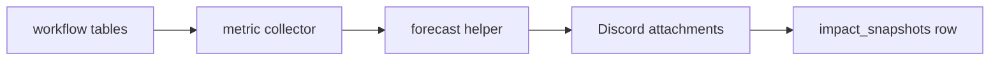
```mermaid
flowchart LR
  S1["workflow tables"]
  S2["metric collector"]
  S3["forecast helper"]
  S4["Discord attachments"]
  S5["impact_snapshots row"]
  S1 --> S2
  S2 --> S3
  S3 --> S4
  S4 --> S5
```

> The report channel gives you durable evidence files; the database row keeps a bot-side history.

## 43. Server Icon Rotation Code Walkthrough

Server icon rotation is a good example of making a visually simple feature reliable. The feature needs config validation, URL cleaning, mode selection, interval enforcement, download checks, state persistence, and commands for manual control.

#### Icon config normalization (utils/server_icons.py:75-100)

```python
  75: def ensure_server_icon_config(config) -> dict:
  76:     background = config.data.setdefault("background", {})
  77:     rotation = background.setdefault("server_icon_rotation", {})
  78:     rotation.setdefault(
  79:         "_comment",
  80:         "Rotates the server icon from configured image URLs. mode is disabled, linear, or random.",
  81:     )
  82:     rotation["mode"] = normalize_server_icon_mode(rotation.get("mode", "disabled"))
  83:     try:
  84:         rotation["interval_seconds"] = max(300, int(rotation.get("interval_seconds", 86400) or 86400))
  85:     except Exception:
  86:         rotation["interval_seconds"] = 86400
  87:     rotation["urls"] = clean_icon_urls(rotation.get("urls", []))
  88:     rotation["current_index"] = parse_server_icon_index(rotation.get("current_index", -1), len(rotation["urls"]))
  89:     current_url = str(rotation.get("current_url", "") or "").strip()
  90:     rotation["current_url"] = current_url if current_url in rotation["urls"] else ""
  91:     try:
  92:         rotation["last_changed_ts"] = max(0, int(rotation.get("last_changed_ts", 0) or 0))
  93:     except Exception:
  94:         rotation["last_changed_ts"] = 0
  95:     rotation["last_error"] = str(rotation.get("last_error", "") or "")[:500]
  96:     try:
  97:         rotation["last_error_ts"] = max(0, int(rotation.get("last_error_ts", 0) or 0))
  98:     except Exception:
  99:         rotation["last_error_ts"] = 0
 100:     return rotation
```

#### Automatic icon rotation loop (cogs/Background.py:1112-1134)

```python
1112:     async def rotate_server_icon(self):
1113:         if not self._server_icon_rotation_enabled():
1114:             return
1115:         allowed = self.bot.config.get_int("guild", "allowed_guild_id")
1116:         guild = self.bot.get_guild(allowed) if allowed else None
1117:         if guild is None:
1118:             return
1119:
1120:         cfg = ensure_server_icon_config(self.bot.config)
1121:         interval = self._server_icon_interval()
1122:         now_ts = int(time.time())
1123:         last_changed = int(cfg.get("last_changed_ts", 0) or 0)
1124:         if last_changed and now_ts - last_changed < interval:
1125:             return
1126:         last_error_ts = int(cfg.get("last_error_ts", 0) or 0)
1127:         if last_error_ts:
1128:             failure_backoff = max(900, min(interval, 3600))
1129:             if now_ts - last_error_ts < failure_backoff:
1130:                 return
1131:
1132:         ok, message = await self.rotate_server_icon_once(guild)
1133:         if not ok:
1134:             await log_error(self.bot, f"Server icon rotation skipped: {message}")
```

#### Server icon mode command (cogs/Commands.py:2239-2266)

```python
2239:     async def server_icon_mode(
2240:         self,
2241:         ctx: discord.ApplicationContext,
2242:         mode: discord.Option(
2243:             str,
2244:             "Rotation mode to use",
2245:             choices=[
2246:                 discord.OptionChoice("Random", "random"),
2247:                 discord.OptionChoice("Linear", "linear"),
2248:                 discord.OptionChoice("Disabled", "disabled"),
2249:             ],
2250:         ),
2251:     ):
2252:         if not self._in_allowed_guild(ctx):
2253:             return await ctx.respond("Wrong server.", ephemeral=True)
2254:         await self._defer(ctx, ephemeral=True)
2255:         if not await self._is_admin_ctx(ctx):
2256:             return await ctx.respond("You don't have permission to use this.", ephemeral=True)
2257:
2258:         raw_mode = str(mode or "").strip().casefold()
2259:         if raw_mode not in VALID_SERVER_ICON_MODES:
2260:             return await ctx.respond("Mode must be `random`, `linear`, or `disabled`.", ephemeral=True)
2261:         async with self._server_icon_operation_lock(), self._config_write_lock():
2262:             cfg = ensure_server_icon_config(self.bot.config)
2263:             cfg["mode"] = raw_mode
2264:             if not await self._save_server_icon_config(ctx, "server_icon_mode_updated", f"mode={raw_mode}"):
2265:                 return
2266:         await ctx.respond(f"Server icon rotation mode is now `{raw_mode}`.", ephemeral=True)
```

The current_index and current_url fields prevent linear rotation from getting stuck and help the bot know what it last tried. The interval is normalized to at least five minutes to respect Discord rate limits and avoid accidental rapid icon changes.

## 44. Durable Operations Platform 3 22

Version 3.22 turns reliability from a collection of local fixes into a shared platform. The request, ticket, tracking, release, summary, and support systems still own their business rules, but background supervision, Discord delivery, workflow tracing, schema validation, health history, retention, and recovery drills now have central owners. This reduces duplicated recovery code and makes failures visible as one connected incident.

#### The New Runtime Shape

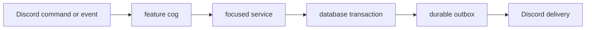
```mermaid
flowchart LR
  S1["Discord command or event"]
  S2["feature cog"]
  S3["focused service"]
  S4["database transaction"]
  S5["durable outbox"]
  S6["Discord delivery"]
  S1 --> S2
  S2 --> S3
  S3 --> S4
  S4 --> S5
  S5 --> S6
```

> The database commit defines the durable workflow result. Discord is then updated from a retryable queue instead of being the only record that something happened.

### Why The Outbox Exists

A direct channel.send followed by a database update has an unavoidable failure window. If Discord accepts the message and Turso fails before the second write, the bot may send the same result again after restart. If the database changes first and Discord fails, the workflow looks complete while the user never receives the result. The transactional outbox closes most of this gap by writing the business result and the delivery intent in one transaction.

#### Durable action creation and idempotency (utils/outbox.py:37-78)

```python
  37:     async def enqueue(
  38:         self,
  39:         action_type: str,
  40:         *,
  41:         payload: dict[str, Any] | None = None,
  42:         guild_id: int = 0,
  43:         channel_id: int = 0,
  44:         user_id: int = 0,
  45:         message_id: int = 0,
  46:         correlation_id: str = "",
  47:         idempotency_key: str = "",
  48:     ) -> int:
  49:         action = str(action_type).strip().casefold()
  50:         if action not in SUPPORTED_ACTIONS:
  51:             raise ValueError(f"unsupported outbox action: {action}")
  52:         correlation = str(correlation_id or new_correlation_id("outbox"))
  53:         key = str(idempotency_key or f"{correlation}:{action}")[:180]
  54:         now = int(time.time())
  55:         await self.bot.db.execute(
  56:             "INSERT OR IGNORE INTO discord_outbox(correlation_id,idempotency_key,action_type,guild_id,channel_id,user_id,message_id,payload_json,status,attempts,next_attempt_ts,created_ts,updated_ts) "
  57:             "VALUES(?,?,?,?,?,?,?,?,?,?,?,?,?)",
  58:             (
  59:                 correlation,
  60:                 key,
  61:                 action,
  62:                 int(guild_id or 0),
  63:                 int(channel_id or 0),
  64:                 int(user_id or 0),
  65:                 int(message_id or 0),
  66:                 json.dumps(payload or {}, separators=(",", ":"), ensure_ascii=False),
  67:                 "pending",
  68:                 0,
  69:                 now,
  70:                 now,
  71:                 now,
  72:             ),
  73:         )
  74:         row = await self.bot.db.fetchone(
  75:             "SELECT id FROM discord_outbox WHERE idempotency_key=?",
  76:             (key,),
  77:         )
  78:         return int(row["id"] or 0) if row else 0
```

#### Atomic claim, receipts, and delivered state excerpt (utils/outbox.py:118-193)

```python
 118:     async def _process_row(self, row) -> str:
 119:         outbox_id = int(row["id"])
 120:         source = str(row["status"])
 121:         OUTBOX_STATES.require(source, "processing")
 122:         now = int(time.time())
 123:         claimed_count = await self.bot.db.execute_affected(
 124:             "UPDATE discord_outbox SET status='processing',attempts=attempts+1,updated_ts=? "
 125:             "WHERE id=? AND status=?",
 126:             (now, outbox_id, source),
 127:         )
 128:         if claimed_count != 1:
 129:             return "retried"
 130:         claimed = await self.bot.db.fetchone(
 131:             "SELECT * FROM discord_outbox WHERE id=? AND status='processing'",
 132:             (outbox_id,),
 133:         )
 134:         if claimed is None:
 135:             return "retried"
 136:         attempts = int(claimed["attempts"] or 1)
 137:         try:
 138:             if outbox_id in self._delivery_receipts:
 139:                 delivered_message_id = self._delivery_receipts[outbox_id]
 140:             else:
 141:                 delivered_message_id = await asyncio.wait_for(self._deliver(claimed), timeout=45)
 142:                 self._delivery_receipts[outbox_id] = int(delivered_message_id or 0)
 143:         except Exception as exc:
 144:             terminal = self._terminal_failure(exc) or attempts >= self.max_attempts
 145:             target = "dead" if terminal else "pending"
 146:             OUTBOX_STATES.require("processing", target)
 147:             delay = 0 if terminal else min(3600, 5 * (2 ** min(attempts - 1, 9)))
 148:             await self.bot.db.execute(
 149:                 "UPDATE discord_outbox SET status=?,next_attempt_ts=?,updated_ts=?,last_error=? WHERE id=?",
 150:                 (
 151:                     target,
 152:                     int(time.time()) + delay,
 153:                     int(time.time()),
 154:                     f"{type(exc).__name__}: {exc}"[:1000],
 155:                     outbox_id,
 156:                 ),
 157:             )
 158:             await record_workflow_event(
 159:                 self.bot.db,
 160:                 workflow_type="discord_outbox",
 161:                 entity_id=str(outbox_id),
 162:                 event=target,
 163:                 correlation_id=str(claimed["correlation_id"] or ""),
 164:                 guild_id=int(claimed["guild_id"] or 0),
 165:                 payload={
 166:                     "action": claimed["action_type"],
 167:                     "attempts": attempts,
 168:                     "error": str(exc)[:300],
 169:                 },
 170:             )
 171:             return "dead" if terminal else "retried"
 172:         OUTBOX_STATES.require("processing", "delivered")
 173:         await self.bot.db.execute(
 174:             "UPDATE discord_outbox SET status='delivered',delivered_ts=?,updated_ts=?,"
 175:             "delivered_message_id=?,last_error=NULL WHERE id=?",
 176:             (
 177:                 int(time.time()),
 178:                 int(time.time()),
 179:                 int(delivered_message_id or 0) or None,
 180:                 outbox_id,
 181:             ),
 182:         )
 183:         self._delivery_receipts.pop(outbox_id, None)
 184:         await record_workflow_event(
 185:             self.bot.db,
 186:             workflow_type="discord_outbox",
 187:             entity_id=str(outbox_id),
 188:             event="delivered",
 189:             correlation_id=str(claimed["correlation_id"] or ""),
 190:             guild_id=int(claimed["guild_id"] or 0),
 191:             payload={"action": claimed["action_type"], "attempts": attempts},
 192:         )
 193:         return "delivered"
```

| Outbox State | Meaning | Recovery Rule |
| --- | --- | --- |
| pending | Ready to be claimed by a worker. | A worker atomically changes exactly one matching row to processing. |
| processing | A worker owns this attempt. | Startup and runtime recover abandoned claims after a bounded lease. |
| delivered | Discord accepted the operation. | The Discord message ID is stored when one exists. |
| dead | The error is permanent or attempts are exhausted. | The dashboard exposes it for explicit retry or repair. |

#### Simplified transaction boundary with commentary

```python
# 1. Store the irreversible business decision.
statements = [
    ("UPDATE level_request_submissions SET status='reviewed' WHERE request_message_id=?", (message_id,)),

    # 2. Store what Discord must receive in the SAME transaction.
    #    The unique idempotency key prevents a second queue row for this result.
    ("INSERT OR IGNORE INTO discord_outbox(...) VALUES(...)", outbox_values),
]
await db.execute_transaction(statements, retry_safe=True)

# 3. A separate worker performs Discord I/O. A network failure no longer
#    erases the review decision and can be retried after a restart.
```

### Supervising Background Work

A task that exists is not necessarily a healthy task. asyncio tasks can finish after an uncaught exception, while the process and slash commands stay online. OperationsCog inventories the expected loops in every cog, recognizes when optional work is deliberately disabled, records state changes, and asks each affected cog to start its work again.

#### Task inventory and restart decision (cogs/Operations.py:216-252)

```python
 216:     async def restart_stopped_tasks(self, *, force: bool = False) -> dict[str, str]:
 217:         affected_cogs: set[str] = set()
 218:         before: dict[str, str] = {}
 219:         cancelled_tasks: list[asyncio.Task] = []
 220:         for label, cog_name, attr in self._external_task_specs():
 221:             cog = self.bot.get_cog(cog_name)
 222:             if cog is not None and not self._task_expected(label, cog):
 223:                 before[label] = "disabled"
 224:                 continue
 225:             value = getattr(cog, attr, None) if cog else None
 226:             state = self._task_state(value)
 227:             before[label] = state
 228:             if cog is not None and (force or state not in {"running", "unknown"}):
 229:                 affected_cogs.add(cog_name)
 230:             if force and value is not None:
 231:                 cancel = getattr(value, "cancel", None)
 232:                 if callable(cancel):
 233:                     cancel()
 234:                     actual_task = value if isinstance(value, asyncio.Task) else getattr(value, "get_task", lambda: None)()
 235:                     if actual_task is not None:
 236:                         cancelled_tasks.append(actual_task)
 237:         if cancelled_tasks:
 238:             await asyncio.gather(*cancelled_tasks, return_exceptions=True)
 239:         if force:
 240:             await asyncio.sleep(0)
 241:         for cog_name in sorted(affected_cogs):
 242:             cog = self.bot.get_cog(cog_name)
 243:             start = getattr(cog, "start_background", None)
 244:             if callable(start):
 245:                 try:
 246:                     await start_cog_background(self.bot, cog_name)
 247:                 except Exception as exc:
 248:                     await log_error(
 249:                         self.bot,
 250:                         f"Task supervisor could not restart {cog_name}: {exc!r}",
 251:                     )
 252:         return before
```

#### Independent supervisor and timeline (cogs/Operations.py:273-324)

```python
 273:     async def _supervisor_loop(self) -> None:
 274:         while not self.bot.is_closed():
 275:             try:
 276:                 changed: list[tuple[str, str, str]] = []
 277:                 for label, cog_name, attr in self._external_task_specs():
 278:                     cog = self.bot.get_cog(cog_name)
 279:                     if cog is not None and not self._task_expected(label, cog):
 280:                         state = "disabled"
 281:                     else:
 282:                         state = self._task_state(
 283:                             getattr(cog, attr, None) if cog else None
 284:                         )
 285:                     previous = self._task_states.get(label)
 286:                     self._task_states[label] = state
 287:                     if previous is not None and state != previous:
 288:                         changed.append((label, previous, state))
 289:                 failed = [
 290:                     label
 291:                     for label, state in self._task_states.items()
 292:                     if state.startswith(("failed", "stopped", "missing"))
 293:                 ]
 294:                 initializing = hasattr(self.bot, "_runtime_initialized") and not self.bot._runtime_initialized
 295:                 if failed and not initializing:
 296:                     restart = self._tasks.get("restarts")
 297:                     if restart is None or restart.done():
 298:                         self._tasks["restarts"] = asyncio.create_task(self.restart_stopped_tasks(), name="avenue-guard:restarts")
 299:                 internal_factories = {
 300:                     "outbox": self._outbox_loop,
 301:                     "health": self._health_loop,
 302:                     "maintenance": self._maintenance_loop,
 303:                     "watchdog": self._watchdog_loop,
 304:                 }
 305:                 for name, factory in internal_factories.items():
 306:                     task = self._tasks.get(name)
 307:                     if task is None or task.done():
 308:                         if task is not None and not task.cancelled() and task.exception() is not None:
 309:                             await log_error(self.bot, f"Operations {name} task failed; restarting: {task.exception()!r}")
 310:                         self._tasks[name] = asyncio.create_task(
 311:                             factory(),
 312:                             name=f"avenue-guard:{name}",
 313:                         )
 314:                         changed.append((f"operations.{name}", "stopped", "running"))
 315:                 timeline = self._tasks.get("timeline")
 316:                 if changed and (timeline is None or timeline.done()):
 317:                     self._tasks["timeline"] = asyncio.create_task(self._record_task_changes(changed), name="avenue-guard:timeline")
 318:             except asyncio.CancelledError:
 319:                 raise
 320:             except Exception as exc:
 321:                 await log_error(self.bot, f"Background task supervisor error: {exc!r}")
 322:             await asyncio.sleep(
 323:                 operations_settings(self.bot.config.data).supervisor_interval_seconds
 324:             )
```

> **Important distinction:** Disabled is a valid configured state. Stopped or failed is an operational problem. Treating both as the same would make the supervisor repeatedly start features that the owner intentionally turned off.

### Correlation IDs And State Machines

Every slash-command execution can receive a correlation ID stored in a ContextVar. ContextVar is an asyncio-aware context slot: concurrent commands can each see their own ID without passing it through every helper parameter. Long workflows also persist that ID in their request, ticket, help, scheduled-opening, outbox, event, and incident rows.

#### Workflow context and transition guards (utils/workflows.py:12-85)

```python
  12: _correlation_id: ContextVar[str] = ContextVar("avenue_guard_correlation_id", default="")
  13:
  14:
  15: def new_correlation_id(prefix: str = "wf") -> str:
  16:     safe_prefix = (
  17:         re.sub(r"[^a-z0-9]+", "-", str(prefix).casefold()).strip("-")[:12] or "wf"
  18:     )
  19:     return f"{safe_prefix}-{int(time.time()):x}-{secrets.token_hex(4)}"
  20:
  21:
  22: def current_correlation_id() -> str:
  23:     return _correlation_id.get("")
  24:
  25:
  26: def begin_workflow_context(correlation_id: str = "", *, prefix: str = "wf") -> str:
  27:     """Attach a correlation ID to the current asyncio task until it completes."""
  28:     value = str(correlation_id or new_correlation_id(prefix))
  29:     _correlation_id.set(value)
  30:     return value
  31:
  32:
  33: def clear_workflow_context() -> None:
  34:     _correlation_id.set("")
  35:
  36:
  37: @contextmanager
  38: def workflow_context(correlation_id: str = "", *, prefix: str = "wf"):
  39:     value = str(correlation_id or new_correlation_id(prefix))
  40:     token = _correlation_id.set(value)
  41:     try:
  42:         yield value
  43:     finally:
  44:         _correlation_id.reset(token)
  45:
  46:
  47: class InvalidWorkflowTransition(ValueError):
  48:     pass
  49:
  50:
  51: class WorkflowStateMachine:
  52:     """Small explicit state-transition guard used by durable workflows."""
  53:
  54:     def __init__(self, transitions: dict[str, Iterable[str]]):
  55:         self.transitions = {
  56:             str(source): {str(target) for target in targets}
  57:             for source, targets in transitions.items()
  58:         }
  59:
  60:     def allows(self, source: str, target: str) -> bool:
  61:         return str(target) in self.transitions.get(str(source), set())
  62:
  63:     def require(self, source: str, target: str) -> None:
  64:         if not self.allows(source, target):
  65:             raise InvalidWorkflowTransition(
  66:                 f"invalid workflow transition: {source!r} -> {target!r}"
  67:             )
  68:
  69:
  70: OUTBOX_STATES = WorkflowStateMachine(
  71:     {
  72:         "pending": ("processing", "dead"),
  73:         "processing": ("delivered", "pending", "failed", "dead"),
  74:         "failed": ("processing", "pending", "dead"),
  75:         "delivered": (),
  76:         "dead": ("pending",),
  77:     }
  78: )
  79:
  80: REQUEST_REVIEW_STATES = WorkflowStateMachine(
  81:     {
  82:         "pending": ("reviewed",),
  83:         "reviewed": (),
  84:     }
  85: )
```

#### Persistent workflow timeline event (utils/workflows.py:88-116)

```python
  88: async def record_workflow_event(
  89:     db,
  90:     *,
  91:     workflow_type: str,
  92:     event: str,
  93:     entity_id: str = "",
  94:     correlation_id: str = "",
  95:     guild_id: int = 0,
  96:     actor_id: int = 0,
  97:     payload: dict[str, Any] | None = None,
  98: ) -> str:
  99:     correlation = str(
 100:         correlation_id or current_correlation_id() or new_correlation_id(workflow_type)
 101:     )
 102:     await db.execute(
 103:         "INSERT INTO workflow_events(correlation_id,workflow_type,entity_id,event,guild_id,actor_id,payload_json,created_ts) "
 104:         "VALUES(?,?,?,?,?,?,?,?)",
 105:         (
 106:             correlation,
 107:             str(workflow_type)[:80],
 108:             str(entity_id)[:120],
 109:             str(event)[:100],
 110:             int(guild_id or 0),
 111:             int(actor_id or 0),
 112:             json.dumps(payload or {}, separators=(",", ":"), ensure_ascii=False),
 113:             int(time.time()),
 114:         ),
 115:     )
 116:     return correlation
```

The state machine is deliberately small. It does not execute workflows; it rejects illegal transitions such as delivered back to processing or a reviewed request back to pending. This makes the lifecycle explicit while leaving database and Discord work in the modules that own it.

### Typed Configuration And Schema Contracts

The original Config object remains the convenient runtime reader, but config_schema.py now validates the structure before staff discovers a typo through a broken button. It verifies IDs, lists, operation bounds, notification modes, request-template field shapes, colors, and which placeholders each embed is allowed to use. Runtime overrides trigger validation again.

#### Versioned config contracts (utils/config_schema.py:7-74)

```python
   7: CONFIG_SCHEMA_VERSION = 2
   8: RUNTIME_SCHEMA_VERSION = 2
   9: EMBED_SCHEMA_VERSION = 2
  10: DATABASE_SCHEMA_VERSION = 8
  11:
  12:
  13: @dataclass(frozen=True)
  14: class ConfigIssue:
  15:     path: str
  16:     message: str
  17:     severity: str = "error"
  18:
  19:     def render(self) -> str:
  20:         return f"{self.path}: {self.message}"
  21:
  22:
  23: @dataclass(frozen=True)
  24: class OperationsSettings:
  25:     supervisor_interval_seconds: int = 60
  26:     health_sample_interval_seconds: int = 300
  27:     outbox_poll_seconds: int = 5
  28:     permission_scan_interval_seconds: int = 1800
  29:     smoke_test_delay_seconds: int = 30
  30:     monthly_report_channel_id: int = 0
  31:     monthly_report_day: int = 1
  32:     monthly_report_hour: int = 9
  33:     retention_days: dict[str, int] = field(default_factory=dict)
  34:
  35:
  36: def _integer(value: Any, default: int, minimum: int, maximum: int) -> int:
  37:     try:
  38:         parsed = int(value)
  39:     except (TypeError, ValueError):
  40:         return default
  41:     return max(minimum, min(maximum, parsed))
  42:
  43:
  44: def operations_settings(data: dict[str, Any]) -> OperationsSettings:
  45:     raw = data.get("operations") if isinstance(data.get("operations"), dict) else {}
  46:     retention = (
  47:         raw.get("retention_days") if isinstance(raw.get("retention_days"), dict) else {}
  48:     )
  49:     normalized_retention = {
  50:         str(table): _integer(days, 365, 1, 3650)
  51:         for table, days in retention.items()
  52:         if str(table)
  53:     }
  54:     return OperationsSettings(
  55:         supervisor_interval_seconds=_integer(
  56:             raw.get("supervisor_interval_seconds"), 60, 15, 3600
  57:         ),
  58:         health_sample_interval_seconds=_integer(
  59:             raw.get("health_sample_interval_seconds"), 300, 30, 86400
  60:         ),
  61:         outbox_poll_seconds=_integer(raw.get("outbox_poll_seconds"), 5, 1, 300),
  62:         permission_scan_interval_seconds=_integer(
  63:             raw.get("permission_scan_interval_seconds"), 1800, 60, 86400
  64:         ),
  65:         smoke_test_delay_seconds=_integer(
  66:             raw.get("smoke_test_delay_seconds"), 30, 0, 600
  67:         ),
  68:         monthly_report_channel_id=_integer(
  69:             raw.get("monthly_report_channel_id"), 0, 0, 2**63 - 1
  70:         ),
  71:         monthly_report_day=_integer(raw.get("monthly_report_day"), 1, 1, 28),
  72:         monthly_report_hour=_integer(raw.get("monthly_report_hour"), 9, 0, 23),
  73:         retention_days=normalized_retention,
  74:     )
```

#### Request template variable contract (utils/config_schema.py:95-177)

```python
  95: REQUEST_TEMPLATE_VARIABLES = {
  96:     "creators",
  97:     "duplicate_history_warning",
  98:     "edit_count",
  99:     "gd_info",
 100:     "level_id",
 101:     "level_name",
 102:     "level_showcase",
 103:     "level_validation_warning",
 104:     "notes",
 105:     "pending_color",
 106:     "request_type",
 107:     "request_type_label",
 108:     "requester_id",
 109:     "requester_mention",
 110:     "result",
 111:     "result_color",
 112:     "review",
 113:     "reviewer_mention",
 114:     "submitted_ago",
 115:     "wave_id",
 116:     "sla_indicator",
 117:     "sla_status",
 118:     "sla_hours",
 119:     "correlation_id",
 120:     "showcase",
 121:     "submitted_ts",
 122:     "edit_deadline",
 123:     "edit_deadline_ts",
 124:     "level_validation_sources",
 125:     "level_validation_checked",
 126:     "level_validation_refresh",
 127:     "level_exists",
 128:     "level_rated",
 129:     "level_requires_showcase",
 130:     "gd_level_name",
 131:     "gd_creator",
 132:     "gd_difficulty",
 133:     "gd_length",
 134:     "gd_stars",
 135:     "gd_rated",
 136:     "gd_platformer",
 137:     "reviewer_id",
 138:     "send_type",
 139:     "send_type_label",
 140:     "queue_status",
 141:     "review_system_version",
 142: }
 143:
 144: REQUEST_BUTTON_VARIABLES = {
 145:     "state",
 146:     "wave_id",
 147:     "submitted_count",
 148:     "request_limit",
 149:     "close_ts",
 150:     "request_type",
 151:     "request_type_label",
 152:     "request_type_line",
 153: }
 154:
 155: WAVE_SUMMARY_VARIABLES = {
 156:     "wave_id",
 157:     "request_type",
 158:     "request_type_label",
 159:     "total_requests",
 160:     "reviewed_count",
 161:     "sent_count",
 162:     "not_sent_count",
 163:     "rejected_count",
 164:     "other_count",
 165:     "level_doesnt_exist_count",
 166:     "stolen_level_count",
 167:     "already_rated_count",
 168:     "pending_count",
 169:     "left_to_review",
 170:     "reviewed_percent",
 171:     "pending_percent",
 172:     "sent_percent",
 173:     "not_sent_percent",
 174:     "sent_percent_reviewed",
 175:     "not_sent_percent_reviewed",
 176:     "reviewer_stats",
 177:     "summary_color",
```

| Contract | Current Version | What It Protects |
| --- | --- | --- |
| Config | 2 | The checked-in JSON structure and supported option types. |
| Runtime | 2 | Persisted settings written by slash commands and maintenance controls. |
| Embed templates | 2 | Allowed request placeholders and Discord field shapes. |
| Database | 5 | Tables and columns expected by the deployed code, including incident batch deduplication. |

### Historical Health Rather Than A Snapshot

The dashboard still answers what is happening now, but OperationsCog also stores what happened over time. A sample contains gateway latency, a measured database probe, internal database health, per-operation query timing, command errors, task state, and provider latency. Provider samples make it possible to distinguish a slow external level API from a slow database or Discord connection.

#### Persistent runtime and provider samples (cogs/Operations.py:334-397)

```python
 334:     async def collect_health_sample(self) -> dict[str, Any]:
 335:         started = time.perf_counter()
 336:         db_ok = True
 337:         try:
 338:             db_ok = await self.bot.db.fetchone_local("SELECT 1 AS ready") is not None
 339:         except Exception:
 340:             db_ok = False
 341:         db_probe_ms = round((time.perf_counter() - started) * 1000, 2)
 342:         background = self.bot.get_cog("BackgroundCog")
 343:         stats = getattr(background, "stats", None)
 344:         request_cog = self.bot.get_cog("RequestLevelsCog")
 345:         providers = (
 346:             request_cog.validation_provider_snapshot()
 347:             if request_cog is not None
 348:             and hasattr(request_cog, "validation_provider_snapshot")
 349:             else {}
 350:         )
 351:         payload = {
 352:             "gateway_latency_ms": round(
 353:                 float(getattr(self.bot, "latency", 0.0) or 0.0) * 1000, 2
 354:             ),
 355:             "db_ok": db_ok,
 356:             "db_probe_ms": db_probe_ms,
 357:             "db": self.bot.db.health_snapshot(),
 358:             "query_timing": self.bot.db.query_timing_snapshot(reset=True),
 359:             "tasks": self.task_snapshot(),
 360:             "daily_commands": int(getattr(stats, "commands", 0) or 0),
 361:             "daily_command_errors": int(getattr(stats, "command_errors", 0) or 0),
 362:             "providers": providers,
 363:             "sample_ts": int(time.time()),
 364:         }
 365:         guild_id = int(
 366:             self.bot.config.get_int("guild", "allowed_guild_id", default=0) or 0
 367:         )
 368:         samples = [(
 369:                 guild_id,
 370:                 payload["sample_ts"],
 371:                 "runtime",
 372:                 db_probe_ms,
 373:                 json.dumps(payload, separators=(",", ":")),
 374:             )]
 375:         for provider, provider_payload in providers.items():
 376:             samples.append((
 377:                     guild_id,
 378:                     payload["sample_ts"],
 379:                     f"provider:{provider}",
 380:                     float(provider_payload.get("average_latency_ms", 0) or 0),
 381:                     json.dumps(provider_payload, separators=(",", ":")),
 382:                 ))
 383:         placeholders = ",".join("(?,?,?,?,?)" for _ in samples)
 384:         payload["persisted"] = False
 385:         self._last_health_sample = payload
 386:         try:
 387:             await self.bot.db.execute_transaction([(
 388:                 f"INSERT INTO health_metrics(guild_id,sample_ts,metric_type,value,payload_json) VALUES {placeholders}",  # nosec B608
 389:                 tuple(value for sample in samples for value in sample),
 390:             )], queue_timeout=0.25)
 391:         except DatabaseBusyError:
 392:             self._deferred_health_samples += 1
 393:             payload["deferred_samples"] = self._deferred_health_samples
 394:             return payload
 395:         payload["persisted"] = True
 396:         payload["deferred_samples"] = self._deferred_health_samples
 397:         return payload
```

Error logging follows the same principle. The message text is normalized and hashed into a fingerprint. Repeated failures update one incident with an occurrence count and latest correlation ID instead of behaving like unrelated errors. Permission drift is stored similarly, including when a previously missing permission is resolved.

### Retention, Restore Drills, And Monthly Impact

#### Allowlisted retention (cogs/Operations.py:433-454)

```python
 433:     async def run_retention(self) -> dict[str, int]:
 434:         settings = operations_settings(self.bot.config.data)
 435:         now = int(time.time())
 436:         removed: dict[str, int] = {}
 437:         for table, days in settings.retention_days.items():
 438:             target = RETENTION_TARGETS.get(table)
 439:             if target is None:
 440:                 continue
 441:             column, condition = target
 442:             cutoff = now - int(days) * 86400
 443:             # Identifiers and predicates come only from RETENTION_TARGETS.
 444:             removed[table] = await self.bot.db.execute_affected(
 445:                 f"DELETE FROM {table} WHERE {column}<? {condition}",  # nosec B608
 446:                 (cutoff,),
 447:             )
 448:         await self.bot.db.execute(
 449:             "UPDATE error_incidents SET status='resolved',resolved_ts=? WHERE status='open' AND last_seen_ts<?",
 450:             (now, now - 7 * 86400),
 451:         )
 452:         self._last_retention_run = now
 453:         await self._persist_maintenance_timestamps()
 454:         return removed
```

#### Non-destructive SQLite restore drill (services/backups.py:22-82)

```python
  22: async def run_restore_drill(
  23:     db, *, guild_id: int = 0, trigger: str = "scheduled"
  24: ) -> dict[str, object]:
  25:     started = time.monotonic()
  26:     timestamp = int(time.time())
  27:     outcome = "passed"
  28:     error = ""
  29:     table_count = 0
  30:     missing: list[str] = []
  31:     with tempfile.TemporaryDirectory(prefix="avenue-guard-drill-") as directory:
  32:         target = Path(directory) / "restore-drill.sqlite3"
  33:         try:
  34:             size_bytes = await db.backup_to(target)
  35:
  36:             def _inspect() -> tuple[int, list[str]]:
  37:                 with closing(
  38:                     sqlite3.connect(f"file:{target}?mode=ro", uri=True)
  39:                 ) as connection:
  40:                     integrity = connection.execute("PRAGMA integrity_check").fetchone()
  41:                     if not integrity or str(integrity[0]).casefold() != "ok":
  42:                         raise ValueError(f"integrity check returned {integrity!r}")
  43:                     rows = connection.execute(
  44:                         "SELECT name FROM sqlite_master WHERE type='table'"
  45:                     ).fetchall()
  46:                     tables = {str(row[0]) for row in rows}
  47:                     return len(tables), sorted(CORE_TABLES - tables)
  48:
  49:             import asyncio
  50:
  51:             table_count, missing = await asyncio.to_thread(_inspect)
  52:             if missing:
  53:                 raise ValueError(f"missing core tables: {', '.join(missing)}")
  54:         except Exception as exc:
  55:             outcome = "failed"
  56:             error = f"{type(exc).__name__}: {exc}"[:1000]
  57:             size_bytes = int(target.stat().st_size) if target.exists() else 0
  58:
  59:     duration_ms = int((time.monotonic() - started) * 1000)
  60:     await db.execute(
  61:         "INSERT INTO restore_drills(guild_id,drill_ts,status,duration_ms,size_bytes,table_count,missing_tables_json,error_text,trigger) "
  62:         "VALUES(?,?,?,?,?,?,?,?,?)",
  63:         (
  64:             guild_id,
  65:             timestamp,
  66:             outcome,
  67:             duration_ms,
  68:             size_bytes,
  69:             table_count,
  70:             json.dumps(missing, separators=(",", ":")),
  71:             error,
  72:             trigger,
  73:         ),
  74:     )
  75:     return {
  76:         "status": outcome,
  77:         "duration_ms": duration_ms,
  78:         "size_bytes": size_bytes,
  79:         "table_count": table_count,
  80:         "missing_tables": missing,
  81:         "error": error,
  82:     }
```

Retention is allowlisted, not arbitrary SQL supplied by a command. Only operational history tables can be trimmed, each with a bounded number of days. Business records such as tickets, requests, reviews, and tracking history are outside that map. A restore drill creates a temporary backup, opens it read-only, runs PRAGMA integrity_check, verifies core tables, stores the result, and then deletes the temporary directory without replacing production data.

#### Idempotent monthly impact delivery excerpt (cogs/Operations.py:466-515)

```python
 466:     async def generate_monthly_report(self, *, force: bool = False) -> bool:
 467:         settings = operations_settings(self.bot.config.data)
 468:         now = now_madrid()
 469:         month_key = (now.replace(day=1) - timedelta(days=1)).strftime("%Y-%m")
 470:         guild_id = int(
 471:             self.bot.config.get_int("guild", "allowed_guild_id", default=0) or 0
 472:         )
 473:         guild = self.bot.get_guild(guild_id)
 474:         commands_cog = self.bot.get_cog("CommandsCog")
 475:         if guild is None or commands_cog is None:
 476:             return False
 477:         exists = await self.bot.db.fetchone(
 478:             "SELECT status FROM monthly_impact_reports WHERE guild_id=? AND month_key=?",
 479:             (guild_id, month_key),
 480:         )
 481:         if exists and not force:
 482:             return False
 483:         metrics = await commands_cog._collect_impact_metrics(guild, 0)
 484:         embed = commands_cog._impact_report_embed(metrics)
 485:         channel_id = int(
 486:             settings.monthly_report_channel_id
 487:             or self.bot.config.get_int("impact", "report_channel_id", default=0)
 488:             or 0
 489:         )
 490:         if not channel_id:
 491:             return False
 492:         correlation = new_correlation_id("impact")
 493:         await self.bot.outbox.enqueue(
 494:             "send_channel",
 495:             guild_id=guild_id,
 496:             channel_id=channel_id,
 497:             correlation_id=correlation,
 498:             idempotency_key=f"monthly-impact:{guild_id}:{month_key}",
 499:             payload={
 500:                 "content": f"Avenue Guard monthly impact report for {month_key}",
 501:                 "embed": embed.to_dict(),
 502:             },
 503:         )
 504:         await self.bot.db.execute(
 505:             "INSERT OR REPLACE INTO monthly_impact_reports(guild_id,month_key,generated_ts,channel_id,payload_json,status) VALUES(?,?,?,?,?,?)",
 506:             (
 507:                 guild_id,
 508:                 month_key,
 509:                 int(time.time()),
 510:                 channel_id,
 511:                 json.dumps(metrics, separators=(",", ":")),
 512:                 "queued",
 513:             ),
 514:         )
 515:         return True
```

#### Monthly Impact Report Lifecycle

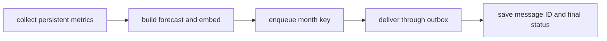
```mermaid
flowchart LR
  S1["collect persistent metrics"]
  S2["build forecast and embed"]
  S3["enqueue month key"]
  S4["deliver through outbox"]
  S5["save message ID and final status"]
  S1 --> S2
  S2 --> S3
  S3 --> S4
  S4 --> S5
```

> The guild and month form the idempotency key, so a restart during the scheduled window cannot create a second report for the same month.

### Request Review Improvements Built On The Platform

Request cards now calculate queue age from the original submitted timestamp and configurable thresholds. The displayed label can move from Fresh to Aging, Due soon, and Overdue without mutating the source timestamp. Reviewer rechecks bypass stale provider cache, save the refreshed evidence, and edit the same review card. Final-result notification preference is stored per user as channel, DM, both, or none. The result decision and its channel-delivery row are committed together, while any requested DM is queued with its own idempotency key.

#### Queue age and SLA calculation (services/request_reviews.py:18-55)

```python
  18: @dataclass(frozen=True)
  19: class RequestAge:
  20:     seconds: int
  21:     hours: float
  22:     label: str
  23:     indicator: str
  24:     status: str
  25:
  26:
  27: def request_age(
  28:     created_ts: Any, now_ts: int | None = None, thresholds: Iterable[int] = (12, 24, 48)
  29: ) -> RequestAge:
  30:     now = int(now_ts or time.time())
  31:     try:
  32:         seconds = max(0, now - int(created_ts or now))
  33:     except (TypeError, ValueError):
  34:         seconds = 0
  35:     hours = seconds / 3600
  36:     limits = sorted(max(1, int(value)) for value in thresholds)
  37:     while len(limits) < 3:
  38:         limits.append((limits[-1] if limits else 12) * 2)
  39:     if hours >= limits[2]:
  40:         status, indicator = "Overdue", "🔴"
  41:     elif hours >= limits[1]:
  42:         status, indicator = "Due soon", "🟠"
  43:     elif hours >= limits[0]:
  44:         status, indicator = "Aging", "🟡"
  45:     else:
  46:         status, indicator = "Fresh", "🟢"
  47:     if seconds < 60:
  48:         label = "just now"
  49:     elif seconds < 3600:
  50:         label = f"{seconds // 60}m ago"
  51:     elif seconds < 86400:
  52:         label = f"{seconds // 3600}h ago"
  53:     else:
  54:         label = f"{seconds // 86400}d ago"
  55:     return RequestAge(seconds, hours, label, indicator, status)
```

#### Wave comparison calculation (services/request_reviews.py:70-100)

```python
  70: def compare_waves(
  71:     current: dict[str, Any], previous: dict[str, Any] | None
  72: ) -> dict[str, str]:
  73:     if not previous:
  74:         return {
  75:             "wave_comparison": "No earlier wave is available yet.",
  76:             "request_delta": "n/a",
  77:             "sent_rate_delta": "n/a",
  78:         }
  79:     current_total = int(current.get("total_requests", 0) or 0)
  80:     previous_total = int(previous.get("total_requests", 0) or 0)
  81:     current_reviewed = int(current.get("reviewed_count", 0) or 0)
  82:     previous_reviewed = int(previous.get("reviewed_count", 0) or 0)
  83:     current_sent = int(current.get("sent_count", 0) or 0)
  84:     previous_sent = int(previous.get("sent_count", 0) or 0)
  85:     request_delta = current_total - previous_total
  86:     current_rate = current_sent / current_reviewed * 100 if current_reviewed else 0.0
  87:     previous_rate = (
  88:         previous_sent / previous_reviewed * 100 if previous_reviewed else 0.0
  89:     )
  90:     rate_delta = current_rate - previous_rate
  91:     direction = "+" if request_delta > 0 else ""
  92:     rate_direction = "+" if rate_delta > 0 else ""
  93:     return {
  94:         "request_delta": f"{direction}{request_delta}",
  95:         "sent_rate_delta": f"{rate_direction}{rate_delta:.1f} pp",
  96:         "wave_comparison": (
  97:             f"Requests: **{direction}{request_delta}** vs wave {previous.get('wave_id', '?')}\n"
  98:             f"Sent rate: **{rate_direction}{rate_delta:.1f} percentage points**"
  99:         ),
 100:     }
```

The wave summary combines total demand, reviewed and pending work, sent rate, structured non-sent reasons, per-reviewer throughput, average review time, and the delta from the previous wave. This makes the summary useful for staffing and policy decisions instead of being only a completion counter.

### Post Deployment Smoke Test

After a short configurable delay, the operations layer probes the database, confirms the configured guild, validates typed config, checks its outbox worker and request cog, compares schema versions, and inventories slash commands. This is an in-process release check, not a full staging environment. It catches incomplete deployments and startup wiring mistakes while the dashboard can still explain them.

#### Post-deployment smoke checks excerpt (cogs/Operations.py:577-646)

```python
 577:     async def _post_deploy_smoke_test(self) -> None:
 578:         delay = operations_settings(self.bot.config.data).smoke_test_delay_seconds
 579:         if delay:
 580:             await asyncio.sleep(delay)
 581:         checks: dict[str, bool] = {}
 582:         details: dict[str, str] = {}
 583:         try:
 584:             checks["database"] = bool(await self.bot.db.fetchone("SELECT 1 AS ready"))
 585:         except Exception as exc:
 586:             checks["database"] = False
 587:             details["database"] = f"{type(exc).__name__}: {exc}"[:300]
 588:         guild_id = int(
 589:             self.bot.config.get_int("guild", "allowed_guild_id", default=0) or 0
 590:         )
 591:         checks["guild"] = self.bot.get_guild(guild_id) is not None
 592:         checks["config"] = not any(
 593:             issue.severity == "error" for issue in self.bot.config.validation_issues
 594:         )
 595:         outbox_task = self._tasks.get("outbox")
 596:         checks["outbox"] = outbox_task is not None and not outbox_task.done()
 597:         checks["request_cog"] = self.bot.get_cog("RequestLevelsCog") is not None
 598:         try:
 599:             schema_rows = await self.bot.db.fetchall(
 600:                 "SELECT component,schema_version FROM schema_metadata"
 601:             )
 602:         except Exception as exc:
 603:             schema_rows = []
 604:             details["schema_versions"] = f"{type(exc).__name__}: {exc}"[:300]
 605:         schema_versions = {
 606:             str(row["component"]): int(row["schema_version"]) for row in schema_rows
 607:         }
 608:         expected_schemas = {
 609:             "database": DATABASE_SCHEMA_VERSION,
 610:             "config": CONFIG_SCHEMA_VERSION,
 611:             "runtime_settings": RUNTIME_SCHEMA_VERSION,
 612:             "embed_templates": EMBED_SCHEMA_VERSION,
 613:         }
 614:         checks["schema_versions"] = schema_versions == expected_schemas
 615:         if not checks["schema_versions"]:
 616:             details.setdefault("schema_versions", (
 617:                 f"expected={expected_schemas} actual={schema_versions}"
 618:             ))
 619:         command_count = sum(1 for _ in self.bot.walk_application_commands())
 620:         checks["slash_commands"] = command_count >= 17
 621:         details["slash_commands"] = str(command_count)
 622:         status = "passed" if all(checks.values()) else "failed"
 623:         correlation = new_correlation_id("deployment")
 624:         self._last_smoke_result = {
 625:             "status": status,
 626:             "checks": checks,
 627:             "details": details,
 628:             "correlation_id": correlation,
 629:             "ts": int(time.time()),
 630:         }
 631:         try:
 632:             await record_workflow_event(
 633:                 self.bot.db,
 634:                 workflow_type="deployment",
 635:                 entity_id=str(getattr(self.bot.user, "id", 0) or 0),
 636:                 event=f"smoke_test_{status}",
 637:                 correlation_id=correlation,
 638:                 guild_id=guild_id,
 639:                 payload={"checks": checks, "details": details},
 640:             )
 641:         except Exception as exc:
 642:             await log_error(self.bot, f"Smoke test history persistence deferred: {exc!r}")
 643:         if status == "failed":
 644:             failed = ", ".join(key for key, passed in checks.items() if not passed)
 645:             await log_error(
 646:                 self.bot, f"Post-deployment smoke test failed: {failed} [{correlation}]"
```

> **Mental model:** Cogs own Discord workflows. Services own reusable business rules. Utils own infrastructure. Turso owns durable truth. OperationsCog watches the watchers, and the outbox turns important Discord effects into recoverable work.

## 45. Runtime Isolation And Incident Recovery 3 22 1

The September 15 review found an important distinction: putting a native call in a thread does not prove it is safe for an asyncio application. The installed libSQL extension can retain Python's GIL during database work. Our local threaded-query experiment took about 0.402 seconds while a separate heartbeat paused for about 0.411 seconds. This demonstrates interpreter contention, not the exact length or sole cause of the production outage.

### Why Threads Were Not Enough

The GIL is Python's interpreter execution lock. asyncio normally cooperates by yielding control at await points. A thread future lets the coroutine yield, but the main interpreter still needs the GIL to resume any Python code. If a Rust extension retains that lock while waiting for a database result, the event loop cannot reliably run heartbeats, interaction responses, watchdogs, or error delivery. CPU cores alone do not solve this ownership problem.

#### The Shared Interpreter Failure

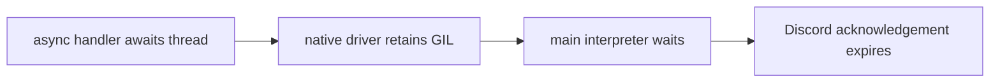
```mermaid
flowchart LR
  S1["async handler awaits thread"]
  S2["native driver retains GIL"]
  S3["main interpreter waits"]
  S4["Discord acknowledgement expires"]
  S1 --> S2
  S2 --> S3
  S3 --> S4
```

> An await is useful only if the code that must resume can actually acquire interpreter execution time.

### The Process Boundary

A worker process has a separate Python interpreter and its own GIL. IsolatedConnection starts that worker with multiprocessing spawn and gives it the path, remote URL, and token in memory. The parent waits on a pipe inside a thread; that wait does not retain the parent's interpreter lock. Only materialized SQL results cross the pipe. There is one primary worker connection, not a fleet of writers and not a silent switch to disposable local storage.

#### Worker operations and materialized result boundary (utils/libsql_worker.py:18-57)

```python
  18: def _worker_main(pipe, path: str, remote_url: str, token: str) -> None:
  19:     import libsql
  20:
  21:     connection = None
  22:     try:
  23:         while True:
  24:             request = pipe.recv()
  25:             action, args = request
  26:             try:
  27:                 if action == "open":
  28:                     options = {"sync_url": remote_url, "auth_token": token} if remote_url else {}
  29:                     connection = libsql.connect(path, **options)
  30:                     result = None
  31:                 elif action == "close":
  32:                     if connection is not None:
  33:                         connection.close()
  34:                     pipe.send((True, None))
  35:                     return
  36:                 elif connection is None:
  37:                     raise RuntimeError("database worker connection is not open")
  38:                 elif action in {"execute", "executescript"}:
  39:                     cursor = getattr(connection, action)(*args)
  40:                     description = getattr(cursor, "description", None)
  41:                     result = {
  42:                         "description": description,
  43:                         "rows": cursor.fetchall() if description else [],
  44:                         "rowcount": getattr(cursor, "rowcount", -1),
  45:                         "lastrowid": getattr(cursor, "lastrowid", None),
  46:                     }
  47:                 elif action in {"commit", "rollback", "sync"}:
  48:                     result = getattr(connection, action)()
  49:                 else:
  50:                     raise ValueError("unsupported database worker operation")
  51:                 pipe.send((True, result))
  52:             except Exception as exc:
  53:                 pipe.send((False, (type(exc).__name__, str(exc))))
  54:     except (EOFError, BrokenPipeError, OSError):
  55:         pass
  56:     finally:
  57:         pipe.close()
```

#### Bounded worker RPC (utils/libsql_worker.py:125-146)

```python
 125:     def _call(self, action: str, *args):
 126:         if not self.alive:
 127:             raise DatabaseWorkerError("Turso worker is unavailable; reconnect required")
 128:         remaining = min(self.timeout, self._deadline - time.monotonic())
 129:         if remaining <= 0:
 130:             self.terminate()
 131:             raise DatabaseWorkerTimeout("Turso worker timed out; operation completion is unknown")
 132:         try:
 133:             self._pipe.send((action, args))
 134:             if not self._pipe.poll(remaining):
 135:                 self.terminate()
 136:                 raise DatabaseWorkerTimeout("Turso worker timed out; operation completion is unknown")
 137:             successful, result = self._pipe.recv()
 138:         except (EOFError, BrokenPipeError, OSError) as exc:
 139:             self.terminate()
 140:             raise DatabaseWorkerError("Turso worker exited; operation completion is unknown") from exc
 141:         if not successful:
 142:             name, message = result
 143:             if name == "ValueError":
 144:                 raise ValueError(message)
 145:             raise DatabaseWorkerError(f"{name}: {message}")
 146:         return result
```

#### The Isolated Runtime

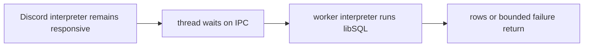
```mermaid
flowchart LR
  S1["Discord interpreter remains responsive"]
  S2["thread waits on IPC"]
  S3["worker interpreter runs libSQL"]
  S4["rows or bounded failure return"]
  S1 --> S2
  S2 --> S3
  S3 --> S4
```

> A worker can be terminated without killing the Discord event loop. Remote durability still depends on Turso.

### Deadlines And Cancellation Ownership

The queue has a ten-second acquisition deadline. A queue timeout means this caller never started its operation. A worker RPC defaults to twenty seconds, with a shared thirty-second budget for normal work on an existing connection and a longer ninety-second startup budget. Reconnection and safe retries are separate phases; these are bounded phases rather than a promise that every end-to-end command finishes in thirty seconds.

#### Bounded queue ownership (utils/db.py:309-329)

```python
 309:     async def _guard(self, timeout: float | None = None, operation: str = "database"):
 310:         self._waiting_operations += 1
 311:         try:
 312:             try:
 313:                 await asyncio.wait_for(self._lock.acquire(), self._queue_timeout_seconds if timeout is None else timeout)
 314:             except asyncio.TimeoutError as exc:
 315:                 self._queue_timeouts += 1
 316:                 if timeout is None or timeout >= self._queue_timeout_seconds:
 317:                     self._last_queue_timeout_ts = int(time.time())
 318:                     self._last_queue_timeout_operation = operation
 319:                 else:
 320:                     self._background_queue_deferrals += 1
 321:                 holder = self._active_operation or "connection/maintenance"
 322:                 owner = self._active_operation_task or "unknown"
 323:                 raise DatabaseBusyError(f"Database busy; {operation} was not started, please retry (holder={holder}, task={owner}, waiting={self._waiting_operations})") from exc
 324:         finally:
 325:             self._waiting_operations -= 1
 326:         try:
 327:             yield
 328:         finally:
 329:             self._lock.release()
```

#### Cancellation retains ownership until the thread finishes (utils/db.py:331-352)

```python
 331:     async def _thread_call(self, function, *args, budget: float = 30):
 332:         def invoke():
 333:             if isinstance(self._conn, IsolatedConnection):
 334:                 self._conn.set_deadline(budget)
 335:             return function(*args)
 336:
 337:         task = asyncio.create_task(asyncio.to_thread(invoke))
 338:         try:
 339:             return await asyncio.shield(task)
 340:         except asyncio.CancelledError:
 341:             # Cancelling to_thread does not stop its thread. Retain the lock
 342:             # until it has exited so a second caller cannot race the connection.
 343:             while not task.done():
 344:                 try:
 345:                     await asyncio.shield(task)
 346:                 except asyncio.CancelledError:
 347:                     continue
 348:                 except Exception:
 349:                     break
 350:             if task.done() and not task.cancelled():
 351:                 task.exception()
 352:             raise
```

#### Simplified cancellation rule with commentary

```python
async with connection_lock:
    # shield prevents cancelling the asyncio caller from cancelling the
    # Future that represents our still-running database thread.
    running = asyncio.create_task(asyncio.to_thread(worker_call))
    try:
        return await asyncio.shield(running)
    except asyncio.CancelledError:
        # This line represents a helper that waits despite repeated
        # cancellation. Another caller must not own the connection yet.
        await wait_until_thread_finishes(running)
        raise

# Only after the thread exits may reconnect, close, or another query
# acquire this lock. Cancelling a Future cannot stop a native thread.
```

> **Timeout does not mean no write happened:** A terminated worker may have committed remotely before its reply was lost. Completion is unknown. Never blindly repeat a non-idempotent write; check saved state or use a guarded transaction with a stable idempotency key.

Deadlines use time.monotonic so an operating-system wall-clock correction cannot extend or shorten a timeout. Business timestamps use epoch time for records and Discord timestamps. This distinction is about elapsed versus calendar time; the bot does not depend on a separate atomic-clock service.

### Acknowledge First Validate The Decision Later

Discord requires the initial response within three seconds. A modal must be that initial response, so deferring and later opening the same modal is not valid. Review buttons therefore open their modal without querying storage. The final submission checks the configured reviewer roles, source channel, current pending row, and current decision. An immediately opened form does not grant permission or guarantee the level is still pending.

#### Review modal initial response (cogs/RequestLevels.py:3857-3871)

```python
3857:     async def handle_review_button(self, interaction: discord.Interaction, action: str):
3858:         if interaction.guild is None or interaction.message is None:
3859:             return await interaction.response.send_message("Request not found.", ephemeral=True)
3860:         member = self._cached_interaction_member(interaction)
3861:         if member is None or not self._has_reviewer_role(member):
3862:             return await interaction.response.send_message("Only reviewers can use these controls.", ephemeral=True)
3863:         if action == "recheck":
3864:             await interaction.response.defer(ephemeral=True)
3865:             return await self._recheck_review_validation(interaction, interaction.message.id)
3866:         # The modal itself is the acknowledgement. Authoritative existence and
3867:         # pending-state checks run after submission, never before this deadline.
3868:         if action == "other":
3869:             return await interaction.response.send_message("Choose a result:", view=OtherReasonView(self, interaction.message.id), ephemeral=True)
3870:
3871:         await interaction.response.send_modal(ReviewModal(self, interaction.message.id, action))
```

Persistent views are registered before preflight and login so saved button custom IDs have handlers from the start. Known slash command names also resolve using the interaction's actual guild if the command-ID cache is cold. An invocation does not force a REST command-sync round trip before its initial acknowledgement.

### Error Reporting Must Survive Its Own Storage Failure

The old database-first logger could disappear behind the same database stall it was reporting. log_error now redacts and prints immediately, then adds an incident to a bounded memory buffer. Independent workers update a Discord embed and persist counts. Component and modal callbacks have central handlers alongside command/event handlers. A repeated failure updates its occurrence count and last-seen timestamp instead of being silently hidden.

#### Immediate log recording (utils/errors.py:257-263)

```python
 257: async def log_error(bot: discord.Client, message: str) -> None:
 258:     message = _compact_error_message(_redact_secrets(message))
 259:     print(f"[Avenue Guard error] {message}", flush=True)
 260:     reporter = getattr(bot, "_error_reporter", None)
 261:     if reporter is None:
 262:         reporter = bot._error_reporter = ErrorReporter(bot)
 263:     reporter.record(message)
```

#### Retry-safe incident batches (utils/errors.py:189-225)

```python
 189:     async def _persist_loop(self):
 190:         while True:
 191:             await self._persistence_event.wait()
 192:             self._persistence_event.clear()
 193:             for key, entry in list(self.entries.items()):
 194:                 delta = entry["pending"]
 195:                 try:
 196:                     if delta:
 197:                         batch_id, delta = entry.setdefault("batch", (uuid4().hex, delta))
 198:                         await self.bot.db.execute_transaction([
 199:                             (
 200:                                 "INSERT INTO error_incidents(fingerprint,category,status,first_seen_ts,last_seen_ts,occurrence_count,last_message,last_correlation_id,log_message_id) "
 201:                                 "SELECT ?,?,?,?,?,?,?,?,? WHERE NOT EXISTS(SELECT 1 FROM error_incident_batches WHERE batch_id=?) "
 202:                                 "ON CONFLICT(fingerprint) DO UPDATE SET status='open',last_seen_ts=excluded.last_seen_ts,"
 203:                                 "occurrence_count=error_incidents.occurrence_count+excluded.occurrence_count,last_message=excluded.last_message,"
 204:                                 "last_correlation_id=excluded.last_correlation_id,log_message_id=COALESCE(excluded.log_message_id,error_incidents.log_message_id),resolved_ts=NULL",
 205:                                 (key, entry["category"], "open", entry["first_ts"], entry["last_ts"], delta,
 206:                                  entry["message"], entry.get("correlation") or None, entry["message_id"] or None, batch_id),
 207:                             ),
 208:                             ("INSERT OR IGNORE INTO error_incident_batches(batch_id,fingerprint,created_ts) VALUES(?,?,?)",
 209:                              (batch_id, key, int(time.time()))),
 210:                         ], retry_safe=True)
 211:                         entry["pending"] -= delta
 212:                         entry.pop("batch", None)
 213:                         row = await self.bot.db.fetchone("SELECT occurrence_count,log_message_id FROM error_incidents WHERE fingerprint=?", (key,))
 214:                         if row:
 215:                             entry["count"] = int(row["occurrence_count"]) + entry["pending"]
 216:                             entry["message_id"] = entry["message_id"] or int(row["log_message_id"] or 0)
 217:                             entry["dirty"] = True
 218:                             self._delivery_event.set()
 219:                     elif entry["message_id"]:
 220:                         await self.bot.db.execute("UPDATE error_incidents SET log_message_id=? WHERE fingerprint=?", (entry["message_id"], key))
 221:                 except Exception as exc:
 222:                     print(f"[Avenue Guard error] Incident persistence deferred: {_compact_error_message(_redact_secrets(str(exc)), 300)}", flush=True)
 223:             if any(entry["pending"] for entry in self.entries.values()):
 224:                 await asyncio.sleep(self.persistence_retry_seconds)
 225:                 self._persistence_event.set()
```

#### Independent Evidence Paths

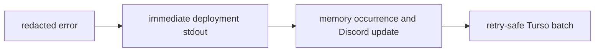
```mermaid
flowchart LR
  S1["redacted error"]
  S2["immediate deployment stdout"]
  S3["memory occurrence and Discord update"]
  S4["retry-safe Turso batch"]
  S1 --> S2
  S2 --> S3
  S3 --> S4
```

> The Discord and database paths are independent workers. Database failure does not prevent a notification attempt.

A batch UUID solves a subtle retry bug. Suppose Turso commits an increment, but its reply is lost. Retrying an ordinary increment doubles the count. Schema 5 commits the incident delta and its unique batch ID together; the same batch is ignored on retry. The buffer supports 512 incident groups, not unlimited durable memory. If the process dies before cloud persistence succeeds, pending memory-only counts can be lost. Deployment logs provide separate evidence subject to the host's retention policy.

### The Watchers Must Not Wait For Their Database

Operations starts its supervisor, watchdog, health, outbox, maintenance, and smoke work before awaiting persisted bootstrap settings. Bootstrap retries independently. The supervisor dispatches restart and history jobs rather than waiting for database-dependent work itself. A shared per-cog lock prevents initial startup and supervisor repair from starting the same feature concurrently. Missing tasks are repaired; deliberately disabled features remain off.

#### Shared startup and repair ownership (utils/supervision.py:6-24)

```python
   6: async def start_cog_background(bot, cog_name: str) -> None:
   7:     """Serialize initial startup and supervisor repairs for each cog."""
   8:     locks = getattr(bot, "_background_start_locks", None)
   9:     if locks is None:
  10:         locks = bot._background_start_locks = {}
  11:     lock = locks.setdefault(cog_name, asyncio.Lock())
  12:     async with lock:
  13:         cog = bot.get_cog(cog_name)
  14:         start = getattr(cog, "start_background", None)
  15:         if callable(start):
  16:             task = asyncio.current_task()
  17:             previous_name = task.get_name() if task is not None else ""
  18:             if task is not None:
  19:                 task.set_name(f"avenue-guard:startup:{cog_name}")
  20:             try:
  21:                 await start()
  22:             finally:
  23:                 if task is not None:
  24:                     task.set_name(previous_name)
```

#### Memory-only watchdog heartbeat (cogs/Operations.py:137-155)

```python
 137:     async def _watchdog_loop(self) -> None:
 138:         previous = time.monotonic()
 139:         while not self.bot.is_closed():
 140:             now = time.monotonic()
 141:             lag_ms = max(0.0, (now - previous - 1) * 1000)
 142:             previous = now
 143:             reporter = getattr(self.bot, "_error_reporter", None)
 144:             set_runtime_heartbeat(
 145:                 lag_ms=lag_ms,
 146:                 tasks=self.task_snapshot(),
 147:                 database=self.bot.db.health_snapshot(),
 148:                 incidents=reporter.snapshot() if reporter else [],
 149:             )
 150:             supervisor = self._tasks.get("supervisor")
 151:             if supervisor is None or supervisor.done():
 152:                 await self.start_background()
 153:             if lag_ms >= 2000:
 154:                 await log_error(self.bot, f"Event loop stalled for {lag_ms / 1000:.1f}s; Discord acknowledgements may have expired")
 155:             await asyncio.sleep(1)
```

### Liveness Is Not Readiness

| Signal | Question | Failure behavior |
| --- | --- | --- |
| /health | Is the web process alive | Remains HTTP 200 while diagnostics can still answer |
| /ready | Can the initialized bot perform useful work | HTTP 503 for stale heartbeat, offline gateway, storage trouble, or stopped critical work |
| /api/bot | What may the public website disclose | Sanitized ready/responsive state and Degraded or Unavailable status |
| Recovery dashboard | What can we inspect without SQL | Worker state, queue, active operation, event-loop lag, tasks, and pending incident counts |

#### Readiness combines independent runtime signals (utils/keepalive.py:62-76)

```python
  62: def get_runtime_health() -> dict:
  63:     with _status_lock:
  64:         heartbeat = _runtime_heartbeat
  65:         health = dict(_runtime_health)
  66:         state = str(_status.get("state") or "")
  67:     age = time.monotonic() - heartbeat if heartbeat else None
  68:     responsive = bool(heartbeat and age is not None and age < 15)
  69:     database = health.get("database", {})
  70:     database_ok = (database.get("connected") is not False and (not database.get("uses_remote") or database.get("worker_alive") is True)
  71:                    and not database.get("primary_write_degraded") and not database.get("write_queue_stalled"))
  72:     auxiliary = {"operations.smoke", "operations.bootstrap", "operations.restarts", "operations.timeline", "release.bootstrap"}
  73:     tasks_ok = not any(str(value).startswith(("failed", "stopped", "missing"))
  74:                        for name, value in health.get("tasks", {}).items() if name not in auxiliary)
  75:     return {**health, "heartbeat_age_seconds": round(age, 2) if age is not None else None,
  76:             "responsive": responsive, "ready": state == "online" and responsive and database_ok and tasks_ok}
```

The watchdog writes a memory-only heartbeat once a second. The HTTP thread can read it even if the asyncio loop stalls, and readiness fails when the heartbeat is fifteen seconds old. The full dashboard build has a five-second shielded deadline; a memory-only fallback appears while a cached build may finish in the background. Neither a health poll nor a Discord reconnect is treated as a new process start for service uptime.

### Recovering Discord Effects And Stale Evidence

The review transaction now queues a disabled-button edit alongside the decision and result notifications. If the immediate edit fails, the durable outbox still repairs that original card. Abandoned processing claims recover during runtime after two minutes. Successful sends have in-process receipts if their database confirmation fails, and deterministic enforced nonces reduce recent duplicate Discord sends after a crash. Discord nonce deduplication has a limited window; this is not an unlimited exactly-once guarantee.

Pending validation refreshes run in small batches. External lookups happen outside the review lock, then the handler reloads the row and checks pending status and level ID before a compare-and-set JSON update. This prevents stale provider results overwriting an edit or reopening buttons after review. Missing Discord messages remain a repair condition rather than a reason to recreate cards on every loop. A Boomlings 403 remains denied upstream access; another provider's positive evidence is retained.

#### Safe validation refresh against concurrent review (cogs/RequestLevels.py:3912-3914)

```python
3912:     async def _refresh_review_validation(self, guild, target_kind, row, *, message=None):
3913:         async with self._validation_card_lock:
3914:             return await self._refresh_review_card(guild, target_kind, row, message=message)
```

> **Do not confuse Discord delivery denial with a bot callback:** If Clyde refuses a user's DM, the bot receives no event to fix or log. Check mutual-server membership, privacy, blocks, and Discord screening separately. Runtime repair cannot bypass a message that Discord never delivered.

### How We Verified The Boundary

The regression suite exercises the real installed native driver in an isolated process, a hard worker deadline, cancellation while another caller waits, a locked primary with a readable snapshot, uncertain incident commits, repeated Discord logs during a stalled database, cold command IDs, early saved views, a failed original review edit, post-send receipt failure, readiness degradation, and refresh/review races. These tests validate mechanisms locally. Render deployment and real Discord smoke checks still establish whether the current production configuration is healthy. The detailed evidence and changed-file inventory live in docs/INCIDENT_DIAGNOSIS_2026-09-15.md.

## 46. Engineering Thinking Behind The Bot

Avenue Guard's best design choices are about recovering from imperfect reality. Discord is not a database. Messages disappear, permissions change, users close DMs, external APIs fail, and hosted storage can be wiped. The bot works because the important truth lives in SQLite and visible Discord messages are treated as projections that can be refreshed or rebuilt.

| Problem | Design Response |
| --- | --- |
| A button can be clicked after restart | Register persistent views with stable custom IDs. |
| Two users can submit at the same time | Use submit locks and database duplicate constraints. |
| Two reviewers can click the same request | Use review lock, pending status check, and disabled buttons. |
| A provider can fail or disagree | Cache normalized validation, warn on uncertainty, and circuit-break repeated failures. |
| A ticket close can fail midway | Save transcript before deletion and restore status on failure. |
| Render can wipe source storage | Use a Turso-backed embedded replica, zipped backups, and read-only restore drills. |
| Config can drift from Discord | Validate typed schema, scan permissions, and expose dashboard repair controls. |

The bot is not architected as many isolated mini-bots. It is one coherent system where request data can feed impact reports, weekly tracking can feed request reviews, help data can feed support metrics, and background telemetry can feed forecasts.

> **How we planned it:** The pattern was usually: identify a manual staff pain, decide what state must survive, store that state, expose a Discord UI, log the outcome, then add a repair or diagnostic path for the ways Discord can drift.

## 47. Debugging Notebook

When something breaks, resist the urge to read everything. Use the failure type to choose the shortest path.

| Symptom | First Places To Check |
| --- | --- |
| Bot fails on startup | Render logs, main.py resolve_db_path, utils/db.py connect/migrate, config.json syntax. |
| Command says no permission | CommandsCog permission helper, roles.admin_owner_role_ids, MOD_ROLE_ID, reviewer_role_ids. |
| Request button wrong state | level_request_state row, refresh_or_create_request_button, request channel/message IDs. |
| Request modal rejects valid user | required_role_ids, request_banned_role_id, _requirements_ok, guild member role cache. |
| ID validation seems wrong | gd_level_validation_cache, provider settings, external provider output, circuit breaker state. |
| Weekly winner not DMed | weekly_reward_disabled, weekly_runs, weekly_claims, excluded roles, DM failure log. |
| Ticket status does not update | tickets.opening_message_id, update_ticket_opening_status, HelpCog on_message. |
| Impact data missing | daily_stats persistence, impact.allowed_user_ids, impact report channel, database path persistence. |

### The Five Checks

1. Check config: is the channel/role/table setting pointing at the right thing?
2. Check database state: does SQLite say the workflow is open, closed, pending, reviewed, or missing?
3. Check Discord object: does the message/channel/thread still exist?
4. Check permissions: can the bot see, send, edit, delete, manage roles, or manage channels there?
5. Check repair path: does /bot dashboard, /bot doctor, /requests repair, /bot storage, or /bot backup explain the issue?

This debugging style matches the code's architecture. Config chooses targets, SQLite stores truth, Discord shows a projection, permissions decide whether the projection can be updated, and repair commands rebuild the projection when it drifts.
