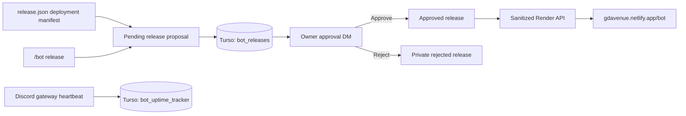

# Avenue Guard Public Status And Release System

## Purpose

This system gives GD Avenue a public `/bot` page without making the private
bot repository, database, diagnostics, or unreleased notes public. Avenue
Guard remains the source of truth. The Netlify website is a read-only client.

The publication rule is intentionally simple:

> A release can be proposed automatically or by command, but it becomes
> public only after the configured owner approves the bot's Discord DM.

## Architecture



No website write credential is stored in the bot. There is no generated file
upload and no GitHub or Netlify token in Render. Approval updates the durable
database, refreshes an in-memory public snapshot, and the website reads that
snapshot on its next refresh.

## Persistent Data

The `bot_releases` table stores:

| Field group | Purpose |
|---|---|
| Version, title, summary, changes | Proposed public content |
| Status | `pending`, `approved`, or `rejected` |
| Source | Slash command or deployment manifest |
| Creator and creation time | Proposal audit trail |
| Approval message ID | Makes replaced panels detectable |
| Decider and decision time | Approval audit trail |
| Error text | Private DM-delivery diagnostics |

The table is part of the normal SQLite migration and Turso synchronization.
It survives Render restarts and cache clears. Approved releases are restored
into the public snapshot during startup.

`bot_uptime_tracker` is a one-row durable availability accumulator. It stores
when measurement began, the most recent heartbeat, total observed seconds, and
seconds during which the Discord gateway was operational. This is deliberately
separate from process uptime: a responsive Render web service does not prove
that Discord commands are working.

## Proposal Methods

### Slash Command

The configured owner can run:

```text
/bot release
  version: 3.20.2
  title: Public service status
  changes: Added live status | Added recent release notes
  summary: Optional short overview
```

The version must follow semantic versioning. A leading `v` is accepted and
normalized away. In the slash command, changes are separated with `|` because
Discord's single-line option cannot contain line breaks. Newlines remain
supported for manifests and internal calls. Markdown-style bullets and number
prefixes are removed before storage.

The configured version floor is `3.18.7`, matching the version established
during the original bot evolution review. Avenue Guard compares semantic
versions correctly, including prereleases, and rejects any proposal that is
not newer than the floor and every pending or published version.
If two increasing proposals are pending and the newer one is published first,
the older panel can no longer regress the public version. An attempted
approval marks that older proposal as superseded and disables its controls.

The maintained sequence is:

| Version | Meaning |
|---|---|
| `3.18.7` | Agreed baseline before the July workflow revisions |
| `3.18.8` | Review-access cleanup |
| `3.18.9` | Slash-command response reliability fixes |
| `3.19.0` | DM support redesign |
| `3.19.1` | Support continuation and response-delivery fixes |
| `3.20.0` | Public status and release system |
| `3.20.1` | Accurate guild metrics, persistent availability, identity, and wording refinements |

The command saves the proposal first and then DMs the owner. If the DM fails,
the proposal remains pending with a private error. Running the same command
again resends the pending proposal instead of creating a duplicate.

### Deployment Manifest

`release.json` is optional. Leave its version blank when a deployment should
not create a proposal. For a new release, use:

```json
{
  "version": "3.20.2",
  "title": "Public service status",
  "summary": "A clearer view of Avenue Guard",
  "changes": [
    "Added live operational status",
    "Added recent release history"
  ]
}
```

On startup, `ReleaseCog` validates the manifest and checks Turso for that
version. It creates and DMs one proposal only when the version has never been
recorded. Restarts do not repeatedly create the same proposal.

## Approval Controls

The DM contains the version, title, summary, changes, source, status, and
proposal ID. Its persistent buttons are:

- **Approve and publish**: conditionally changes `pending` to `approved`,
  stores the owner and decision time, disables both buttons, and refreshes the
  public release snapshot.
- **Reject**: changes `pending` to `rejected`, stores the decision audit, and
  disables both buttons without changing the public API.

Only IDs in `release_updates.owner_user_ids` can use these controls. The
stored approval message ID must match the clicked message, so an older panel
cannot approve a proposal after `/bot release` has sent a replacement.

## Public API

### `GET /api/bot`

This endpoint returns:

- Public service state and a human-readable status
- Whether the Discord gateway is currently online
- Current approved version
- Render process start and uptime
- Current Discord connection start and uptime
- Persistent measured Discord availability percentage and measurement start
- Discord latency
- Configured GD Avenue guild member count
- Bot name and avatar URL
- Latest approved release
- Public snapshot update time

It does not return internal exception text, database configuration, paths,
tokens, role or channel IDs, owner IDs, pending releases, rejected releases,
or approval errors.

### `GET /api/releases`

This endpoint returns up to `public_release_limit` approved releases ordered
from newest to oldest. Each record contains only version, title, summary,
changes, and publication time.

Both endpoints set an explicit JSON content type, `X-Content-Type-Options:
nosniff`, and read-only wildcard CORS. The status endpoint is not cached. The
release endpoint may be cached for 30 seconds.

The original `/status` endpoint remains available for private operational
diagnosis and Render health checks.

## Uptime Meaning

The large duration shows the current Discord connection uptime while the bot
is online. If Discord is unavailable but the Render process still responds, it
shows process uptime and a non-operational state. This prevents a successful
HTTP response from being mistaken for a healthy Discord bot.

The percentage beside it is Avenue Guard's persisted Discord availability,
measured from `uptime_tracking_since_ts`. While running, a heartbeat commits
at one-minute resolution. Gateway disconnect and resume events commit their
transition immediately. On the next successful start, time since the previous
heartbeat is conservatively counted as downtime. The measurement therefore
survives restarts and unclean process exits through Turso. It begins when this
schema is first deployed; it does not fabricate uptime for time before that
date. UptimeRobot can remain as an independent outside-in monitor.

## Website Behavior

`bot.html` and `bot.js` live in the deployed `gdav_website` repository.
Netlify's Pretty URLs expose `bot.html` as `/bot`.

The page:

- Refreshes status and release data every 30 seconds
- Refreshes immediately when the tab becomes visible again
- Uses text-only DOM construction for release data instead of injecting HTML
- Uses the current Avenue Guard Discord avatar as its stable first render and
  accepts only HTTPS avatar updates from the bot API
- Keeps stale content visible while clearly reporting refresh failure
- Works with an empty release history
- Uses the existing site navigation, palette, surfaces, and mobile layout

## Deployment Order

1. Deploy Avenue Guard so `/api/bot` and `/api/releases` exist.
2. Verify both endpoints directly.
3. Deploy the `gdav_website` repository containing `bot.html`, `bot.js`, the
   shared CSS update, navigation links, and privacy disclosure.
4. Open `/bot` on desktop and mobile.
5. Confirm the `3.20.1` deployment proposal in `release.json` arrived by DM,
   or run `/bot release` with the next real semantic version.
6. Approve the DM and verify the version appears within 30 seconds.

Deploying the website first is safe: it shows a retryable unavailable state
until the bot API is live.

## Recovery

- **Owner DM failed:** open DMs and rerun `/bot release` with the same version.
- **Old panel clicked:** use the latest DM; old message IDs are rejected.
- **Latest panel has a stale stored ID:** Avenue Guard accepts a newer Discord
  message, reconciles its ID into Turso, records the IDs in runtime diagnostics
  and the Render log, and continues the decision. A genuinely older message
  timestamp remains blocked.
- **Turso temporarily unavailable:** the proposal remains in local committed
  state and normal database retry/synchronization behavior applies.
- **Website cannot fetch:** it retains any visible status, marks the refresh
  failure, and retries automatically.
- **Release notes were rejected:** change the version or submit a corrected
  proposal manually. If `release.json` already contains a different valid
  version, rejection immediately checks it and sends the corrected proposal
  without waiting for another restart.
- **Approval happened but page is stale:** wait up to 30 seconds, then use the
  page's Refresh button.
