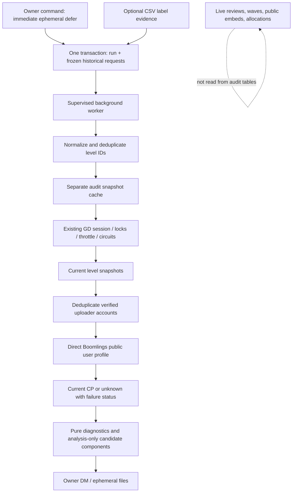

# Avenue Guard: Private Historical Request Audit

This is a side-development research tool, not a request-priority implementation. It captures the evidence that actually exists, preserves uncertainty, and gives the bot owner files to study before choosing a mathematical model.

## Start Here

The feature is **disabled by default**. Deploy this version with the normal Turso environment settings; no new database credentials or Google authentication are required. Take a normal `/bot backup` first if desired. The additive schema migration runs during normal database initialization.

In `config.json`, change `historical_audit.enabled` to `true`, then restart or use the existing configuration reload workflow. The command is restricted to the configured guild and the exact user IDs in `impact.allowed_user_ids`. Administrator permissions alone do not grant access. An empty owner allowlist denies access.

Use:

```text
/requests historical_audit action:start
/requests historical_audit action:status
/requests historical_audit action:report
/requests historical_audit action:cancel
```

Omit `run_id` to select the latest run, or supply the UUID returned by `start`. `report` also works on a partially completed or cancelled run and clearly identifies its state. Completed reports remain downloadable when the feature is disabled.

Useful start options:

| Option | Meaning |
|---|---|
| `refresh_external:true` | Reuse fresh audit snapshots and fetch missing/expired ones |
| `refresh_external:false` | Analysis/report-only run using stored audit snapshots, even if stale; no external GD calls |
| `force:true` | Ignore audit snapshot freshness; requires external refresh; never overrides provider circuits |
| `sheet_csv` | A local/exported CSV uploaded as a Discord attachment |
| `csv_url` | Alternative public HTTPS CSV URL on an explicitly allowed host |

Only one queued/running audit is allowed across the database. A second start is denied, not merged or silently substituted. Cancelling preserves completed snapshots and frozen inputs. Disabling pauses an active job; re-enabling resumes it. A process restart resumes the same run rather than taking another live history snapshot.

## The Data Path



The live history source is `level_request_submissions`. Weekly reward requests live in a different table and are intentionally excluded. Pending historical requests are retained for coverage, but only historical `sent`/`recommended` results are analysis candidates. Other rejection reasons remain the original strings, grouped as `other` in summary cross-tabs.

The source identity is `(guild_id, wave_id, user_id)`, not a guessed global request row ID. The export synthesizes `request_row_id` from that identity. Requester, reviewer and message IDs are copied as decimal text to avoid introducing new JavaScript/libSQL floating-point rounding. This does not recover precision already lost in older records.

The input capture is atomic and happens once. Reviews or edits occurring after capture are not silently folded into an in-progress audit. Start a new run when you want another historical cutoff.

## Storage and Migrations

The historical audit was introduced in database schema **7**. The current database schema is **8**, which retains every audit table and adds the separate production PPS tables. Schema 5/6/7 upgrades are additive, and fresh databases or restored older backups receive both table families. Newer schema versions are still rejected instead of downgraded.

| Table | Durable purpose |
|---|---|
| `historical_audit_runs` | Owner, input configuration/evidence, start/end, status, summary, error and delivery state |
| `historical_audit_requests` | Frozen source columns, one record per historical live request |
| `historical_audit_levels` | Per-run distinct levels and frozen snapshot results; null result means unfinished |
| `historical_audit_creators` | Per-run distinct accounts and frozen profile results |
| `historical_level_audit_snapshots` | Latest small normalized snapshot per level, with cache expiry |
| `historical_creator_audit_snapshots` | Latest normalized account snapshot, with nullable current CP and expiry |
| `historical_prestige_labels` | Imported label evidence, CSV hash/row, optional wave/date qualifiers |

`idx_historical_audit_active` prevents simultaneous queued/running jobs. A per-process durable lease also prevents two deployment workers from processing the same run at once. It lasts two minutes, renews when less than one minute remains, and is released on normal completion/cancellation when storage permits. After an abrupt crash, a replacement worker may wait up to two minutes before resuming. Automatic report delivery uses a compare-and-set claim as well. All production reads/writes go through the existing `Database` wrapper, its isolated libSQL worker, exact integer binding, replica reads and transaction guards. Audit writes use short one-second queue admission, descriptive operation labels, and retry-safe bounded batches where applicable.

The one-time input capture is **not blindly retried** after an unknown commit. Its run UUID is checked instead, because taking a second history snapshot could produce a different dataset. Repeated cache/item/evidence writes are idempotent. Cache failures propagate as storage failures and retry at job level; they are not recorded as pretend provider results.

Existing full database backups include these tables and can restore audit progress, imported evidence and snapshots. CSV attachments alone are not the durable database. If the database itself is deleted, the files may preserve evidence, but only an actual database backup restores job state. No storage system is literally impossible to lose; retain independent backups.

Audit tables are not added to automatic retention/deletion policies. Disabling the feature leaves them intact. To remove the code later, preserve an export/backup and the matching schema version; do not deploy an older schema-6 build against schema 7.

## Current GD Metadata and CP

Level calls reuse `RequestLevelsCog._fetch_validation_provider`, its reusable trusted-CA aiohttp session, provider locks, minimum intervals, conservative retries and circuit breakers. They do **not** call the live request validation/cache-write workflow. Existing parser keys and live combined validation semantics are unchanged; a nested `audit_metadata` payload preserves nullable raw metadata that the old parsers discarded. That payload is stripped at the live combination boundary, so even the customizable public `level_validation_json` variable retains its original format. The audit consumes direct provider results before that boundary.

The audit stores current existence, name, uploader identity/name, stars, rated/featured/epic indicators, difficulty and length. Invalid or absent protocol fields stay null. A confidently missing level has `current_exists=false`, but its rating is **unknown**, not automatically classified as currently unrated. Provider disagreement is retained; conflicting uploader identities withhold account association, and conflicting rating claims leave current rating unknown.

Direct level response key `6` identifies the uploader's **user ID**. The creator section supplies `userID:name:accountID`. GDBrowser exposes `playerID` and `accountID`; these are kept separate. A username alone is never used to guess the account, and co-creators named in the submitted form are not assigned uploader CP.

Direct level key `42` is exported as `current_epic_tier_raw`. The legacy provider exposes a broad epic-or-higher boolean, not a verified named Legendary/Mythic classification. Consequently `current_legendary` and `current_mythic` remain null. Current rating flags never become historical requested prestige labels.

The focused profile helper POSTs to:

```text
https://www.boomlings.com/database/getGJUserInfo20.php
targetAccountID=<verified account ID>
secret=<existing public GD protocol secret>
```

It verifies the returned identity and field semantics before accepting CP:

```python
# The protocol keys are identifiers, not positions in a list.
returned_account = fields["16"]  # Account ID, must match targetAccountID
uploader_user = fields["2"]      # User ID, checked against the level when known
current_cp = fields["8"]         # Account Creator Points, not level award points

# Actual zero is valid. Missing/invalid key 8 is an unsuccessful lookup,
# NOT a synthetic zero. Duplicate keys and mismatched accounts are rejected.
```

Protocol sources: [profile endpoint](https://boomlings.dev/endpoints/users/getGJUserInfo20), [user resource fields](https://boomlings.dev/resources/server/user). These are community-maintained reverse-engineered protocol references, not a formal stability promise from RobTop. A single read-only direct profile probe during implementation successfully returned matching account/user IDs and a numeric CP field. Tests separately verify real zero, missing CP, malformed data, duplicate keys, wrong accounts, HTTP denial and user-ID conflicts.

Profile calls share the Boomlings lock/circuit and use a conservative two-attempt maximum. Access-denied responses are not immediately retried; 429 stops attempts and lets the existing cooldown apply. A 403 from the deployment's network can still happen and will leave CP unknown. This feature does not claim to bypass Cloudflare.

Lookups are sequential, with a default two-second pause between distinct work items. Accounts and levels are deduplicated. Successful snapshots are fresh for 24 hours; failures for five minutes. Both TTLs and job spacing are configurable within safe bounds. Force refresh does not disable throttling. Processing and CSV/JSON rendering are off the Discord event loop where applicable.

## Prestige Enrichment: Evidence, Not Guessing

CSV input is UTF-8, optionally with a BOM, comma-delimited, at most 2 MB and 10,000 data rows. Required headers are `level_id` and `prestige`; aliases include `id`/`gd_id`, and `category`/`send_category`/`requested_prestige`. Optional qualifiers are `wave_id` (or `wave`) and `request_date` (or `date`). Dates must be `YYYY-MM-DD` and are compared with the stored request's **UTC date**.

```csv
level_id,prestige,wave_id,request_date
111111111,Feature,2,
222222222,MYTHIC,,2026-08-20
333333333,rate,,
```

ID normalization accepts decimal digit strings and spreadsheet-style integral `.0` values; it rejects scientific notation, extra text and invalid ranges. Historical IDs can be older/shorter than the current live submission format. Case/whitespace and `featured`/`rated` spellings normalize to the five valid categories. No other category is fabricated.

Matching uses level ID, then any wave/date qualifiers. **Exactly one historical request must match**. Zero matches remain unmatched evidence; several matches remain ambiguous evidence and label no request. This prevents a single spreadsheet label from silently being spread across multiple waves for the same level. Inspect `avenue_prestige_enrichment.csv` to add qualifiers before rerunning.

Every accepted row carries `source=google_sheet`, its content hash, original source row and match confidence. Local CSVs have that source name because they represent the old-sheet enrichment workflow; it is provenance, not proof that an arbitrary uploaded CSV was authenticated by Google. Invalid/missing rows are recorded as import errors. Imported evidence persists and is frozen separately for each run.

The optional review-text parser only accepts a narrow whole-text grammar such as `Epic`, `Sent for Epic`, or `Prestige: Mythic`. It rejects negation, speculation, arbitrary prose and multiple labels. Its provenance is `review_text_exact`. It can be disabled independently.

If matched sources disagree, `prestige_conflict=true` and both `prestige` and `prestige_source` are null. Evidence is kept, not silently preferred. If sources agree, the source column identifies the sheet when present, while the evidence detail and source breakdown retain all agreeing sources. An unmatched level never defaults to Rate or Rejected.

## What Waiting and Candidate Numbers Mean

The database knows requests and review times, but not a complete moderator-outreach/removal history. Therefore this implementation does **not** present a genuine historical allocation replay.

For a historically recommended request with coherent review timestamps, it counts observed subsequent request waves whose first stored submission occurred after approval and before the run cutoff. This is `approved_age_observed_waves_proxy`, measured **as of the audit**, not at the original request. Empty/lost waves cannot be reconstructed, and a first submission is not an exact opening timestamp.

```text
Historical approval --> observed later wave --> observed later wave --> audit cutoff
                          +1 proxy wave          +1 proxy wave

No conclusion about actual outreach, queue removal, or Avenue causation follows.
```

`waiting_component_h = 1.5 * min(proxy_wave_age, 4)^1.5`. Rejected/pending rows and invalid approval timestamps have no waiting component. Repeated sent rows are retained as historical occurrences, not asserted to be independent actual outreach queue entries.

Prestige uses `f = 1.8^x - 1` **only when its label and configured exponent are known**. Rate=0 and Mythic=5 are fixed analysis anchors; Feature/Epic/Legendary exponents default to null because you have not selected them.

Current CP is binned as 0, 1, 2, 3, 4+, or unknown. CP scoring defaults to **disabled**. To test a named candidate without changing live behavior, configure an explicit table, for example:

```json
{
  "candidate_model_version": "my-exploration-v2",
  "cp_formula": {
    "name": "illustrative-bin-table-v1",
    "points": {"0": 4, "1": 3, "2": 2, "3": 1, "4+": 0}
  }
}
```

Those coefficients are merely an example, not a recommendation or finalized low-CP function. Omitted bins stay unknown. Each run freezes the formula and model name, so changing configuration does not rewrite old calculations.

`candidate_priority_total` exists only when f, g and h are all known. A known zero component remains zero; missing never becomes zero. `known_components_only_g_plus_h_not_full_priority` is deliberately named to prevent mistaking it for a full priority score. Neither field is read by live decisions.

Full candidate component coverage among historically sent rows and prestige-label coverage are separate report percentages. Genuine historical replay support is explicitly **false**: even complete current components do not supply historical CP or actual outreach events. Until the owner runs the audit against the durable production database, actual label/CP/re-fetch percentages are unmeasured. With the default disabled g formula, no full candidate totals are generated.

## Files and Interpretation

The owner receives a concise coverage embed plus:

| File | Contents |
|---|---|
| `avenue_historical_requests.csv` | One row per frozen historical request; private identities/review text, previous occurrences/decisions, prestige evidence, current snapshots and candidate components |
| `avenue_historical_levels_current_snapshot.csv` | One current snapshot per normalized distinct historical level |
| `avenue_creator_snapshot.csv` | One current profile per resolved account, including zero versus unknown CP and failures |
| `avenue_prestige_enrichment.csv` | Matched, ambiguous/unmatched and review-text evidence; identity/provenance/conflicts |
| `avenue_historical_audit_summary.json` | Coverage, rating cross-tabs, CP counts/percentages, prestige subset, repeated levels, waiting/data-quality diagnostics and frozen model configuration |
| `avenue_historical_audit.md` | Readable private report with tables, cautions and interpretation |

CSV unknowns are blank cells; numeric fields never receive synthetic zero. Structured summary JSON uses null. User-controlled strings beginning with spreadsheet formula triggers are escaped for safer imports. Original private review text is still available in the frozen database record.

Historical-result/current-rating cross-tabs retain unknowns in the denominator. The report says **currently rated among historically sent levels**, not a causal success measure. The labelled prestige subset is explicitly incomplete and potentially non-random. Previous sent/rejected counts only include prior reviews known before the later submission, avoiding retrospective look-ahead.

All delivery is owner DM or ephemeral interaction response; no unchecked public/private channel fallback is used. If DM delivery fails while the originating interaction is still usable, it falls back ephemerally. After a long job/restart, use `action:report` for an ephemeral download. Interaction tokens are never stored in Turso. Attachments are grouped under a conservative total-byte budget. Oversized files use numbered raw byte parts; concatenate in numeric order to restore the original file exactly.

An interrupted/unknown automatic DM leaves `delivery_status=sending`; it is not automatically repeated. Manual `report` remains available. Database contention pauses/retries a run after 30 seconds and records a private error when storage permits; the existing independent error reporter still reports failures if storage is unavailable. Individual external failures finish their work item with unknown data rather than aborting the whole audit.

## Explicit Isolation Guarantee

This feature changes no reviewer button callbacks, Send/Reject meaning, wave transitions, request/public template rendering or production allocations. It adds no automatic priority queue, no Bayesian model and no displayed Bayesian probabilities. Audit processing writes only audit tables; it does not overwrite historical live rows with current CP/rating. The normal additive schema migration updates schema metadata, not review outcomes.

The regression suite tests extraction and non-mutation, provider failures, caching/force refresh, restart recovery, snapshots in database backups, CP identity/zero/unknown, CSV provenance/conflicts, partial components, current-rating wording, owner authorization, interaction acknowledgement, private fallback and attachment splitting.

## Implementation Files

Exact files added or changed for this feature:

```text
README.md
TEST_CHECKLIST.md
cogs/Commands.py
cogs/HistoricalAudit.py
cogs/Operations.py
config.json
docs/HISTORICAL_REQUEST_AUDIT.md
main.py
release.json
scripts/quality_check.sh
services/historical_audit.py
tests/test_database.py
tests/test_historical_audit.py
tests/test_slash_commands.py
tests/test_turso_contention.py
utils/config_schema.py
utils/db.py
utils/gd_profile.py
utils/gd_validation.py
utils/historical_audit.py
utils/historical_audit_schema.py
```

The historical audit remains an isolated evidence tool: it never feeds the production PPS queue and never rewrites historical requests. PPS v1 is documented separately in `docs/PRIORITY_POINT_SYSTEM.md`; it starts prospectively with newly created PPS waves only.
