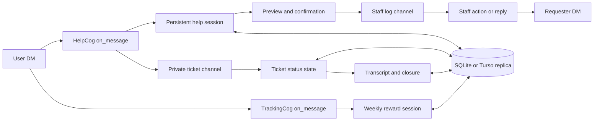
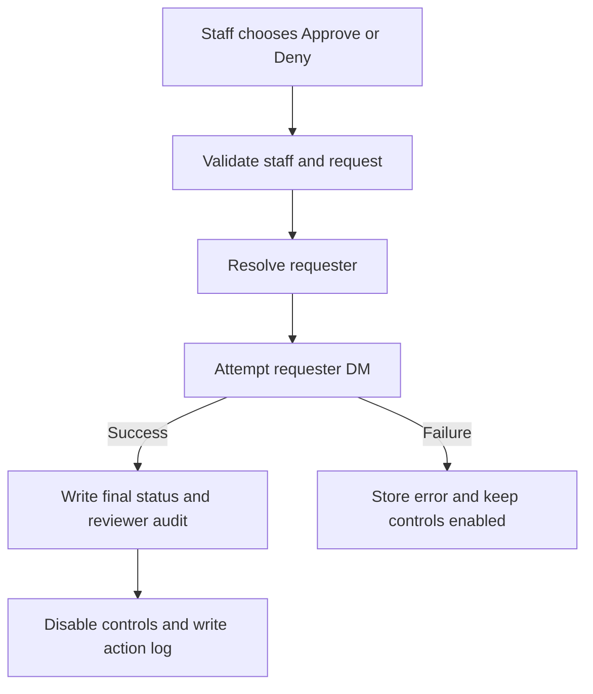

# Avenue Guard Support Workflow Audit

Date: 2026-07-29

## Scope

This audit covers every support path owned by `HelpCog` plus the weekly DM
listener where it shares the same private-message input:

- Member and former-member dashboards
- FAQ navigation
- Appeals
- User reports
- Bot issue reports
- Staff replies to tracked submissions
- Partnership tickets
- Ordinary staff tickets
- Ticket status automation
- Inactivity prompts and closure
- Ticket transcript generation, search, approval, denial, and delivery
- Former-member ban information
- Ticket satisfaction prompts
- Restart recovery and Turso-backed persistence

The review traced each entry point through its Discord interaction, in-memory
state, database writes, retry path, final state, and user/staff notification.

## System Shape

The key ownership rule is now explicit: an active support session owns the
user's next DM. `TrackingCog` checks that ownership and yields instead of
trying to parse the same message as a weekly level request. `HelpCog` also
keeps a short-lived claim for the Discord message itself, so a final message
that clears the session, such as `cancel`, cannot race into the weekly parser.

## Durable State

| Table | Purpose | Important terminal states |
|---|---|---|
| `help_sessions` | Current appeal, report, bot issue, or transcript step | Deleted on completion/cancel/expiry |
| `help_submissions` | Tracked appeals, reports, and bot issues | `pending`, `responded`, `failed` |
| `help_cooldowns` | Per-action abuse and repeat limits | Timestamp based |
| `ban_info_requests` | Former-member ban information work | `pending`, `delivery_failed`, `delivered`, `failed` |
| `tickets` | Ticket lifecycle, status message, feedback | `open`, `closing_prompted`, `closed` |
| `ticket_transcripts` | Pointer to the durable transcript message | One pointer per guild/ticket |
| `transcript_requests` | User transcript approval workflow | `pending`, `delivery_failed`, `approved`, `denied` |
| `ticket_cooldowns` | Ticket creation limit | Timestamp based |

`transcript_requests` now records `updated_ts`, `reviewed_by`, `reviewed_ts`,
and `error_text`. The database migration adds these columns to existing
installations and backfills `updated_ts` from `created_ts`.

## Workflow Review

### Dashboard And FAQ

The dashboard resolves the member through cache first and Discord second. It
then combines active tickets, current-wave request state, weekly activity, and
recent support work. Recent help submissions and transcript requests are now
merged by update time, so one type can no longer hide the other.

FAQ pages use transient navigation buttons and delete the previous panel before
showing the next one. Normal DM text is not treated as a search query.

### Appeals, Reports, And Bot Issues

Each flow stores a step and JSON payload in `help_sessions`, while keeping a
live memory copy for immediate consistency during a Turso synchronization
delay. Appeals collect three answers; reports and bot issues collect one
detailed answer. Every flow reaches a preview before staff receives anything.

Editing now creates a clean replacement payload. Appeal type and former-member
context are retained, but old answers and attachments are removed. This
prevents accidentally retained evidence from being submitted after an edit.

Submission follows this order:

1. Check duplicate protection where applicable.
2. Resolve the configured staff channel.
3. Insert a tracked database row and allocate the help ID.
4. Send the staff embed.
5. Save the staff channel/message pointer.
6. Apply the cooldown and audit log.

If the staff message cannot be finalized, the database row is marked failed and
the partially sent Discord message is removed where possible.

### Staff Replies

Staff replies are accepted only when they reply directly to a tracked staff
embed and pass the moderator check. The moderator check now uses the member
object already supplied by Discord before consulting the guild cache.

The requester ID is read from both the database and original bot-authored
embed. A mismatch is logged, the trusted embed value is used, and a successful
delivery repairs the database value. DM resolution tries the guild member
cache, bot user cache, guild fetch, and global user fetch in that order.

The submission remains pending if delivery fails. This prevents a visible
"responded" state when the requester received nothing.

### Former-Member Ban Information

Former members can open a durable `BI-<id>` request. Staff can provide optional
reason, date, evidence links, notes, and files. Empty fields are omitted from
the final DM.

The requester ID is also recoverable from the staff embed and repaired during
modal submission if it differs from the stored value. Failed DMs produce a
retryable `delivery_failed` state, retain the staff button, and log the exact
requester ID. Evidence memory is capped to 25 MB even if configuration contains
a larger value.

### Transcript Requests

Users can identify their ticket by channel mention, channel ID, or short ticket
ID such as `T3`. A failed request setup no longer destroys the active DM
session, so the user can retry after staff repairs the channel configuration.

Pending and delivery-failed duplicates are blocked. A previously approved or
denied request does not block a future request forever; the normal help
cooldown remains the timing control.

Approval and denial both follow a delivery-first rule:

A denial is not marked final until its notification DM succeeds. Approval
delivery failures use `delivery_failed` and can be retried. Both paths
cross-check the requester ID against the original staff embed.

### Transcript Contents

Ticket transcripts now default to the complete chronological channel history.
They include:

- Message timestamp and author ID
- Message text
- Attachment filename and URL
- Embed title, description, and fields
- Sticker names
- Edit timestamp
- Replied-to message ID

If a caller intentionally supplies a message limit, the newest messages are
retained and the transcript begins with an explicit truncation notice. There
is no silent 2,000-message cutoff.

### Ticket Creation

Ticket creation defers the Discord interaction before network or database
work. It validates the member, cooldown, category, moderator role, and optional
notification role before creating a channel.

The moderator role must resolve to a real guild role. This prevents creation of
a private channel that only the requester can see. Member names are sanitized
before they become part of a channel name.

The channel is created first, then the cooldown and ticket row are committed in
one database transaction. A database failure deletes the new channel to avoid
an orphan.

Partnership tickets preserve normal moderator visibility but ping only the
configured partnership role.

### Ticket Status

Requester messages set `Waiting for staff`; other permitted channel messages
set `Waiting for user`. Manual status changes use the same stored value and
opening-message updater.

If the opening status message was deleted or was never indexed, the updater
creates a replacement status message and saves its ID. A missing message no
longer causes silent, permanent status drift.

### Inactivity And Closure

The scanner supports fractional inactivity hours and uses a conditional update
that still requires the ticket to be stale. After posting a prompt, it verifies
that the prompt actually owns the current database state. If fresh activity
won the race, the scanner deletes its stale prompt.

Choosing to keep a ticket open resets its inactivity clock. A manual
`/ticket status` change also clears and disables any outstanding close prompt.

Close-prompt authorization no longer disappears when `MOD_ROLE_ID` is missing.
With no valid role, only the configured manage-guild fallback can authorize
closure.

Ticket closure remains transcript-first:

1. Mark the visible status resolved.
2. Generate and upload the transcript.
3. Index the transcript message.
4. Delete the ticket channel.
5. Mark the database row closed.
6. Send the satisfaction prompt.

Any failure before channel deletion restores the open ticket state.

### Satisfaction

Satisfaction buttons use stable custom IDs and are restored for eligible
closed tickets after restart. Only the ticket creator can submit a score, only
one score is accepted, and the prompt expires after seven days.

## Confirmed Problems Corrected

| Problem | Impact | Correction |
|---|---|---|
| Cache-only staff lookup | Valid staff could be rejected | Use supplied member object, then cache/fetch fallback |
| Weekly/support DM collision | Support answers could enter weekly parser | Shared active-session ownership check |
| Denial finalized before DM | Requester received no result and staff could not retry | Deliver first, finalize second |
| Transcript setup cleared failed flow | User had to restart from dashboard | Preserve session and controls on failure |
| Permanent terminal duplicate block | User could never request the same transcript again | Only block active/retry states |
| Silent 2,000-message transcript limit | Latest ticket context could be missing | Complete history by default, explicit limited mode |
| Stale inactivity race | Fresh tickets could be prompted for closure | Conditional update plus post-write verification |
| "Keep open" retained stale timer | The same prompt could return on the next scan | Reset inactivity time when staff chooses No |
| Manual status left old close controls | Staff saw a prompt that no longer matched database state | Clear and disable the prompt during status changes |
| Missing mod role bypass | Close control could lose its staff check | Always enforce moderator/manage-guild authorization |
| Missing staff role during creation | Staff could be locked out of a new ticket | Fail safely before creating the channel |
| Deleted opening status message | Status stopped updating forever | Recreate and re-index the status message |
| Mixed status list ordered by type | Transcript status could be hidden | Merge and sort all support records by update time |
| Preview edits retained evidence | Removed attachment could still be submitted | Reset answers and attachments on edit |

## Verification

Automated coverage includes:

- Multi-step appeal progression
- Report and bot issue previews
- Turso-stale and Turso-failure session behavior
- Staff reply requester recovery
- Failed transcript setup retry
- Transcript denial success and failed-DM retry
- Transcript audit migration from the legacy schema
- Ticket inactivity/activity race
- Missing ticket status message repair
- Missing-role close authorization
- Weekly/support DM ownership in both cogs
- Complete and explicitly limited transcript output
- Ticket ID concurrency and transaction rollback

The manual Discord checks remain in `TEST_CHECKLIST.md`, because Discord
permissions, real DMs, channel deletion, and component persistence cannot be
fully reproduced by local unit tests.

## Residual External Risks

The remaining risks are external rather than unresolved state-machine defects:

- A user can close DMs or delete their Discord account.
- Discord can reject a large transcript or evidence upload based on the
  server/account upload limit.
- Staff can manually delete a staff-log or transcript message.
- Discord or Turso can be temporarily unavailable.
- The bot still requires the configured channel and role permissions.

These cases now preserve retryable state where possible and write identifying
diagnostics rather than silently claiming completion.
